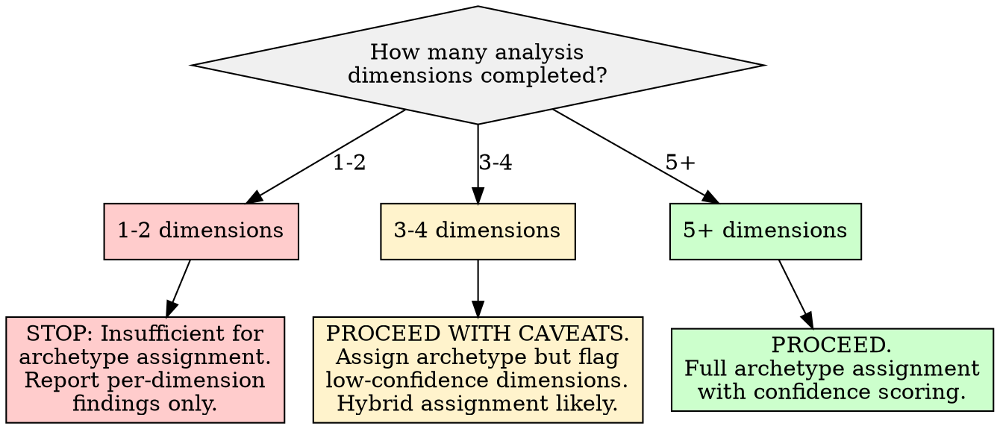
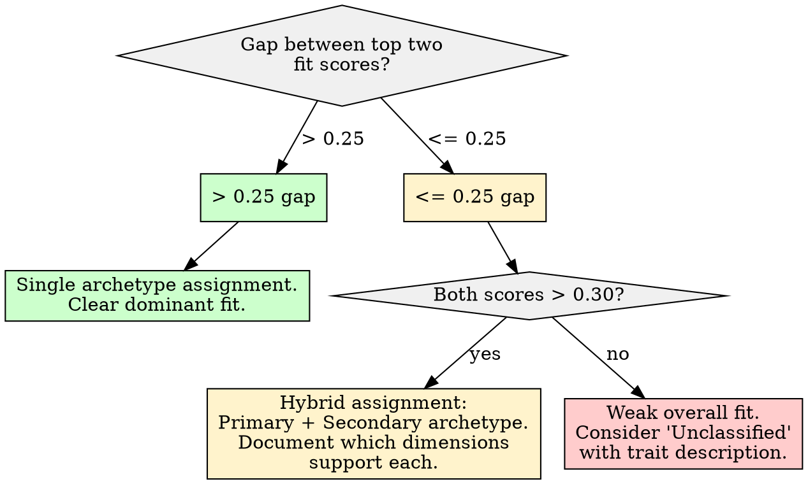
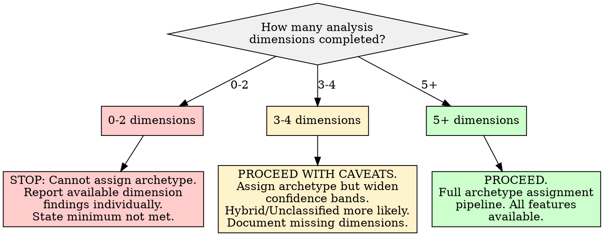

# Archetype Assignment

## Overview

Synthesize outputs from multiple prior analysis phases into a persona archetype classification by evaluating weighted evidence across dimensions, computing fit scores per reference archetype, assigning with confidence, and documenting supporting evidence. The core principle: **an archetype is a behavioral pattern supported by converging multi-dimensional evidence, not a label derived from any single analysis -- assignment requires evidence from at least three independent analysis dimensions, and every assignment must carry an explicit confidence score and evidence trail.**

## When to Use

- Multiple prior analyses have been completed (taxonomy/interest classification, sentiment analysis, engagement scoring, temporal patterns, psycholinguistic profile, personality traits, network/social graph, or similar)
- Need to synthesize heterogeneous analysis outputs into a single persona classification
- Assigning user role archetypes (Subject Matter Expert, Lurker-turned-Leader, Community Gatekeeper, Emotional Support Seeker, Digital Nomad/Generalist, or custom archetypes)
- Building a composite user profile from multi-dimensional behavioral evidence
- Need confidence-scored archetype assignment with documented evidence trail
- Evaluating whether a user fits a reference archetype, a hybrid blend, or no established archetype

**When NOT to use:**

- Fewer than 3 prior analysis dimensions are available (see Insufficient Data Handling)
- Goal is to classify content rather than a user/account
- Attempting to psychologically diagnose or clinically profile an individual
- Assigning archetypes for evaluative, hiring, screening, or gatekeeping purposes
- Only a single analysis dimension is available (use that dimension's own classification instead)



## Quick Reference: Reference Archetypes

These five reference archetypes represent common behavioral patterns in online communities. They are NOT exhaustive -- users may fit none, one, or a blend of multiple archetypes.

| Archetype | Core Signal | Primary Evidence Dimensions | Distinguishing Markers |
|-----------|-------------|---------------------------|----------------------|
| **Subject Matter Expert (SME)** | Deep, concentrated expertise with high engagement quality | Taxonomy (specialist), Engagement (high quality), Psycholinguistic (analytical-reflective), Personality (high Openness, high Conscientiousness) | Peaked interest distribution, high content-to-process word ratio, analytical register, substantive rather than social engagement |
| **Lurker-turned-Leader** | Temporal transition from low to high activity with increasing community influence | Temporal (activity ramp-up), Engagement (increasing over time), Network (growing centrality), Sentiment (stabilizing positive) | Clear temporal inflection point, early low-frequency period followed by sustained high engagement, growing reply/thread initiation rates |
| **Community Gatekeeper** | Information flow control with broad community connections and moderate-to-high engagement | Network (high betweenness centrality), Engagement (consistent moderate-high), Taxonomy (moderate breadth), Psycholinguistic (social-relational register) | Bridges multiple sub-communities, responds across many threads, social process words elevated, consistent posting schedule |
| **Emotional Support Seeker** | Affect-heavy engagement with social connection emphasis | Sentiment (high variability, negative skew), Psycholinguistic (affective-dominant, high I-pronouns), Personality (high Neuroticism indicators), Engagement (response-seeking patterns) | Elevated negative emotion vocabulary, high self-reference, question-heavy posts, sentiment volatility, seeking validation patterns |
| **Digital Nomad/Generalist** | Broad, shallow engagement across many topics without deep commitment to any | Taxonomy (polymathic/broad), Temporal (irregular/bursty), Engagement (moderate, spread thin), Network (peripheral, many weak ties) | Flat interest distribution, high orthogonality score, irregular posting schedule, low thread depth, wide but shallow network connections |

## Workflow

Copy this checklist and track progress:

```
Archetype Assignment Progress:
- [ ] Step 1: Inventory completed prior analyses and assess coverage
- [ ] Step 2: Extract key indicators from each completed analysis
- [ ] Step 3: Build the evidence matrix (archetype x dimension)
- [ ] Step 4: Compute fit scores per reference archetype
- [ ] Step 5: Evaluate hybrid/blended archetype possibilities
- [ ] Step 6: Assign archetype with confidence score
- [ ] Step 7: Document supporting and contradicting evidence
- [ ] Step 8: Assess temporal stability of the assignment
- [ ] Step 9: Write findings to docs/analysis/23-archetype-assignment.md
```

### Step 1: Inventory Completed Prior Analyses

Before synthesizing, catalog which prior analyses are available and their confidence levels. Each analysis is one "dimension" of evidence.

**Analysis dimension inventory:**

| Dimension | Typical Source Skill | Key Output for Archetype Assignment | Required? |
|-----------|---------------------|-------------------------------------|-----------|
| **Interest Taxonomy** | taxonomic-interest-classification | Orthogonality score, interest shape (peaked/bimodal/plateau/flat), primary pillars | Strongly recommended |
| **Sentiment** | vader-sentiment-analysis | Mean/median compound, distribution shape, volatility, trajectory patterns | Strongly recommended |
| **Engagement** | weighted-engagement-scoring | Composite engagement score, component breakdown, ranking position | Strongly recommended |
| **Temporal Patterns** | temporal-circadian-patterns | Activity regularity, burst detection, engagement style classification, trend direction | Recommended |
| **Psycholinguistic Profile** | liwc-psycholinguistic | Dominant dimensions, register classification, process/content word ratio | Recommended |
| **Personality Traits** | big-five-personality | OCEAN scores with confidence bands, writing style constraints | Optional (enhances) |
| **Network Position** | network-social-graph | Centrality metrics, community membership, bridging scores | Optional (enhances) |
| **MDPI Hypernetwork** | mdpi-hypernetwork-archetype | Three-letter archetype (Score-Sentiment-Toxicity), typicality score | Optional (enhances) |
| **Topic Modeling** | nmf-topic-modeling | Topic distribution, dominant topics, topic coherence | Optional (enhances) |
| **Rhetorical Style** | rhetorical-discourse-structure | Rhetorical moves, argument patterns, discourse structure | Optional (enriches) |

**Minimum requirement: 3 dimensions must be completed to proceed.** If fewer than 3 are available, STOP and report that archetype assignment cannot be performed with sufficient confidence.

**For each available dimension, record:**
1. The analysis report location (e.g., `docs/analysis/04-taxonomic-interest-classification.md`)
2. The confidence level reported by that analysis (high/moderate/low/insufficient)
3. The key indicators that feed into archetype assignment

### Step 2: Extract Key Indicators from Each Completed Analysis

For each completed prior analysis, extract the specific indicators relevant to archetype differentiation.

**Extraction targets per dimension:**

**Taxonomy/Interest:**
- Classification: Deep Specialist / Specialist / Moderate / Broad / Polymathic
- Interest shape: Peaked / Bimodal / Plateau / Flat
- Orthogonality score (0.0-1.0)
- Primary and secondary interest pillars
- Number of occupied categories

**Sentiment:**
- Mean compound score
- Sentiment distribution: % positive / negative / neutral
- Trajectory pattern: stabilizing / volatile / inflecting / plateau
- Sentiment skewness
- Tier mismatches (title vs body divergence)

**Engagement:**
- Composite engagement score (percentile within corpus)
- Component breakdown (which signals drive the score)
- Sensitivity analysis result (robust / moderate / sensitive)
- Temporal engagement trend (increasing / stable / decreasing)

**Temporal Patterns:**
- Activity regularity score (circadian consistency)
- Engagement style: steady / bursty / weekend-warrior / nocturnal
- Trend direction: increasing / stable / declining
- Burst frequency and characteristics
- Temporal inflection points (if any)

**Psycholinguistic Profile:**
- Dominant register: analytical-reflective / social-relational / expressive-positive / expressive-negative / achievement-oriented / authority-oriented / sensory-descriptive / process-heavy / content-dense
- Top 3 dimensions by baseline deviation
- Function word percentage (process vs content orientation)
- Summary variable approximations (Analytic, Clout, Authenticity, Tone)

**Personality Traits (if available):**
- OCEAN scores (normalized 0-100) with confidence bands
- Which traits have confident (non-indeterminate) readings
- Trait conflicts and resolutions

**Network Position (if available):**
- Degree centrality (how connected)
- Betweenness centrality (how much a bridge)
- Community membership (how many sub-communities)
- Network role classification (hub / bridge / peripheral / isolate)

### Step 3: Build the Evidence Matrix

Construct a matrix mapping each reference archetype against each available evidence dimension. For each cell, record whether the evidence SUPPORTS, CONTRADICTS, or is NEUTRAL toward that archetype.

**Evidence matrix structure:**

```
                    | SME | Lurker-turned-Leader | Community Gatekeeper | Emotional Support Seeker | Digital Nomad |
--------------------|-----|----------------------|----------------------|--------------------------|---------------|
Taxonomy            | [S/C/N] | [S/C/N]          | [S/C/N]              | [S/C/N]                  | [S/C/N]       |
Sentiment           | [S/C/N] | [S/C/N]          | [S/C/N]              | [S/C/N]                  | [S/C/N]       |
Engagement          | [S/C/N] | [S/C/N]          | [S/C/N]              | [S/C/N]                  | [S/C/N]       |
Temporal            | [S/C/N] | [S/C/N]          | [S/C/N]              | [S/C/N]                  | [S/C/N]       |
Psycholinguistic    | [S/C/N] | [S/C/N]          | [S/C/N]              | [S/C/N]                  | [S/C/N]       |
Personality         | [S/C/N] | [S/C/N]          | [S/C/N]              | [S/C/N]                  | [S/C/N]       |
Network             | [S/C/N] | [S/C/N]          | [S/C/N]              | [S/C/N]                  | [S/C/N]       |

S = Supports (evidence aligns with archetype markers)
C = Contradicts (evidence conflicts with archetype markers)
N = Neutral (evidence neither supports nor contradicts, or dimension not available)
```

**Scoring rules for each cell:**

| Evidence Alignment | Score | Criteria |
|--------------------|-------|----------|
| **Strong Support** | +2 | Indicator is a primary marker for this archetype AND falls clearly within expected range |
| **Moderate Support** | +1 | Indicator is a secondary marker OR primary marker at boundary of expected range |
| **Neutral** | 0 | Indicator is not relevant to this archetype, or value is ambiguous/indeterminate |
| **Moderate Contradiction** | -1 | Indicator conflicts with a secondary expectation for this archetype |
| **Strong Contradiction** | -2 | Indicator conflicts with a primary marker for this archetype |

**Example evidence evaluation for SME archetype on Taxonomy dimension:**
- Taxonomy classification = "Deep Specialist" or "Specialist" --> Strong Support (+2)
- Taxonomy classification = "Moderate" with peaked shape --> Moderate Support (+1)
- Taxonomy classification = "Broad" or "Polymathic" --> Strong Contradiction (-2)

### Step 4: Compute Fit Scores per Reference Archetype

For each archetype, compute a weighted fit score from the evidence matrix.

**Weighting rules:**

Dimensions with higher confidence get more weight. Dimensions that are primary differentiators for a given archetype get more weight than dimensions that are secondary.

```
Fit_score(archetype) = SUM(evidence_score_i * dimension_weight_i * confidence_weight_i) / SUM(dimension_weight_i * confidence_weight_i)
```

**Dimension weight guidelines:**

| Dimension Role for Archetype | Weight |
|------------------------------|--------|
| **Primary differentiator** (listed as "Primary Evidence" in Quick Reference) | 1.5 |
| **Secondary differentiator** (supports but does not define) | 1.0 |
| **Tertiary / supplemental** | 0.5 |

**Confidence weight mapping:**

| Prior Analysis Confidence | Weight |
|--------------------------|--------|
| High | 1.0 |
| Moderate | 0.7 |
| Low | 0.4 |
| Insufficient / Not available | 0.0 (exclude) |

**Fit score interpretation:**

| Fit Score Range | Interpretation |
|-----------------|----------------|
| > 0.60 | Strong fit -- archetype is well-supported |
| 0.30 to 0.60 | Moderate fit -- archetype is plausible but not dominant |
| 0.00 to 0.30 | Weak fit -- some supporting evidence but insufficient |
| < 0.00 | Poor fit -- contradicting evidence outweighs support |

### Step 5: Evaluate Hybrid/Blended Archetype Possibilities

Users rarely fit a single archetype perfectly. Evaluate whether a hybrid classification better represents the evidence.

**Hybrid assignment criteria:**



**Hybrid classification format:**
- **Primary archetype:** The highest-scoring archetype (if score > 0.30)
- **Secondary archetype:** The second-highest (if within 0.25 of primary AND score > 0.30)
- **Blend description:** One sentence describing which traits from each archetype are present
- Example: "SME-Gatekeeper hybrid: deep domain expertise (SME) combined with cross-community bridging behavior (Gatekeeper)"

**When NO archetype fits (all scores < 0.30):**
- Do NOT force an assignment
- Classify as "Unclassified / Emerging Pattern"
- Describe the user's behavioral profile in terms of the individual dimension findings
- Note which reference archetypes came closest and why they did not reach threshold
- Consider whether the evidence suggests a novel archetype not in the reference set

### Step 6: Assign Archetype with Confidence Score

**Confidence score computation:**

The confidence in the archetype assignment depends on three factors:

1. **Fit strength:** How high is the top fit score?
2. **Evidence coverage:** How many dimensions contributed evidence?
3. **Evidence agreement:** How consistent is the evidence (few contradictions)?

```
Confidence = (fit_strength_factor + coverage_factor + agreement_factor) / 3
```

**Factor definitions:**

| Factor | Computation | Range |
|--------|-------------|-------|
| **Fit strength** | Top fit score normalized to [0, 1]. Score of 0.60+ = 1.0; 0.30 = 0.5; below 0.30 = proportional | 0.0 - 1.0 |
| **Coverage** | (dimensions with non-neutral evidence) / (total dimensions available) | 0.0 - 1.0 |
| **Agreement** | 1.0 - (number of contradicting dimensions / total contributing dimensions) | 0.0 - 1.0 |

**Confidence interpretation:**

| Confidence Score | Label | Meaning |
|-----------------|-------|---------|
| 0.75 - 1.00 | **High** | Strong, consistent multi-dimensional support. Assignment is reliable. |
| 0.50 - 0.74 | **Moderate** | Reasonable support with some gaps or minor contradictions. Assignment is plausible. |
| 0.30 - 0.49 | **Low** | Mixed evidence or limited dimensional coverage. Assignment is tentative. |
| 0.00 - 0.29 | **Very Low** | Insufficient or contradictory evidence. Assignment should not be treated as reliable. |

### Step 7: Document Supporting and Contradicting Evidence

For the assigned archetype (and secondary archetype if hybrid), document:

**For each supporting dimension:**
- Which specific indicator(s) support the assignment
- The indicator value and what makes it supportive
- The confidence level of that prior analysis

**For each contradicting dimension:**
- Which specific indicator(s) conflict with the assignment
- Why the contradiction was overridden (e.g., outweighed by stronger evidence, low confidence on the contradicting dimension)

**For neutral dimensions:**
- Why the dimension did not contribute (not available, value was ambiguous, dimension is not relevant to this archetype)

This evidence trail is the most important output. An archetype label without its evidence trail is an unsupported assertion.

### Step 8: Assess Temporal Stability

If temporal data is available, evaluate whether the archetype assignment would differ across time periods.

**Temporal stability checks:**
- If temporal analysis showed a clear activity trend (increasing, declining), the archetype may be transitional
- If sentiment trajectory showed inflection points, the affective component of the archetype may have shifted
- If engagement patterns changed over time, the user may have transitioned between archetypes

**Stability classification:**

| Pattern | Classification | Implication |
|---------|---------------|-------------|
| All dimensions stable over time | **Stable archetype** | Assignment reflects enduring behavioral pattern |
| 1-2 dimensions show temporal change | **Mostly stable** | Note which dimensions are shifting and in what direction |
| Activity trend shows clear transition | **Transitional** | User may be moving between archetypes; report the direction (e.g., "transitioning from Lurker toward SME") |
| Multiple dimensions show inconsistent temporal patterns | **Unstable / context-dependent** | Archetype may not be the right frame; describe dimensional profile instead |

### Step 9: Write the Report

Write all findings to `docs/analysis/23-archetype-assignment.md`. See the report template below.

## Report Output Template

The final report MUST be written to `docs/analysis/23-archetype-assignment.md` with this structure:

```markdown
# Archetype Assignment

## Methodology
- **Approach:** Multi-dimensional evidence synthesis across [N] completed analysis phases
- **Reference archetypes:** Subject Matter Expert (SME), Lurker-turned-Leader, Community Gatekeeper, Emotional Support Seeker, Digital Nomad/Generalist [+ any custom archetypes]
- **Minimum dimensional threshold:** 3 independent analysis dimensions required
- **Scoring method:** Weighted evidence matrix with dimension confidence weighting
- **Date of synthesis:** [date]

## Prior Analysis Inventory

### Completed Analyses
| Dimension | Report Location | Confidence | Key Indicators Extracted |
|-----------|----------------|------------|-------------------------|
| [dimension] | [path] | [high/moderate/low] | [brief summary of extracted indicators] |
| ... | ... | ... | ... |

### Analyses Not Available
| Dimension | Impact on Assignment |
|-----------|---------------------|
| [dimension] | [how absence affects confidence or differentiability] |

## Evidence Matrix

### Raw Evidence Scores
| Dimension | SME | Lurker-turned-Leader | Community Gatekeeper | Emotional Support Seeker | Digital Nomad |
|-----------|-----|----------------------|----------------------|--------------------------|---------------|
| [dim] | [+2/+1/0/-1/-2] | ... | ... | ... | ... |
| ... | ... | ... | ... | ... | ... |

### Evidence Justification
[For each non-zero cell in the matrix, a one-sentence explanation of why that evidence score was assigned]

## Fit Scores

| Archetype | Raw Fit Score | Weighted Fit Score | Interpretation |
|-----------|--------------|-------------------|----------------|
| [archetype] | [score] | [score] | [strong/moderate/weak/poor fit] |
| ... | ... | ... | ... |

## Archetype Assignment

### Primary Assignment
- **Archetype:** [name]
- **Fit score:** [value]
- **Confidence:** [score] ([High/Moderate/Low/Very Low])

### Secondary Assignment (if hybrid)
- **Archetype:** [name]
- **Fit score:** [value]
- **Blend description:** [one-sentence hybrid description]

### Confidence Breakdown
| Factor | Score | Rationale |
|--------|-------|-----------|
| Fit strength | [0-1] | [explanation] |
| Evidence coverage | [0-1] | [N of M dimensions contributed] |
| Evidence agreement | [0-1] | [N contradictions out of M contributing dimensions] |
| **Overall confidence** | **[0-1]** | **[label]** |

## Evidence Trail

### Supporting Evidence
| Dimension | Indicator | Value | Why It Supports |
|-----------|-----------|-------|-----------------|
| [dim] | [indicator] | [value] | [explanation] |

### Contradicting Evidence
| Dimension | Indicator | Value | Why It Contradicts | Resolution |
|-----------|-----------|-------|--------------------|------------|
| [dim] | [indicator] | [value] | [explanation] | [why overridden] |

### Neutral / Non-Contributing Dimensions
| Dimension | Reason |
|-----------|--------|
| [dim] | [not available / ambiguous / not relevant to assigned archetype] |

## Temporal Stability Assessment
- **Stability classification:** [Stable / Mostly stable / Transitional / Unstable]
- **Temporal evidence:** [summary of temporal patterns affecting stability]
- **Trajectory (if transitional):** [from archetype X toward archetype Y, based on evidence Z]

## Profile Summary
[2-3 paragraph narrative synthesizing all findings into a cohesive behavioral portrait. This should read as a description of how the user engages with the community, NOT as a personality assessment or value judgment. Reference specific evidence from the dimensions.]

## Limitations and Caveats
- Archetypes are behavioral pattern descriptions, not personality types or fixed identities
- The reference archetype set is not exhaustive -- users may exhibit patterns not captured by any reference archetype
- Assignment confidence is bounded by the confidence of the input analyses
- [Specific dimensional gaps and their impact]
- [Evidence contradictions and how they were resolved]
- Archetype assignment reflects behavior observed in THIS corpus during THIS time period
- The same user may exhibit different archetype patterns in different communities or at different times
- These results should NOT be used for evaluative judgment, gatekeeping, or any decision that affects the individual

## References
- Ferrara, E., et al. (2025). Characterizing User Archetypes and Discussions on Social Hypernetworks. *MDPI Big Data and Cognitive Computing*, 9(9), 236.
- Akar, E. & Mardikyan, S. (2018). User Roles and Contribution Patterns in Online Communities. *SAGE Open*, 8(3).
- Welser, H.T., et al. (2011). Finding Social Roles in Wikipedia. *iConference*.
- Tu, N. & Dong, X. (2010). Using cluster analysis in Persona development. *IEEE/ACIS International Conference*.
- Stachl, C., et al. (2022). The kernel of truth in text-based personality assessment. *Psychological Bulletin*.
```

## Good Patterns

- **Require multi-dimensional evidence** -- never assign an archetype from a single analysis dimension
- **Weight evidence by confidence** -- a high-confidence taxonomy classification matters more than a low-confidence personality inference
- **Allow hybrid archetypes** -- most users blend traits from multiple archetypes; forcing a single label loses nuance
- **Document the evidence trail** -- every archetype assignment must trace back to specific indicators from specific analyses
- **Report confidence explicitly** -- an assignment with 0.35 confidence is fundamentally different from one with 0.85 confidence
- **Evaluate temporal stability** -- if evidence suggests the user's behavior is changing, a static archetype label is misleading
- **Treat archetypes as behavioral descriptions** -- they describe what someone DOES in a community, not who they ARE as a person
- **Allow "Unclassified"** -- forcing every user into a reference archetype when evidence is mixed produces false precision

## Anti-Patterns

| Anti-Pattern | Why It Fails | Instead |
|--------------|-------------|---------|
| Assigning archetype from a single dimension | A taxonomy score alone cannot distinguish SME from Emotional Support Seeker who happens to focus on one topic | Require 3+ converging dimensions |
| Treating archetypes as exhaustive/mutually exclusive | Real users blend behaviors; forcing one label loses the most interesting patterns | Allow hybrid assignments; allow "Unclassified" |
| Forcing assignment when evidence is mixed | A low-confidence forced assignment is worse than an honest "insufficient evidence" | Report "Unclassified" with dimensional profile when no archetype scores above 0.30 |
| Ignoring temporal changes in archetype | Users evolve; a "Lurker-turned-Leader" label only makes sense if the temporal transition is visible | Assess temporal stability; report transitions |
| Using archetypes as personality labels | "This person IS a Gatekeeper" implies fixed identity; behavior varies by context and time | Frame as "exhibits Gatekeeper behavioral patterns in this corpus during this period" |
| Equal-weighting all dimensions regardless of confidence | A low-confidence personality inference should not override a high-confidence taxonomy classification | Apply confidence-based weighting |
| Omitting contradicting evidence | Cherry-picking supporting evidence while ignoring contradictions produces biased assignments | Document ALL evidence, supporting AND contradicting |
| Presenting fit scores without the evidence matrix | A fit score of 0.55 is meaningless without knowing which dimensions contributed what | Always include the evidence matrix alongside scores |
| Assuming the reference archetypes are complete | Five archetypes cannot capture all user behavioral patterns; novel patterns exist | Allow "Emerging Pattern" classification with descriptive labeling |

## Boundaries

**This skill SHOULD:**
- Synthesize outputs from 3+ prior analysis dimensions into a persona archetype
- Evaluate evidence per archetype using the weighted evidence matrix
- Assign archetypes with explicit confidence scores
- Document supporting AND contradicting evidence for every assignment
- Allow hybrid/blended archetype classifications
- Report "Unclassified" when evidence is insufficient or contradictory
- Assess temporal stability of the assignment
- Write findings to `docs/analysis/23-archetype-assignment.md`

**This skill should NOT:**
- Treat archetypes as fixed personality types or stable identities
- Force classification when evidence is insufficient (all fit scores below 0.30)
- Use archetypes for judgment, evaluation, hiring, moderation, or gatekeeping
- Assume the five reference archetypes are exhaustive (they are a starting framework)
- Override high-confidence evidence with low-confidence evidence
- Assign archetypes from fewer than 3 completed analysis dimensions
- Present assignments without confidence scores and evidence trails
- Claim that archetype assignment reveals who someone "really is"
- Make predictions about future behavior based on archetype assignment
- Compare archetype assignments across different communities without recalibrating

## Insufficient Data Handling



| Condition | Action |
|-----------|--------|
| **0-2 analysis dimensions completed** | STOP. Do NOT assign an archetype. Report only: which dimensions are available, their individual findings, and a statement that archetype assignment requires at least 3 converging dimensions. Recommend which additional analyses would most improve coverage. |
| **3-4 dimensions completed** | Assign archetype but prominently flag limited dimensional coverage. Reduce maximum achievable confidence by 0.15 (cap at 0.85). Document which missing dimensions would strengthen or potentially change the assignment. Hybrid and "Unclassified" outcomes are more likely at this coverage level. |
| **5+ dimensions completed** | Full assignment pipeline. All features and confidence levels available. |
| **One dimension has very high confidence but others are low** | Do NOT let the high-confidence dimension dominate. The weighting system accounts for confidence, but archetype assignment is inherently multi-dimensional. A single strong signal is necessary but not sufficient. |
| **Evidence is contradictory (3+ dimensions contradict the top archetype)** | Do NOT force assignment. Report as "Contradictory Evidence Profile" and describe the dimensional findings individually. The user's behavior may not fit the reference archetype framework. |
| **All fit scores are similar (spread < 0.15)** | The evidence does not discriminate between archetypes. Report as "Undifferentiated Profile" and note that the user does not show a distinctive archetype pattern. This is information, not a failure. |
| **Temporal data shows archetype transition** | Assign BOTH the current archetype and the trajectory. Format: "Transitioning from [archetype A] toward [archetype B], currently at [stage]. Evidence: [temporal indicators]." |
| **Prior analyses used different corpora or time windows** | Flag the misalignment. If analyses cover substantially different time periods or data subsets, the synthesis is comparing non-parallel evidence. Weight accordingly and document. |
| **A completed analysis reported its own results as "insufficient data"** | Treat that dimension as NOT available for archetype assignment. Do not extract indicators from an analysis that flagged its own results as unreliable. |

## Common Mistakes

| Mistake | Fix |
|---------|-----|
| Assigning archetype from the single most dramatic analysis finding | Use the full evidence matrix. A high orthogonality score alone does not make someone a Digital Nomad. |
| Reporting fit score without showing the evidence matrix | Always include the matrix. The score is a summary; the matrix is the evidence. |
| Treating "Unclassified" as a failure | It is a valid and informative outcome. Not every user fits a reference archetype. |
| Skipping temporal stability assessment | If temporal data exists, you must assess whether the archetype is stable, transitional, or context-dependent. |
| Presenting the archetype as permanent identity | Always frame as "behavioral pattern observed in this corpus during this period." |
| Forcing a single archetype when evidence supports a hybrid | Allow and document hybrid classifications. Most users exhibit blended patterns. |
| Weighting all dimensions equally despite different confidence levels | Apply confidence-based weighting. A high-confidence analysis should outweigh a low-confidence one. |
| Ignoring contradicting evidence in the report | Document ALL contradictions and how they were resolved. Cherry-picking destroys credibility. |
| Using archetype assignment for moderation or evaluation decisions | Archetypes describe behavior, not quality or worth. They are analytical tools, not judgment tools. |
| Not recommending additional analyses when coverage is thin | When only 3-4 dimensions are available, explicitly state which additional analyses would most strengthen the assignment. |

## References

- [Ferrara, E., et al. (2025). Characterizing User Archetypes and Discussions on Social Hypernetworks. *MDPI Big Data and Cognitive Computing*, 9(9), 236.](https://www.mdpi.com/2504-2289/9/9/236)
- [Akar, E. & Mardikyan, S. (2018). User Roles and Contribution Patterns in Online Communities. *SAGE Open*, 8(3).](https://journals.sagepub.com/doi/10.1177/2158244018794773)
- [Welser, H.T., et al. (2011). Finding Social Roles in Wikipedia. *iConference*.](https://academic.oup.com/jcmc/article/22/6/337/4675174)
- [Tu, N. & Dong, X. (2010). Using cluster analysis in Persona development. *IEEE/ACIS*.](https://ieeexplore.ieee.org/document/5681684)
- [Stachl, C., et al. (2022). The kernel of truth in text-based personality assessment. *Psychological Bulletin*.](https://research.tilburguniversity.edu/en/publications/the-kernel-of-truth-in-text-based-personality-assessment-a-meta-a)
- [NN/g: Personas vs. Archetypes.](https://www.nngroup.com/articles/personas-archetypes/)
- [Multi-dimensional clustering in user profiling (Westminster/CORE).](https://core.ac.uk/outputs/161121828/)
- [Data-driven Personas: Constructing Archetypal Users with Clickstreams and User Telemetry (CHI 2016).](https://dl.acm.org/doi/10.1145/2858036.2858523)
- [An, J., et al. (2021). A Survey of 15 Years of Data-Driven Persona Development. *International Journal of Human-Computer Interaction*.](https://www.tandfonline.com/doi/full/10.1080/10447318.2021.1908670)
- [Discourse Blog: Understanding Lurkers in Online Communities.](https://blog.discourse.org/2023/08/online-community-engagement-understanding-lurkers/)
