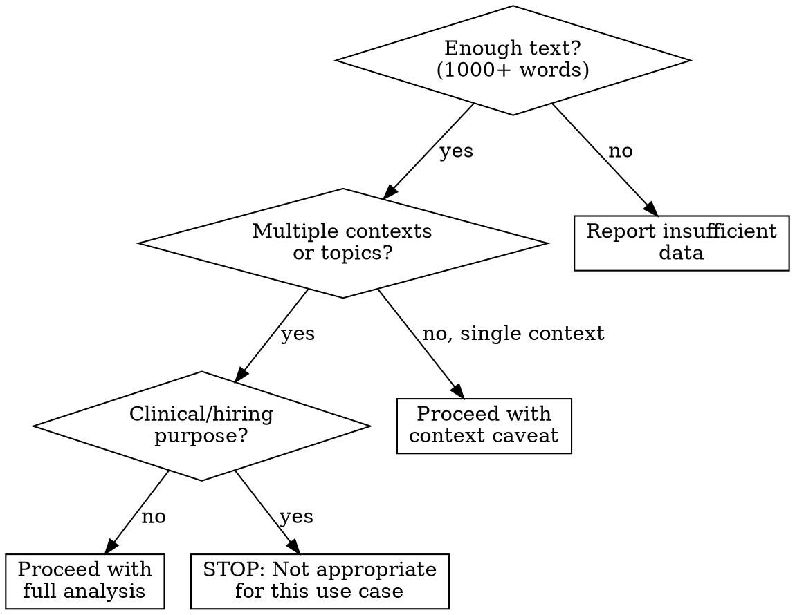
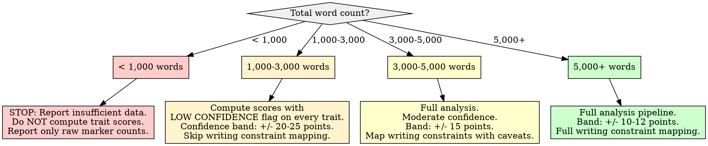

# Big Five (OCEAN) Personality Profiling

## Overview

Infer Big Five personality trait positions from linguistic markers in a text corpus, then map each trait to concrete writing style constraints for voice replication. The core principle: **personality influences word choice in measurable but modest ways** -- the mean absolute correlation between Big Five traits and LIWC categories is ~0.14 (Yarkoni, 2010), with the strongest single correlation at ~0.23. This means text-based personality inference reveals *tendencies*, never *diagnoses*. Treat all outputs as relative positions on a continuum with wide confidence bands, not as fixed personality scores.

**Research foundation:** The 2022 meta-analysis by Stachl et al. in *Psychological Bulletin* (N = 85,724 across 26 studies) established that 20 linguistic categories constitute a "kernel of truth" correlating with both self- and observer-reported Big Five traits. Self-report correlations are small (|r| = .08-.14); observer-report correlations are small-to-medium (|r| = .18-.39). The 52 LIWC categories collectively explain ~5.1% of self-reported personality variance, but ~38.5% of observer-reported variance.

## When to Use

- Characterizing an author's personality tendencies from a corpus of their writing
- Building a personality profile to inform writing style replication or voice matching
- Quantifying linguistic markers associated with each OCEAN dimension
- Comparing a writing sample's trait indicators against population baselines
- Feeding trait positions into archetype classification or persona construction

**When NOT to use:**

- Diagnosing personality disorders or clinical conditions (this is NOT a clinical tool)
- Making hiring, screening, or gatekeeping decisions based on inferred traits
- Corpus contains fewer than 1,000 words (see Insufficient Data Handling)
- Text is translated, heavily edited by others, or ghostwritten (author signal is diluted)
- Single-context writing only (e.g., all work emails) -- context constrains language and masks personality



## Quick Reference

### The Five Traits and Their Linguistic Markers

| Trait | High-Trait Linguistic Indicators | Low-Trait Linguistic Indicators |
|-------|----------------------------------|--------------------------------|
| **Openness (O)** | Articles, prepositions, long words (6+ chars), insight words ("think", "know", "consider"), tentative language, abstract/intellectual vocabulary, cultural references, varied vocabulary (high type-token ratio) | Short words, concrete/simple vocabulary, low type-token ratio, few insight words, past-tense orientation |
| **Conscientiousness (C)** | Achievement words ("earn", "win", "completed"), exclusion words ("but", "except", "without"), negations used for precision, formal structure, longer sentences, organized discourse markers | Fewer achievement words, more filler words, shorter sentences, informal structure, present-tense hedging |
| **Extraversion (E)** | Social words ("friend", "talk", "party"), positive emotion words, 1st person plural ("we", "us"), references to people/groups, exclamation marks, informal/conversational tone, shorter words | Fewer social references, more articles/prepositions (task-oriented), longer words, formal tone, 1st person singular, fewer exclamations |
| **Agreeableness (A)** | Positive emotion words, affirmation ("agree", "wonderful", "great"), 1st person singular (expressing empathy), words about family/home/friends, fewer swear words, hedging/softening language | Negative emotion words, swear words, words about money/death, direct/blunt phrasing, fewer affirmations, competitive language |
| **Neuroticism (N)** | 1st person singular ("I", "me", "my"), negative emotion words ("awful", "worried", "terrible"), anxiety words, sadness words, anger words, more past tense, hedging/uncertainty markers | Fewer 1st person singular, fewer negative emotion words, more present tense, confident/certain language, fewer anxiety/worry words |

### Key Metric Thresholds

| Parameter | Value | Source |
|-----------|-------|--------|
| **Minimum corpus size (basic)** | 1,000 words | IBM Watson Personality Insights research |
| **Minimum corpus size (reliable)** | 3,000+ words | IBM Watson validation studies |
| **Optimal corpus size** | 5,000-10,000+ words | Yarkoni (2010): bloggers averaged 115,000 words |
| **Expected correlation strength** | r = 0.08-0.23 | Stachl et al. (2022) meta-analysis |
| **Variance explained (self-report)** | ~5.1% | 52 LIWC categories combined |
| **Variance explained (observer)** | ~38.5% | 52 LIWC categories combined |
| **Population baseline** | Score 50 on 0-100 scale | By definition, population mean is the midpoint |
| **Confidence band (typical)** | +/- 15-20 points | On a 0-100 normalized scale |

## Workflow

Copy this checklist and track progress:

```
Big Five Personality Profiling Progress:
- [ ] Step 1: Validate corpus suitability and size
- [ ] Step 2: Compute linguistic marker frequencies per trait
- [ ] Step 3: Score each trait dimension (raw indicators)
- [ ] Step 4: Normalize scores and compute confidence bands
- [ ] Step 5: Map trait positions to writing style constraints
- [ ] Step 6: Generate the personality-informed writing profile
- [ ] Step 7: Write findings to docs/analysis/15-big-five-personality.md
```

### Step 1: Validate Corpus Suitability

Before analysis, verify the corpus can support personality inference.

**Suitability checks:**

| Check | Pass Condition | Fail Action |
|-------|---------------|-------------|
| **Word count** | 1,000+ words total | Below 1,000: STOP. Report insufficient data. Do not compute trait scores. |
| **Word count confidence** | 3,000+ words for moderate confidence | 1,000-3,000: Proceed but flag ALL scores as "low confidence." |
| **Language** | Predominantly English | Non-English text invalidates LIWC-based marker lists. Flag or exclude. |
| **Authorship** | Single author or known author set | Mixed/unknown authorship dilutes signal. Document limitation. |
| **Context diversity** | Writing spans 2+ topics or contexts | Single-context writing (all work emails, all game reviews) constrains language. Trait scores reflect the context, not the person. Flag prominently. |
| **Editing level** | Minimally edited, natural writing | Heavily edited/ghostwritten text reflects editorial voice, not author personality. |
| **Temporal span** | Multiple writing occasions preferred | A single long document from one sitting may reflect mood, not trait. |

**If corpus fails suitability:** Report the failure. State what was checked, what failed, and why personality inference is unreliable for this corpus. Do not force analysis on unsuitable data.

### Step 2: Compute Linguistic Marker Frequencies

For each trait dimension, count occurrences of validated linguistic markers across the corpus.

**Marker categories to measure (per LIWC-validated research):**

```python
# Validated marker categories derived from Pennebaker & King (1999),
# Yarkoni (2010), and Stachl et al. (2022) meta-analysis.
# These are CATEGORY-LEVEL indicators, not exhaustive word lists.

TRAIT_MARKERS = {
    'openness': {
        'positive_indicators': [
            'articles (a, an, the)',           # r ~ .10-.15
            'prepositions',                     # r ~ .08-.12
            'long words (6+ characters)',       # vocabulary complexity
            'insight words (think, know, consider, understand)',
            'tentative words (maybe, perhaps, guess)',
            'high type-token ratio',            # vocabulary diversity
            'abstract nouns',
            'cultural/intellectual references',
        ],
        'negative_indicators': [
            'present-tense verbs (overuse)',
            'concrete/simple vocabulary',
            'low type-token ratio',
            'home/family words (inversely correlated)',
        ],
    },
    'conscientiousness': {
        'positive_indicators': [
            'achievement words (earn, win, complete, success)',
            'exclusion words (but, except, without)',  # precision
            'negations used for precision',
            'longer average sentence length',
            'discourse markers (therefore, however, furthermore)',
            'future-tense verbs',
            'organized paragraph structure',
        ],
        'negative_indicators': [
            'filler words (um, like, basically)',
            'informal abbreviations',
            'very short sentences (fragmented)',
            'present-tense hedging',
        ],
    },
    'extraversion': {
        'positive_indicators': [
            'social words (friend, talk, share, together)',
            'positive emotion words (happy, great, love, wonderful)',
            '1st person plural (we, us, our)',
            'references to people and groups',
            'exclamation marks',
            'informal/conversational register',
            'shorter average word length',
        ],
        'negative_indicators': [
            'articles (task-focused writing)',   # inversely correlated
            'long words',
            '1st person singular (I-focused)',
            'formal register',
            'prepositions (complex structure)',
        ],
    },
    'agreeableness': {
        'positive_indicators': [
            'positive emotion words',
            'affirmation/agreement words (agree, wonderful, thank)',
            'family words (home, mother, friend)',
            'social process words',
            'hedging/softening (perhaps, might, I think)',
            'compliments and praise',
            'inclusive language (we, together)',
        ],
        'negative_indicators': [
            'swear words',
            'anger words',
            'death/violence references',
            'money/power words',
            'direct commands/imperatives',
            'competitive language',
        ],
    },
    'neuroticism': {
        'positive_indicators': [  # HIGH neuroticism markers
            '1st person singular (I, me, my, mine)',  # strongest marker
            'negative emotion words (awful, terrible, worried)',
            'anxiety words (nervous, afraid, tense)',
            'sadness words (cry, grief, sad)',
            'anger words (hate, annoyed, furious)',
            'past-tense verbs',
            'certainty-reducing hedges (I guess, maybe, not sure)',
        ],
        'negative_indicators': [  # LOW neuroticism (emotional stability)
            'positive emotion words',
            'present-tense verbs',
            'certainty words (always, definitely, clearly)',
            'fewer self-references',
        ],
    },
}
```

**Measurement approach:**

1. **Tokenize** the corpus (preserve case for emphasis detection, then lowercase for counting)
2. **Count** words falling into each marker category using a validated word list (LIWC-22 if available, or open alternatives like VADER lexicon for sentiment categories, NRC EmoLex for emotion categories)
3. **Compute** the frequency rate per marker category: `count / total_words * 100`
4. **Track** structural markers separately: average sentence length, type-token ratio, punctuation patterns, pronoun ratios

```python
import re
from collections import Counter

def compute_basic_markers(text):
    """Compute foundational linguistic markers for personality inference.
    This provides the raw measurements; trait scoring is in Step 3."""
    words = text.lower().split()
    total_words = len(words)
    if total_words == 0:
        return None

    unique_words = set(words)
    sentences = re.split(r'[.!?]+', text)
    sentences = [s.strip() for s in sentences if s.strip()]

    # Pronoun categories
    i_pronouns = {'i', 'me', 'my', 'mine', 'myself'}
    we_pronouns = {'we', 'us', 'our', 'ours', 'ourselves'}

    # Word length distribution
    long_words = [w for w in words if len(w) >= 6]

    markers = {
        'total_words': total_words,
        'unique_words': len(unique_words),
        'type_token_ratio': len(unique_words) / total_words,
        'avg_word_length': sum(len(w) for w in words) / total_words,
        'avg_sentence_length': total_words / max(len(sentences), 1),
        'long_word_pct': len(long_words) / total_words * 100,
        'i_pronoun_pct': sum(1 for w in words if w in i_pronouns) / total_words * 100,
        'we_pronoun_pct': sum(1 for w in words if w in we_pronouns) / total_words * 100,
        'exclamation_rate': text.count('!') / max(len(sentences), 1),
        'question_rate': text.count('?') / max(len(sentences), 1),
    }
    return markers
```

### Step 3: Score Each Trait Dimension

Convert raw marker frequencies into relative trait positions. Each trait is scored on a continuum, NOT as a binary classification.

**Scoring approach:**

For each trait, compute a weighted composite from its marker categories. The weights reflect the meta-analytic correlation strengths from Stachl et al. (2022).

**Scoring heuristic (when validated tools like LIWC-22 are unavailable):**

For each trait dimension:
1. Count the frequency of positive indicators (markers associated with HIGH trait levels)
2. Count the frequency of negative indicators (markers associated with LOW trait levels)
3. Compute a directional score: `(positive_rate - negative_rate) / (positive_rate + negative_rate)`
4. This yields a raw score from -1.0 (strongly low-trait) to +1.0 (strongly high-trait)
5. Center of 0.0 = indeterminate / population average

**Trait scoring table:**

| Trait | Primary Markers (highest r) | Secondary Markers | Weight Split |
|-------|----------------------------|-------------------|--------------|
| **Openness** | Long words, type-token ratio, articles | Insight words, tentative language, prepositions | 60% primary / 40% secondary |
| **Conscientiousness** | Achievement words, exclusion words, sentence length | Discourse markers, future tense, negation precision | 60% / 40% |
| **Extraversion** | Social words, positive emotion, we-pronouns | Exclamation rate, informal register, short words | 60% / 40% |
| **Agreeableness** | Positive emotion, affirmation, low swearing | Family words, hedging, inclusive language | 60% / 40% |
| **Neuroticism** | I-pronouns, negative emotion, anxiety words | Past tense, sadness words, anger words | 60% / 40% |

### Step 4: Normalize Scores and Compute Confidence Bands

**Normalization:**

Convert raw directional scores (-1.0 to +1.0) to a 0-100 scale centered at 50:

```
normalized_score = 50 + (raw_score * 50)
```

Where 50 = population average (indeterminate), 0 = extreme low-trait, 100 = extreme high-trait.

**Confidence bands:**

The confidence band width depends on corpus size and context diversity:

| Corpus Size | Context Diversity | Confidence Band |
|-------------|-------------------|-----------------|
| 1,000-2,000 words | Single context | +/- 25 points (extremely wide; results are suggestive only) |
| 1,000-2,000 words | Multiple contexts | +/- 20 points |
| 3,000-5,000 words | Single context | +/- 20 points |
| 3,000-5,000 words | Multiple contexts | +/- 15 points |
| 5,000-10,000 words | Multiple contexts | +/- 12 points |
| 10,000+ words | Multiple contexts | +/- 10 points (practical floor -- text-based inference has inherent limits) |

**Interpreting positions:**

| Normalized Score | Position Label | Meaning |
|-----------------|---------------|---------|
| 0-20 | Very Low | Strong low-trait indicators; well below population average |
| 20-35 | Low | Below population average |
| 35-50 | Low-Average | Slightly below to average |
| 50 | Average / Indeterminate | No directional signal; could be truly average or insufficient data |
| 50-65 | High-Average | Slightly above average |
| 65-80 | High | Above population average |
| 80-100 | Very High | Strong high-trait indicators; well above population average |

**Midpoint scores (40-60) require special handling:** If a trait scores in the 40-60 range, the confidence band likely spans from "low" to "high." Report this as "indeterminate" rather than "average." Average and indeterminate are different claims -- "average" implies knowledge of position; "indeterminate" correctly states the data cannot distinguish.

### Step 5: Map Trait Positions to Writing Style Constraints

This is the critical translation step: converting trait scores into actionable writing constraints that enable voice replication.

**Openness mapping:**

| Score Range | Writing Constraints |
|-------------|-------------------|
| High (65+) | Use varied, sophisticated vocabulary. Include abstract concepts and intellectual framing. Employ tentative/exploratory language ("perhaps", "consider", "one might argue"). Reference ideas, culture, philosophy. Longer, more complex sentence structures. |
| Average (35-65) | Mix of concrete and abstract. Standard vocabulary without being either simplistic or deliberately ornate. Balanced sentence complexity. |
| Low (0-35) | Prefer concrete, familiar vocabulary. Short, direct sentences. Focus on tangible/practical topics. Avoid abstract theorizing. Straightforward phrasing. |

**Conscientiousness mapping:**

| Score Range | Writing Constraints |
|-------------|-------------------|
| High (65+) | Structured, organized prose with clear paragraph progression. Use discourse markers ("therefore", "however", "in addition"). Achievement-oriented framing. Precise word choice with qualifying exclusions ("except", "unless"). Formal register. |
| Average (35-65) | Moderate structure. Mix of formal and informal. Some organizational markers. |
| Low (0-35) | Looser structure, more stream-of-consciousness. Casual tone. Shorter sentences. Fewer organizational markers. More present-tense, less future-planning language. |

**Extraversion mapping:**

| Score Range | Writing Constraints |
|-------------|-------------------|
| High (65+) | Conversational, energetic tone. Frequent references to people, social events, group activities. Use "we/us" framing. Positive emotion words. Exclamation marks (sparingly). Shorter, punchier sentences. Informal register. |
| Average (35-65) | Balanced social and task-oriented content. Mix of "I" and "we." Moderate emotional expression. |
| Low (0-35) | Task-oriented, analytical tone. Fewer social references. More "I" than "we." Longer, more complex sentences. Restrained emotional expression. Formal or neutral register. |

**Agreeableness mapping:**

| Score Range | Writing Constraints |
|-------------|-------------------|
| High (65+) | Warm, affirming tone. Hedge assertions ("I think", "it seems"). Express agreement and appreciation. Avoid blunt negative judgments. Inclusive language. Softened disagreements ("I see your point, but..."). No profanity. |
| Average (35-65) | Balanced directness and diplomacy. Occasional hedging. Can disagree openly but not harshly. |
| Low (0-35) | Direct, blunt tone. State opinions without hedging. Comfortable with disagreement and critique. May use stronger/coarser language. Challenge-oriented phrasing. Competitive framing. |

**Neuroticism mapping (inverted as Emotional Stability for constraint clarity):**

| Score Range (Neuroticism) | Writing Constraints |
|---------------------------|-------------------|
| High N / Low Stability (65+) | More self-referential ("I feel", "I worry"). Express uncertainty and doubt. Use hedging about outcomes. Negative emotion vocabulary is natural and frequent. Past-tense reflection. Qualify positive statements. |
| Average (35-65) | Balanced emotional expression. Mix of positive and negative. Moderate self-reference. |
| Low N / High Stability (0-35) | Confident, assured tone. Fewer self-references. Primarily positive or neutral emotional vocabulary. Present-tense, forward-looking. Minimal anxiety or doubt markers. Certainty language ("clearly", "definitely"). |

### Step 6: Generate the Personality-Informed Writing Profile

Synthesize the five trait positions and their writing constraints into a unified writing profile. The profile should resolve constraint conflicts between traits (e.g., high Openness suggests complex sentences, but high Extraversion suggests shorter sentences -- resolve toward moderate complexity with varied rhythm).

**Profile structure:**

```markdown
## Writing Voice Profile

### Trait Summary
| Trait | Score | Position | Confidence |
|-------|-------|----------|------------|
| Openness | [X] | [label] | +/- [N] |
| Conscientiousness | [X] | [label] | +/- [N] |
| Extraversion | [X] | [label] | +/- [N] |
| Agreeableness | [X] | [label] | +/- [N] |
| Neuroticism | [X] | [label] | +/- [N] |

### Composite Writing Constraints
- **Vocabulary level:** [simple / moderate / sophisticated / varied]
- **Sentence complexity:** [short-direct / moderate / long-complex / varied-rhythm]
- **Emotional tone:** [restrained / balanced / expressive / warm / intense]
- **Social orientation:** [task-focused / balanced / people-focused]
- **Formality:** [casual / moderate / formal / context-dependent]
- **Assertion style:** [hedged / balanced / direct / blunt]
- **Temporal orientation:** [past-reflective / present-focused / future-oriented]
- **Self-reference density:** [low / moderate / high]
```

**Resolving trait conflicts:**

When two traits push writing constraints in opposite directions, resolve by:
1. **Prioritize the stronger-signal trait** (the one further from 50 with the narrower confidence band)
2. **Document the tension** in the profile ("High Openness suggests complex vocabulary, but high Extraversion favors conversational brevity -- resolve toward varied vocabulary in casual structures")
3. **Never silently drop a constraint** -- if a conflict exists, name it

### Step 7: Write the Report

Write all findings to `docs/analysis/15-big-five-personality.md`.

## Report Output Template

The final report MUST be written to `docs/analysis/15-big-five-personality.md` with this structure:

```markdown
# Big Five (OCEAN) Personality Profile

## Methodology
- **Approach:** Linguistic marker frequency analysis mapped to Big Five personality dimensions
- **Corpus:** [N words scored, N documents/texts, date range, source description]
- **Marker framework:** LIWC-validated categories (Pennebaker & King 1999; Yarkoni 2010; Stachl et al. 2022)
- **Scoring method:** Directional composite scoring from marker frequencies, normalized to 0-100 scale
- **Confidence calibration:** Based on corpus size ([N] words) and context diversity ([single/multiple])

## Corpus Suitability Assessment
- **Word count:** [N] words ([sufficient / insufficient / marginal])
- **Language:** [English / mixed]
- **Authorship:** [Single / multiple / unknown]
- **Context diversity:** [Single context / multiple contexts -- list them]
- **Editing level:** [Natural / lightly edited / heavily edited]
- **Temporal span:** [Single occasion / multiple occasions over N days/months/years]
- **Overall suitability:** [Suitable / suitable with caveats / unsuitable]

## Trait Scores

| Trait | Raw Score | Normalized (0-100) | Position | Confidence Band | Interpretation |
|-------|-----------|--------------------|-----------|--------------------|----------------|
| Openness | [+/-X.XX] | [0-100] | [label] | +/- [N] | [1-sentence interpretation] |
| Conscientiousness | [+/-X.XX] | [0-100] | [label] | +/- [N] | [1-sentence interpretation] |
| Extraversion | [+/-X.XX] | [0-100] | [label] | +/- [N] | [1-sentence interpretation] |
| Agreeableness | [+/-X.XX] | [0-100] | [label] | +/- [N] | [1-sentence interpretation] |
| Neuroticism | [+/-X.XX] | [0-100] | [label] | +/- [N] | [1-sentence interpretation] |

## Linguistic Evidence per Trait

### Openness
- **Marker frequencies:** [table of measured indicator rates vs. corpus baseline]
- **Key evidence:** [most prominent indicators and their rates]
- **Confidence notes:** [what strengthens or weakens confidence in this score]

### Conscientiousness
[Same structure]

### Extraversion
[Same structure]

### Agreeableness
[Same structure]

### Neuroticism
[Same structure]

## Writing Style Constraints (for Voice Replication)

### Composite Profile
| Dimension | Constraint | Derived From |
|-----------|-----------|--------------|
| Vocabulary level | [constraint] | [trait(s)] |
| Sentence complexity | [constraint] | [trait(s)] |
| Emotional tone | [constraint] | [trait(s)] |
| Social orientation | [constraint] | [trait(s)] |
| Formality | [constraint] | [trait(s)] |
| Assertion style | [constraint] | [trait(s)] |
| Temporal orientation | [constraint] | [trait(s)] |
| Self-reference density | [constraint] | [trait(s)] |

### Trait Conflict Resolutions
[Document any conflicts between trait-derived constraints and how they were resolved]

### Exemplar Sentences
[3-5 sentences that demonstrate the constrained writing style, drawn from or inspired by the corpus]

## Limitations and Caveats
- Text-based personality inference captures tendencies, not diagnoses. The strongest individual LIWC-trait correlation is ~0.23 (Yarkoni, 2010).
- LIWC categories collectively explain ~5.1% of self-reported personality variance (Stachl et al., 2022). Results are probabilistic indicators, not deterministic measures.
- Writing context strongly affects language: the same person writes differently in email vs. social media vs. academic papers. Scores reflect the writing context as much as the person.
- [Corpus-specific limitations from Step 1]
- [Confidence band acknowledgment: scores of X and Y overlap at their confidence intervals, meaning they may not be truly different]
- These results should NOT be used for clinical assessment, hiring decisions, or any evaluative purpose. They are intended solely for writing style characterization.

## Population Baseline Comparison
- All scores are normed against a theoretical population mean of 50.
- Without a matched comparison corpus, absolute positions should be interpreted cautiously.
- The profile is most useful as a RELATIVE description (which traits are strongest/weakest for this author) rather than an absolute placement.

## References
- Pennebaker, J.W. & King, L.A. (1999). Linguistic styles: Language use as an individual difference. *Journal of Personality and Social Psychology*, 77(6), 1296-1312.
- Yarkoni, T. (2010). Personality in 100,000 Words: A large-scale analysis of personality and word use among bloggers. *Journal of Research in Personality*, 44(3), 363-373.
- Stachl, C., et al. (2022). The kernel of truth in text-based personality assessment: A meta-analysis of the relations between the Big Five and LIWC. *Psychological Bulletin*.
- Hirsh, J.B. & Peterson, J.B. (2009). Personality and language use in self-narratives. *Journal of Research in Personality*, 43(3), 524-527.
- Boyd, R.L. & Pennebaker, J.W. (2017). Language-based personality: A new approach to personality in a digital world. *Current Opinion in Behavioral Sciences*, 18, 63-68.
- Tausczik, Y.R. & Pennebaker, J.W. (2010). The psychological meaning of words: LIWC and computerized text analysis methods. *Journal of Language and Social Psychology*, 29(1), 24-54.
```

## Good Patterns

- **Use validated marker lists** from meta-analytic research (Stachl et al. 2022, Yarkoni 2010) rather than intuition-based word lists
- **Report confidence intervals** on every trait score -- never present a point estimate without a band
- **Treat results as tendencies** ("the writing suggests moderate openness") not diagnoses ("this person is open")
- **Map traits to writing constraints** -- the practical output is a replicable writing profile, not a personality label
- **Compare against population baselines** -- raw marker frequencies without normalization are uninterpretable
- **Document corpus limitations** prominently, not as a buried footnote
- **Score all five traits** even when some are indeterminate -- an indeterminate score is information ("the data does not distinguish this trait")
- **Resolve trait conflicts explicitly** when mapping to writing constraints -- never silently drop conflicting evidence

## Anti-Patterns

| Anti-Pattern | Why It Fails | Instead |
|--------------|-------------|---------|
| Claiming diagnostic accuracy | Text-personality correlations max at r = .23; 95% of variance is NOT explained | Report correlations, confidence bands, and the "tendencies not diagnoses" framing |
| Using fewer than 1,000 words | Below 1,000 words, marker frequencies are dominated by noise | Require 1,000-word minimum; flag 1,000-3,000 as low confidence |
| Treating OCEAN scores as fixed personality | Scores reflect THIS corpus in THIS context at THIS time | Frame as "writing-derived trait indicators" not "personality scores" |
| Ignoring context effects | A professional email corpus will score low-Extraversion regardless of actual personality | Document context, flag single-context corpora, note which traits are most context-dependent |
| Using unvalidated word lists | Intuitive word lists may not correlate with actual personality traits | Use LIWC-validated categories or lists derived from published research |
| Conflating online writing with offline personality | Online self-presentation is curated and context-specific | Note that writing-derived profiles reflect presented identity, not private experience |
| Presenting scores without confidence bounds | A score of 72 means nothing without knowing it could be 57-87 | Always pair scores with confidence bands |
| Scoring only 1-2 traits | Partial profiles invite over-interpretation of the measured traits | Score all five; mark indeterminate traits as such |
| Binary trait classification | "Extraverted" vs "Introverted" loses the continuum | Use position labels (Low / Low-Average / Average / High-Average / High / Very High) |
| Ignoring the "kernel of truth" meta-analysis | Cherry-picking individual studies inflates expected accuracy | Anchor expectations to the meta-analytic effect sizes |

## Boundaries

**This skill SHOULD produce:**
- Trait position scores (0-100) for all five OCEAN dimensions with confidence bands
- Linguistic marker frequency tables showing evidence per trait
- Writing style constraints derived from trait positions
- Composite writing voice profile for style replication
- Explicit documentation of corpus limitations, confidence levels, and methodological caveats
- Written report at `docs/analysis/15-big-five-personality.md`

**This skill should NOT:**
- Diagnose personality traits, disorders, or clinical conditions
- Claim clinical validity or psychometric equivalence with validated personality instruments (NEO-PI-R, BFI-2)
- Be used for hiring, screening, admissions, or any evaluative decision about a person
- Present scores without confidence bounds
- Ignore that writing context affects language (professional email vs. casual social media vs. creative writing)
- Claim accuracy beyond what meta-analytic evidence supports (~5% of self-reported variance explained)
- Produce a profile from fewer than 1,000 words
- Treat a single writing context as representative of whole personality
- Conflate "presented writing identity" with "actual personality"

## Insufficient Data Handling



| Condition | Action |
|-----------|--------|
| **Corpus < 1,000 words** | STOP. Do NOT compute trait scores. Report only: raw word count, language, and a statement that the corpus is too small for personality inference. List raw marker frequencies without interpreting them as trait indicators. |
| **Corpus 1,000-3,000 words** | Compute scores but flag EVERY trait as "low confidence." Use +/- 20-25 point confidence bands. Skip writing constraint mapping (too unreliable). Report scores as "preliminary indicators only." |
| **Corpus 3,000-5,000 words** | Full analysis with moderate confidence. Use +/- 15 point confidence bands. Map writing constraints but caveat that they reflect limited data. |
| **Corpus 5,000+ words** | Full analysis pipeline. Use +/- 10-12 point bands. Reliability improves marginally beyond 10,000 words due to inherent method limits. |
| **Single-context corpus** | Widen confidence bands by 5 points. Note prominently that trait scores reflect the writing context as much as the person. Extraversion and Agreeableness are most affected by context. |
| **Highly uniform topic** | All writing about one narrow topic (e.g., all game reviews) constrains vocabulary and tone. Openness and Conscientiousness scores are least reliable here. Flag in report. |
| **Multiple traits score 40-60** | If 3+ traits are in the 40-60 range, the corpus may lack sufficient personality signal. Report as "insufficient differentiation" rather than "average personality." Consider whether context uniformity is suppressing signal. |
| **All traits cluster on one side** | If all five traits score above 65 or below 35, check for a systematic bias (e.g., all positive/enthusiastic writing inflates E, A, and O simultaneously). Note the clustering and investigate whether context explains it. |

## Common Mistakes

| Mistake | Fix |
|---------|-----|
| Reporting "Extraversion: 73" without confidence band | Always report "73 +/- 15" or "73 (range: 58-88)" |
| Using OCEAN as a personality diagnosis | Frame as "writing-derived trait indicators reflecting linguistic patterns in this corpus" |
| Analyzing a corpus under 1,000 words | Stop and report insufficient data. Do not compute scores. |
| Treating a single-context corpus as personality ground truth | Flag single-context prominently; note which traits are most context-dependent |
| Scoring only the "interesting" traits | Score all five. Indeterminate is information, not absence. |
| Mapping writing constraints from low-confidence scores | Only map writing constraints when confidence is moderate or higher (3,000+ words) |
| Ignoring that I-pronoun frequency has multiple interpretations | High I-pronouns correlate with both Neuroticism AND depression AND self-awareness AND intimate writing style. Do not over-interpret. |
| Presenting the profile as stable/permanent | Personality traits are relatively stable, but linguistic expression of them varies by context, mood, and audience |
| Using the profile for evaluative judgments | This is a writing style tool, not a character assessment tool |
| Skipping the population baseline comparison | Without baseline comparison, raw scores are uninterpretable. Always note that 50 = theoretical population mean. |

## References

- Pennebaker, J.W. & King, L.A. (1999). Linguistic styles: Language use as an individual difference. *Journal of Personality and Social Psychology*, 77(6), 1296-1312.
- [Yarkoni, T. (2010). Personality in 100,000 Words. *Journal of Research in Personality*, 44(3), 363-373.](https://pmc.ncbi.nlm.nih.gov/articles/PMC2885844/)
- [Stachl, C., et al. (2022). The kernel of truth in text-based personality assessment: A meta-analysis. *Psychological Bulletin*.](https://research.tilburguniversity.edu/en/publications/the-kernel-of-truth-in-text-based-personality-assessment-a-meta-a)
- Hirsh, J.B. & Peterson, J.B. (2009). Personality and language use in self-narratives. *Journal of Research in Personality*, 43(3), 524-527.
- Boyd, R.L. & Pennebaker, J.W. (2017). Language-based personality: A new approach. *Current Opinion in Behavioral Sciences*, 18, 63-68.
- Tausczik, Y.R. & Pennebaker, J.W. (2010). The psychological meaning of words. *Journal of Language and Social Psychology*, 29(1), 24-54.
- [LIWC-22 Manual: Development and Psychometrics.](https://www.liwc.app/static/documents/LIWC-22%20Manual%20-%20Development%20and%20Psychometrics.pdf)
- [IBM Watson Personality Insights: Validation and Methodology.](https://developer.ibm.com/watson/blog/2016/08/31/ibm-watson-personality-insights-has-a-new-model-support-of-shorter-text-and-precision-improvement/)
- [Frontiers in Psychology: Linguistic measures of personality in group discussions (2022).](https://www.frontiersin.org/journals/psychology/articles/10.3389/fpsyg.2022.887616/full)
