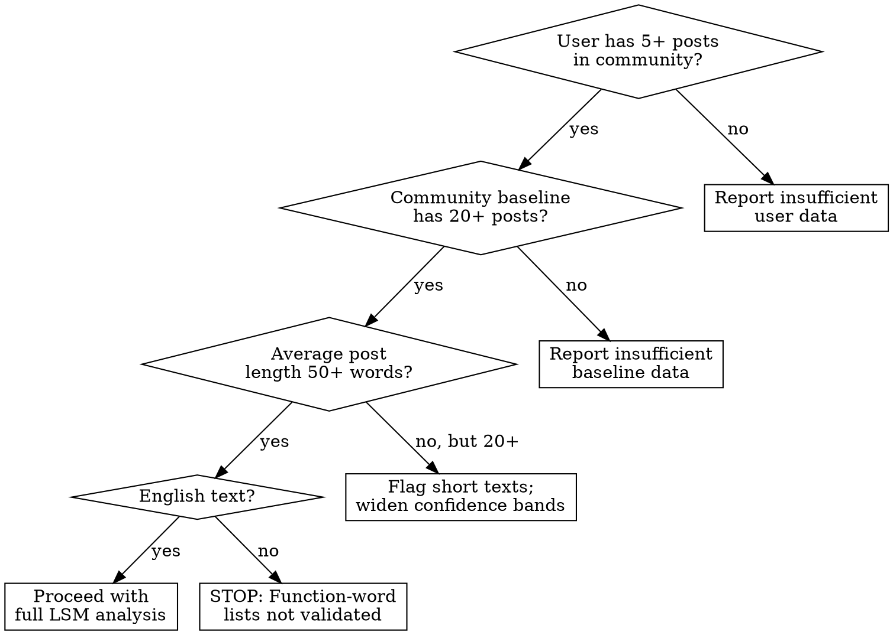
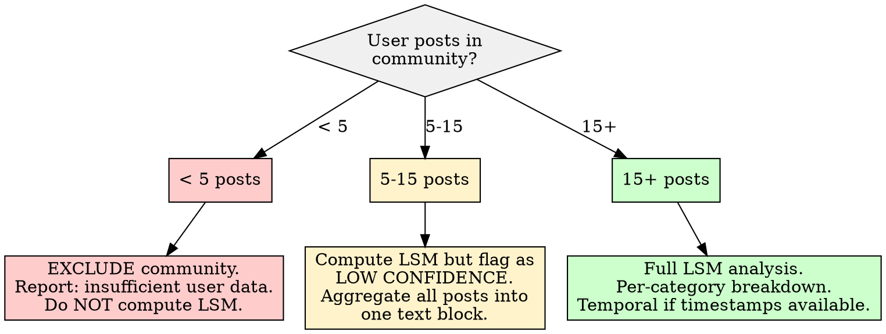

# Communication Accommodation Theory (CAT) and Linguistic Style Matching

## Overview

Measure how a user converges toward community linguistic norms by comparing their function-word usage against community baselines via Linguistic Style Matching (LSM). The core principle: **people unconsciously adjust their function-word usage to match the groups they engage with, and the degree of this adjustment -- measured as LSM -- reveals which communities exert the strongest stylistic pull on a user.** Function words (pronouns, articles, prepositions, conjunctions, auxiliary verbs, adverbs, negations, quantifiers) are the signal because they reflect cognitive style rather than topic -- two people discussing completely different subjects will still converge on function-word usage if they are accommodating to each other.

**Theoretical foundation:** Communication Accommodation Theory (Giles, 1973; Giles & Ogay, 2007) predicts that individuals converge their communication style toward groups they identify with and diverge from groups they distance from. Linguistic Style Matching (Ireland et al., 2011; Gonzales, Hancock & Pennebaker, 2010) operationalizes this convergence through function-word similarity, using the formula developed by Pennebaker and colleagues. The key insight from Pennebaker's research is that function words are produced largely automatically and are resistant to conscious manipulation, making them a more reliable indicator of accommodation than content words.

**LSM score range:** Scores range from approximately 0.50 to 1.00, where higher values indicate greater stylistic convergence. An LSM of 1.00 means identical function-word distributions; 0.50 indicates near-random similarity. In practice, scores above 0.80 suggest strong accommodation, 0.65-0.80 moderate accommodation, and below 0.65 weak or no accommodation.

## When to Use

- Quantifying how strongly a user adapts their writing style to different communities
- Ranking communities by the degree of linguistic accommodation a user exhibits
- Tracking whether a user's style converges toward or diverges from a community over time
- Identifying "linguistic home" communities where a user's style most closely matches norms
- Comparing accommodation patterns across multiple communities to find style-adoption targets
- Establishing function-word baselines for community writing norms
- Feeding accommodation scores into archetype or persona analysis

**When NOT to use:**

- Corpus contains fewer than 50 words per text sample (LSM requires minimum 50 words per sample; Pennebaker recommends more)
- User has fewer than 5 posts in a community (function-word frequencies are unstable)
- Community baseline has fewer than 20 posts from other members (baseline is unreliable)
- Text is machine-translated (translation alters function-word distributions)
- Inferring social motivation or group loyalty from LSM alone (LSM measures style similarity, not intent)
- Non-English text without validated function-word categories for that language



## Quick Reference

### The Nine Function-Word Categories for LSM

| Category | Examples | Why It Matters |
|----------|----------|---------------|
| **Personal pronouns** | I, he, she, they, we, you, me, him, her, them, us | Self-focus vs. other-focus; social orientation |
| **Impersonal pronouns** | it, that, this, what, anything, something, everything | Abstraction level; referential style |
| **Articles** | a, an, the | Concrete vs. abstract thinking; noun-phrase complexity |
| **Conjunctions** | and, but, or, so, because, although, while, if | Reasoning complexity; clause linking style |
| **Prepositions** | to, of, in, for, on, with, at, by, from, about | Spatial/relational framing; structural complexity |
| **Auxiliary verbs** | is, was, am, are, be, been, have, has, had, do, will, would, could, should | Tense and modality preferences |
| **High-frequency adverbs** | very, really, just, so, also, too, quite, almost, always, never | Intensity and hedging patterns |
| **Negations** | not, no, never, neither, nobody, nothing, none, cannot, don't, won't | Disagreement and exclusion patterns |
| **Quantifiers** | many, few, some, all, every, each, any, much, more, most, several | Specificity and generalization tendencies |

### LSM Formula

For each function-word category *c*, the category-level LSM between user *u* and community *k* is:

```
LSM_c(u, k) = 1 - ( |freq_c(u) - freq_c(k)| / (freq_c(u) + freq_c(k) + 0.0001) )
```

Where:
- `freq_c(u)` = percentage of user's words in category *c* (within community *k*)
- `freq_c(k)` = percentage of community's words in category *c* (excluding the user)
- `0.0001` prevents division by zero

**Composite LSM** is the average of the nine category-level LSM scores:

```
LSM(u, k) = (1/9) * SUM over c in {9 categories} of LSM_c(u, k)
```

### Key Thresholds

| Parameter | Value | Source |
|-----------|-------|--------|
| **LSM score range** | ~0.50 to 1.00 | Pennebaker (secretlifeofpronouns.com) |
| **Strong accommodation** | LSM >= 0.80 | Ireland et al. (2011) |
| **Moderate accommodation** | 0.65 <= LSM < 0.80 | Gonzales, Hancock & Pennebaker (2010) |
| **Weak/no accommodation** | LSM < 0.65 | Below typical conversational baseline |
| **Minimum words per sample** | 50 words | Pennebaker LSM calculator requirement |
| **Recommended words per sample** | 200+ words | Larger samples improve stability |
| **Minimum user posts per community** | 5 posts | Below this, function-word rates are noise |
| **Minimum community baseline posts** | 20 posts (excluding user) | Below this, baseline is unstable |
| **Minimum community members for baseline** | 5 unique authors | Single-author baselines conflate individual style with community norm |

## Workflow

Copy this checklist and track progress:

```
CAT Linguistic Style Matching Progress:
- [ ] Step 1: Validate corpus suitability and segment by community
- [ ] Step 2: Build function-word dictionaries
- [ ] Step 3: Compute community baselines (excluding target user)
- [ ] Step 4: Compute user function-word frequencies per community
- [ ] Step 5: Calculate LSM scores (per-category and composite)
- [ ] Step 6: Rank communities by accommodation strength
- [ ] Step 7: Temporal accommodation analysis (if timestamps available)
- [ ] Step 8: Write findings to docs/analysis/17-cat-linguistic-style-matching.md
```

### Step 1: Validate Corpus Suitability and Segment by Community

Before computing LSM, verify the data can support the analysis.

**Suitability checks:**

| Check | Pass Condition | Fail Action |
|-------|---------------|-------------|
| **Community segmentation** | Posts are tagged with community/group identifiers | Without community labels, LSM cannot be computed per-community. Report failure. |
| **User post count per community** | 5+ posts in at least 2 communities | Below 5 posts: exclude that community. Below 2 communities total: cannot compare accommodation. |
| **Community baseline size** | 20+ posts from other members per community | Below 20: flag baseline as "unstable" and widen confidence interpretation. |
| **Community author diversity** | 5+ unique authors in baseline | Below 5: baseline reflects individual styles, not community norms. Flag prominently. |
| **Average text length** | 50+ words per post average | Below 50: function-word frequencies are unreliable per-post. Aggregate all user posts within a community into one combined text before computing frequencies. |
| **Language** | Predominantly English | Non-English text invalidates the function-word category lists below. |
| **User text volume per community** | 200+ total words per community (aggregated) | Below 200 total words: exclude community from analysis. |

**Segmentation:** Group all posts by community identifier. For each community, separate the target user's posts from all other members' posts. The community baseline must EXCLUDE the target user's posts to avoid self-matching bias.

### Step 2: Build Function-Word Dictionaries

Use these validated function-word category lists derived from LIWC research (Pennebaker, Booth & Francis, 2007; Tausczik & Pennebaker, 2010):

```python
FUNCTION_WORD_CATEGORIES = {
    'personal_pronouns': {
        'i', 'me', 'my', 'mine', 'myself',
        'you', 'your', 'yours', 'yourself', 'yourselves',
        'he', 'him', 'his', 'himself',
        'she', 'her', 'hers', 'herself',
        'we', 'us', 'our', 'ours', 'ourselves',
        'they', 'them', 'their', 'theirs', 'themselves',
        'it', 'its', 'itself',   # NOTE: some frameworks separate these as impersonal
    },
    'impersonal_pronouns': {
        'that', 'this', 'these', 'those',
        'what', 'which', 'who', 'whom', 'whose',
        'anything', 'something', 'everything', 'nothing',
        'anyone', 'someone', 'everyone', 'nobody',
        'another', 'other', 'others',
    },
    'articles': {
        'a', 'an', 'the',
    },
    'conjunctions': {
        'and', 'but', 'or', 'nor', 'so', 'yet', 'for',
        'because', 'although', 'though', 'while', 'whereas',
        'if', 'unless', 'until', 'since', 'whether',
        'as', 'than', 'that',  # subordinating uses
    },
    'prepositions': {
        'to', 'of', 'in', 'for', 'on', 'with', 'at', 'by',
        'from', 'about', 'into', 'through', 'during', 'before',
        'after', 'above', 'below', 'between', 'under', 'over',
        'against', 'along', 'among', 'around', 'behind', 'beside',
        'beyond', 'near', 'toward', 'upon', 'within', 'without',
    },
    'auxiliary_verbs': {
        'is', 'am', 'are', 'was', 'were', 'be', 'been', 'being',
        'have', 'has', 'had', 'having',
        'do', 'does', 'did',
        'will', 'would', 'shall', 'should',
        'can', 'could', 'may', 'might', 'must',
    },
    'high_freq_adverbs': {
        'very', 'really', 'just', 'so', 'also', 'too', 'quite',
        'almost', 'always', 'never', 'often', 'still', 'already',
        'even', 'only', 'now', 'then', 'here', 'there',
        'perhaps', 'maybe', 'probably', 'certainly', 'definitely',
    },
    'negations': {
        'not', 'no', 'never', 'neither', 'nor',
        'nobody', 'nothing', 'none', 'nowhere',
        "n't",  # Handle contractions: "don't" -> "do" + "n't"
        'cannot',
    },
    'quantifiers': {
        'many', 'few', 'some', 'all', 'every', 'each', 'any',
        'much', 'more', 'most', 'less', 'least', 'several',
        'enough', 'plenty', 'both', 'half', 'numerous',
    },
}
```

**Tokenization requirements:**
- Lowercase all tokens before matching (function words are case-insensitive)
- Split contractions: "don't" -> "do" + "n't"; "isn't" -> "is" + "n't"
- Remove URLs, markup, and non-word tokens before counting
- Preserve all remaining tokens for total word count (denominator)

### Step 3: Compute Community Baselines

For each community *k*, compute the function-word frequency profile from ALL posts by members OTHER than the target user.

```python
import re
from collections import Counter

def tokenize(text):
    """Tokenize text for function-word analysis."""
    text = re.sub(r'https?://\S+|www\.\S+', '', text)  # Remove URLs
    text = re.sub(r'<[^>]+>', '', text)                  # Remove HTML/markup
    text = text.lower()
    # Split contractions to capture negation particles
    text = re.sub(r"n't", " n't", text)
    text = re.sub(r"'s", " 's", text)
    text = re.sub(r"'re", " 're", text)
    text = re.sub(r"'ve", " 've", text)
    text = re.sub(r"'ll", " 'll", text)
    text = re.sub(r"'m", " 'm", text)
    tokens = re.findall(r"[a-z']+", text)
    return tokens

def compute_function_word_profile(texts, categories):
    """Compute function-word frequency profile from a list of texts.
    Returns dict: {category_name: percentage_of_total_words}"""
    all_tokens = []
    for text in texts:
        all_tokens.extend(tokenize(text))

    total_words = len(all_tokens)
    if total_words == 0:
        return None

    profile = {}
    for cat_name, cat_words in categories.items():
        count = sum(1 for token in all_tokens if token in cat_words)
        profile[cat_name] = (count / total_words) * 100  # percentage

    profile['_total_words'] = total_words
    return profile

def compute_community_baseline(community_posts, user_id, categories):
    """Compute community baseline EXCLUDING the target user."""
    other_posts = [p['text'] for p in community_posts if p['author'] != user_id]
    if len(other_posts) < 20:
        return None  # Insufficient baseline
    return compute_function_word_profile(other_posts, categories)
```

**Critical:** Always exclude the target user from their own community baseline. Including the user inflates LSM by measuring self-similarity.

### Step 4: Compute User Function-Word Frequencies per Community

For each community the user participates in, compute their function-word profile from ONLY their posts in that community.

```python
def compute_user_profile_per_community(all_posts, user_id, categories):
    """Compute user's function-word profile per community."""
    communities = set(p['community'] for p in all_posts if p['author'] == user_id)
    user_profiles = {}

    for community in communities:
        user_posts = [
            p['text'] for p in all_posts
            if p['author'] == user_id and p['community'] == community
        ]
        if len(user_posts) < 5:
            continue  # Insufficient user data in this community

        profile = compute_function_word_profile(user_posts, categories)
        if profile and profile['_total_words'] >= 200:
            user_profiles[community] = profile

    return user_profiles
```

### Step 5: Calculate LSM Scores

Apply the Pennebaker LSM formula for each function-word category, then average for composite LSM.

```python
def compute_lsm_category(user_freq, community_freq):
    """Compute LSM for a single function-word category.
    Returns value between 0 and 1."""
    return 1 - (abs(user_freq - community_freq) /
                (user_freq + community_freq + 0.0001))

def compute_lsm(user_profile, community_baseline, categories):
    """Compute composite LSM and per-category breakdown."""
    category_scores = {}
    for cat_name in categories:
        u_freq = user_profile.get(cat_name, 0)
        c_freq = community_baseline.get(cat_name, 0)
        category_scores[cat_name] = compute_lsm_category(u_freq, c_freq)

    composite = sum(category_scores.values()) / len(category_scores)
    return {
        'composite_lsm': composite,
        'category_scores': category_scores,
        'user_total_words': user_profile.get('_total_words', 0),
        'baseline_total_words': community_baseline.get('_total_words', 0),
    }
```

### Step 6: Rank Communities by Accommodation Strength

Sort communities by composite LSM to identify where the user accommodates most and least.

**Ranking table structure:**

| Rank | Community | Composite LSM | Accommodation Level | User Words | Baseline Words | Strongest Category | Weakest Category |
|------|-----------|---------------|---------------------|------------|----------------|--------------------|------------------|
| 1 | [name] | [0.XX] | [strong/moderate/weak] | [N] | [N] | [category: score] | [category: score] |

**Interpretation guidance:**

| Composite LSM | Accommodation Level | Interpretation |
|---------------|---------------------|----------------|
| >= 0.80 | Strong | User's function-word usage closely mirrors community norms. Suggests deep engagement or natural stylistic fit. |
| 0.65 - 0.79 | Moderate | Partial convergence. User has adopted some community style patterns but maintains distinct voice. |
| < 0.65 | Weak / Divergent | User's style differs substantially from community norms. May indicate peripheral participation, intentional divergence, or stylistic mismatch. |

**Per-category deviation analysis:** For each community, identify which function-word categories show the greatest convergence (highest category LSM) and greatest divergence (lowest category LSM). This reveals WHICH aspects of style the user adapts vs. resists.

### Step 7: Temporal Accommodation Analysis

If timestamps are available, track how LSM changes over time to detect convergence trajectories.

**Temporal windowing:**

| User's Participation Span | Recommended Window | Minimum Posts per Window |
|--------------------------|-------------------|------------------------|
| < 3 months | Weekly | 3+ posts |
| 3 months - 1 year | Bi-weekly or monthly | 5+ posts |
| 1+ years | Monthly or quarterly | 5+ posts |

```python
import pandas as pd

def compute_temporal_lsm(user_posts, community_baseline, categories, window='M'):
    """Compute LSM over temporal windows to track convergence."""
    df = pd.DataFrame(user_posts)
    df['date'] = pd.to_datetime(df['date'])
    df = df.sort_values('date')

    windows = df.groupby(pd.Grouper(key='date', freq=window))
    trajectory = []

    for window_start, window_posts in windows:
        texts = window_posts['text'].tolist()
        if len(texts) < 3:
            continue  # Skip sparse windows

        user_profile = compute_function_word_profile(texts, categories)
        if user_profile is None or user_profile['_total_words'] < 100:
            continue

        lsm_result = compute_lsm(user_profile, community_baseline, categories)
        trajectory.append({
            'window_start': window_start,
            'composite_lsm': lsm_result['composite_lsm'],
            'post_count': len(texts),
            'word_count': user_profile['_total_words'],
            'category_scores': lsm_result['category_scores'],
        })

    return trajectory
```

**Trajectory patterns:**

| Pattern | Detection | Interpretation |
|---------|-----------|----------------|
| **Convergence** | LSM increases over 3+ consecutive windows | User is adopting community style over time |
| **Stable match** | LSM varies < 0.05 across windows | User entered already matching or has fully converged |
| **Divergence** | LSM decreases over 3+ consecutive windows | User is moving away from community norms (disengagement, identity differentiation) |
| **Oscillation** | LSM alternates up/down between windows | Inconsistent engagement or topic-driven variation |
| **Step change** | LSM shifts > 0.10 between adjacent windows | Possible event-driven accommodation shift |

**If no timestamps are available:** Skip Step 7 entirely. Report that temporal analysis was not possible. Compute only the static (aggregate) LSM scores from Steps 5-6.

### Step 8: Write Report

Write all findings to `docs/analysis/17-cat-linguistic-style-matching.md`.

## Report Output Template

The final report MUST be written to `docs/analysis/17-cat-linguistic-style-matching.md` with this structure:

```markdown
# Communication Accommodation Theory: Linguistic Style Matching Analysis

## Methodology
- **Framework:** Communication Accommodation Theory (Giles, 1973) operationalized via Linguistic Style Matching (Ireland et al., 2011)
- **LSM formula:** LSM_c = 1 - (|freq_c(user) - freq_c(community)| / (freq_c(user) + freq_c(community) + 0.0001)), averaged across 9 function-word categories
- **Function-word categories:** Personal pronouns, impersonal pronouns, articles, conjunctions, prepositions, auxiliary verbs, high-frequency adverbs, negations, quantifiers
- **Corpus:** [N total user posts across K communities, date range, total word count]
- **Baseline construction:** Community baselines computed from non-user posts (minimum 20 posts, 5 unique authors per community)
- **Temporal window:** [window size if temporal analysis performed, or "N/A -- static analysis only"]

## Corpus Suitability Assessment

| Community | User Posts | User Words | Baseline Posts | Baseline Authors | Baseline Words | Status |
|-----------|-----------|------------|----------------|-----------------|----------------|--------|
| [name] | [N] | [N] | [N] | [N] | [N] | [suitable / insufficient user data / insufficient baseline / marginal] |

- **Communities analyzed:** [N of K met minimum thresholds]
- **Communities excluded:** [list with reasons]
- **Overall suitability:** [suitable / suitable with caveats / insufficient data]

## Community Accommodation Ranking

| Rank | Community | Composite LSM | Level | User Words | Baseline Words | Top Converging Category | Top Diverging Category |
|------|-----------|---------------|-------|------------|----------------|------------------------|----------------------|
| 1 | [name] | [0.XX] | [strong/moderate/weak] | [N] | [N] | [cat: 0.XX] | [cat: 0.XX] |

### Interpretation
[Narrative synthesis: which communities does the user accommodate most? What does the ranking pattern suggest about engagement depth, identity alignment, or stylistic flexibility?]

## Per-Community LSM Breakdown

### [Community Name] (Composite LSM: X.XX)

| Function-Word Category | User Rate (%) | Community Rate (%) | Category LSM | Delta |
|----------------------|--------------|-------------------|-------------|-------|
| Personal pronouns | [X.XX] | [X.XX] | [0.XX] | [+/- X.XX] |
| Impersonal pronouns | [X.XX] | [X.XX] | [0.XX] | [+/- X.XX] |
| Articles | [X.XX] | [X.XX] | [0.XX] | [+/- X.XX] |
| Conjunctions | [X.XX] | [X.XX] | [0.XX] | [+/- X.XX] |
| Prepositions | [X.XX] | [X.XX] | [0.XX] | [+/- X.XX] |
| Auxiliary verbs | [X.XX] | [X.XX] | [0.XX] | [+/- X.XX] |
| High-freq adverbs | [X.XX] | [X.XX] | [0.XX] | [+/- X.XX] |
| Negations | [X.XX] | [X.XX] | [0.XX] | [+/- X.XX] |
| Quantifiers | [X.XX] | [X.XX] | [0.XX] | [+/- X.XX] |

[Repeat for each analyzed community]

## Temporal Accommodation Trajectory (if timestamps available)

### [Community Name]

| Window | Composite LSM | Post Count | Word Count | Trend |
|--------|---------------|-----------|------------|-------|
| [date range] | [0.XX] | [N] | [N] | [converging / stable / diverging] |

### Trajectory Patterns Detected
- **Convergence:** [communities where LSM increased over time]
- **Stable match:** [communities with consistent LSM]
- **Divergence:** [communities where LSM decreased over time]
- **Step changes:** [sudden LSM shifts with window dates]

### Trajectory Interpretation
[Narrative: how has the user's accommodation changed over their participation history? Are they becoming more integrated into certain communities? Pulling away from others?]

## Cross-Community Style Profile

### User's Baseline Style (aggregate across all communities)
| Function-Word Category | User Overall Rate (%) | Range Across Communities |
|----------------------|---------------------|------------------------|
| Personal pronouns | [X.XX] | [min - max] |
| [etc.] | | |

### Style Flexibility Index
[How much does the user's function-word profile vary across communities? High variation = high accommodation flexibility. Low variation = consistent personal style regardless of community.]

## Limitations and Caveats
- LSM measures function-word similarity, not social motivation. High LSM does not prove the user deliberately accommodates; it may reflect natural stylistic fit, topic-driven convergence, or shared demographic language patterns.
- Accommodation can be conscious or unconscious (Giles & Ogay, 2007). LSM cannot distinguish between intentional style-shifting and automatic linguistic alignment.
- Small communities (< 50 baseline posts) produce unstable baselines. LSM scores for these communities should be interpreted cautiously.
- Function-word frequencies are affected by text length: very short posts (< 50 words) produce noisy per-post estimates. Aggregation mitigates this but reduces temporal granularity.
- LSM does not capture all dimensions of accommodation. Lexical choice, syntax complexity, tone, and discourse structure are not measured by function-word LSM.
- [Corpus-specific limitations from Step 1]
- These results should NOT be used to infer group loyalty, social belonging, or psychological alignment. LSM is a stylistic similarity metric, not a measure of identity.

## References
- Giles, H. (1973). Accent mobility: A model and some data. *Anthropological Linguistics*, 15, 87-105.
- Giles, H. & Ogay, T. (2007). Communication Accommodation Theory. In B.B. Whaley & W. Samter (Eds.), *Explaining Communication: Contemporary Theories and Exemplars*.
- Ireland, M.E., Slatcher, R.B., Eastwick, P.W., Scissors, L.E., Finkel, E.J., & Pennebaker, J.W. (2011). Language style matching predicts relationship initiation and stability. *Psychological Science*, 22(1), 39-44.
- Gonzales, A.L., Hancock, J.T., & Pennebaker, J.W. (2010). Language style matching as a predictor of social dynamics in small groups. *Communication Research*, 37(1), 3-19.
- Pennebaker, J.W., Booth, R.J., & Francis, M.E. (2007). *Linguistic Inquiry and Word Count: LIWC2007*. Austin, TX: LIWC.net.
- Tausczik, Y.R. & Pennebaker, J.W. (2010). The psychological meaning of words: LIWC and computerized text analysis methods. *Journal of Language and Social Psychology*, 29(1), 24-54.
- Niederhoffer, K.G. & Pennebaker, J.W. (2002). Linguistic style matching in social interaction. *Journal of Language and Social Psychology*, 21(4), 337-360.
```

## Good Patterns

- **Use function words exclusively for LSM** -- content words reflect topic, not style; function words are produced automatically and reveal cognitive accommodation patterns independent of subject matter
- **Exclude the target user from community baselines** -- including user posts in their own baseline inflates LSM by measuring self-similarity
- **Compute per-category LSM before averaging** -- the composite hides which categories converge vs. diverge; per-category detail reveals what aspects of style the user adapts
- **Require minimum sample sizes** -- at least 50 words per text, 200+ total words per user-community pair, 20+ baseline posts, 5+ baseline authors
- **Compare across multiple communities** -- a single LSM score is hard to interpret; relative ranking across communities reveals accommodation patterns
- **Track accommodation over time** -- static LSM shows current similarity; temporal trajectory shows convergence/divergence dynamics
- **Report community baseline stability** -- note when baselines are small or dominated by few authors, which makes the "community norm" unreliable
- **Aggregate short posts before computing frequencies** -- per-post function-word rates from 20-word posts are noise; combine all user posts in a community into one aggregate

## Anti-Patterns

| Anti-Pattern | Why It Fails | Instead |
|--------------|-------------|---------|
| Using content words for LSM | Content words reflect topic (sports, cooking), not style. Two sports fans discussing sports will match on content words regardless of accommodation | Use only the nine function-word categories: pronouns, articles, prepositions, conjunctions, auxiliary verbs, adverbs, negations, quantifiers |
| Computing LSM without a community baseline | Without a baseline, you are measuring the user's style against nothing. A high "score" is meaningless without a reference distribution | Always compute community baseline from other members' posts first, then measure user distance from that baseline |
| Including the user in their own baseline | Self-similarity inflates LSM. The user's posts matching their own posts is not accommodation | Exclude the target user from community baseline computation |
| Treating high LSM as "good" and low as "bad" | High LSM means stylistic similarity, not social success. Low LSM may indicate intentional divergence, unique expertise voice, or healthy non-conformity | Report LSM as descriptive ("strong/moderate/weak accommodation") not evaluative ("good/bad") |
| Conflating topic similarity with style matching | Two users discussing the same topic will share content words but may have very different function-word patterns | LSM already handles this by using only function words, but remind readers that LSM measures HOW people write, not WHAT they write about |
| Ignoring that accommodation can be unconscious | Claiming a user "chose to adapt" based on LSM alone over-interprets the data. Much function-word accommodation is automatic | Note that LSM captures stylistic similarity regardless of whether it is conscious or unconscious |
| Computing per-post LSM on short texts | A 15-word post might have 0% articles purely by chance. Per-post LSM on short texts is dominated by sampling noise | Aggregate all user posts within a community before computing function-word frequencies |
| Using a single community's baseline as universal | Different communities have genuinely different function-word norms (technical communities use more prepositions; casual communities use more personal pronouns) | Compute a separate baseline for each community |
| Reporting only composite LSM | The composite hides meaningful variation across categories. A user might match perfectly on pronouns but diverge on articles | Always report per-category breakdown alongside composite score |

## Boundaries

**This skill SHOULD produce:**
- Community-specific function-word baselines from aggregate member data
- Per-category and composite LSM scores for the user in each community
- Community accommodation ranking (strongest to weakest convergence)
- Per-category deviation analysis showing which function-word types converge vs. diverge
- Temporal accommodation trajectories if timestamps are available
- Cross-community style flexibility assessment
- Written report at `docs/analysis/17-cat-linguistic-style-matching.md`

**This skill should NOT:**
- Infer social motivation, group loyalty, or belonging from LSM scores alone (LSM measures style similarity, not intent)
- Claim accommodation is always deliberate or strategic (much is unconscious)
- Use LSM as sole evidence of community membership or identity
- Ignore that small communities produce unstable baselines
- Apply the nine-category English function-word framework to non-English text without validation
- Treat LSM as a personality trait (it reflects interaction-specific style adjustment, not fixed characteristic)
- Compare LSM scores across studies or corpora with different baseline sizes (LSM magnitude is sensitive to baseline composition)
- Produce scores from fewer than 200 aggregated user words per community
- Present accommodation rankings without per-category breakdowns

## Insufficient Data Handling



| Condition | Action |
|-----------|--------|
| **User has < 5 posts in a community** | Exclude that community from analysis. Report it as "insufficient user data." Do NOT compute LSM. |
| **User has 5-15 posts in a community** | Compute LSM but flag as "low confidence." Aggregate all posts into a single text block before computing function-word frequencies. Skip temporal analysis for this community. |
| **User has 15+ posts in a community** | Full analysis including per-category breakdown. Temporal analysis possible if timestamps available and 3+ posts per window. |
| **Community baseline has < 20 posts** | Flag baseline as "unstable." Compute LSM but note that the baseline may not represent true community norms. Widen interpretive caution. |
| **Community baseline has < 5 unique authors** | Flag baseline as "individual-dominated." The "community norm" may reflect one or two prolific authors, not a genuine community style. Note prominently. |
| **User's aggregated text < 200 words in a community** | Exclude community. Function-word frequencies from < 200 words are dominated by sampling noise. |
| **User participates in only 1 community** | Cannot compute comparative accommodation ranking. Report single-community LSM with caveat that cross-community comparison is the primary value of this analysis. |
| **User participates in only 2 communities** | Compute LSM for both but note that ranking two communities provides limited insight. Report as preliminary. |
| **No timestamps available** | Skip Step 7 (temporal analysis). Report static aggregate LSM only. Note that convergence/divergence trajectories could not be assessed. |
| **All LSM scores cluster tightly (range < 0.05)** | User may have a rigid personal style that does not accommodate, or all communities may have similar function-word norms. Investigate baseline diversity before concluding low accommodation. |

## Common Mistakes

| Mistake | Fix |
|---------|-----|
| Including user posts in community baseline | Always filter out the target user's posts before computing baseline frequencies |
| Using raw word counts instead of percentages | LSM formula requires percentages (count / total_words * 100), not raw counts |
| Forgetting the 0.0001 epsilon in the denominator | Without epsilon, categories where both user and community have 0% cause division-by-zero |
| Computing per-post LSM on posts shorter than 50 words | Aggregate all user posts per community into one combined text; compute frequencies on the aggregate |
| Reporting only composite LSM without category breakdown | Always include per-category scores; the composite hides which aspects of style converge vs. diverge |
| Comparing LSM scores from communities with very different baseline sizes | A baseline of 20 posts vs. 2,000 posts will have different stability. Note baseline sizes when comparing. |
| Interpreting low LSM as "bad" or "disengaged" | Low LSM means stylistic difference, not social failure. The user may have expertise voice, deliberate divergence, or natural mismatch |
| Claiming conscious accommodation from LSM alone | LSM measures style similarity, not intent. Note that accommodation may be unconscious. |
| Skipping contraction splitting in tokenization | "don't" must become "do" + "n't" to properly count auxiliary verbs and negations |
| Using community baselines from a different time period than user posts | If the user posted in 2020 but the baseline is from 2024, style norms may have shifted. Match temporal windows when possible. |

## References

- Giles, H. (1973). Accent mobility: A model and some data. *Anthropological Linguistics*, 15, 87-105.
- [Giles, H. & Ogay, T. (2007). Communication Accommodation Theory. In B.B. Whaley & W. Samter (Eds.), *Explaining Communication*.](https://core.ac.uk/download/pdf/147103741.pdf)
- [Ireland, M.E., Slatcher, R.B., Eastwick, P.W., Scissors, L.E., Finkel, E.J., & Pennebaker, J.W. (2011). Language style matching predicts relationship initiation and stability. *Psychological Science*, 22(1), 39-44.](https://journals.sagepub.com/doi/abs/10.1177/0956797610392928)
- [Gonzales, A.L., Hancock, J.T., & Pennebaker, J.W. (2010). Language style matching as a predictor of social dynamics in small groups. *Communication Research*, 37(1), 3-19.](https://journals.sagepub.com/doi/10.1177/0093650209351468)
- Pennebaker, J.W., Booth, R.J., & Francis, M.E. (2007). *Linguistic Inquiry and Word Count: LIWC2007*. Austin, TX: LIWC.net.
- [Tausczik, Y.R. & Pennebaker, J.W. (2010). The psychological meaning of words. *Journal of Language and Social Psychology*, 29(1), 24-54.](https://www.cs.cmu.edu/~ylataus/files/TausczikPennebaker2010.pdf)
- Niederhoffer, K.G. & Pennebaker, J.W. (2002). Linguistic style matching in social interaction. *Journal of Language and Social Psychology*, 21(4), 337-360.
- [LIWC-22 Manual: Development and Psychometrics.](https://www.liwc.app/static/documents/LIWC-22%20Manual%20-%20Development%20and%20Psychometrics.pdf)
- [Pennebaker, J.W. Language Style Matching Calculator.](https://www.secretlifeofpronouns.com/exercise/synch/)
- [LIWC LSM Help Documentation.](https://www.liwc.app/help/lsm)
- [Rains, S.A. (2025). Communication accommodation theory in quantitative research. *Communication Monographs*.](https://www.tandfonline.com/doi/full/10.1080/03637751.2025.2546102)
