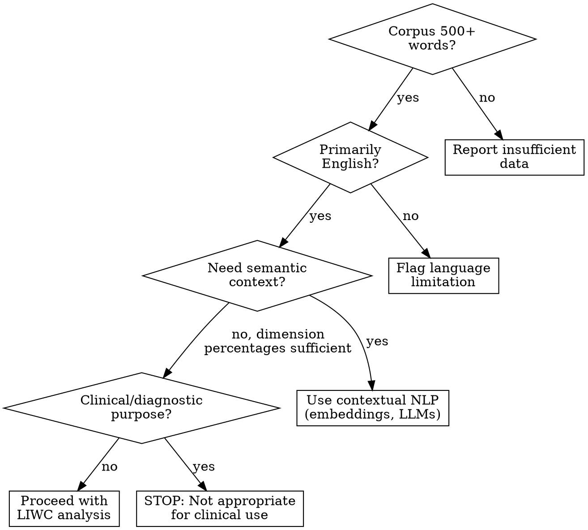
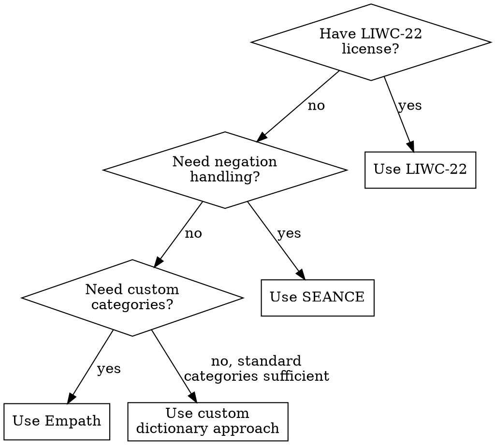
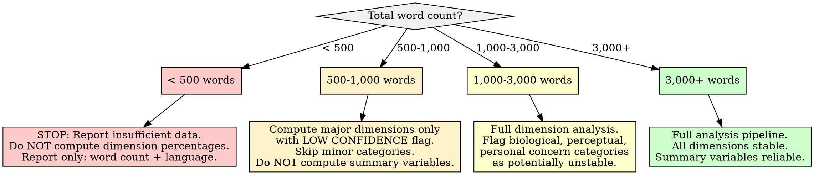

# LIWC Psycholinguistic Analysis

## Overview

LIWC (Linguistic Inquiry and Word Count) psycholinguistic analysis categorizes a corpus's vocabulary into hierarchical psychological dimensions -- cognitive processes, social dynamics, affective states, biological concerns, drives, and perceptual processes -- then computes each dimension's proportional weight to identify which linguistic registers dominate the writing. The core principle: **words are windows into psychological processes, but dictionary-based categorization captures word-level signals, not meaning-level understanding**. A word like "cut" matches the biological/body category regardless of whether the text describes surgery, budget cuts, or a film edit. Treat dimension percentages as statistical summaries of vocabulary composition, never as direct measures of psychological states.

**Methodological foundation:** LIWC-22 (Boyd et al., 2022) provides ~6,500 dictionary entries mapped to 118 hierarchically organized categories. Open-source alternatives include Empath (Fast et al., 2016; ~200 categories, r = 0.90 correlation with LIWC), SEANCE (Crossley et al., 2017; 254 indices with negation and POS features), and custom dictionary approaches using validated word lists. All share the same bag-of-words limitation: no handling of negation, sarcasm, polysemy, or compositional meaning.

## When to Use

- Categorizing an author's vocabulary into psychological dimensions for style profiling
- Identifying which linguistic registers (cognitive, social, emotional, perceptual) dominate a corpus
- Establishing dimension baselines to compare across corpora, time periods, or contexts
- Mapping psycholinguistic dimension distributions to style replication priorities
- Providing input features for downstream personality, archetype, or voice modeling analyses

**When NOT to use:**

- Diagnosing psychological conditions, mental health states, or clinical profiles
- Corpus contains fewer than 500 words (see Insufficient Data Handling)
- Text is heavily non-English (LIWC dictionaries are English-calibrated)
- You need semantic understanding of how words are used in context (dictionary methods cannot provide this)
- Making evaluative judgments about a person's character or mental fitness
- Text is machine-generated, heavily templated, or formulaic (dimension percentages reflect the template, not a person)



## Quick Reference

### LIWC-22 Major Dimension Hierarchy

| Level 1 Dimension | Level 2 Categories | Example Words | Typical Baseline % |
|---|---|---|---|
| **Linguistic (function words)** | Pronouns, articles, prepositions, auxiliary verbs, conjunctions, negations | I, the, to, is, and, not | 55-65% of all words |
| **Cognitive Processes** | Insight, cause, discrepancy, tentative, certainty, differentiation | think, know, because, maybe, always, but | 10-14% |
| **Social Processes** | Family, friends, female refs, male refs | talk, friend, mother, he | 8-12% |
| **Affective Processes** | Positive emotion, negative emotion (anxiety, anger, sadness) | happy, love, worried, hate, cry | 5-8% |
| **Drives** | Affiliation, achievement, power, reward, risk | ally, win, superior, benefit, danger | 6-9% |
| **Biological Processes** | Body, health, ingestion, sexual | eat, blood, pain, clinic | 1-3% |
| **Perceptual Processes** | See, hear, feel | look, heard, touch | 2-4% |
| **Time Orientation** | Past focus, present focus, future focus | walked, is, will | 8-14% |
| **Relativity** | Motion, space, time | walk, down, end | 12-16% |
| **Personal Concerns** | Work, leisure, home, money, religion, death | job, cook, house, cash, god, dead | 3-8% |
| **Informal Language** | Swear words, netspeak, assent, nonfluencies, fillers | damn, lol, ok, um, like | 1-5% (varies heavily by register) |

### Summary Variables (LIWC-22 Composites)

| Variable | What It Measures | Range | Interpretation |
|---|---|---|---|
| **Analytic** | Formal, logical, hierarchical thinking | 0-100 (percentile) | High = academic/formal; Low = narrative/personal |
| **Clout** | Social confidence and leadership | 0-100 | High = speaking from authority; Low = tentative/humble |
| **Authenticity** | Honest, personal, vulnerable writing | 0-100 | High = raw/personal; Low = guarded/distanced |
| **Emotional Tone** | Overall positivity vs negativity | 0-100 | >50 = positive; <50 = negative; ~50 = mixed/neutral |

### Key Parameters

| Parameter | Value | Notes |
|---|---|---|
| **Minimum corpus size (basic)** | 500 words | Below this, category percentages are too noisy |
| **Minimum corpus size (reliable)** | 1,000+ words | Percentages stabilize; low-frequency categories become measurable |
| **Minimum corpus size (stable minor categories)** | 3,000+ words | Biological, perceptual, and personal concern categories need larger samples |
| **LIWC-22 dictionary entries** | ~6,500 | Covering 118 categories |
| **Empath categories** | ~200 | Correlation with LIWC: r = 0.90 (Fast et al., 2016) |
| **SEANCE indices** | 254 core + 20 component | Includes negation handling and POS filtering |
| **Typical dictionary coverage** | 80-90% of tokens | 10-20% of words match no category (proper nouns, rare terms, typos) |
| **Process vs content split** | ~60/40 function/content | Function words (process) dominate; content words carry topical signal |

## Workflow

Copy this checklist and track progress:

```
LIWC Psycholinguistic Analysis Progress:
- [ ] Step 1: Validate corpus suitability and select tool
- [ ] Step 2: Preprocess text for dictionary-based analysis
- [ ] Step 3: Compute dimension percentages across all categories
- [ ] Step 4: Compute summary variables (Analytic, Clout, Authenticity, Tone)
- [ ] Step 5: Compare against reference baselines
- [ ] Step 6: Identify dominant dimensions and register profile
- [ ] Step 7: Distinguish process words from content words
- [ ] Step 8: Map dimensions to style replication priorities
- [ ] Step 9: Write findings to docs/analysis/16-liwc-psycholinguistic.md
```

### Step 1: Validate Corpus Suitability and Select Tool

**Suitability checks:**

| Check | Pass Condition | Fail Action |
|---|---|---|
| **Word count** | 500+ words total | Below 500: STOP. Report insufficient data. Do not compute dimension percentages. |
| **Word count (reliable)** | 1,000+ words | 500-1,000: Proceed with LOW CONFIDENCE flag on all dimensions. Minor categories (<2% expected) are unreliable. |
| **Word count (stable minor)** | 3,000+ words | 1,000-3,000: Compute all dimensions but flag biological, perceptual, and personal concern categories as unstable. |
| **Language** | Predominantly English | Non-English text invalidates English-calibrated dictionaries. Flag or exclude non-English portions. |
| **Register diversity** | Ideally spans multiple registers | Single-register corpus (all formal, all casual) constrains dimension variability. Note in report. |
| **Authorship** | Known author(s) | Mixed/unknown authorship produces blended dimension profiles. Document limitation. |

**Tool selection:**



| Tool | Strengths | Limitations | When to Choose |
|---|---|---|---|
| **LIWC-22** | Gold standard; 118 validated categories; summary variables; extensive norms | Proprietary ($); no negation handling; bag-of-words | When license available and standard categories suffice |
| **Empath** | 200 categories; can generate custom categories; open-source; r=0.90 with LIWC | No summary variables; no POS filtering; bag-of-words | When custom categories needed or LIWC unavailable |
| **SEANCE** | 254 indices; negation handling; POS filtering; open-source | Fewer validated norms; requires Python setup | When negation handling is critical (e.g., sarcastic or complex text) |
| **Custom dictionaries** | Full control; can combine multiple validated word lists | Requires validation; no established norms; maintenance burden | When combining specific validated lists for a targeted analysis |

**If corpus fails suitability:** Report the failure in the output document. State what was checked, what failed, and why psycholinguistic dimension analysis is unreliable for this corpus.

### Step 2: Preprocess Text for Dictionary-Based Analysis

**Dictionary-based analysis has DIFFERENT preprocessing requirements than semantic NLP.**

**DO:**
- Lowercase text for dictionary matching (LIWC and alternatives are case-insensitive lookups)
- Preserve contractions ("don't", "can't") -- many dictionaries include them as entries
- Expand common abbreviations only if the dictionary does not include them
- Remove URLs, HTML tags, user mentions/handles (these are not vocabulary)
- Normalize whitespace
- Keep punctuation separate from words (tokenize properly)

**DO NOT:**
- Stem or lemmatize (dictionaries contain specific word forms; stemming creates false matches and misses valid entries)
- Remove stopwords (function words ARE psycholinguistic data -- pronouns, articles, prepositions are primary carriers of process-level information)
- Remove numbers unless they dominate the corpus (LIWC has a "number" category)

```python
import re
from collections import Counter

def preprocess_for_dictionary(text):
    """Clean text for LIWC-style dictionary matching.
    DO NOT stem. DO NOT remove stopwords. Function words are data."""
    text = re.sub(r'https?://\S+|www\.\S+', '', text)  # Remove URLs
    text = re.sub(r'@\w+', '', text)                     # Remove @mentions
    text = re.sub(r'<[^>]+>', '', text)                   # Remove HTML tags
    text = re.sub(r'&\w+;', '', text)                     # Remove HTML entities
    text = re.sub(r'\s+', ' ', text).strip()              # Normalize whitespace
    return text

def tokenize_for_dictionary(text):
    """Tokenize preserving contractions and word forms.
    Returns lowercase tokens for dictionary lookup."""
    text = preprocess_for_dictionary(text)
    # Split on whitespace and punctuation boundaries, keeping contractions intact
    tokens = re.findall(r"\b[\w']+\b", text.lower())
    return tokens
```

### Step 3: Compute Dimension Percentages Across All Categories

For each LIWC-style dimension, count the number of tokens matching that dimension's dictionary and divide by total token count. Report percentages, not raw counts.

```python
# Example using Empath (open-source LIWC alternative)
# pip install empath
from empath import Empath

lexicon = Empath()

def compute_dimension_percentages_empath(text):
    """Compute LIWC-style dimension percentages using Empath.
    Returns normalized percentages (each category as % of total words)."""
    result = lexicon.analyze(text, normalize=True)
    # Empath normalize=True divides by total category hits, not total words.
    # For LIWC-style percentages, we need per-word normalization.
    tokens = tokenize_for_dictionary(text)
    total_words = len(tokens)
    if total_words == 0:
        return None, 0

    # Re-analyze with raw counts for proper normalization
    raw_counts = lexicon.analyze(text, normalize=False)
    percentages = {
        cat: (count / total_words * 100) if count else 0.0
        for cat, count in raw_counts.items()
    }
    return percentages, total_words

# Example using a custom dictionary approach
# (When neither LIWC-22 nor Empath is available)
PSYCH_DIMENSIONS = {
    'cognitive_processes': {
        'insight': ['think', 'know', 'consider', 'understand', 'realize',
                     'recognize', 'believe', 'wonder', 'figure', 'idea'],
        'causation': ['because', 'cause', 'effect', 'hence', 'therefore',
                       'reason', 'since', 'result', 'lead', 'produce'],
        'discrepancy': ['should', 'would', 'could', 'ought', 'need',
                         'want', 'wish', 'hope', 'expect', 'desire'],
        'tentative': ['maybe', 'perhaps', 'guess', 'seem', 'appear',
                       'might', 'possibly', 'probably', 'suppose', 'unsure'],
        'certainty': ['always', 'never', 'definitely', 'certain', 'sure',
                       'absolute', 'clearly', 'obvious', 'undoubtedly', 'truly'],
        'differentiation': ['but', 'except', 'without', 'rather', 'instead',
                             'however', 'although', 'unless', 'unlike', 'whereas'],
    },
    'social_processes': {
        'social_general': ['talk', 'share', 'friend', 'together', 'group',
                            'join', 'meet', 'chat', 'community', 'people'],
        'family': ['mother', 'father', 'parent', 'family', 'brother',
                    'sister', 'daughter', 'son', 'wife', 'husband'],
        'affiliation': ['ally', 'bond', 'connect', 'belong', 'team',
                         'cooperate', 'help', 'support', 'trust', 'loyal'],
    },
    'affective_processes': {
        'positive_emotion': ['happy', 'love', 'joy', 'wonderful', 'great',
                              'excellent', 'good', 'nice', 'enjoy', 'pleased'],
        'negative_emotion': ['bad', 'wrong', 'terrible', 'awful', 'horrible',
                              'ugly', 'nasty', 'poor', 'miserable', 'pathetic'],
        'anxiety': ['worried', 'nervous', 'afraid', 'scared', 'anxious',
                     'fear', 'panic', 'tense', 'dread', 'uneasy'],
        'anger': ['hate', 'angry', 'furious', 'annoyed', 'irritated',
                   'rage', 'hostile', 'bitter', 'resentful', 'mad'],
        'sadness': ['sad', 'cry', 'grief', 'lonely', 'depressed',
                     'sorry', 'miss', 'hurt', 'mourn', 'heartbreak'],
    },
    'drives': {
        'achievement': ['win', 'success', 'earn', 'complete', 'accomplish',
                         'goal', 'achieve', 'master', 'excel', 'best'],
        'power': ['superior', 'control', 'command', 'dominate', 'authority',
                   'lead', 'influence', 'rule', 'force', 'power'],
        'reward': ['benefit', 'prize', 'gain', 'profit', 'reward',
                    'bonus', 'gift', 'valuable', 'worth', 'treasure'],
        'risk': ['danger', 'risk', 'threat', 'hazard', 'warning',
                  'caution', 'beware', 'vulnerable', 'unsafe', 'gamble'],
    },
    'biological_processes': {
        'body': ['body', 'hand', 'head', 'face', 'heart',
                  'skin', 'blood', 'arm', 'eye', 'brain'],
        'health': ['sick', 'pain', 'hospital', 'doctor', 'medicine',
                    'disease', 'cure', 'symptom', 'healthy', 'injury'],
        'ingestion': ['eat', 'drink', 'food', 'meal', 'hungry',
                       'taste', 'cook', 'dinner', 'breakfast', 'lunch'],
    },
    'perceptual_processes': {
        'see': ['see', 'look', 'watch', 'view', 'notice',
                 'observe', 'stare', 'glance', 'visible', 'bright'],
        'hear': ['hear', 'listen', 'sound', 'loud', 'quiet',
                  'noise', 'ring', 'voice', 'music', 'silent'],
        'feel': ['feel', 'touch', 'warm', 'cold', 'soft',
                  'hard', 'rough', 'smooth', 'sharp', 'heavy'],
    },
}

def compute_dimension_percentages_custom(tokens, dimensions=PSYCH_DIMENSIONS):
    """Compute dimension percentages using a custom dictionary.
    Returns nested dict: {dimension: {subcategory: percentage}}."""
    total_words = len(tokens)
    if total_words == 0:
        return None

    token_set = Counter(tokens)
    results = {}

    for dimension, subcategories in dimensions.items():
        dim_total = 0
        sub_results = {}
        for subcat, word_list in subcategories.items():
            count = sum(token_set.get(w, 0) for w in word_list)
            pct = count / total_words * 100
            sub_results[subcat] = {'count': count, 'percentage': round(pct, 3)}
            dim_total += count
        dim_pct = dim_total / total_words * 100
        results[dimension] = {
            'total_percentage': round(dim_pct, 3),
            'total_count': dim_total,
            'subcategories': sub_results,
        }

    # Coverage: what percentage of tokens matched any category
    all_matched = sum(d['total_count'] for d in results.values())
    results['_meta'] = {
        'total_words': total_words,
        'matched_words': all_matched,
        'coverage_pct': round(all_matched / total_words * 100, 2),
        'unmatched_pct': round((1 - all_matched / total_words) * 100, 2),
    }
    return results
```

**Critical: percentages, not raw counts.** Always report `count / total_words * 100`. Raw counts are uninterpretable without knowing corpus size. A corpus with 50 anger words could be intensely angry (50/500 = 10%) or emotionally bland (50/50,000 = 0.1%).

### Step 4: Compute Summary Variables

If using LIWC-22, summary variables (Analytic, Clout, Authenticity, Emotional Tone) are computed automatically. For open-source tools, approximate these composites from available dimensions.

```python
def compute_summary_approximations(dimension_results, tokens):
    """Approximate LIWC-22 summary variables from dimension percentages.
    These are APPROXIMATIONS, not validated equivalents of LIWC-22 composites."""
    total = len(tokens)
    if total == 0:
        return None

    cog = dimension_results.get('cognitive_processes', {}).get('total_percentage', 0)
    social = dimension_results.get('social_processes', {}).get('total_percentage', 0)
    affect = dimension_results.get('affective_processes', {}).get('total_percentage', 0)

    # Count function word categories
    articles = sum(1 for t in tokens if t in {'a', 'an', 'the'})
    prepositions = sum(1 for t in tokens if t in {
        'to', 'of', 'in', 'for', 'on', 'with', 'at', 'by', 'from',
        'about', 'into', 'through', 'during', 'before', 'after'
    })
    i_pronouns = sum(1 for t in tokens if t in {'i', 'me', 'my', 'mine', 'myself'})
    we_pronouns = sum(1 for t in tokens if t in {'we', 'us', 'our', 'ours', 'ourselves'})

    articles_pct = articles / total * 100
    prepositions_pct = prepositions / total * 100
    i_pron_pct = i_pronouns / total * 100
    we_pron_pct = we_pronouns / total * 100

    pos_emo = dimension_results.get('affective_processes', {}).get(
        'subcategories', {}).get('positive_emotion', {}).get('percentage', 0)
    neg_emo = dimension_results.get('affective_processes', {}).get(
        'subcategories', {}).get('negative_emotion', {}).get('percentage', 0)

    # Analytic approximation: high articles + prepositions + cognitive = formal/analytic
    analytic_raw = articles_pct + prepositions_pct + cog
    # Clout approximation: high we-pronouns, low I-pronouns, high social
    clout_raw = we_pron_pct + social - i_pron_pct
    # Authenticity approximation: high I-pronouns, high negative emotion, low articles
    authenticity_raw = i_pron_pct + neg_emo - articles_pct
    # Tone approximation: positive emotion vs negative emotion
    tone_raw = pos_emo - neg_emo

    return {
        'analytic_approx': round(analytic_raw, 2),
        'clout_approx': round(clout_raw, 2),
        'authenticity_approx': round(authenticity_raw, 2),
        'tone_approx': round(tone_raw, 2),
        '_note': 'These are directional approximations, NOT validated LIWC-22 percentile scores.',
    }
```

**Important:** If not using LIWC-22, label all summary variables as "approximations" and note they are directional indicators, not psychometrically validated percentile scores.

### Step 5: Compare Against Reference Baselines

Dimension percentages are meaningless without comparison. A cognitive process rate of 12% means nothing until you know the reference rate is 11% (essentially average) or 6% (substantially elevated).

**Reference baselines from published LIWC norms (approximate ranges):**

| Dimension | Typical Range (general writing) | Elevated If | Reduced If |
|---|---|---|---|
| Cognitive Processes | 10-14% | > 16% | < 8% |
| Social Processes | 8-12% | > 14% | < 6% |
| Affective (total) | 5-8% | > 10% | < 3% |
| Positive Emotion | 3-5% | > 6% | < 2% |
| Negative Emotion | 1.5-3% | > 4% | < 1% |
| Drives (total) | 6-9% | > 11% | < 4% |
| Biological Processes | 1-3% | > 4% | < 0.5% |
| Perceptual Processes | 2-4% | > 5% | < 1% |
| I-pronouns | 4-7% | > 9% | < 3% |
| We-pronouns | 0.5-1.5% | > 2% | < 0.3% |
| Articles | 5-8% | > 9% | < 4% |

**Baseline comparison procedure:**

1. Compute the corpus's dimension percentage for each category
2. Compare against the reference range in the table above
3. Flag categories that fall outside the typical range as "elevated" or "reduced"
4. Compute a deviation score: `(corpus_rate - midpoint_of_range) / range_width`
5. Rank dimensions by absolute deviation to identify the most distinctive features

```python
REFERENCE_BASELINES = {
    'cognitive_processes': (10.0, 14.0),
    'social_processes': (8.0, 12.0),
    'affective_processes': (5.0, 8.0),
    'positive_emotion': (3.0, 5.0),
    'negative_emotion': (1.5, 3.0),
    'drives': (6.0, 9.0),
    'biological_processes': (1.0, 3.0),
    'perceptual_processes': (2.0, 4.0),
}

def compare_to_baselines(dimension_results):
    """Compare corpus dimension percentages against reference baselines.
    Returns deviation analysis for each dimension."""
    comparisons = []
    for dim, (low, high) in REFERENCE_BASELINES.items():
        if dim in dimension_results:
            corpus_pct = dimension_results[dim].get('total_percentage', 0)
        else:
            # Check subcategories
            for parent_dim in dimension_results.values():
                if isinstance(parent_dim, dict) and 'subcategories' in parent_dim:
                    if dim in parent_dim['subcategories']:
                        corpus_pct = parent_dim['subcategories'][dim]['percentage']
                        break
            else:
                continue

        midpoint = (low + high) / 2
        range_width = high - low
        deviation = (corpus_pct - midpoint) / range_width if range_width > 0 else 0

        status = 'typical'
        if corpus_pct > high:
            status = 'elevated'
        elif corpus_pct < low:
            status = 'reduced'

        comparisons.append({
            'dimension': dim,
            'corpus_pct': corpus_pct,
            'baseline_range': f"{low}-{high}%",
            'status': status,
            'deviation': round(deviation, 2),
        })

    # Sort by absolute deviation (most distinctive first)
    comparisons.sort(key=lambda x: abs(x['deviation']), reverse=True)
    return comparisons
```

### Step 6: Identify Dominant Dimensions and Register Profile

Rank all dimensions by their percentage weight and by their deviation from baseline. The dominant dimensions define the corpus's psycholinguistic register.

**Register classification:**

| Dominant Dimension(s) | Register Profile | Style Implication |
|---|---|---|
| Cognitive + Analytical | **Analytical-reflective** | Formal reasoning, cause-effect chains, qualification and nuance |
| Social + Affiliation | **Social-relational** | People-oriented, group-referencing, empathetic tone |
| Affective + Positive emotion | **Expressive-positive** | Enthusiastic, warm, emotionally open, affirming |
| Affective + Negative emotion | **Expressive-negative** | Critical, concerned, emotionally raw or intense |
| Drives + Achievement | **Achievement-oriented** | Goal-focused, competitive, results-framing |
| Drives + Power | **Authority-oriented** | Commanding, decisive, status-conscious |
| Biological + Health | **Body-health focused** | Physical awareness, health concerns, somatic language |
| Perceptual + See/Hear/Feel | **Sensory-descriptive** | Vivid, scene-painting, experiential storytelling |
| High function words + Low content | **Process-heavy** | Abstract, procedural, relationship-maintaining rather than information-conveying |
| Low function words + High content | **Content-dense** | Information-rich, factual, topic-focused |

**Multi-dimension dominance:** Most corpora show 2-3 co-dominant dimensions. Report the top 3 by deviation from baseline and describe the composite register (e.g., "Analytical-reflective with social-relational secondary emphasis").

### Step 7: Distinguish Process Words from Content Words

This is a critical differentiation for style replication. Process words (function words: pronouns, articles, prepositions, auxiliary verbs) reveal HOW someone writes. Content words (nouns, verbs, adjectives, adverbs carrying topical meaning) reveal WHAT they write about.

**Why this matters for style replication:**
- **Process words are more stable** across topics and contexts -- they reflect habitual language patterns
- **Content words vary** with topic -- they reflect what the author is discussing, not how they discuss it
- A style replication system should prioritize matching process-word patterns (which persist across topics) over content-word patterns (which change with subject matter)

```python
FUNCTION_WORD_CATEGORIES = {
    'personal_pronouns': {'i', 'me', 'my', 'mine', 'myself', 'you', 'your',
                           'yours', 'he', 'him', 'his', 'she', 'her', 'hers',
                           'it', 'its', 'we', 'us', 'our', 'they', 'them', 'their'},
    'articles': {'a', 'an', 'the'},
    'prepositions': {'to', 'of', 'in', 'for', 'on', 'with', 'at', 'by', 'from',
                      'about', 'into', 'through', 'during', 'before', 'after',
                      'above', 'below', 'between', 'under', 'over'},
    'auxiliary_verbs': {'is', 'am', 'are', 'was', 'were', 'be', 'been', 'being',
                         'have', 'has', 'had', 'do', 'does', 'did', 'will',
                         'would', 'shall', 'should', 'may', 'might', 'can',
                         'could', 'must'},
    'conjunctions': {'and', 'but', 'or', 'nor', 'for', 'yet', 'so',
                      'because', 'although', 'while', 'if', 'when', 'then'},
    'negations': {'not', 'no', 'never', 'neither', 'nobody', 'nothing',
                   'nowhere', 'nor'},
}

def compute_process_content_split(tokens):
    """Compute the ratio of process (function) words to content words."""
    all_function_words = set()
    for category_words in FUNCTION_WORD_CATEGORIES.values():
        all_function_words.update(category_words)

    total = len(tokens)
    if total == 0:
        return None

    function_count = sum(1 for t in tokens if t in all_function_words)
    content_count = total - function_count

    # Per-category breakdown
    category_breakdown = {}
    for cat, words in FUNCTION_WORD_CATEGORIES.items():
        cat_count = sum(1 for t in tokens if t in words)
        category_breakdown[cat] = {
            'count': cat_count,
            'percentage': round(cat_count / total * 100, 2),
        }

    return {
        'function_word_pct': round(function_count / total * 100, 2),
        'content_word_pct': round(content_count / total * 100, 2),
        'function_content_ratio': round(function_count / max(content_count, 1), 3),
        'category_breakdown': category_breakdown,
        'style_stability_note': (
            'Function word patterns are more stable across topics and '
            'should be prioritized for style replication. Content word '
            'patterns reflect topic, not style.'
        ),
    }
```

### Step 8: Map Dimensions to Style Replication Priorities

Translate the dimension profile into a ranked list of linguistic registers that a style replication system should prioritize.

**Priority mapping rules:**

1. **Highest priority:** Dimensions with the largest deviation from baseline (most distinctive features)
2. **Second priority:** The process/content word ratio and function word category distribution (most stable style markers)
3. **Third priority:** Summary variable approximations (overall writing posture)
4. **Lowest priority:** Minor categories near baseline (these do not differentiate the writing)

```python
def map_to_replication_priorities(baseline_comparisons, process_content, summary_vars):
    """Generate ranked style replication priorities from psycholinguistic analysis."""
    priorities = []

    # Priority 1: Most distinctive dimensions (by deviation from baseline)
    for comp in baseline_comparisons:
        if abs(comp['deviation']) > 0.5:  # Outside typical range
            priorities.append({
                'priority': 'HIGH',
                'feature': comp['dimension'],
                'direction': comp['status'],
                'corpus_rate': f"{comp['corpus_pct']:.1f}%",
                'baseline': comp['baseline_range'],
                'replication_note': f"Style replication MUST {'amplify' if comp['status'] == 'elevated' else 'suppress'} {comp['dimension']} language to match this corpus.",
            })
        elif abs(comp['deviation']) > 0.25:
            priorities.append({
                'priority': 'MEDIUM',
                'feature': comp['dimension'],
                'direction': comp['status'],
                'corpus_rate': f"{comp['corpus_pct']:.1f}%",
                'baseline': comp['baseline_range'],
                'replication_note': f"Style replication should lean {'toward' if comp['status'] == 'elevated' else 'away from'} {comp['dimension']} language.",
            })

    # Priority 2: Process word signature
    if process_content:
        fw_pct = process_content['function_word_pct']
        priorities.append({
            'priority': 'HIGH',
            'feature': 'function_word_ratio',
            'direction': f"{fw_pct:.1f}% function words",
            'corpus_rate': f"{fw_pct:.1f}%",
            'baseline': '55-65%',
            'replication_note': 'Function word patterns are the most stable style markers. Match this ratio closely.',
        })

    # Priority 3: Summary posture
    if summary_vars and '_note' in summary_vars:
        for key in ['analytic_approx', 'clout_approx', 'authenticity_approx', 'tone_approx']:
            val = summary_vars.get(key, 0)
            if abs(val) > 2.0:  # Meaningfully non-zero
                priorities.append({
                    'priority': 'MEDIUM',
                    'feature': key.replace('_approx', ''),
                    'direction': 'high' if val > 0 else 'low',
                    'value': val,
                    'replication_note': f"Writing posture leans {'formal/analytical' if key == 'analytic_approx' and val > 0 else 'personal/narrative' if key == 'analytic_approx' else key.replace('_approx', '')}.",
                })

    # Sort by priority
    priority_order = {'HIGH': 0, 'MEDIUM': 1, 'LOW': 2}
    priorities.sort(key=lambda x: priority_order.get(x['priority'], 3))

    return priorities
```

### Step 9: Write Report

Write all findings to `docs/analysis/16-liwc-psycholinguistic.md`. See the report template below.

## Report Output Template

The final report MUST be written to `docs/analysis/16-liwc-psycholinguistic.md` with this structure:

```markdown
# LIWC Psycholinguistic Analysis

## Methodology
- **Tool:** [LIWC-22 / Empath / SEANCE / Custom dictionary -- specify which]
- **Corpus:** [N words total, N documents/texts, date range if available, source description]
- **Preprocessing:** [dictionary-safe: lowercased for matching, preserved contractions, removed URLs/HTML/mentions, NO stemming, NO stopword removal]
- **Dictionary coverage:** [X% of tokens matched at least one category; Y% unmatched]
- **Baseline comparison:** [reference norms used -- LIWC-22 published norms / approximated from literature]

## Corpus Suitability Assessment
- **Word count:** [N] words ([sufficient / marginal / insufficient])
- **Language:** [English / mixed -- percentage]
- **Register diversity:** [single register / multiple registers -- list them]
- **Authorship:** [single / multiple / unknown]
- **Overall suitability:** [suitable / suitable with caveats / unsuitable]
- **Confidence level:** [high (3,000+) / moderate (1,000-3,000) / low (500-1,000)]

## Dimension Percentages

### Major Dimensions
| Dimension | Corpus % | Baseline Range | Status | Deviation |
|-----------|----------|----------------|--------|-----------|
| Cognitive Processes | [X.X%] | 10-14% | [typical/elevated/reduced] | [+/-X.XX] |
| Social Processes | [X.X%] | 8-12% | ... | ... |
| Affective Processes | [X.X%] | 5-8% | ... | ... |
| Drives | [X.X%] | 6-9% | ... | ... |
| Biological Processes | [X.X%] | 1-3% | ... | ... |
| Perceptual Processes | [X.X%] | 2-4% | ... | ... |

### Subcategory Detail
[Table breaking down each major dimension into its subcategories with percentages]

### Summary Variable Approximations
| Variable | Value | Interpretation |
|----------|-------|----------------|
| Analytic (approx) | [X.XX] | [formal/analytical vs personal/narrative] |
| Clout (approx) | [X.XX] | [authoritative vs tentative] |
| Authenticity (approx) | [X.XX] | [personal/vulnerable vs guarded/distanced] |
| Emotional Tone (approx) | [X.XX] | [positive vs negative vs neutral] |

[If using LIWC-22, report actual percentile scores instead of approximations]

## Process vs Content Word Analysis

| Category | Percentage | Count |
|----------|-----------|-------|
| Function words (total) | [X.X%] | [N] |
| Content words (total) | [X.X%] | [N] |
| Function/Content ratio | [X.XXX] | -- |
| Personal pronouns | [X.X%] | [N] |
| Articles | [X.X%] | [N] |
| Prepositions | [X.X%] | [N] |
| Auxiliary verbs | [X.X%] | [N] |
| Conjunctions | [X.X%] | [N] |
| Negations | [X.X%] | [N] |

**Style stability note:** [Interpretation of function word patterns as stable style markers vs content words as topic-dependent]

## Dominant Dimension Profile

### Register Classification
- **Primary register:** [Analytical-reflective / Social-relational / Expressive-positive / etc.]
- **Secondary register:** [if applicable]
- **Tertiary register:** [if applicable]

### Most Distinctive Features (ranked by deviation from baseline)
1. [Dimension]: [corpus %] vs [baseline range] -- [interpretation]
2. [Dimension]: ...
3. [Dimension]: ...

## Style Replication Priorities

| Priority | Feature | Direction | Corpus Rate | Baseline | Replication Guidance |
|----------|---------|-----------|-------------|----------|---------------------|
| HIGH | [feature] | [elevated/reduced] | [X.X%] | [range] | [specific guidance] |
| HIGH | function_word_ratio | [X.X%] | [X.X%] | 55-65% | [guidance] |
| MEDIUM | [feature] | ... | ... | ... | ... |
| ... | ... | ... | ... | ... | ... |

## Limitations and Caveats
- Dictionary-based categorization captures vocabulary composition, NOT semantic meaning. The word "cut" is categorized identically whether it refers to surgery, budget reductions, or film editing.
- No handling of negation: "not happy" is counted as positive emotion. [If using SEANCE, this limitation is partially mitigated.]
- No handling of sarcasm, irony, or figurative language.
- Polysemy (words with multiple meanings) inflates some categories and deflates others unpredictably.
- [Corpus-specific limitations from Step 1]
- [Confidence level acknowledgment and what it means for reliability]
- Summary variable approximations are directional indicators only, not psychometrically validated equivalents of LIWC-22 composites.
- These results should NOT be used for psychological diagnosis, clinical assessment, or evaluative judgments about mental health or character.
- Dimension percentages reflect vocabulary composition in THIS corpus in THIS context. The same author may produce different dimension profiles in different writing contexts.
- Results from open-source alternatives (Empath, SEANCE, custom dictionaries) may differ from LIWC-22 due to different dictionary compositions, category boundaries, and normalization methods.

## Cross-Tool Consistency Note
[If multiple tools were used, report where they agreed and diverged. If only one tool was used, note that cross-validation with a second tool would strengthen confidence.]

## References
- Boyd, R.L., Ashokkumar, A., Seraj, S., & Pennebaker, J.W. (2022). The development and psychometric properties of LIWC-22. University of Texas at Austin.
- Pennebaker, J.W., Boyd, R.L., Jordan, K., & Blackburn, K. (2015). The development and psychometric properties of LIWC2015. University of Texas at Austin.
- Tausczik, Y.R. & Pennebaker, J.W. (2010). The psychological meaning of words: LIWC and computerized text analysis methods. *Journal of Language and Social Psychology*, 29(1), 24-54.
- Fast, E., Chen, B., & Bernstein, M.S. (2016). Empath: Understanding topic signals in large-scale text. *CHI*.
- Crossley, S.A., Kyle, K., & McNamara, D.S. (2017). Sentiment analysis and social cognition engine (SEANCE). *Behavior Research Methods*, 49(3), 803-821.
- [Additional references as applicable]
```

## Good Patterns

- **Report percentages, never raw counts** -- raw counts without corpus size normalization are meaningless
- **Use validated dictionaries** from published research (LIWC, Empath, SEANCE) rather than ad-hoc word lists
- **Compare against reference baselines** -- a dimension percentage in isolation has no interpretive value
- **Analyze multiple dimensions simultaneously** -- a corpus's psycholinguistic profile is the PATTERN across dimensions, not any single dimension
- **Distinguish process words from content words** -- function word patterns are stable style markers; content words reflect topic
- **Preserve function words during preprocessing** -- DO NOT remove stopwords; pronouns, articles, and prepositions ARE the psycholinguistic data
- **Rank dimensions by baseline deviation** -- the most distinctive dimensions (largest deviations) are the highest-priority targets for style replication
- **Report dictionary coverage** -- if 30% of tokens match no category, the profile is incomplete and this must be acknowledged
- **Label summary variable approximations clearly** -- if not using LIWC-22, do not present approximations as validated percentile scores

## Anti-Patterns

| Anti-Pattern | Why It Fails | Instead |
|---|---|---|
| Using LIWC categories as psychological diagnoses | Dictionary hits measure vocabulary composition, not mental states. "Sad words" does not equal "depression." | Frame as "linguistic dimension profile" and "vocabulary composition," never as psychological assessment |
| Ignoring base rates / not comparing to baselines | A cognitive process rate of 12% means nothing without knowing the baseline is 10-14% | Always compare against published reference ranges; report deviation from baseline |
| Treating low-frequency categories as meaningful | With 500 words, a single "death" word = 0.2%. This is noise, not signal. | Require minimum word counts per category; flag categories with fewer than 5 matches as unreliable |
| Conflating dictionary hits with semantic understanding | "Not happy" counts as positive emotion. "Killing it" counts as violence. Dictionary methods do not parse meaning. | Document the bag-of-words limitation prominently; note that context, negation, and figurative language are not captured |
| Using a single dimension in isolation | Reporting "high negative emotion" without the full dimension profile invites overinterpretation | Always report the complete dimension profile; interpret individual dimensions in the context of the full pattern |
| Stemming text before dictionary lookup | "running" might match a dictionary, but "run" (the stem) might not, or might match a different entry | Do NOT stem; dictionaries contain specific word forms |
| Removing stopwords before LIWC analysis | Stopwords (function words) carry the majority of psycholinguistic signal for process-level analysis | Preserve ALL words; function words are data, not noise |
| Reporting raw counts instead of percentages | "50 anger words" could mean intense anger or negligible anger depending on corpus size | Always report `count / total_words * 100` |
| Treating open-source results as equivalent to LIWC-22 | Empath correlates at r=0.90 with LIWC, but r=0.90 still means 19% unexplained variance | Note which tool was used; flag that absolute values may differ from published LIWC norms |
| Analyzing fewer than 500 words | Category percentages are dominated by sampling noise below 500 words | Enforce 500-word minimum; flag 500-1,000 as low confidence |

## Boundaries

**This skill SHOULD produce:**
- Dimension percentages for all major LIWC-style categories with subcategory breakdowns
- Baseline comparison showing each dimension's deviation from published reference ranges
- Summary variable approximations (or actual LIWC-22 scores if available)
- Process vs content word analysis with function word category breakdown
- Dominant dimension identification and register classification
- Style replication priority rankings mapped from dimension deviations
- Dictionary coverage statistics
- Written report at `docs/analysis/16-liwc-psycholinguistic.md`

**This skill should NOT:**
- Diagnose mental health conditions, psychological states, or clinical profiles from dimension percentages
- Claim clinical validity or psychological ground truth from dictionary-based word categorization
- Ignore the bag-of-words limitation (no negation, sarcasm, polysemy, or context handling)
- Treat dictionary-based categories as capturing the meaning of words in context
- Remove stopwords or function words during preprocessing (these are psycholinguistic data)
- Report raw counts without normalization to percentages
- Interpret dimension percentages without comparing to reference baselines
- Present a single dimension in isolation without the full profile context
- Use results for evaluative, hiring, screening, or gatekeeping decisions about people
- Treat Empath/SEANCE/custom dictionary results as identical to LIWC-22 without noting the tool and its limitations
- Analyze a corpus with fewer than 500 words (report insufficient data instead)
- Ignore context effects on word usage (the same person produces different dimension profiles in different writing contexts)

## Insufficient Data Handling



| Condition | Action |
|---|---|
| **Corpus < 500 words** | STOP. Do NOT compute dimension percentages. Report only: total word count, language assessment, and a statement that the corpus is too small for stable psycholinguistic dimension analysis. |
| **Corpus 500-1,000 words** | Compute major dimensions (cognitive, social, affective, drives) with LOW CONFIDENCE flag. Skip minor categories (biological, perceptual, personal concerns) -- sample sizes are too small for stable percentages. Do NOT compute summary variable approximations. |
| **Corpus 1,000-3,000 words** | Full dimension analysis. Flag biological processes, perceptual processes, and personal concern categories as potentially unstable (these are low-frequency categories that need larger samples). Summary variable approximations are directional only. |
| **Corpus 3,000+ words** | Full analysis pipeline. All dimensions stable. Summary variables reliable (to the extent the tool supports them). |
| **Most text falls into a single category** | If one dimension captures >25% of all categorized words, this may indicate a topically narrow corpus rather than a genuine psycholinguistic pattern. Check whether the topic drives the dimension dominance (e.g., a health forum will naturally score high on biological processes). Note this in the report. |
| **Category with fewer than 5 matches** | Do not interpret this category. Report the count with a "too few matches for reliable percentage" note. |
| **Open-source tool produces different results than expected LIWC ranges** | This is expected. Empath, SEANCE, and custom dictionaries use different word lists and category boundaries. Note the tool used and that absolute percentages may not align with published LIWC norms. Compare the RELATIVE pattern across dimensions, not absolute percentages. |
| **Dictionary coverage below 70%** | More than 30% of tokens match no category. The dimension profile is based on a minority of the vocabulary. Report this prominently and note that the uncategorized vocabulary may contain important psycholinguistic signal that the dictionary misses. |
| **Single-register corpus** | All text from one register (all formal academic, all casual chat, all technical documentation) constrains dimension variability. The dimension profile reflects the register, not necessarily the author's full linguistic range. Flag in report. |

## Common Mistakes

| Mistake | Fix |
|---|---|
| Removing stopwords before analysis | Keep ALL words. Function words (stopwords) are the primary carriers of process-level psycholinguistic information. |
| Stemming or lemmatizing before dictionary lookup | Do NOT stem. Dictionaries contain specific word forms. Stemming creates false matches and misses valid entries. |
| Reporting "the author is anxious" based on high anxiety words | Report "the corpus shows elevated anxiety vocabulary (X% vs baseline 1-2%)" -- never attribute mental states |
| Treating percentages from 500-word corpus as reliable | Flag all results from corpora under 1,000 words as low confidence. Skip minor categories entirely under 1,000 words. |
| Using one dimension to characterize the whole corpus | Report the full dimension profile. A single elevated dimension without the full context invites misinterpretation. |
| Ignoring that "not happy" counts as positive | Document the negation blindness limitation. If negation is critical, use SEANCE (which handles negation) instead. |
| Presenting Empath percentages as LIWC-22 norms | Different tools have different dictionaries and category boundaries. Always name the tool used and note that absolute values may differ from LIWC published norms. |
| Skipping baseline comparison | Dimension percentages without baselines are uninterpretable. Always compare against reference ranges. |
| Not reporting dictionary coverage | If 25% of tokens are uncategorized, the profile is based on 75% of the vocabulary. Report coverage. |
| Treating the dimension profile as permanent | The same author produces different dimension profiles in different contexts. Note that results reflect this corpus in this context. |

## References

- [Boyd, R.L., Ashokkumar, A., Seraj, S., & Pennebaker, J.W. (2022). The development and psychometric properties of LIWC-22.](https://www.liwc.app/static/documents/LIWC-22%20Manual%20-%20Development%20and%20Psychometrics.pdf)
- [Tausczik, Y.R. & Pennebaker, J.W. (2010). The psychological meaning of words: LIWC and computerized text analysis methods. *Journal of Language and Social Psychology*, 29(1), 24-54.](https://www.cs.cmu.edu/~ylataus/files/TausczikPennebaker2010.pdf)
- [Fast, E., Chen, B., & Bernstein, M.S. (2016). Empath: Understanding topic signals in large-scale text. *CHI*.](https://arxiv.org/pdf/1602.06979)
- [Crossley, S.A., Kyle, K., & McNamara, D.S. (2017). Sentiment analysis and social cognition engine (SEANCE). *Behavior Research Methods*, 49(3), 803-821.](https://link.springer.com/article/10.3758/s13428-016-0743-z)
- [Pennebaker, J.W. & King, L.A. (1999). Linguistic styles: Language use as an individual difference. *Journal of Personality and Social Psychology*, 77(6), 1296-1312.](https://www.researchgate.net/publication/246699633_Linguistic_inquiry_and_word_count_LIWC)
- [LIWC How It Works.](https://www.liwc.app/help/howitworks)
- [LIWC Analysis Overview.](https://www.liwc.app/help/liwc)
- [psyLex: Open-source LIWC implementation.](https://github.com/seanrife/psyLex)
- [Empath GitHub Repository.](https://github.com/Ejhfast/empath-client)
- [SEANCE GitHub Repository.](https://github.com/kristopherkyle/SEANCE)
