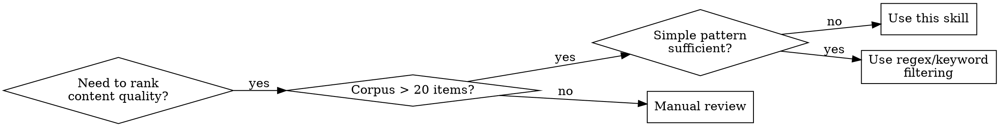
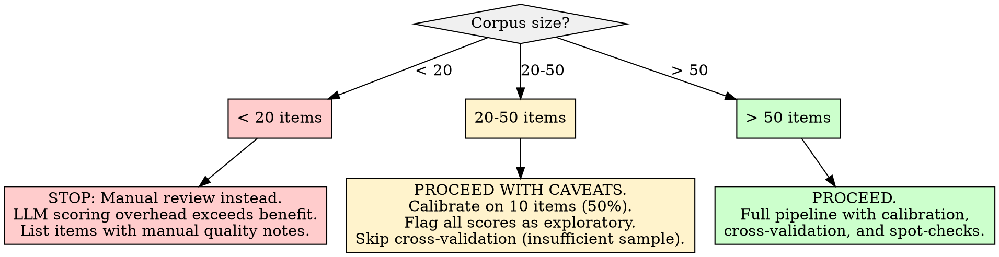

# LLM-Based Relevance Scoring

## Overview

Use a Large Language Model as a judge to assign 0-100 relevance scores to individual content items, evaluating substance over surface-level signals. The core principle: **a well-calibrated LLM with an explicit rubric scores content more consistently than ad-hoc heuristics, but scores are measurements -- not ground truth -- and require calibration, spot-checks, and documented rubrics.**

## When to Use

- Corpus of text items (posts, comments, articles, reviews, messages) needs quality or relevance ranking
- Need to separate substantive contributions from low-effort content (one-liners, memes, "+1" replies)
- Identifying "Authority Peaks" -- content where a user served as a primary knowledge source for others
- Building a scoring pipeline for batch processing with checkpointing
- Need reproducible, documented scoring criteria rather than subjective impressions

**When NOT to use:**
- Corpus has fewer than 20 items -- manual review is faster and more reliable
- Content is non-textual (images, audio) without transcription
- You need real-time scoring with sub-second latency (use heuristics instead)
- A simple keyword or regex filter would suffice (do not use an LLM for what `grep` can do)



## Quick Reference

| Concept | Recommended Approach | Anti-pattern |
|---------|---------------------|-------------|
| **Rubric** | Explicit 5-level rubric with examples per level | Vague "rate quality 0-100" prompt |
| **Few-shot examples** | 5-10 calibration examples spanning the full score range | Zero-shot or examples only at extremes |
| **Temperature** | 0.1-0.3 for scoring consistency | Default (1.0) introduces variance |
| **Batch size** | 10-50 items per batch with checkpoint after each | Entire corpus in one pass, no checkpoints |
| **Calibration** | Score 20 items manually, compare to LLM, adjust rubric until Cohen's kappa > 0.7 | No calibration, trust LLM output directly |
| **Cross-validation** | Score a 10% sample with a second model, check correlation | Single model, no validation |
| **Authority detection** | Score reply chains for knowledge asymmetry | Count upvotes or length as proxy for authority |
| **Spot-checks** | Human-review 5-10% of scored items per batch | Zero human review |

## Workflow

Copy this checklist and track progress:

```
LLM Relevance Scoring Progress:
- [ ] Step 1: Define the scoring rubric
- [ ] Step 2: Build few-shot calibration examples
- [ ] Step 3: Configure the LLM scoring environment
- [ ] Step 4: Run calibration pass and validate
- [ ] Step 5: Batch-score the corpus with checkpoints
- [ ] Step 6: Detect Authority Peaks
- [ ] Step 7: Cross-validate with a second model (optional but recommended)
- [ ] Step 8: Human spot-check and adjust
- [ ] Step 9: Write findings to docs/analysis/06-llm-relevance-scoring.md
```

### Step 1: Define the Scoring Rubric

The rubric is the single most important artifact. Without it, scores are meaningless.

**Five-level rubric template (adapt to your domain):**

| Score Range | Level | Criteria | Example Signals |
|-------------|-------|----------|-----------------|
| 0-19 | Noise | No substantive content. Memes, single-word replies, deleted/empty, spam, off-topic. | "+1", "lol", "this", "[deleted]", bot-generated filler |
| 20-39 | Low Substance | Minimal original thought. Agreement/disagreement without reasoning, personal anecdotes without generalizable insight. | "I agree", "Same thing happened to me", opinion without evidence |
| 40-59 | Moderate | Contains a clear point with some supporting detail. On-topic, contributes to discussion, but not a primary source. | Shares a relevant link, summarizes known information, asks a clarifying question |
| 60-79 | High Substance | Original analysis, detailed explanation, or synthesis of multiple sources. Demonstrates expertise or deep familiarity. | Step-by-step troubleshooting, comparative analysis, detailed how-to |
| 80-100 | Authority Peak | Primary knowledge source. Original research, first-hand expert testimony, comprehensive synthesis that others reference. Demonstrates command of the subject. | Definitive technical explanation others cite, original data/findings, corrects widespread misconceptions with evidence |

**Rubric design rules:**
- Each level MUST have concrete, observable criteria -- not subjective impressions
- Criteria must be domain-adapted (technical content differs from creative writing)
- The gap between adjacent levels must be clear enough that two humans would agree 70%+ of the time
- Document the rubric in the output report -- scores without a rubric are uninterpretable

### Step 2: Build Few-Shot Calibration Examples

Select 5-10 real items from the corpus that span the full score range. Score them manually, then include them in every scoring prompt as calibration anchors.

```python
CALIBRATION_EXAMPLES = [
    {
        "content": "lol",
        "score": 5,
        "reasoning": "Single-word reaction with no substantive content."
    },
    {
        "content": "I had the same problem last week but can't remember how I fixed it.",
        "score": 25,
        "reasoning": "Personal anecdote acknowledging the topic but providing no actionable information."
    },
    {
        "content": "You need to update your GPU drivers. Go to nvidia.com/drivers and select your card model.",
        "score": 55,
        "reasoning": "Correct, actionable advice but brief. Points in the right direction without detailed explanation."
    },
    {
        "content": "This is a known issue with kernel 6.1+ when using NVIDIA 535 drivers. The fix is to add 'nvidia-drm.modeset=1' to your GRUB config. Here's why: the DRM subsystem changed its initialization order in 6.1, and without explicit modesetting, the framebuffer handoff fails during resume. I verified this on three machines running Fedora 39.",
        "score": 85,
        "reasoning": "Expert-level response with root cause analysis, specific fix, explanation of the underlying mechanism, and empirical verification. This is a primary knowledge source."
    },
]
```

**Selection criteria for calibration examples:**
- At least one example per rubric level
- Choose examples where the score is unambiguous (boundary cases confuse calibration)
- Prefer examples from the actual corpus over synthetic ones
- Include one example that looks long but is low-substance (tests length-bias resistance)

### Step 3: Configure the LLM Scoring Environment

**Local via Ollama (recommended for privacy and cost):**

```python
import requests
import json
import time

OLLAMA_BASE = "http://localhost:11434"

def score_with_ollama(content, rubric, examples, model="llama3.1:8b"):
    """Score a single content item using a local Ollama model."""
    prompt = build_scoring_prompt(content, rubric, examples)

    response = requests.post(
        f"{OLLAMA_BASE}/api/generate",
        json={
            "model": model,
            "prompt": prompt,
            "stream": False,
            "options": {
                "temperature": 0.2,  # Low temperature for consistency
                "num_predict": 256,  # Cap output length
            }
        },
        timeout=120
    )
    response.raise_for_status()
    return parse_score_response(response.json()["response"])


def build_scoring_prompt(content, rubric, examples):
    """Build the scoring prompt with rubric and few-shot examples."""
    example_block = "\n\n".join(
        f"Content: \"{ex['content']}\"\nScore: {ex['score']}\nReasoning: {ex['reasoning']}"
        for ex in examples
    )

    return f"""You are a content relevance scorer. Score the following content on a 0-100 scale using this rubric:

{rubric}

Here are calibration examples:

{example_block}

Now score this content. Respond with ONLY a JSON object containing "score" (integer 0-100) and "reasoning" (one sentence).

Content: \"{content}\"
"""


def parse_score_response(raw_response):
    """Extract score and reasoning from LLM response."""
    # Try JSON parse first
    try:
        # Find JSON object in response
        start = raw_response.index('{')
        end = raw_response.rindex('}') + 1
        parsed = json.loads(raw_response[start:end])
        score = int(parsed["score"])
        reasoning = parsed.get("reasoning", "")
        if 0 <= score <= 100:
            return {"score": score, "reasoning": reasoning}
    except (ValueError, KeyError, json.JSONDecodeError):
        pass

    # Fallback: regex for a number
    import re
    match = re.search(r'\b(\d{1,3})\b', raw_response)
    if match:
        score = int(match.group(1))
        if 0 <= score <= 100:
            return {"score": score, "reasoning": raw_response.strip()}

    return {"score": -1, "reasoning": f"PARSE_FAILURE: {raw_response[:200]}"}
```

**Model selection guidance:**

| Model | Strengths | Limitations |
|-------|-----------|-------------|
| Llama 3.1 8B (Ollama) | Fast, runs on 8GB VRAM, good for bulk scoring | May struggle with nuanced authority detection |
| Llama 3.1 70B (Ollama) | Strong reasoning, better calibration | Requires 40GB+ VRAM or quantized |
| Mistral 7B (Ollama) | Fast, good instruction following | Less consistent on subjective rubrics |
| GPT-4 / GPT-4o (API) | Best calibration, highest human agreement | Cost, rate limits, data leaves your machine |
| Claude (API) | Strong reasoning, good rubric adherence | Cost, rate limits, data leaves your machine |

**Fallback chain:** If the primary model is unavailable, fall back gracefully:
1. Primary: local Ollama model
2. Fallback: smaller local model (e.g., 8B instead of 70B)
3. Last resort: API-based model with rate limiting
4. If no LLM available: log items as "unscored" and continue pipeline

### Step 4: Run Calibration Pass and Validate

Before scoring the full corpus, calibrate on a small set.

```python
def calibration_check(human_scores, llm_scores):
    """Compare human and LLM scores. Target: Cohen's kappa > 0.7 on binned scores."""
    # Bin into 5 levels for kappa calculation
    def to_bin(score):
        if score < 20: return 0
        if score < 40: return 1
        if score < 60: return 2
        if score < 80: return 3
        return 4

    human_bins = [to_bin(s) for s in human_scores]
    llm_bins = [to_bin(s) for s in llm_scores]

    # Cohen's kappa (manual calculation, no sklearn dependency)
    from collections import Counter
    n = len(human_bins)
    observed_agree = sum(1 for h, l in zip(human_bins, llm_bins) if h == l) / n
    h_dist = Counter(human_bins)
    l_dist = Counter(llm_bins)
    expected_agree = sum(
        (h_dist.get(k, 0) / n) * (l_dist.get(k, 0) / n) for k in range(5)
    )
    kappa = (observed_agree - expected_agree) / (1 - expected_agree) if expected_agree < 1 else 1.0

    # Mean absolute error
    mae = sum(abs(h - l) for h, l in zip(human_scores, llm_scores)) / n

    return {
        "kappa": round(kappa, 3),
        "mae": round(mae, 1),
        "observed_agreement": round(observed_agree, 3),
        "pass": kappa >= 0.7 and mae <= 15
    }
```

**Calibration procedure:**
1. Manually score 20 items spanning all rubric levels
2. Score the same 20 items with the LLM
3. Compute Cohen's kappa (binned into 5 levels) and mean absolute error
4. If kappa < 0.7 or MAE > 15: revise rubric wording, add/adjust examples, re-score
5. Repeat until calibration passes
6. Document final calibration metrics in the report

**If calibration never passes:** The rubric may be too subjective for the chosen model. Options:
- Simplify to 3 levels (low/medium/high) instead of 5
- Use a more capable model
- Accept lower calibration and flag all scores as "approximate"

### Step 5: Batch-Score the Corpus with Checkpoints

**REQUIRED SUB-SKILL:** Use automated-orchestration for checkpoint/resume patterns.

```python
import json, time
from pathlib import Path

def batch_score(items, model, rubric, examples, checkpoint_path="checkpoints/scoring.json",
                batch_size=25, rate_limit_delay=0.5):
    """Score items in batches with checkpoint/resume."""
    checkpoint_path = Path(checkpoint_path)
    checkpoint_path.parent.mkdir(parents=True, exist_ok=True)

    # Load existing checkpoint
    if checkpoint_path.exists():
        state = json.loads(checkpoint_path.read_text())
    else:
        state = {"scored": {}, "errors": [], "started_at": time.time()}

    already_scored = set(state["scored"].keys())
    remaining = [(i, item) for i, item in enumerate(items)
                 if str(i) not in already_scored]

    print(f"Scoring {len(remaining)} items ({len(already_scored)} already done)")

    for batch_start in range(0, len(remaining), batch_size):
        batch = remaining[batch_start:batch_start + batch_size]

        for idx, item in batch:
            try:
                result = score_with_ollama(
                    item["content"], rubric, examples, model=model
                )
                state["scored"][str(idx)] = {
                    "score": result["score"],
                    "reasoning": result["reasoning"],
                    "item_id": item.get("id", idx),
                }
                time.sleep(rate_limit_delay)
            except Exception as e:
                state["errors"].append({
                    "index": idx,
                    "error": str(e),
                    "time": time.time()
                })

        # Checkpoint after each batch
        tmp = checkpoint_path.with_suffix(".tmp")
        tmp.write_text(json.dumps(state, indent=2, default=str))
        tmp.rename(checkpoint_path)
        print(f"  Checkpoint: {len(state['scored'])} scored, "
              f"{len(state['errors'])} errors")

    state["completed_at"] = time.time()
    checkpoint_path.write_text(json.dumps(state, indent=2, default=str))
    return state
```

### Step 6: Detect Authority Peaks

An Authority Peak is content where a user served as a **primary knowledge source** -- not merely participating, but providing information others could not easily obtain elsewhere.

```python
def detect_authority_peaks(scored_items, threshold=75):
    """Identify content items that qualify as Authority Peaks.

    Authority Peak criteria (ALL must be met):
    1. Relevance score >= threshold (default 75)
    2. Contains original information (not just linking/quoting)
    3. Demonstrates domain expertise or first-hand knowledge
    """
    peaks = []
    for item in scored_items:
        if item["score"] < threshold:
            continue

        # Authority signals (check reasoning field for these markers)
        reasoning = item.get("reasoning", "").lower()
        authority_signals = [
            "expert", "first-hand", "original", "primary source",
            "detailed explanation", "comprehensive", "corrects",
            "demonstrates expertise", "authority"
        ]
        signal_count = sum(1 for s in authority_signals if s in reasoning)

        peaks.append({
            **item,
            "authority_signal_count": signal_count,
            "is_authority_peak": signal_count >= 1 or item["score"] >= 85
        })

    return [p for p in peaks if p["is_authority_peak"]]
```

**Authority Peak characteristics:**
- High relevance score alone is necessary but NOT sufficient
- Look for knowledge asymmetry: the author knows something the audience does not
- Original analysis, first-hand experience, or synthesis of primary sources
- Other users reference, build on, or defer to this content
- Length is NOT a reliable signal -- a 2-sentence expert correction can be an Authority Peak

### Step 7: Cross-Validate with a Second Model

Score a random 10% sample with a different model. High correlation (Pearson r > 0.75) between models increases confidence. Low correlation flags rubric ambiguity.

```python
import random

def cross_validate(items, primary_scores, secondary_model, rubric, examples,
                   sample_fraction=0.10):
    """Score a sample with a second model and compare."""
    sample_size = max(10, int(len(items) * sample_fraction))
    sample_indices = random.sample(range(len(items)), sample_size)

    secondary_scores = {}
    for idx in sample_indices:
        result = score_with_ollama(
            items[idx]["content"], rubric, examples, model=secondary_model
        )
        secondary_scores[idx] = result["score"]

    # Pearson correlation
    primary_sample = [primary_scores[idx] for idx in sample_indices]
    secondary_sample = [secondary_scores[idx] for idx in sample_indices]

    n = len(primary_sample)
    mean_p = sum(primary_sample) / n
    mean_s = sum(secondary_sample) / n
    cov = sum((p - mean_p) * (s - mean_s) for p, s in zip(primary_sample, secondary_sample)) / n
    std_p = (sum((p - mean_p) ** 2 for p in primary_sample) / n) ** 0.5
    std_s = (sum((s - mean_s) ** 2 for s in secondary_sample) / n) ** 0.5

    pearson_r = cov / (std_p * std_s) if std_p > 0 and std_s > 0 else 0

    return {
        "sample_size": n,
        "pearson_r": round(pearson_r, 3),
        "mean_primary": round(mean_p, 1),
        "mean_secondary": round(mean_s, 1),
        "pass": pearson_r >= 0.75
    }
```

### Step 8: Human Spot-Check and Adjust

After batch scoring, randomly select 5-10% of items for human review. Focus on:

1. **Boundary cases** (scores near 40, 60, 80 -- the rubric level transitions)
2. **Extreme scores** (0-10 and 90-100 -- verify these are genuinely extreme)
3. **Parse failures** (any items with score = -1)
4. **Score clusters** -- if >50% of items score within a 10-point range, the rubric may lack discrimination

**Adjustment protocol:**
- If human disagrees with >20% of spot-checked scores: revise rubric, re-calibrate, re-score
- If disagreements cluster at specific rubric levels: refine that level's criteria
- If scores show systematic bias (LLM scores 15+ points higher/lower than human): add a bias correction offset and document it

### Step 9: Write Report

Write all findings to `docs/analysis/06-llm-relevance-scoring.md`.

## Report Output Template

The final report MUST be written to `docs/analysis/06-llm-relevance-scoring.md` with this structure:

```markdown
# LLM-Based Relevance Scoring Analysis

## Methodology
- Corpus: [N items, source description, average content length]
- Model(s) used: [primary model, secondary model if cross-validated]
- Rubric: [5-level rubric with criteria -- include full rubric or reference]
- Calibration: [kappa score, MAE, number of calibration items]
- Temperature: [value used]
- Few-shot examples: [count, selection criteria]

## Calibration Results
| Metric | Value | Threshold | Pass? |
|--------|-------|-----------|-------|
| Cohen's kappa (5-bin) | [value] | >= 0.7 | [yes/no] |
| Mean Absolute Error | [value] | <= 15 | [yes/no] |
| Observed agreement | [value] | -- | -- |

## Score Distribution
| Score Range | Level | Count | Percentage |
|-------------|-------|-------|------------|
| 0-19 | Noise | [N] | [%] |
| 20-39 | Low Substance | [N] | [%] |
| 40-59 | Moderate | [N] | [%] |
| 60-79 | High Substance | [N] | [%] |
| 80-100 | Authority Peak | [N] | [%] |

**Mean score:** [value]
**Median score:** [value]
**Standard deviation:** [value]

## Authority Peaks
[List of content items scoring 80+ with authority signals]

| Item ID | Score | Authority Signals | Summary |
|---------|-------|-------------------|---------|
| ... | ... | ... | ... |

## Cross-Validation (if performed)
| Metric | Value |
|--------|-------|
| Sample size | [N] |
| Pearson r | [value] |
| Mean score (primary) | [value] |
| Mean score (secondary) | [value] |
| Correlation assessment | [strong/moderate/weak] |

## Human Spot-Check Results
- Items reviewed: [N] ([%] of corpus)
- Agreement rate: [%]
- Bias direction: [LLM scores higher/lower/neutral]
- Adjustments made: [description or "none"]

## Limitations and Caveats
- [LLM scores are model-dependent, not objective truth]
- [Rubric was designed for this specific corpus/domain]
- [Calibration metrics and any shortfalls]
- [Items that could not be scored and why]
```

## Good Patterns

- **Explicit rubric with observable criteria** -- every level defined by what you can SEE in the content, not how it "feels"
- **Few-shot calibration examples spanning the full range** -- anchors the model's scoring distribution
- **Low temperature (0.1-0.3)** -- reduces score variance between identical re-runs
- **Checkpoint after every batch** -- avoids re-scoring hundreds of items after a crash
- **Cross-validation with a second model** -- agreement between models is stronger evidence than one model's output
- **Human spot-checks on boundary and extreme scores** -- catches systematic miscalibration
- **Document the rubric in the report** -- scores are uninterpretable without the rubric that produced them
- **Chain-of-thought reasoning** -- requiring the LLM to explain its score before outputting the number improves consistency

## Anti-Patterns

| Anti-Pattern | Why It Fails | Instead |
|--------------|-------------|---------|
| "Rate this content 0-100" with no rubric | LLM has no basis for consistent scoring; scores drift across batches | Provide explicit 5-level rubric with examples |
| No calibration before bulk scoring | Systematic errors multiply across entire corpus | Always calibrate on 20 items first, target kappa > 0.7 |
| Temperature = 1.0 for scoring | High variance; same content gets different scores on re-runs | Use temperature 0.1-0.3 for scoring tasks |
| Scoring without few-shot examples | Model invents its own scale; 50 might mean "average" or "mediocre" | Include 5-10 calibration examples in every prompt |
| Trusting LLM scores as ground truth | LLMs are judges, not oracles; they have systematic biases | Treat scores as one input, not definitive ranking |
| Processing entire corpus without checkpoints | One failure or timeout loses all progress | Checkpoint every 10-50 items |
| Using content length as a quality proxy | Long content can be low-quality; short content can be authoritative | Score on substance, explicitly tell LLM to ignore length |
| Scoring with no rate limiting | Overwhelms local model or exceeds API quotas | Add 0.5-2s delay between items |
| Skipping human spot-checks | No way to detect systematic bias or rubric failure | Human-review 5-10% of scored items |

## Boundaries

**This skill SHOULD:**
- Score content substance using a documented rubric
- Identify high-value contributions (Authority Peaks)
- Produce calibrated, spot-checked scores with documented confidence
- Write a complete report to `docs/analysis/06-llm-relevance-scoring.md`
- Use checkpointed batch processing for large corpora
- Document the rubric, calibration metrics, and any adjustments

**This skill should NOT:**
- Treat LLM scores as objective truth -- they are model-dependent measurements
- Score content without human spot-checks on a sample
- Use scores to rank PEOPLE rather than CONTENT -- scores describe artifacts, not authors
- Skip calibration -- uncalibrated scores are meaningless
- Assume authority from score alone -- Authority Peaks require both high scores AND knowledge asymmetry signals
- Process content without rate limiting

## Insufficient Data Handling



| Condition | Action |
|-----------|--------|
| **Corpus < 20 items** | Do NOT use LLM scoring. Manual review is faster and more reliable at this scale. List items with brief quality notes instead. |
| **Corpus 20-50 items** | Score all items but flag results as "exploratory." Calibrate on at least 10 items. Skip cross-validation (sample too small). |
| **Corpus > 50 items** | Full pipeline: calibrate, batch-score, cross-validate, spot-check. |
| **Content too short to score** (< 5 words) | Assign score 0-10 automatically with reasoning "Content too brief for meaningful evaluation." Do not send to LLM. |
| **LLM unavailable** (Ollama down, API unreachable) | Log items as "unscored" with timestamp. Do NOT skip items silently. Resume when LLM becomes available using checkpoint. |
| **Scores cluster with no variance** (>60% within 10-point range) | The rubric lacks discrimination for this corpus. Options: (1) add domain-specific criteria, (2) widen level definitions, (3) switch to 3-level (low/medium/high) scoring. |
| **Parse failures > 10%** | Model is not following the output format. Fix: (1) simplify prompt, (2) add stricter output format instructions, (3) try a different model. |
| **Local LLM resources limited** (slow GPU, CPU-only) | Use quantized models (Q4_K_M), reduce batch sizes, increase rate_limit_delay, or score a representative sample and extrapolate. |
| **Calibration never passes** | Simplify to 3 levels (low/medium/high). If still failing, the task may be too subjective for automated scoring -- report this finding. |

## Common Mistakes

| Mistake | Fix |
|---------|-----|
| Scoring without defining the rubric first | Write the rubric BEFORE touching the LLM. The rubric is the specification. |
| Calibrating on boundary cases | Calibration examples should be UNAMBIGUOUS -- save boundary cases for spot-checks. |
| Using the same examples for calibration and evaluation | Calibration examples go in the prompt. Evaluation items are separate. Never evaluate an item that appears in the few-shot examples. |
| Reporting mean score without distribution | Always report the full distribution (5-bin histogram). Mean score alone hides bimodal or skewed distributions. |
| Treating Authority Peaks as "best content" | Authority Peak means the user was a primary knowledge source. High-quality creative writing or humor may score high but is not an Authority Peak. |
| Re-scoring the entire corpus after rubric adjustment | Only re-score the calibration set and items near the adjusted boundary. Use checkpoints to preserve stable scores. |
| Ignoring parse failures | Parse failures (score = -1) indicate prompt or model problems. Fix the root cause; do not average them away. |
| Not documenting model version | Scores are model-dependent. "llama3.1:8b-q4_K_M" and "llama3.1:8b" may produce different results. Record the exact model string. |

## Red Flags -- Stop and Reassess

- All scores cluster within a 15-point range -- rubric has no discrimination power
- Calibration kappa < 0.5 after two rubric revisions -- task may not be scorable by this model
- Parse failure rate > 20% -- model cannot follow the output format
- LLM scores correlate more with content length than with substance -- add explicit "ignore length" instruction and re-calibrate
- Authority Peak detection finds > 30% of items -- threshold is too low, or rubric inflates scores
- Human spot-check disagrees with > 30% of scores -- fundamental calibration problem

## References

- [LLM-as-a-Judge: A Practical Guide (Towards Data Science)](https://towardsdatascience.com/llm-as-a-judge-a-practical-guide/)
- [Calibrating Scores of LLM-as-a-Judge (GoDaddy Engineering)](https://www.godaddy.com/resources/news/calibrating-scores-of-llm-as-a-judge)
- [LLM Rubric Evaluation (Promptfoo)](https://www.promptfoo.dev/docs/configuration/expected-outputs/model-graded/llm-rubric/)
- [LLM-as-a-Judge: Complete Guide (Evidently AI)](https://www.evidentlyai.com/llm-guide/llm-as-a-judge)
- [Using LLMs for Evaluation (Cameron Wolfe)](https://cameronrwolfe.substack.com/p/llm-as-a-judge)
- [Ollama Batch Evaluation Guide (KAUST HPC)](https://docs.hpc.kaust.edu.sa/_collections/data_science_onboarding/notebooks/inference/ollama-interactive-inference/ollama-sif-batch-eval-ibex.html)
- [LLM Evaluation Metrics (Confident AI)](https://www.confident-ai.com/blog/llm-evaluation-metrics-everything-you-need-for-llm-evaluation)
- [Ollama GitHub Repository](https://github.com/ollama/ollama)
