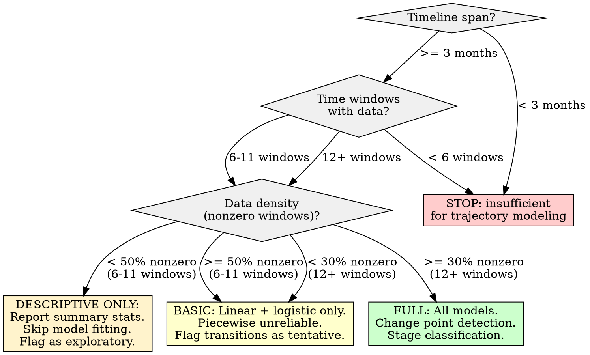

# Longitudinal Growth Curve Modeling

## Overview

Fit growth curve models to temporal activity metadata to track a user's evolution through stages of Digital Maturity (Lurker, Participant, Community Leader/Moderator). The core principle: **activity trajectories are not linear -- fit multiple candidate models, use information criteria to select the best, and detect change points that mark stage transitions rather than assuming smooth progression.**

## When to Use

- Temporal activity data spanning months or years (timestamps on posts, comments, votes, moderation actions)
- Need to classify a user's current Digital Maturity stage based on trajectory shape
- Investigating whether a user transitioned between participation modes (lurking to active, active to leadership)
- Comparing growth models (linear, logistic, piecewise) to find best trajectory fit
- Detecting inflection points or change points in activity rate over time
- Feeding trajectory shape into downstream persona or archetype analysis

**When NOT to use:**
- Activity timeline is shorter than 3 months -- insufficient for trajectory modeling (see Insufficient Data)
- Fewer than 12 time-windowed data points -- cannot distinguish model shapes
- Need to predict future behavior -- this skill models historical trajectories, not forecasts
- Claiming psychological maturity from activity counts -- activity volume is a proxy, not a direct measure
- Single-point-in-time snapshots with no temporal dimension

```dot
digraph model_selection {
    rankdir=LR;
    "Activity trajectory\nshape?" [shape=diamond];
    "Steady increase\nor decrease?" [shape=diamond];
    "Plateau or\nsaturation?" [shape=diamond];
    "Abrupt shifts?" [shape=diamond];

    "Linear model" [shape=box];
    "Logistic model" [shape=box];
    "Piecewise model" [shape=box];
    "Fit ALL three\nand compare AIC/BIC" [shape=box, style=filled, fillcolor="#ccffcc"];

    "Activity trajectory\nshape?" -> "Steady increase\nor decrease?" [label="visual check"];
    "Steady increase\nor decrease?" -> "Linear model" [label="yes"];
    "Steady increase\nor decrease?" -> "Plateau or\nsaturation?" [label="no"];
    "Plateau or\nsaturation?" -> "Logistic model" [label="yes"];
    "Plateau or\nsaturation?" -> "Abrupt shifts?" [label="no"];
    "Abrupt shifts?" -> "Piecewise model" [label="yes"];

    "Linear model" -> "Fit ALL three\nand compare AIC/BIC";
    "Logistic model" -> "Fit ALL three\nand compare AIC/BIC";
    "Piecewise model" -> "Fit ALL three\nand compare AIC/BIC";
}
```



**Always fit all candidate models regardless of visual impression.** The flowchart above guides intuition, but model selection MUST be data-driven via AIC/BIC comparison.

## Quick Reference

| Model | When It Fits | Parameters | Best For |
|-------|-------------|------------|----------|
| **Linear** | Steady, constant-rate change | slope, intercept | Early-stage users with short timelines |
| **Logistic (sigmoid)** | S-curve: slow start, rapid growth, plateau | L (ceiling), k (steepness), x0 (midpoint) | Users who ramp up then stabilize |
| **Piecewise linear** | Distinct phases with different slopes | slopes per segment, breakpoints | Users with clear stage transitions |
| **Quadratic/polynomial** | Gradual acceleration or deceleration | coefficients | Use sparingly; overfits easily beyond degree 2 |

| Information Criterion | Formula Concept | Use Case |
|-----------------------|-----------------|----------|
| **AIC** | -2*log(L) + 2*k | Prefer for predictive model selection |
| **BIC** | -2*log(L) + k*log(n) | Prefer for explanatory model selection (penalizes complexity more) |

**Selection rule:** Lower AIC/BIC = better fit. When AIC and BIC disagree, prefer BIC (we seek explanation, not prediction).

## Digital Maturity Stages

| Stage | Label | Behavioral Signals |
|-------|-------|-------------------|
| **Stage 1** | Lurker | Low or zero posting activity; account exists but minimal visible output; may have passive signals (subscriptions, saves, votes) if available |
| **Stage 2** | Participant | Regular posting/commenting; engaged in discussions; moderate frequency and consistency |
| **Stage 3** | Community Leader/Moderator | High-frequency sustained activity; moderation actions; thread initiation; mentoring behaviors; cross-community engagement |

**Transition detection is the primary analytical goal** -- not just classifying current stage but identifying WHEN and HOW transitions occurred.

## Workflow

Copy this checklist and track progress:

```
Longitudinal Growth Curve Modeling Progress:
- [ ] Step 1: Prepare temporal activity data (windowed aggregation)
- [ ] Step 2: Compute activity features per time window
- [ ] Step 3: Visualize raw trajectory (before fitting)
- [ ] Step 4: Fit linear growth model
- [ ] Step 5: Fit logistic (sigmoid) growth model
- [ ] Step 6: Fit piecewise linear model with change point detection
- [ ] Step 7: Compare models using AIC/BIC
- [ ] Step 8: Detect phase transitions (change points)
- [ ] Step 9: Classify Digital Maturity stages
- [ ] Step 10: Validate transitions against activity metadata
- [ ] Step 11: Write findings to docs/analysis/11-longitudinal-growth-curves.md
```

### Step 1: Prepare Temporal Activity Data (Windowed Aggregation)

Raw timestamps must be aggregated into time windows before fitting. Do NOT fit models to individual event timestamps.

```python
import pandas as pd
import numpy as np

def prepare_temporal_windows(activity_df, date_col='date', window='W'):
    """
    Aggregate activity into regular time windows.

    Adapt to your data:
    - Forum data: post/comment timestamps
    - Chat data: message timestamps
    - Any platform: action timestamps with action_type column

    Parameters:
    - activity_df: DataFrame with at least a datetime column
    - date_col: name of the datetime column
    - window: pandas frequency string ('W'=weekly, 'M'=monthly, '2W'=biweekly)

    Returns:
    - DataFrame with one row per time window containing activity counts
    """
    df = activity_df.copy()
    df[date_col] = pd.to_datetime(df[date_col])

    # Sort by date for proper windowing
    df = df.sort_values(date_col)

    # Determine appropriate window size based on timeline span
    timeline_span = (df[date_col].max() - df[date_col].min()).days
    if window == 'auto':
        if timeline_span < 90:
            window = 'W'       # Weekly for short timelines
        elif timeline_span < 365:
            window = '2W'      # Biweekly for medium timelines
        else:
            window = 'M'       # Monthly for long timelines

    # Create a complete date range (fills gaps with zero-activity windows)
    full_range = pd.date_range(
        start=df[date_col].min(),
        end=df[date_col].max(),
        freq=window
    )

    # Aggregate activity per window
    windowed = df.set_index(date_col).resample(window).agg(
        activity_count=('body' if 'body' in df.columns else date_col, 'count'),
    ).reindex(full_range, fill_value=0)

    windowed.index.name = 'window_start'
    windowed = windowed.reset_index()

    # Add numeric time index for regression (0, 1, 2, ...)
    windowed['t'] = range(len(windowed))

    print(f"Timeline: {df[date_col].min().date()} to {df[date_col].max().date()}")
    print(f"Window size: {window}, Total windows: {len(windowed)}")
    print(f"Windows with zero activity: {(windowed['activity_count'] == 0).sum()}")

    return windowed
```

**Critical: fill zero-activity windows.** Gaps in activity ARE data -- they indicate lurking or absence. Dropping zero-activity windows biases the trajectory upward.

**Window size selection:**

| Timeline Span | Recommended Window | Rationale |
|---------------|-------------------|-----------|
| < 3 months | Weekly | Preserves short-term variation |
| 3-12 months | Biweekly | Smooths noise while preserving trends |
| 1-3 years | Monthly | Standard for long-term trajectories |
| 3+ years | Monthly | Monthly is sufficient; quarterly loses too much detail |

### Step 2: Compute Activity Features Per Time Window

Activity volume alone is an insufficient maturity indicator. Compute multiple features per window.

```python
def compute_window_features(activity_df, date_col='date', window='M'):
    """
    Compute multi-dimensional activity features per time window.

    Adapt feature computation to available columns in your data:
    - If you have post types: count by type (post vs comment vs moderation)
    - If you have engagement scores: aggregate per window
    - If you have reply chains: count thread initiations vs replies
    """
    df = activity_df.copy()
    df[date_col] = pd.to_datetime(df[date_col])

    features = df.set_index(date_col).resample(window).agg(
        activity_count=(date_col, 'count'),
    )

    # Add content-length feature if text body is available
    if 'body' in df.columns:
        body_agg = df.set_index(date_col)['body'].resample(window).agg(
            lambda x: x.dropna().str.len().mean()
        )
        features['avg_content_length'] = body_agg

    # Add unique-context feature if context/subreddit/channel is available
    context_col = next(
        (c for c in ['subreddit', 'channel', 'forum', 'category']
         if c in df.columns), None
    )
    if context_col:
        context_agg = df.set_index(date_col)[context_col].resample(window).nunique()
        features['unique_contexts'] = context_agg

    # Add content-type diversity if type column exists
    type_col = next(
        (c for c in ['type', 'content_type', 'action_type']
         if c in df.columns), None
    )
    if type_col:
        type_agg = df.set_index(date_col)[type_col].resample(window).nunique()
        features['action_diversity'] = type_agg

    # Fill gaps with zeros for count features, NaN for ratio features
    features['activity_count'] = features['activity_count'].fillna(0)

    features = features.reset_index()
    features.columns.name = None
    features['t'] = range(len(features))

    return features
```

**Multi-dimensional maturity signals:**

| Feature | Lurker Signal | Participant Signal | Leader Signal |
|---------|--------------|-------------------|---------------|
| activity_count | 0-1 per window | Moderate, consistent | High, sustained |
| avg_content_length | N/A or very short | Moderate (50-200 chars) | Long, substantive (200+) |
| unique_contexts | 0-1 | 2-5 | 5+ (cross-community presence) |
| action_diversity | 1 (view/vote only) | 2-3 (post, comment) | 3+ (post, comment, moderate, initiate) |

### Step 3: Visualize Raw Trajectory (Before Fitting)

Always plot the raw data before fitting any model. This prevents fitting a model that contradicts visual evidence.

```python
import matplotlib
matplotlib.use('Agg')
import matplotlib.pyplot as plt

def plot_raw_trajectory(windowed_df, y_col='activity_count', save_path=None):
    """Plot raw activity trajectory with a LOESS smoother for visual trend."""
    fig, ax = plt.subplots(figsize=(12, 5))

    ax.bar(windowed_df['window_start'], windowed_df[y_col],
           alpha=0.4, color='steelblue', label='Raw activity')

    # Rolling average as visual smoother
    rolling_window = max(3, len(windowed_df) // 10)
    smoothed = windowed_df[y_col].rolling(
        window=rolling_window, center=True, min_periods=1
    ).mean()
    ax.plot(windowed_df['window_start'], smoothed,
            color='darkred', linewidth=2, label=f'Rolling mean (w={rolling_window})')

    ax.set_xlabel('Time')
    ax.set_ylabel(y_col)
    ax.set_title(f'Raw Activity Trajectory: {y_col}')
    ax.legend()

    if save_path:
        fig.savefig(save_path, dpi=150, bbox_inches='tight')
        print(f"Saved trajectory plot to {save_path}")
    plt.close(fig)
    return fig
```

**What to look for:**
- Upward trend with steady slope -> likely linear
- S-curve (slow, fast, plateau) -> likely logistic
- Abrupt slope changes -> likely piecewise
- High variance with no trend -> may not be modelable (see Insufficient Data)

### Step 4: Fit Linear Growth Model

```python
import statsmodels.api as sm

def fit_linear_model(windowed_df, y_col='activity_count'):
    """
    Fit a simple linear growth model: y = a + b*t
    Returns model results with AIC/BIC for comparison.
    """
    t = windowed_df['t'].values
    y = windowed_df[y_col].values

    X = sm.add_constant(t)  # Adds intercept column
    model = sm.OLS(y, X).fit()

    return {
        'model_type': 'linear',
        'model': model,
        'aic': model.aic,
        'bic': model.bic,
        'r_squared': model.rsquared,
        'params': {
            'intercept': model.params[0],
            'slope': model.params[1],
        },
        'slope_pvalue': model.pvalues[1],
        'residuals': model.resid,
        'fitted': model.fittedvalues,
        'interpretation': (
            f"Linear trend: {'increasing' if model.params[1] > 0 else 'decreasing'} "
            f"at {model.params[1]:.3f} units/window "
            f"(p={model.pvalues[1]:.4f}, R2={model.rsquared:.3f})"
        ),
    }
```

### Step 5: Fit Logistic (Sigmoid) Growth Model

The logistic model captures S-curve trajectories: slow start, rapid growth, and plateau -- the classic "lurker to active participant who stabilizes" pattern.

```python
from scipy.optimize import curve_fit
from scipy.stats import norm

def logistic_function(t, L, k, t0):
    """
    Logistic growth: y = L / (1 + exp(-k * (t - t0)))
    L = carrying capacity (plateau)
    k = steepness of growth
    t0 = midpoint (inflection point)
    """
    return L / (1 + np.exp(-k * (t - t0)))

def fit_logistic_model(windowed_df, y_col='activity_count'):
    """
    Fit a logistic growth model using nonlinear least squares.
    Returns model results with AIC/BIC for comparison.
    """
    t = windowed_df['t'].values.astype(float)
    y = windowed_df[y_col].values.astype(float)
    n = len(y)

    # Initial parameter guesses
    L_init = y.max() * 1.2 if y.max() > 0 else 1.0
    k_init = 0.1
    t0_init = len(t) / 2

    try:
        popt, pcov = curve_fit(
            logistic_function, t, y,
            p0=[L_init, k_init, t0_init],
            maxfev=10000,
            bounds=([0, 0.001, 0], [y.max() * 5, 10, len(t) * 2])
        )
        L, k, t0 = popt

        fitted = logistic_function(t, *popt)
        residuals = y - fitted
        ss_res = np.sum(residuals**2)
        ss_tot = np.sum((y - y.mean())**2)
        r_squared = 1 - (ss_res / ss_tot) if ss_tot > 0 else 0

        # Compute AIC/BIC for nonlinear model
        # k_params = 3 (L, k, t0) + 1 (sigma) = 4
        k_params = 4
        log_likelihood = -n/2 * np.log(2 * np.pi * ss_res / n) - n/2
        aic = -2 * log_likelihood + 2 * k_params
        bic = -2 * log_likelihood + k_params * np.log(n)

        return {
            'model_type': 'logistic',
            'params': {'L': L, 'k': k, 't0': t0},
            'aic': aic,
            'bic': bic,
            'r_squared': r_squared,
            'residuals': residuals,
            'fitted': fitted,
            'inflection_point': t0,
            'interpretation': (
                f"Logistic fit: ceiling={L:.1f}, steepness={k:.3f}, "
                f"inflection at window {t0:.1f} (R2={r_squared:.3f})"
            ),
            'converged': True,
        }
    except (RuntimeError, ValueError) as e:
        return {
            'model_type': 'logistic',
            'converged': False,
            'error': str(e),
            'interpretation': f"Logistic model failed to converge: {e}",
        }
```

### Step 6: Fit Piecewise Linear Model with Change Point Detection

Piecewise models are the most important for Digital Maturity analysis because stage transitions manifest as slope changes.

```python
def fit_piecewise_model(windowed_df, y_col='activity_count',
                        max_breakpoints=3):
    """
    Fit piecewise linear model using change point detection.

    Uses exhaustive search over candidate breakpoints with BIC
    for selecting the number of segments.

    For large datasets, consider using the 'ruptures' library:
        import ruptures
        algo = ruptures.Pelt(model="l2").fit(signal)
        breakpoints = algo.predict(pen=penalty)
    """
    t = windowed_df['t'].values.astype(float)
    y = windowed_df[y_col].values.astype(float)
    n = len(y)

    if n < 12:
        return {
            'model_type': 'piecewise',
            'converged': False,
            'error': 'Insufficient data points for piecewise fitting (need 12+)',
        }

    best_result = None
    best_bic = np.inf

    # Try 1, 2, ... max_breakpoints
    for n_bp in range(1, max_breakpoints + 1):
        # Candidate breakpoint positions (avoid edges)
        margin = max(3, n // (n_bp + 2))
        candidates = range(margin, n - margin)

        if n_bp == 1:
            for bp in candidates:
                result = _fit_piecewise_segments(t, y, [bp])
                if result['bic'] < best_bic:
                    best_bic = result['bic']
                    best_result = result
        elif n_bp == 2:
            for bp1 in candidates:
                for bp2 in range(bp1 + margin, n - margin):
                    result = _fit_piecewise_segments(t, y, [bp1, bp2])
                    if result['bic'] < best_bic:
                        best_bic = result['bic']
                        best_result = result

    # Also compare against no-breakpoint (simple linear)
    linear_result = _fit_piecewise_segments(t, y, [])
    if linear_result['bic'] < best_bic:
        best_result = linear_result
        best_result['interpretation'] = (
            "No change points detected; linear model preferred by BIC"
        )

    return best_result

def _fit_piecewise_segments(t, y, breakpoints):
    """Fit linear segments between breakpoints and compute BIC."""
    n = len(y)
    segments = []
    boundaries = [0] + list(breakpoints) + [n]

    fitted = np.zeros(n)
    total_residuals = np.zeros(n)

    for i in range(len(boundaries) - 1):
        start, end = boundaries[i], boundaries[i + 1]
        seg_t = t[start:end]
        seg_y = y[start:end]

        if len(seg_t) < 2:
            continue

        X_seg = sm.add_constant(seg_t)
        seg_model = sm.OLS(seg_y, X_seg).fit()
        fitted[start:end] = seg_model.fittedvalues
        total_residuals[start:end] = seg_model.resid

        segments.append({
            'start_idx': start,
            'end_idx': end,
            'slope': seg_model.params[1],
            'intercept': seg_model.params[0],
            'r_squared': seg_model.rsquared,
        })

    ss_res = np.sum(total_residuals**2)
    ss_tot = np.sum((y - y.mean())**2)
    r_squared = 1 - (ss_res / ss_tot) if ss_tot > 0 else 0

    # BIC: k = 2 params per segment + number of breakpoints + sigma
    k_params = 2 * len(segments) + len(breakpoints) + 1
    log_likelihood = -n/2 * np.log(2 * np.pi * ss_res / n) - n/2 if ss_res > 0 else -np.inf
    bic = -2 * log_likelihood + k_params * np.log(n)
    aic = -2 * log_likelihood + 2 * k_params

    return {
        'model_type': 'piecewise',
        'converged': True,
        'breakpoints': breakpoints,
        'segments': segments,
        'aic': aic,
        'bic': bic,
        'r_squared': r_squared,
        'residuals': total_residuals,
        'fitted': fitted,
        'interpretation': (
            f"Piecewise linear: {len(segments)} segments, "
            f"breakpoints at windows {breakpoints} (R2={r_squared:.3f})"
        ),
    }
```

**Alternative: using the `ruptures` library for change point detection:**

```python
def detect_changepoints_ruptures(y, penalty=None, max_breakpoints=5):
    """
    Use the ruptures library for robust change point detection.
    Install: pip install ruptures

    Algorithms:
    - Pelt: penalized, fast, good default (use pen= parameter)
    - Binseg: binary segmentation, fast approximation
    - BottomUp: merges segments, good for noisy data
    """
    import ruptures as rpt

    signal = y.reshape(-1, 1) if y.ndim == 1 else y

    if penalty is None:
        # Use BIC-derived penalty: log(n) * variance
        penalty = np.log(len(y)) * np.var(y)

    algo = rpt.Pelt(model="l2", min_size=3).fit(signal)
    breakpoints = algo.predict(pen=penalty)

    # ruptures returns breakpoint indices (exclusive end positions)
    # Remove the last element (which is always len(signal))
    breakpoints = [bp for bp in breakpoints if bp < len(y)]

    return breakpoints
```

### Step 7: Compare Models Using AIC/BIC

```python
def compare_models(model_results):
    """
    Compare all fitted models using AIC and BIC.
    Returns ranked comparison table.
    """
    comparison = []
    for result in model_results:
        if result.get('converged', True):
            comparison.append({
                'model_type': result['model_type'],
                'aic': result.get('aic', np.inf),
                'bic': result.get('bic', np.inf),
                'r_squared': result.get('r_squared', 0),
                'interpretation': result.get('interpretation', ''),
            })
        else:
            comparison.append({
                'model_type': result['model_type'],
                'aic': np.inf,
                'bic': np.inf,
                'r_squared': 0,
                'interpretation': f"FAILED: {result.get('error', 'did not converge')}",
            })

    comp_df = pd.DataFrame(comparison)

    # Rank by BIC (prefer explanatory parsimony)
    comp_df = comp_df.sort_values('bic')
    comp_df['bic_rank'] = range(1, len(comp_df) + 1)
    comp_df['aic_rank'] = comp_df['aic'].rank().astype(int)

    # Delta BIC from best model
    best_bic = comp_df['bic'].min()
    comp_df['delta_bic'] = comp_df['bic'] - best_bic

    print("\n=== Model Comparison ===")
    print(comp_df[['model_type', 'aic', 'bic', 'delta_bic',
                    'r_squared', 'bic_rank']].to_string(index=False))
    print(f"\nBest model by BIC: {comp_df.iloc[0]['model_type']}")

    return comp_df
```

**Delta BIC interpretation:**

| Delta BIC | Evidence Against Higher-BIC Model |
|-----------|----------------------------------|
| 0-2 | Not worth mentioning; models are essentially equivalent |
| 2-6 | Positive evidence for the lower-BIC model |
| 6-10 | Strong evidence |
| > 10 | Very strong evidence; higher-BIC model is clearly inferior |

**Document your model selection rationale.** State which model won, by how much, and whether AIC and BIC agreed.

### Step 8: Detect Phase Transitions (Change Points)

Whether piecewise wins or not, explicitly detect and characterize transitions.

```python
def detect_phase_transitions(windowed_df, y_col='activity_count',
                              piecewise_result=None):
    """
    Identify and characterize phase transitions in the activity trajectory.
    Uses the piecewise model breakpoints plus slope-change analysis.
    """
    transitions = []

    if piecewise_result and piecewise_result.get('converged'):
        segments = piecewise_result['segments']
        breakpoints = piecewise_result['breakpoints']

        for i, bp in enumerate(breakpoints):
            if i + 1 < len(segments):
                pre_slope = segments[i]['slope']
                post_slope = segments[i + 1]['slope']
                slope_change = post_slope - pre_slope

                # Map breakpoint index to actual date
                bp_date = windowed_df.iloc[bp]['window_start'] \
                    if bp < len(windowed_df) else None

                transitions.append({
                    'breakpoint_index': bp,
                    'date': bp_date,
                    'pre_slope': pre_slope,
                    'post_slope': post_slope,
                    'slope_change': slope_change,
                    'direction': 'acceleration' if slope_change > 0
                                 else 'deceleration',
                    'magnitude': abs(slope_change),
                })

    # Also detect using rolling slope changes (model-free)
    y = windowed_df[y_col].values
    rolling_slope = np.diff(y)
    rolling_slope_smooth = pd.Series(rolling_slope).rolling(
        window=3, center=True, min_periods=1
    ).mean().values

    # Find sign changes in slope (zero crossings)
    sign_changes = np.where(np.diff(np.sign(rolling_slope_smooth)))[0]
    for sc in sign_changes:
        sc_date = windowed_df.iloc[sc + 1]['window_start'] \
            if sc + 1 < len(windowed_df) else None
        transitions.append({
            'breakpoint_index': sc + 1,
            'date': sc_date,
            'detection_method': 'rolling_slope_sign_change',
            'direction': 'inflection',
        })

    return transitions
```

### Step 9: Classify Digital Maturity Stages

Map the trajectory and transitions to Digital Maturity stages.

```python
def classify_maturity_stages(windowed_df, transitions, y_col='activity_count',
                              features_df=None):
    """
    Classify the user's Digital Maturity stage at each time window.

    Stage classification uses BOTH activity volume AND trajectory shape.
    A user who posts frequently but shows no growth is a stable Participant,
    not a Leader.

    Thresholds below are STARTING POINTS. Calibrate to your data
    by examining the distribution of activity counts across your corpus.
    """
    df = windowed_df.copy()
    y = df[y_col].values

    # Compute rolling statistics for classification
    window_size = max(3, len(df) // 10)
    df['rolling_mean'] = pd.Series(y).rolling(
        window=window_size, min_periods=1, center=True
    ).mean()
    df['rolling_std'] = pd.Series(y).rolling(
        window=window_size, min_periods=1, center=True
    ).std().fillna(0)

    # Percentile-based thresholds (adapt to corpus)
    nonzero = y[y > 0]
    if len(nonzero) == 0:
        df['maturity_stage'] = 'Lurker'
        df['stage_confidence'] = 'high'
        return df

    p25 = np.percentile(nonzero, 25)
    p75 = np.percentile(nonzero, 75)

    def classify_window(row):
        rm = row['rolling_mean']
        if rm <= p25 * 0.5:
            return 'Lurker'
        elif rm <= p75:
            return 'Participant'
        else:
            return 'Community Leader/Moderator'

    df['maturity_stage'] = df.apply(classify_window, axis=1)

    # Confidence based on variance
    df['stage_confidence'] = df['rolling_std'].apply(
        lambda s: 'high' if s < p25 else ('medium' if s < p75 else 'low')
    )

    # Enhance with additional features if available
    if features_df is not None and 'unique_contexts' in features_df.columns:
        # Cross-community presence is a strong Leader signal
        for idx in df.index:
            if idx < len(features_df):
                contexts = features_df.iloc[idx].get('unique_contexts', 0)
                if contexts >= 5 and df.loc[idx, 'maturity_stage'] == 'Participant':
                    df.loc[idx, 'maturity_stage'] = 'Community Leader/Moderator'

    # Report stage distribution
    stage_counts = df['maturity_stage'].value_counts()
    print("\n=== Digital Maturity Stage Distribution ===")
    for stage, count in stage_counts.items():
        pct = 100 * count / len(df)
        print(f"  {stage}: {count} windows ({pct:.1f}%)")

    # Identify current stage (most recent stable window)
    recent = df.tail(max(3, window_size))
    current_stage = recent['maturity_stage'].mode().iloc[0] if len(recent) > 0 else 'Unknown'
    print(f"\nCurrent stage (recent {len(recent)} windows): {current_stage}")

    return df
```

### Step 10: Validate Transitions Against Activity Metadata

Do not rely solely on statistical change points. Cross-reference detected transitions with qualitative changes in the activity data.

```python
def validate_transitions(windowed_df, transitions, activity_df,
                          date_col='date'):
    """
    Check whether detected transitions correspond to observable
    changes in activity patterns, not just volume.

    Validation signals:
    - New content types appearing after transition
    - New communities/contexts entered
    - Change in content length or depth
    - External events (platform changes, life events) -- note but cannot detect programmatically
    """
    validated = []
    for tr in transitions:
        bp_date = tr.get('date')
        if bp_date is None:
            continue

        # Look at activity before vs after transition
        before = activity_df[
            pd.to_datetime(activity_df[date_col]) < bp_date
        ]
        after = activity_df[
            pd.to_datetime(activity_df[date_col]) >= bp_date
        ]

        validation = {'transition': tr, 'signals': []}

        # Check content type diversity change
        type_col = next(
            (c for c in ['type', 'content_type', 'action_type']
             if c in activity_df.columns), None
        )
        if type_col:
            types_before = set(before[type_col].dropna().unique())
            types_after = set(after[type_col].dropna().unique())
            new_types = types_after - types_before
            if new_types:
                validation['signals'].append(
                    f"New activity types after transition: {new_types}"
                )

        # Check context/community diversity change
        ctx_col = next(
            (c for c in ['subreddit', 'channel', 'forum', 'category']
             if c in activity_df.columns), None
        )
        if ctx_col:
            ctx_before = before[ctx_col].nunique() if len(before) > 0 else 0
            ctx_after = after[ctx_col].nunique() if len(after) > 0 else 0
            if ctx_after > ctx_before * 1.5:
                validation['signals'].append(
                    f"Context diversity increased: {ctx_before} -> {ctx_after}"
                )

        # Check content length change
        if 'body' in activity_df.columns:
            len_before = before['body'].dropna().str.len().mean()
            len_after = after['body'].dropna().str.len().mean()
            if not np.isnan(len_before) and not np.isnan(len_after):
                if len_after > len_before * 1.3:
                    validation['signals'].append(
                        f"Content length increased: {len_before:.0f} -> {len_after:.0f} chars"
                    )

        validation['validated'] = len(validation['signals']) > 0
        validated.append(validation)

    confirmed = sum(1 for v in validated if v['validated'])
    print(f"\nTransition validation: {confirmed}/{len(validated)} confirmed "
          f"by activity metadata changes")

    return validated
```

### Step 11: Write Report

Write all findings to `docs/analysis/11-longitudinal-growth-curves.md`. See Report Output Template below.

## Report Output Template

The final report MUST be written to `docs/analysis/11-longitudinal-growth-curves.md` with this structure:

```markdown
# Longitudinal Growth Curve Analysis

## Methodology
- Data source: [describe activity dataset, platform, date range]
- Timeline span: [start date] to [end date] ([N] months/years)
- Window aggregation: [weekly/biweekly/monthly], [N] total windows
- Windows with zero activity: [N] ([%])
- Models fitted: linear, logistic, piecewise
- Model selection criterion: BIC (lower = better)
- Date of analysis: [date]

## Raw Trajectory Summary
- Total activity items: [N]
- Activity rate: [mean] per window (std: [value])
- Trend (visual): [increasing / decreasing / plateau / mixed]
- [Path to trajectory plot if generated]

## Model Comparison

| Model | AIC | BIC | Delta BIC | R-squared | Rank (BIC) |
|-------|-----|-----|-----------|-----------|------------|
| [type] | [value] | [value] | [value] | [value] | [rank] |

**Selected model:** [type] (Delta BIC = [value] over second-best; [interpretation of evidence strength])

**Model selection rationale:** [Explain why selected model is preferred. If AIC and BIC disagree, note this and explain preference.]

### Selected Model Details
- Parameters: [list model parameters and values]
- Interpretation: [plain language explanation of trajectory shape]
- Goodness of fit: R-squared = [value]

### Alternative Model Notes
[Brief note on each non-selected model: why it was inferior or where it disagreed]

## Phase Transitions

### Detected Transitions
| # | Date | Window Index | Pre-Slope | Post-Slope | Direction | Validated? |
|---|------|-------------|-----------|------------|-----------|------------|
| 1 | [date] | [idx] | [slope] | [slope] | [accel/decel] | [yes/no] |

### Transition Validation
[For each transition, describe the supporting metadata evidence or lack thereof]

### Transitions NOT Detected
[Note if the model found no transitions -- this itself is a finding. Possible explanations:
 gradual change without abrupt shifts, insufficient data, or genuinely stable trajectory]

## Digital Maturity Classification

### Stage Distribution Over Time
| Stage | Windows | Percentage | Date Range |
|-------|---------|------------|------------|
| Lurker | [N] | [%] | [earliest] - [latest] |
| Participant | [N] | [%] | [earliest] - [latest] |
| Community Leader/Moderator | [N] | [%] | [earliest] - [latest] |

### Current Stage: [Stage Name]
- Based on most recent [N] windows
- Confidence: [high/medium/low]
- Supporting evidence: [activity level, diversity, trajectory direction]

### Stage Trajectory Narrative
[1-3 paragraphs describing the user's evolution: when they transitioned between stages,
 what evidence supports each transition, and what the overall trajectory shape reveals]

## Activity Feature Trends
[If multi-dimensional features were computed (content length, context diversity, etc.),
 show how they evolved alongside the primary activity count]

## Limitations and Caveats
- [Timeline too short for confident long-term modeling if applicable]
- [Large gaps in activity if applicable -- see gap analysis below]
- [Model fit quality -- low R-squared means trajectory is noisy]
- [Activity volume is a proxy, not a direct measure of maturity]
- [Platform changes or life events may explain transitions better than maturity evolution]
- [Thresholds for stage classification are corpus-relative, not absolute]
- [This analysis describes historical trajectory; it does NOT predict future behavior]

## Confounding Factors
[Note any known or suspected confounding factors:
 - Platform design changes that affected activity metrics
 - Account age effects (new-user enthusiasm vs. veteran fatigue)
 - Seasonal patterns in platform usage
 - Data export limitations (incomplete history)]

## Downstream Use
[How these findings feed into persona synthesis, weighted engagement scoring,
 or archetype assignment. Reference other analysis skills as appropriate.]
```

## Good Patterns

- **Fit multiple model types and compare:** Never accept the first model that "looks right." Always fit linear, logistic, and piecewise, then let AIC/BIC decide.
- **Use AIC/BIC for model selection:** Information criteria balance fit quality against complexity. They prevent overfitting to noise.
- **Identify change points explicitly:** Stage transitions are the primary deliverable. A model with good overall fit but no transition detection misses the point.
- **Windowed aggregation before fitting:** Raw timestamps are too noisy. Aggregate into regular windows (weekly/monthly) with zero-activity windows preserved.
- **Validate transitions against activity metadata:** A statistical change point is a hypothesis. Confirm it by checking whether content types, contexts, or content depth also changed.
- **Document model selection rationale:** Future readers (including future Claude instances) need to know WHY a model was chosen, not just which one.
- **Use percentile-based thresholds:** Absolute activity thresholds do not generalize across platforms. Calibrate stage boundaries to the user's own distribution.

## Anti-Patterns

| Anti-Pattern | Why It Fails | Instead |
|--------------|-------------|---------|
| Fitting a single model without alternatives | You cannot know if linear fits well without comparing to logistic and piecewise | Always fit all three; compare with AIC/BIC |
| Overfitting to noise with high-degree polynomials | Degree-3+ polynomials fit training data well but produce absurd extrapolations and unstable segment interpretations | Cap at degree 2 (quadratic) for polynomials; prefer piecewise for complex shapes |
| Treating activity volume as sole maturity indicator | High-volume posting without depth, diversity, or reciprocity is not maturity -- it may be spam or obsessive single-topic engagement | Use multi-dimensional features: activity count + content length + context diversity + action type diversity |
| Ignoring gaps in activity | Dropping zero-activity windows biases trajectories upward and hides lurking periods | Fill time series with zero-activity windows using `reindex` with full date range |
| Assuming linear growth | Most users do not grow linearly; S-curves and piecewise transitions are far more common in community participation research | Let the data decide -- fit multiple models and compare |
| Predicting future behavior from the trajectory | Growth curves model historical patterns; extrapolation is unreliable, especially beyond the observed range | Explicitly state the analysis is retrospective. Do NOT forecast. |
| Claiming psychological maturity from activity patterns | "They post more, therefore they are more mature" conflates observable behavior with internal state | Use the term "Digital Maturity stage" to specifically denote observable behavioral patterns, not psychological claims |
| Using raw AIC/BIC values without delta comparison | Individual AIC/BIC values are meaningless; only the difference between models matters | Always compute and report Delta BIC from the best model |

## Boundaries

**This skill SHOULD:**
- Model activity trajectories using multiple candidate growth curve models
- Identify phase transitions via change point detection and slope analysis
- Classify current Digital Maturity stage (Lurker / Participant / Community Leader/Moderator)
- Compare models using AIC/BIC and document selection rationale
- Validate detected transitions against qualitative activity metadata changes
- Fill zero-activity gaps in time series
- Produce a structured report at `docs/analysis/11-longitudinal-growth-curves.md`

**This skill should NOT:**
- Predict future behavior or extrapolate trajectories beyond observed data
- Claim psychological maturity from activity volume patterns
- Ignore confounding factors (platform design changes, account age effects, seasonal patterns, life events)
- Use absolute activity thresholds that do not generalize across platforms
- Skip model comparison and accept a single model without alternatives
- Treat change points as definitive stage boundaries without metadata validation
- Make causal claims about what drove transitions ("they became a leader because...")

## Insufficient Data Handling



| Condition | Impact | Action |
|-----------|--------|--------|
| **Timeline < 3 months** | Cannot distinguish trajectory shape from noise | STOP. Report: "Timeline too short for growth curve modeling ([N] days). Minimum 3 months required." Report descriptive stats only (total activity, mean rate). |
| **< 6 time windows** | Cannot fit any model reliably | STOP. Same as above. At weekly resolution, this means < 6 weeks of data. |
| **6-11 time windows** | Can fit linear/logistic but piecewise is unreliable | Fit linear and logistic only. Skip piecewise (not enough data for segment estimation). Flag all results as "limited data." |
| **12+ windows but < 30% nonzero** | Mostly lurking; trajectory is sparse | Fit all models but note: "Sparse activity trajectory -- [X]% of windows have zero activity. Model fit may be dominated by zeros." Consider binary modeling (active/inactive per window) instead. |
| **Large gaps (> 3 consecutive zero windows)** | Gap could represent absence, lurking, or data incompleteness | Identify and report all gaps > 3 windows. Distinguish between "lurking gap" (account still active, just no posting) and "absence gap" (unknown if user was on platform). If gap exceeds 25% of timeline, flag: "Large gap may confound trajectory interpretation." |
| **Only one content type** | Cannot assess maturity diversity | Fit activity count models but caveat: "Single content type available. Multi-dimensional maturity assessment not possible. Stage classification based on volume only." |
| **All activity in a single burst** | Not a trajectory; it is a single event | Report: "Activity concentrated in [date range]. No longitudinal trajectory to model. Single-period analysis only." |

**Minimum requirements for specific analyses:**

| Analysis | Minimum Requirement |
|----------|-------------------|
| Any model fitting | 6+ time windows spanning 3+ months |
| Piecewise / change point detection | 12+ time windows spanning 6+ months |
| Multi-segment piecewise (2+ breakpoints) | 20+ time windows |
| Stage classification with confidence | 12+ windows with 30%+ nonzero activity |
| Transition validation | At least 5 activity items before AND after each transition |

**When in doubt:** Report what you CAN compute and explicitly state what you CANNOT and why. A partial report with honest limitations is more valuable than a complete report built on insufficient data.

## Common Mistakes

| Mistake | Fix |
|---------|-----|
| Not filling zero-activity windows in the time series | Use `reindex` with a complete date range and `fill_value=0`. Gaps ARE data. |
| Comparing AIC across models fit on different data subsets | All models must be fit on the exact same data (same windows, same y values). |
| Using R-squared alone for model selection | R-squared always increases with complexity. Use AIC/BIC which penalize extra parameters. |
| Fitting piecewise model with too many breakpoints for the data size | Maximum breakpoints should be n_windows / 6 (at least 6 data points per segment). |
| Reporting model parameters without confidence intervals | Use `model.conf_int()` for OLS models. For nonlinear fits, report `pcov` diagonal as parameter uncertainty. |
| Classifying maturity stage from a single time window | Use a rolling window or the most recent N windows. A single window is too noisy for stage assignment. |
| Treating the inflection point of a logistic curve as a "transition date" | The inflection is the point of maximum growth rate, not a discrete transition. Piecewise breakpoints are better transition markers. |
| Ignoring that platform changes affect activity metrics | Reddit redesigns, API changes, or new features can cause apparent transitions that have nothing to do with user maturity. Note this in Confounding Factors. |
| Using weekly windows on a 5-year timeline | Results in 260+ data points where monthly (60 points) would be cleaner. Match window size to timeline span (see table in Step 1). |

## References

- [Twelve Frequently Asked Questions About Growth Curve Modeling (PMC)](https://www.ncbi.nlm.nih.gov/pmc/articles/PMC3131138/)
- [Piecewise Latent Growth Models: Beyond Linear-Linear Processes (Behavior Research Methods)](https://link.springer.com/article/10.3758/s13428-020-01420-5)
- [Bayesian Piecewise Growth Curve Models (Journal of Behavioral Data Science)](https://jbds.isdsa.org/jbds/article/view/51)
- [ruptures: Change Point Detection in Python (GitHub)](https://github.com/deepcharles/ruptures)
- [piecewise-regression in Python (JOSS)](https://www.theoj.org/joss-papers/joss.03859/10.21105.joss.03859.pdf)
- [AIC and BIC Model Selection with statsmodels](https://codepointtech.com/mastering-model-selection-aic-bic-in-python-statsmodels/)
- [Linear Mixed Effects Models (statsmodels)](https://www.statsmodels.org/stable/examples/notebooks/generated/mixed_lm_example.html)
- [No Country for Old Members: User Lifecycle and Linguistic Change (WWW 2013)](https://archives.iw3c2.org/www2013/proceedings/p307.pdf)
- [A Life-Cycle Perspective on Online Community Success (ACM Computing Surveys)](https://dl.acm.org/doi/10.1145/1459352.1459356)
- [Lurkers versus Contributors (Open Innovation Communities)](https://www.sciencedirect.com/science/article/pii/S2199853123000847)
- [From Lurkers to Workers: Predicting Voluntary Contribution (Information Systems Research)](https://pubsonline.informs.org/doi/10.1287/isre.2019.0905)
- [Life Cycle and Maturity Models for Online Communities (SpringerLink)](https://link.springer.com/chapter/10.1007/978-1-4302-4714-2_4)
- [Community Maturity Model (The Community Roundtable)](https://communityroundtable.com/what-we-do/research/community-maturity-model/)
- [The Life Cycle of Contributors in Collaborative Online Communities (OpenStreetMap)](https://www.tandfonline.com/doi/full/10.1080/13658816.2018.1458312)
