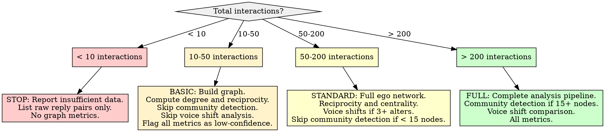

# Network and Social Graph Analysis

## Overview

Build and analyze a directed interaction graph from reply chains and parent-child relationships in conversation data. The core principle: **edges are replies, nodes are participants, and the asymmetry between who initiates and who responds reveals social structure** -- before inferring relationships, measure the graph.

## When to Use

- Conversation data with reply chains or parent-child references (forum threads, comment trees, message archives)
- Need to identify a user's frequent interlocutors and interaction patterns
- Measuring whether interactions are reciprocal or one-directional
- Detecting whether a user shifts voice, tone, or vocabulary depending on who they are replying to
- Extracting an ego network for a single user from a larger interaction dataset
- Feeding interaction patterns into downstream persona or archetype analysis

**When NOT to use:**
- Content has no reply structure (standalone documents, articles, reviews without threading)
- Need content-level analysis only (sentiment, topic modeling) -- use NMF or VADER skills instead
- Fewer than 10 interactions total -- insufficient for any graph metric (see Insufficient Data section)
- Attempting to infer real-world personal relationships from interaction frequency alone

## Workflow

Copy this checklist and track progress:

```
Network and Social Graph Analysis Progress:
- [ ] Step 1: Extract reply pairs from conversation data
- [ ] Step 2: Build directed interaction graph
- [ ] Step 3: Filter for meaningful interactions
- [ ] Step 4: Compute graph-level metrics
- [ ] Step 5: Extract ego network for target user
- [ ] Step 6: Identify frequent interlocutors
- [ ] Step 7: Measure reciprocity patterns
- [ ] Step 8: Detect audience-dependent voice shifts
- [ ] Step 9: Run community detection (if graph is large enough)
- [ ] Step 10: Write findings to docs/analysis/10-network-social-graph.md
```

### Step 1: Extract Reply Pairs from Conversation Data

Parse the conversation dataset to extract directed edges: (replier, parent_author). Each reply creates one directed edge from the replier to the author of the parent content.

```python
import pandas as pd

def extract_reply_pairs(comments_df, id_col='id', parent_col='parent_id',
                        author_col='author', body_col='body'):
    """
    Extract directed reply pairs from a comments/messages dataframe.
    Returns a dataframe of (source, target, metadata) edges.

    Adapt column names to your data format:
    - Forum data: thread_id, reply_to_id, username, content
    - Chat data: message_id, reply_to, sender, text
    - Email data: message_id, in_reply_to, from, body
    """
    # Build lookup: content ID -> author
    id_to_author = comments_df.set_index(id_col)[author_col].to_dict()

    edges = []
    for _, row in comments_df.iterrows():
        source = row[author_col]
        parent_id = row[parent_col]

        if pd.isna(parent_id) or pd.isna(source):
            continue

        # Resolve parent author from lookup
        target = id_to_author.get(parent_id)
        if target is None or target == source:  # Skip self-replies
            continue

        edges.append({
            'source': source,          # Who replied
            'target': target,          # Who they replied to
            'body': row.get(body_col, ''),
            'timestamp': row.get('date', row.get('timestamp', None)),
            'parent_id': parent_id,
        })

    return pd.DataFrame(edges)
```

**Data format adaptation:** The column names above are generic. Map them to your actual data:
- Reddit exports: `id`, `parent_id` (prefixed with `t1_` or `t3_`), author may need external resolution
- Forum exports: thread/post IDs, `reply_to` fields
- Chat exports: message IDs, `in_reply_to` or thread references

**Common issue -- unresolvable parent authors:** If the parent content is not in the dataset (deleted, from another export, or external), the edge cannot be constructed. Track these as "orphan references" and report the count.

### Step 2: Build Directed Interaction Graph

```python
import networkx as nx
from collections import Counter

def build_interaction_graph(edges_df):
    """
    Build a weighted directed graph from reply pairs.
    Edge weight = number of interactions from source to target.
    """
    G = nx.DiGraph()

    # Aggregate edges: count interactions per (source, target) pair
    edge_counts = Counter(
        zip(edges_df['source'], edges_df['target'])
    )

    for (source, target), weight in edge_counts.items():
        G.add_edge(source, target, weight=weight)

    return G

G = build_interaction_graph(edges_df)
print(f"Nodes: {G.number_of_nodes()}, Edges: {G.number_of_edges()}")
print(f"Total interactions: {sum(d['weight'] for _, _, d in G.edges(data=True))}")
```

### Step 3: Filter for Meaningful Interactions

Not all interactions carry equal analytical weight. Filter edges to reduce noise.

```python
def filter_graph(G, edges_df, min_weight=2, min_body_length=10):
    """
    Remove edges that represent trivial interactions.
    - min_weight: require at least N interactions between a pair
    - min_body_length: exclude one-word/trivial replies from edge construction
    """
    # First: rebuild edges excluding trivial replies
    substantive = edges_df[edges_df['body'].str.len() >= min_body_length]
    G_filtered = build_interaction_graph(substantive)

    # Second: remove low-weight edges
    weak_edges = [
        (u, v) for u, v, d in G_filtered.edges(data=True)
        if d['weight'] < min_weight
    ]
    G_filtered.remove_edges_from(weak_edges)

    # Remove isolated nodes (no remaining edges)
    isolates = list(nx.isolates(G_filtered))
    G_filtered.remove_nodes_from(isolates)

    print(f"Filtered: {G.number_of_nodes()} -> {G_filtered.number_of_nodes()} nodes, "
          f"{G.number_of_edges()} -> {G_filtered.number_of_edges()} edges")
    return G_filtered
```

**Filtering thresholds depend on corpus size:**

| Corpus Size (interactions) | min_weight | min_body_length | Rationale |
|---------------------------|------------|-----------------|-----------|
| < 100 | 1 | 5 | Preserve all signal in small datasets |
| 100-500 | 2 | 10 | Filter trivial but keep moderate |
| 500-2000 | 2-3 | 15 | Standard filtering |
| 2000+ | 3-5 | 20 | Aggressive noise reduction |

### Step 4: Compute Graph-Level Metrics

```python
def compute_graph_metrics(G):
    """Compute standard SNA metrics for the interaction graph."""
    metrics = {}

    # Basic structure
    metrics['nodes'] = G.number_of_nodes()
    metrics['edges'] = G.number_of_edges()
    metrics['density'] = nx.density(G)
    metrics['total_interactions'] = sum(d['weight'] for _, _, d in G.edges(data=True))

    # Reciprocity: proportion of edges that are bidirectional
    metrics['reciprocity'] = nx.reciprocity(G)

    # Degree centrality (in and out)
    in_degree = nx.in_degree_centrality(G)
    out_degree = nx.out_degree_centrality(G)
    metrics['in_degree_centrality'] = in_degree
    metrics['out_degree_centrality'] = out_degree

    # Betweenness centrality: who bridges different clusters
    if G.number_of_nodes() <= 1000:  # Expensive for large graphs
        metrics['betweenness'] = nx.betweenness_centrality(G, weight='weight')

    # Weakly connected components
    components = list(nx.weakly_connected_components(G))
    metrics['num_components'] = len(components)
    metrics['largest_component_size'] = max(len(c) for c in components) if components else 0

    return metrics
```

**Key metrics and interpretation:**

| Metric | Formula / Function | What It Reveals |
|--------|--------------------|-----------------|
| **Density** | `2*edges / (nodes*(nodes-1))` | How interconnected the network is (0-1) |
| **Reciprocity** | `\|{(u,v) in G \| (v,u) in G}\| / \|{(u,v) in G}\|` | Proportion of mutual interactions |
| **In-degree centrality** | Normalized count of incoming edges | Who receives the most replies (attention target) |
| **Out-degree centrality** | Normalized count of outgoing edges | Who initiates the most replies (active participant) |
| **Betweenness centrality** | Fraction of shortest paths through node | Who bridges different groups |
| **Weakly connected components** | Subgraphs reachable ignoring direction | How fragmented the network is |

### Step 5: Extract Ego Network for Target User

The ego network is the subgraph centered on the target user, including all their direct interlocutors (alters) and the connections between those alters.

```python
def extract_ego_network(G, ego_user):
    """
    Extract the ego network: ego + alters + edges between them.
    Returns both the ego subgraph and summary statistics.
    """
    if ego_user not in G:
        return None, {"error": f"User '{ego_user}' not found in graph"}

    # Ego network: ego + all neighbors + edges among them
    ego_graph = nx.ego_graph(G, ego_user, undirected=True)

    alters = set(ego_graph.nodes()) - {ego_user}

    # Classify alter relationships
    alter_stats = []
    for alter in alters:
        outgoing = G[ego_user].get(alter, {}).get('weight', 0)  # ego -> alter
        incoming = G[alter].get(ego_user, {}).get('weight', 0) if G.has_edge(alter, ego_user) else 0

        alter_stats.append({
            'alter': alter,
            'ego_to_alter': outgoing,
            'alter_to_ego': incoming,
            'total': outgoing + incoming,
            'reciprocity_ratio': min(outgoing, incoming) / max(outgoing, incoming)
                                 if max(outgoing, incoming) > 0 else 0,
            'direction': 'mutual' if outgoing > 0 and incoming > 0
                         else ('outgoing' if outgoing > 0 else 'incoming'),
        })

    alter_df = pd.DataFrame(alter_stats).sort_values('total', ascending=False)

    summary = {
        'ego_user': ego_user,
        'num_alters': len(alters),
        'total_interactions': alter_df['total'].sum(),
        'mutual_alters': len(alter_df[alter_df['direction'] == 'mutual']),
        'outgoing_only': len(alter_df[alter_df['direction'] == 'outgoing']),
        'incoming_only': len(alter_df[alter_df['direction'] == 'incoming']),
        'ego_reciprocity': len(alter_df[alter_df['direction'] == 'mutual']) / len(alters) if alters else 0,
    }

    return alter_df, summary
```

### Step 6: Identify Frequent Interlocutors

Rank alters by interaction volume and classify the interaction pattern.

```python
def classify_interlocutors(alter_df, top_n=10):
    """
    Classify the ego's top interlocutors by interaction pattern.
    """
    top = alter_df.head(top_n).copy()

    def classify(row):
        ratio = row['reciprocity_ratio']
        if row['direction'] != 'mutual':
            return 'one-directional'
        elif ratio >= 0.6:
            return 'balanced-mutual'
        elif row['ego_to_alter'] > row['alter_to_ego']:
            return 'ego-dominant'
        else:
            return 'alter-dominant'

    top['pattern'] = top.apply(classify, axis=1)
    return top
```

**Interlocutor pattern interpretation:**

| Pattern | Description | Implication |
|---------|-------------|-------------|
| **balanced-mutual** | Roughly equal exchange | Peer relationship, conversational |
| **ego-dominant** | Ego replies more than alter replies back | Ego seeks engagement, alter less invested |
| **alter-dominant** | Alter replies more to ego | Ego attracts attention, alter seeks engagement |
| **one-directional** | Only one direction of interaction | Broadcast or observation pattern |

### Step 7: Measure Reciprocity Patterns

Reciprocity operates at three levels: global network, ego-level, and per-alter.

```python
def measure_reciprocity(G, ego_user, alter_df):
    """
    Compute reciprocity at three levels.
    """
    # 1. Global network reciprocity
    global_recip = nx.reciprocity(G)

    # 2. Ego-level reciprocity (what fraction of ego's alters are mutual)
    mutual = alter_df[alter_df['direction'] == 'mutual']
    ego_recip = len(mutual) / len(alter_df) if len(alter_df) > 0 else 0

    # 3. Weighted ego reciprocity (accounts for interaction volume)
    total_out = alter_df['ego_to_alter'].sum()
    total_in = alter_df['alter_to_ego'].sum()
    weighted_recip = min(total_out, total_in) / max(total_out, total_in) \
                     if max(total_out, total_in) > 0 else 0

    # 4. Initiation ratio: how often does ego start threads vs respond
    ego_out_degree = G.out_degree(ego_user, weight='weight') if ego_user in G else 0
    ego_in_degree = G.in_degree(ego_user, weight='weight') if ego_user in G else 0
    initiation_ratio = ego_out_degree / (ego_out_degree + ego_in_degree) \
                       if (ego_out_degree + ego_in_degree) > 0 else 0.5

    return {
        'global_reciprocity': global_recip,
        'ego_alter_reciprocity': ego_recip,
        'ego_weighted_reciprocity': weighted_recip,
        'initiation_ratio': initiation_ratio,
        'interpretation': interpret_initiation(initiation_ratio),
    }

def interpret_initiation(ratio):
    if ratio > 0.7:
        return 'Strong initiator -- primarily starts conversations'
    elif ratio > 0.55:
        return 'Moderate initiator -- slightly more outgoing than responding'
    elif ratio > 0.45:
        return 'Balanced -- roughly equal initiation and response'
    elif ratio > 0.3:
        return 'Moderate responder -- primarily reacts to others'
    else:
        return 'Strong responder -- rarely initiates, mostly responds'
```

### Step 8: Detect Audience-Dependent Voice Shifts

Compare the ego's linguistic features when replying to different interlocutors or interlocutor types. This step draws on Communication Accommodation Theory (CAT): speakers adjust their language to converge toward or diverge from their conversation partners.

```python
from collections import defaultdict
import numpy as np

def compute_voice_features(text):
    """
    Extract lightweight linguistic features for voice comparison.
    Extend with spaCy/NLTK for deeper analysis.
    """
    if not text or not isinstance(text, str):
        return None
    words = text.split()
    sentences = text.split('.')
    return {
        'avg_word_length': np.mean([len(w) for w in words]) if words else 0,
        'avg_sentence_length': np.mean([len(s.split()) for s in sentences if s.strip()]) if sentences else 0,
        'vocabulary_richness': len(set(words)) / len(words) if words else 0,
        'question_ratio': text.count('?') / max(len(sentences), 1),
        'exclamation_ratio': text.count('!') / max(len(sentences), 1),
        'text_length': len(text),
        'formality_proxy': sum(1 for w in words if len(w) > 6) / max(len(words), 1),
    }

def detect_voice_shifts(edges_df, ego_user, alter_df, top_n=5):
    """
    Compare ego's writing style when addressing different alters.
    Returns per-alter feature averages and cross-alter variance.
    """
    ego_replies = edges_df[edges_df['source'] == ego_user]
    top_alters = alter_df.head(top_n)['alter'].tolist()

    alter_features = {}
    for alter in top_alters:
        replies_to_alter = ego_replies[ego_replies['target'] == alter]
        features = [compute_voice_features(r) for r in replies_to_alter['body'] if r]
        features = [f for f in features if f is not None]
        if features:
            alter_features[alter] = {
                k: np.mean([f[k] for f in features])
                for k in features[0].keys()
            }

    if len(alter_features) < 2:
        return None, "Insufficient interlocutors for voice shift detection (need 2+)"

    # Compute cross-alter variance for each feature
    feature_names = list(next(iter(alter_features.values())).keys())
    variance_report = {}
    for feat in feature_names:
        values = [alter_features[a][feat] for a in alter_features]
        variance_report[feat] = {
            'mean': np.mean(values),
            'std': np.std(values),
            'cv': np.std(values) / np.mean(values) if np.mean(values) > 0 else 0,
            'range': max(values) - min(values),
        }

    return alter_features, variance_report
```

**Interpreting voice shift results:**

| Coefficient of Variation (CV) | Interpretation |
|-------------------------------|----------------|
| CV < 0.10 | Stable voice -- minimal audience adaptation |
| CV 0.10 - 0.25 | Moderate shifts -- some audience sensitivity |
| CV > 0.25 | Strong shifts -- voice varies substantially by interlocutor |

**What constitutes a meaningful shift:** A single feature with high CV is not sufficient. Look for **consistent patterns across multiple features** -- if word length, sentence length, AND formality all shift for the same alter, that is a meaningful accommodation pattern. One noisy feature alone is not.

### Step 9: Community Detection (If Graph Is Large Enough)

Community detection requires a minimum network size to produce meaningful results.

```python
def detect_communities(G, min_nodes=15):
    """
    Detect communities using the Louvain method.
    Requires converting DiGraph to undirected for most algorithms.
    """
    if G.number_of_nodes() < min_nodes:
        return None, f"Graph too small ({G.number_of_nodes()} nodes) for community detection (need {min_nodes}+)"

    # Convert to undirected, summing edge weights
    G_undirected = G.to_undirected()

    # Louvain community detection
    try:
        from community import community_louvain
        partition = community_louvain.best_partition(G_undirected, weight='weight')
    except ImportError:
        # Fallback: greedy modularity
        communities = nx.community.greedy_modularity_communities(G_undirected, weight='weight')
        partition = {}
        for i, comm in enumerate(communities):
            for node in comm:
                partition[node] = i

    num_communities = len(set(partition.values()))
    modularity = nx.community.modularity(
        G_undirected,
        [{n for n, c in partition.items() if c == i} for i in set(partition.values())],
        weight='weight'
    )

    return partition, {
        'num_communities': num_communities,
        'modularity': modularity,
        'interpretation': 'Strong structure' if modularity > 0.4
                          else 'Moderate structure' if modularity > 0.2
                          else 'Weak/no community structure',
    }
```

### Step 10: Write Report

Write all findings to `docs/analysis/10-network-social-graph.md`. See Report Output Template below.

## Report Output Template

The final report MUST be written to `docs/analysis/10-network-social-graph.md` with this structure:

```markdown
# Network and Social Graph Analysis

## Methodology
- Data source: [describe conversation dataset and reply structure]
- Reply pairs extracted: [N edges from M records, O orphan references]
- Filtering: min_weight=[N], min_body_length=[N]
- Graph construction: directed, weighted by interaction count
- Date of analysis: [date]

## Graph Summary

| Metric | Value | Interpretation |
|--------|-------|----------------|
| Nodes (unique participants) | [N] | |
| Edges (directed interaction pairs) | [N] | |
| Total interactions (weighted) | [N] | |
| Density | [value] | [sparse/moderate/dense] |
| Global reciprocity | [value] | [low/moderate/high mutual interaction] |
| Connected components | [N] | [fragmented/cohesive] |
| Largest component | [N nodes] | [% of total] |

## Ego Network: [Target User]

### Ego Summary
| Metric | Value |
|--------|-------|
| Direct interlocutors (alters) | [N] |
| Mutual alters | [N] ([%]) |
| Outgoing-only alters | [N] |
| Incoming-only alters | [N] |
| Ego reciprocity | [value] |
| Initiation ratio | [value] -- [interpretation] |

### Top Interlocutors
| Alter | Ego->Alter | Alter->Ego | Total | Pattern |
|-------|-----------|-----------|-------|---------|
| [user] | [N] | [N] | [N] | [balanced/ego-dominant/alter-dominant/one-directional] |

## Reciprocity Analysis
- Global reciprocity: [value]
- Ego alter reciprocity: [value]
- Weighted reciprocity: [value]
- Initiation ratio: [value] -- [interpretation]
- [Narrative: Is the user primarily a conversation starter or responder?]

## Audience-Dependent Voice Shifts

### Feature Variance Across Interlocutors
| Feature | Mean | Std Dev | CV | Interpretation |
|---------|------|---------|-----|----------------|
| avg_word_length | [val] | [val] | [val] | [stable/moderate/strong shift] |
| avg_sentence_length | [val] | [val] | [val] | |
| vocabulary_richness | [val] | [val] | [val] | |
| formality_proxy | [val] | [val] | [val] | |

### Accommodation Pattern
[Describe whether the user adapts voice by audience, and if so, how]

## Community Structure (if applicable)
- Communities detected: [N]
- Modularity: [value] -- [interpretation]
- Ego's community: [ID] with [N] members
- [Description of the ego's position within and across communities]

## Limitations and Caveats
- [Orphan references that could not be resolved]
- [Sparse graph warnings if applicable]
- [Features that could not be computed due to insufficient data]
- [Interaction frequency does NOT imply personal relationship strength]
- [Network position reflects online interaction patterns only]

## Downstream Use
[How these findings feed into persona synthesis, style replication, or archetype assignment]
```

## Good Patterns

- **Build directed graphs from reply relationships:** Direction encodes who initiated vs. who responded. Never collapse to undirected until community detection requires it.
- **Calculate degree centrality AND reciprocity ratios:** In-degree alone misses the difference between a user who receives many one-off replies vs. one who sustains ongoing dialogues.
- **Compare linguistic features across different interlocutor types:** Group alters by interaction pattern (mutual vs. one-directional) or by community, then compare ego's voice features per group.
- **Extract ego network before global analysis:** The ego network is the analytically relevant subgraph for individual profiling. Global metrics provide context but the ego view is the deliverable.
- **Use weighted edges:** Interaction count matters. A single reply is qualitatively different from a 20-message exchange. Weight edges by interaction count.

## Anti-Patterns

| Anti-Pattern | Why It Fails | Instead |
|--------------|-------------|---------|
| Treating all interactions as equal weight | A single reply and a 50-message exchange look identical | Weight edges by interaction count; filter by min_weight |
| Ignoring edge directionality | Conflates initiating with responding; loses reciprocity signal | Always build DiGraph first; convert to undirected only when algorithm requires it |
| Building graphs without filtering trivial interactions | One-word replies ("thanks", "lol") inflate edge counts without social signal | Filter by min_body_length before graph construction |
| Over-interpreting sparse graphs | A graph with 5 nodes and 3 edges cannot support centrality or community claims | Check minimum thresholds before computing metrics (see Insufficient Data) |
| Assuming high degree = high influence | A user replying "ok" to 100 different people has high out-degree but no influence | Cross-reference degree with interaction quality (body length, reciprocity) |
| Treating interaction frequency as relationship strength | 50 hostile exchanges are not a "strong relationship" | Interaction frequency measures engagement volume, not valence or quality |
| Running community detection on tiny graphs | Modularity optimization is meaningless with <15 nodes | Skip community detection; report "graph too small" |

## Boundaries

**This skill SHOULD:**
- Map directed interaction networks from reply chains
- Identify frequent interlocutors and classify interaction patterns
- Measure reciprocity at global, ego, and per-alter levels
- Detect audience-dependent voice shifts via cross-alter feature comparison
- Calculate standard SNA metrics (centrality, density, reciprocity, components)
- Extract and analyze ego networks
- Produce a structured report at `docs/analysis/10-network-social-graph.md`

**This skill should NOT:**
- Infer personal relationships from interaction frequency alone (frequency measures engagement, not affection or trust)
- Deanonymize users or attempt to link pseudonymous accounts
- Build surveillance-style profiles or track users across platforms
- Assume network position reflects offline relationships or social status
- Make claims about the nature of relationships (friendly, hostile) without sentiment analysis from another skill
- Attribute motivation to interaction patterns ("they reply because they admire the user")

## Insufficient Data Handling



| Condition | Impact | Action |
|-----------|--------|--------|
| **< 10 total interactions** | No graph metrics are meaningful | List raw reply pairs. Report "insufficient data for graph analysis." Do NOT compute centrality or reciprocity. |
| **10-50 interactions** | Basic structure visible but metrics unstable | Build graph, compute degree and reciprocity only. Flag all values as "low-confidence (n=X)." Skip community detection and voice shifts. |
| **50-200 interactions** | Ego network viable, global metrics marginal | Full ego network analysis. Reciprocity and interlocutor classification. Voice shifts only if 3+ alters with 5+ interactions each. Skip community detection if < 15 nodes. |
| **> 200 interactions** | Full analysis viable | Complete pipeline including community detection (if 15+ nodes) and voice shift analysis. |
| **No parent references in data** | Cannot construct reply edges | Report "data lacks threading structure." Suggest alternative approaches (co-occurrence in same thread, temporal proximity). |
| **Ego user has < 5 alters** | Ego network too sparse for pattern detection | Report basic alter list. Skip voice shift analysis (need 3+ alters minimum). Skip interlocutor classification (need pattern variation). |
| **> 50% orphan parent references** | Graph is severely incomplete | Report the orphan rate. Proceed with available edges but caveat all metrics as "partial network -- [X]% of references unresolved." |

**Minimum thresholds for specific analyses:**

| Analysis | Minimum Requirement |
|----------|-------------------|
| Graph construction | 10+ interactions, 3+ unique participants |
| Ego network extraction | Ego user has 3+ alters |
| Reciprocity measurement | 5+ bidirectional pairs in network |
| Voice shift detection | 3+ alters with 5+ interactions each |
| Community detection | 15+ nodes in largest connected component |
| Betweenness centrality | 10+ nodes (computationally expensive, analytically meaningless below this) |

**When in doubt:** Report what you CAN compute and explicitly state what you CANNOT and why. A partial report with honest limitations is more valuable than a complete report built on insufficient data.

## Common Mistakes

| Mistake | Fix |
|---------|-----|
| Computing centrality on disconnected graph without noting components | Always report number of connected components; centrality is only meaningful within a component |
| Reporting graph density without context | Interaction graphs are almost always sparse (density < 0.1). Compare against expected density for the corpus type, not against 1.0. |
| Including self-replies in the graph | Filter `source == target` edges during extraction. Self-replies inflate degree without social meaning. |
| Treating the unfiltered graph as the analytical graph | Always report metrics on the filtered graph. Show unfiltered counts for context but analyze the filtered version. |
| Using undirected metrics on a directed graph | Use `DiGraph`-compatible functions. `nx.degree_centrality` on a DiGraph gives total degree; use `in_degree_centrality` / `out_degree_centrality` explicitly. |
| Not normalizing for corpus size when comparing users | Raw degree counts are not comparable across different-sized corpora. Use centrality (normalized) metrics. |
| Claiming "strong community structure" with modularity < 0.3 | Modularity < 0.3 is weak. Only claim meaningful structure above 0.4. |
| Skipping the orphan reference count | Unreported orphans silently bias the graph toward interactions where both participants are in the dataset |

## References

- [NetworkX Documentation: DiGraph](https://networkx.org/documentation/stable/reference/classes/digraph.html)
- [NetworkX: Reciprocity](https://networkx.org/documentation/stable/reference/algorithms/generated/networkx.algorithms.reciprocity.reciprocity.html)
- [NetworkX: Centrality Algorithms](https://networkx.org/documentation/stable/reference/algorithms/centrality.html)
- [Reciprocity in Network Science (Wikipedia)](https://en.wikipedia.org/wiki/Reciprocity_(network_science))
- [Communication Accommodation Theory (Wikipedia)](https://en.wikipedia.org/wiki/Communication_accommodation_theory)
- [Ego Network Analysis (Hanneman & Riddle, Chapter 9)](https://faculty.ucr.edu/~hanneman/nettext/C9_Ego_networks.html)
- [Social Network Analysis Survey (ACM Computing Surveys)](https://dl.acm.org/doi/10.1145/3648470)
- [User Profiling in Ego Networks (WWW 2014)](https://dl.acm.org/doi/10.1145/2566486.2568045)
- [Concepts and Measurements in SNA (D-Lab Berkeley)](https://dlab.berkeley.edu/news/concepts-and-measurements-social-network-analysis)
- [Louvain Community Detection (python-louvain)](https://python-louvain.readthedocs.io/)
