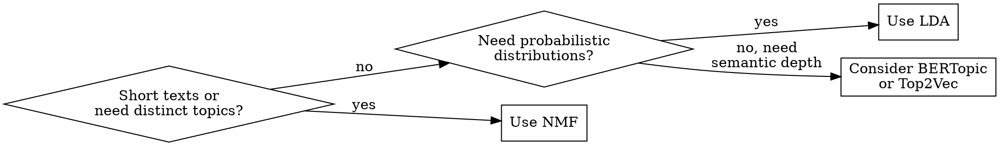

# NMF Topic Modeling

## Overview

Non-negative Matrix Factorization (NMF) decomposes a TF-IDF document-term matrix into two non-negative matrices: W (document-topic) and H (topic-term). The non-negativity constraint produces additive, interpretable topics where each document is a weighted mixture of themes and each theme is a weighted mixture of terms. NMF typically produces more coherent, less overlapping topics than LDA, especially on shorter texts.

## When to Use

- Discovering latent themes across a corpus of documents (posts, comments, articles, reviews)
- Finding hidden connections between seemingly unrelated content areas
- Corpus has 100+ documents with substantive text (not just titles or single sentences)
- Need interpretable, distinct topics with minimal overlap
- Working with TF-IDF weighted text (NMF strength vs LDA's bag-of-words)

**When NOT to use:**
- Corpus has fewer than 50 documents -- too sparse for meaningful factorization
- Documents are extremely short (under 10 words each) without enrichment strategies
- You need probabilistic topic distributions with uncertainty estimates (use LDA instead)
- A single definitive classification is needed (use supervised methods instead)



## Quick Reference

| Parameter | Recommended Starting Value | Notes |
|-----------|---------------------------|-------|
| `max_df` | 0.95 | Remove terms in >95% of docs (corpus-specific stopwords) |
| `min_df` | 2-5 | Remove terms appearing in fewer than N docs |
| `max_features` | 1000-5000 | Cap vocabulary size; start at 2000 |
| `n_components` (k) | 8-15 | Select via coherence scoring; start with 10 |
| `init` | "nndsvda" | Deterministic initialization; most stable |
| `solver` | "mu" (Multiplicative Update) | Use with `beta_loss="kullback-leibler"` for sparse topics |
| `alpha_W` / `alpha_H` | 0.1 | L1/L2 regularization; increase for sparser topics |
| `l1_ratio` | 0.5 | Balance between L1 (sparsity) and L2 (smoothness) |
| `random_state` | 42 | Reproducibility |
| Top N terms per topic | 10-15 | For display and coherence evaluation |

## Workflow

Copy this checklist and track progress:

```
NMF Topic Modeling Progress:
- [ ] Step 1: Validate corpus size and quality
- [ ] Step 2: Preprocess text and build TF-IDF matrix
- [ ] Step 3: Select number of topics (k) via coherence sweep
- [ ] Step 4: Fit NMF model with chosen k
- [ ] Step 5: Extract and label topics (human review)
- [ ] Step 6: Compute document-topic distributions
- [ ] Step 7: Identify cross-topic connections
- [ ] Step 8: Compare with LDA (optional validation)
- [ ] Step 9: Write findings to docs/analysis/05-nmf-topic-modeling.md
```

### Step 1: Validate Corpus Size and Quality

Before running NMF, verify the corpus meets minimum requirements.

**Minimum corpus thresholds:**

| Corpus Size | Recommendation |
|-------------|---------------|
| < 50 documents | Insufficient. Combine with related corpora or use keyword extraction instead. |
| 50-100 documents | Marginal. Reduce k to 3-5 topics. Expect low coherence. Flag results as exploratory. |
| 100-500 documents | Viable. Target 5-10 topics. |
| 500-2000 documents | Good. Target 8-15 topics. |
| 2000+ documents | Excellent. Can support 15-25+ topics if coherence holds. |

**Quality checks:**
- Average document length should be 20+ words after preprocessing
- Remove empty documents, duplicates, and boilerplate-only entries
- If >50% of documents are under 10 words, consider concatenation strategies (e.g., group by author, thread, or time window)

**If corpus is insufficient:** Report this finding in the output document rather than forcing analysis on inadequate data. State the corpus size, why it is insufficient, and what minimum size would be needed.

### Step 2: Preprocess Text and Build TF-IDF Matrix

```python
from sklearn.feature_extraction.text import TfidfVectorizer
import re

def preprocess_text(text):
    """Clean text for NMF. Extend stopwords iteratively."""
    text = text.lower()
    text = re.sub(r'http\S+|www\.\S+', '', text)  # Remove URLs
    text = re.sub(r'[^a-zA-Z\s]', ' ', text)       # Keep only letters
    text = re.sub(r'\s+', ' ', text).strip()         # Normalize whitespace
    return text

documents = [preprocess_text(doc) for doc in raw_documents]

# Start with sklearn's English stopwords, then iterate
custom_stopwords = list(TfidfVectorizer(stop_words='english').get_stop_words())
# Add domain-specific stopwords discovered during topic review:
# custom_stopwords += ['reddit', 'post', 'comment', 'edit', 'deleted']

vectorizer = TfidfVectorizer(
    max_df=0.95,       # Ignore terms in >95% of docs
    min_df=2,          # Ignore terms in <2 docs
    max_features=2000, # Vocabulary cap
    stop_words=custom_stopwords,
    ngram_range=(1, 2) # Unigrams + bigrams for richer topics
)
tfidf_matrix = vectorizer.fit_transform(documents)
feature_names = vectorizer.get_feature_names_out()
```

**Iterative stopword refinement:** After an initial NMF run, inspect top terms per topic. If generic terms dominate multiple topics (e.g., "thing", "people", "really"), add them to `custom_stopwords` and refit.

### Step 3: Select Number of Topics (k) via Coherence Sweep

Do NOT choose k arbitrarily. Sweep a range and score each.

```python
from sklearn.decomposition import NMF
import numpy as np

def compute_coherence_umass(H, tfidf_matrix, top_n=10):
    """UMass coherence: co-occurrence of top words within documents.
    More negative = less coherent. Closer to 0 = better."""
    coherence_scores = []
    binary_matrix = (tfidf_matrix > 0).astype(int)
    doc_count = binary_matrix.shape[0]

    for topic_idx in range(H.shape[0]):
        top_word_indices = H[topic_idx].argsort()[-top_n:][::-1]
        topic_coherence = 0
        pair_count = 0
        for i in range(1, len(top_word_indices)):
            for j in range(i):
                w_i = top_word_indices[i]
                w_j = top_word_indices[j]
                co_doc_count = binary_matrix[:, w_i].multiply(
                    binary_matrix[:, w_j]
                ).sum()
                w_j_count = binary_matrix[:, w_j].sum()
                if w_j_count > 0:
                    topic_coherence += np.log(
                        (co_doc_count + 1) / w_j_count
                    )
                    pair_count += 1
        if pair_count > 0:
            coherence_scores.append(topic_coherence / pair_count)
    return np.mean(coherence_scores)

# Sweep k values
k_range = range(3, 21)
coherence_results = []

for k in k_range:
    model = NMF(n_components=k, init='nndsvda', random_state=42,
                max_iter=500)
    W = model.fit_transform(tfidf_matrix)
    H = model.components_
    score = compute_coherence_umass(H, tfidf_matrix)
    reconstruction_err = model.reconstruction_err_
    coherence_results.append({
        'k': k, 'coherence': score, 'recon_error': reconstruction_err
    })
    print(f"k={k:2d}  coherence={score:.4f}  recon_error={reconstruction_err:.2f}")

# Select k: use elbow method on coherence curve
# Look for where coherence plateaus or drops
```

**Selecting k from results:**
1. Plot coherence vs. k. Look for the "elbow" -- the point after which coherence stops improving meaningfully.
2. Cross-check with reconstruction error (should decrease monotonically; large jumps indicate instability).
3. Prefer the smaller k when two values produce similar coherence (parsimony).
4. If coherence is uniformly poor (all scores below -2.0 for UMass), the corpus may lack thematic structure. Report this finding.

### Step 4: Fit Final NMF Model

```python
k_chosen = 10  # Replace with value from Step 3

nmf_model = NMF(
    n_components=k_chosen,
    init='nndsvda',
    random_state=42,
    max_iter=500,
    alpha_W=0.1,
    alpha_H=0.1,
    l1_ratio=0.5
)
W = nmf_model.fit_transform(tfidf_matrix)  # Document-topic matrix
H = nmf_model.components_                   # Topic-term matrix
```

### Step 5: Extract and Label Topics -- Human Review Required

```python
def display_topics(H, feature_names, top_n=15):
    """Display top terms per topic for human labeling."""
    topics = []
    for topic_idx, topic_vec in enumerate(H):
        top_indices = topic_vec.argsort()[-top_n:][::-1]
        top_terms = [(feature_names[i], topic_vec[i]) for i in top_indices]
        topics.append(top_terms)
        terms_str = ', '.join(
            f"{term} ({weight:.3f})" for term, weight in top_terms
        )
        print(f"Topic {topic_idx}: {terms_str}")
    return topics

topics = display_topics(H, feature_names)
```

**Labeling guidelines:**
- Assign a short descriptive label based on the top 5-7 terms (e.g., "Gaming Hardware" not "Topic 3")
- If top terms are incoherent (no clear theme), label as "Incoherent -- Review" and note in report
- Do NOT force a label onto an incoherent topic. This is a signal, not a failure.
- Topics with very similar top terms may indicate k is too high -- consider reducing k

### Step 6: Compute Document-Topic Distributions

```python
import pandas as pd

# W matrix rows = documents, columns = topic weights
topic_labels = [f"Topic_{i}" for i in range(k_chosen)]
# Replace with human labels after Step 5:
# topic_labels = ["Gaming", "Tech", "Politics", ...]

doc_topic_df = pd.DataFrame(W, columns=topic_labels)
doc_topic_df['dominant_topic'] = doc_topic_df.idxmax(axis=1)
doc_topic_df['dominant_weight'] = doc_topic_df.max(axis=1)

# Documents with low dominant weight are multi-topic or off-topic
low_confidence = doc_topic_df[doc_topic_df['dominant_weight'] < 0.1]
print(f"Documents with weak topic assignment: {len(low_confidence)}/{len(doc_topic_df)}")
```

**Interpreting weights:**
- Dominant weight > 0.5: Strongly associated with one topic
- Dominant weight 0.2-0.5: Moderate association, likely multi-topic
- Dominant weight < 0.1: Weak assignment -- document may not fit any topic well

### Step 7: Identify Cross-Topic Connections

```python
# Topic co-occurrence: which topics frequently appear together in documents
topic_correlation = doc_topic_df[topic_labels].corr()

# Find documents that bridge multiple topics (high weight in 2+ topics)
def find_bridge_documents(W, threshold=0.15):
    """Documents with significant weight in multiple topics."""
    bridges = []
    for doc_idx, row in enumerate(W):
        significant = [(i, w) for i, w in enumerate(row) if w > threshold]
        if len(significant) >= 2:
            bridges.append({
                'doc_index': doc_idx,
                'topics': significant,
                'topic_count': len(significant)
            })
    return sorted(bridges, key=lambda x: x['topic_count'], reverse=True)

bridge_docs = find_bridge_documents(W)
print(f"Bridge documents (span 2+ topics): {len(bridge_docs)}/{len(W)}")
```

Cross-topic connections reveal the most interesting structural insights -- where seemingly separate themes intersect within the same documents.

### Step 8: Compare with LDA (Optional Validation)

```python
from sklearn.decomposition import LatentDirichletAllocation
from sklearn.feature_extraction.text import CountVectorizer

# LDA requires raw counts, not TF-IDF
count_vectorizer = CountVectorizer(
    max_df=0.95, min_df=2, max_features=2000,
    stop_words=custom_stopwords
)
count_matrix = count_vectorizer.fit_transform(documents)

lda_model = LatentDirichletAllocation(
    n_components=k_chosen, random_state=42, max_iter=50
)
lda_W = lda_model.fit_transform(count_matrix)

# Compare top terms -- do NMF and LDA agree on major themes?
# Agreement on core topics strengthens confidence in those themes.
# Divergence highlights topics that may be artifacts of one method.
```

### Step 9: Write Report

Write all findings to `docs/analysis/05-nmf-topic-modeling.md`. See the report template below.

## Report Output Template

The final report MUST be written to `docs/analysis/05-nmf-topic-modeling.md` with this structure:

```markdown
# NMF Topic Modeling Analysis

## Methodology
- Corpus size: [N documents, average length]
- Preprocessing: [stopword list, ngram range, max_features]
- k selection: [range swept, coherence metric used, chosen k and why]
- NMF parameters: [init, solver, regularization]

## Coherence Scores
| k | Coherence (UMass) | Reconstruction Error |
|---|-------------------|---------------------|
| ... | ... | ... |

Selected k = [N] based on [elbow/plateau/domain judgment].

## Discovered Topics

### Topic 0: [Human Label]
**Top terms:** term1 (0.xxx), term2 (0.xxx), ...
**Coherence:** [topic-level score]
**Document count (dominant):** [N]
**Interpretation:** [1-2 sentence description]

[Repeat for each topic]

### Incoherent Topics
[List any topics that could not be meaningfully labeled, with top terms]

## Document-Topic Distributions
- Documents with strong single-topic assignment (>0.5): [N] ([%])
- Multi-topic documents (2+ topics >0.15): [N] ([%])
- Weakly assigned documents (<0.1 max weight): [N] ([%])

## Cross-Topic Connections
[Table or description of which topics co-occur, with example bridge documents]

## Topic Correlation Matrix
[Heatmap description or table of pairwise topic correlations]

## LDA Comparison (if performed)
[Which topics agreed across methods, which diverged]

## Limitations and Caveats
- [Corpus size limitations if any]
- [Incoherent topics that require further investigation]
- [Topics are statistical clusters, not definitive categories]
- [Results should be validated with domain expertise]
```

## Common Mistakes

| Mistake | Fix |
|---------|-----|
| Choosing k = 10 because "it feels right" | Sweep k range with coherence scoring. Use data, not intuition. |
| Skipping stopword iteration | Run NMF once, inspect topics, add noisy terms to stoplist, refit. Repeat. |
| Treating topics as definitive categories | Topics are statistical patterns. Always caveat that they require human validation. |
| Over-interpreting small topic weights | A document with weight 0.02 in a topic is NOT meaningfully associated. Use thresholds (>0.1 minimum). |
| Ignoring incoherent topics | Report them honestly. Incoherent topics signal k may be too high, or the corpus lacks structure in that region. |
| Using raw counts instead of TF-IDF for NMF | NMF works best with TF-IDF. Raw counts favor LDA. This is a fundamental method distinction. |
| Running on tiny corpus and trusting results | Below 50 docs, results are noise. Below 100, flag as exploratory. |
| Not comparing NMF with LDA | Cross-method agreement strengthens findings. Divergence flags fragile topics. |
| Labeling topics without reading example documents | Always read 5-10 documents from each topic to validate the label makes sense in context. |

## Red Flags -- Stop and Reassess

- All topics share the same dominant terms -- preprocessing failure (increase `max_df`, add stopwords)
- Coherence scores uniformly poor across all k values -- corpus may lack thematic structure
- Most documents have dominant weight < 0.1 -- topics do not capture document content
- Single topic absorbs >60% of documents -- either k is too low or corpus is thematically uniform
- Reconstruction error does NOT decrease as k increases -- model fitting problem (check data sparsity)

## Boundaries

**This skill SHOULD produce:**
- 8-10 latent themes (adjustable based on coherence)
- Coherence scores for each k value tested
- Document-topic distribution matrix
- Cross-topic connection analysis
- Human-reviewed topic labels
- Written report at `docs/analysis/05-nmf-topic-modeling.md`

**This skill should NOT:**
- Claim topics represent "true" categories without human validation
- Use NMF results as sole basis for document classification
- Skip human review of topic interpretability
- Force labels onto incoherent topics
- Treat a single NMF run as definitive (iterate stopwords, compare with LDA)
