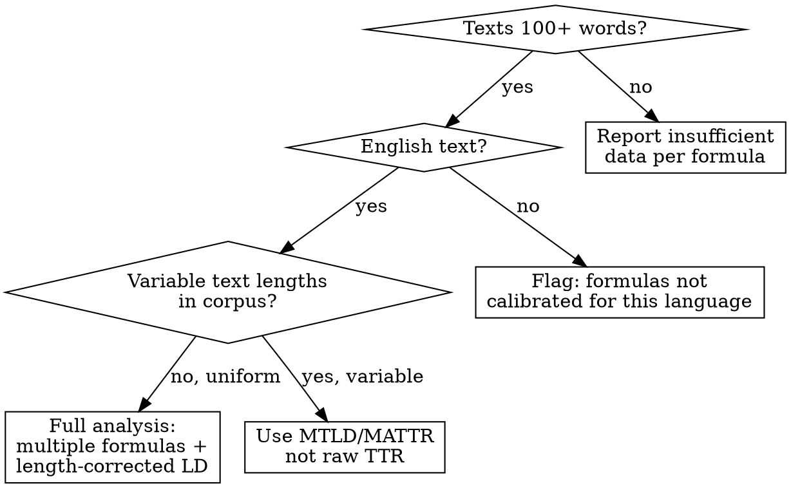
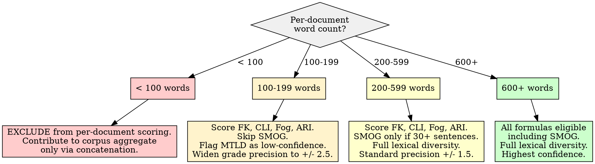

# Readability and Lexical Diversity Metrics

## Overview

Compute quantitative complexity targets from a text corpus by measuring readability (grade-level estimates from multiple formulas) and lexical diversity (vocabulary richness corrected for text length). The core principle: **no single readability formula or diversity index is sufficient -- use multiple measures, report the range, and correct for text length before comparing.** Readability formulas estimate the US grade level required to comprehend text; lexical diversity indices estimate how varied the vocabulary is. Both translate directly into measurable LLM prompt constraints (e.g., "target FK grade 12-14, MTLD above 80, average sentence length 18-22 words").

**Why multiple formulas:** Flesch-Kincaid and Coleman-Liau can diverge by 2-4 grade levels on the same text because they weight different proxies for complexity (syllables vs. characters, sentence length vs. word length). Reporting only one formula hides this disagreement. The consensus range across formulas is the reliable signal.

## When to Use

- Measuring the complexity profile of a text corpus before voice replication
- Establishing quantitative readability targets for LLM prompt constraints
- Comparing complexity across documents, authors, or time periods within a corpus
- Computing lexical diversity with length-corrected measures (MTLD, MATTR)
- Setting a complexity ceiling and floor for generated text
- Feeding readability/diversity metrics into an archetype or persona construction pipeline

**When NOT to use:**

- Texts shorter than 100 words (readability formulas are unreliable; see Insufficient Data Handling)
- Comparing readability scores across languages without recalibration (formulas are English-calibrated)
- Equating readability with writing quality (low grade level is not "bad"; high grade level is not "good")
- Claiming readability scores measure actual reader comprehension (they estimate surface complexity)
- Using raw TTR on variable-length texts without correction (TTR decreases mechanically as text length increases)



## Quick Reference

### Readability Formulas

| Formula | What It Measures | Minimum Text | Key Sensitivity | Python (`textstat`) |
|---------|-----------------|-------------|-----------------|---------------------|
| **Flesch-Kincaid Grade Level** | Syllables per word + words per sentence | 100 words | Sentence length, polysyllabic words | `textstat.flesch_kincaid_grade(text)` |
| **Coleman-Liau Index** | Characters per word + sentences per 100 words | 100 words | Word length in characters (not syllables) | `textstat.coleman_liau_index(text)` |
| **Gunning Fog Index** | Complex words (3+ syllables) + sentence length | 100 words | Polysyllabic word frequency | `textstat.gunning_fog(text)` |
| **SMOG Index** | Polysyllabic words (3+ syllables) | 30 sentences (~600 words) | Polysyllabic density; needs 30-sentence sample | `textstat.smog_index(text)` |
| **Automated Readability Index (ARI)** | Characters per word + words per sentence | 100 words | Character counts (fast, no syllable parsing) | `textstat.automated_readability_index(text)` |

### Lexical Diversity Indices

| Index | What It Measures | Length-Sensitive? | Correction Method | Python Library |
|-------|-----------------|-------------------|-------------------|----------------|
| **TTR (Type-Token Ratio)** | Unique words / total words | YES -- decreases with length | Do not compare across different-length texts | `len(set(tokens)) / len(tokens)` |
| **MTLD** | Average consecutive words maintaining TTR >= 0.72 | NO (r = -0.02 with length) | Built-in; robust to length | `lexical_diversity.mtld(tokens)` |
| **MATTR** | Moving-average TTR across fixed windows (default 50 tokens) | Minimal (window-based) | Fixed window normalizes length | `lexical_diversity.mattr(tokens, window=50)` |
| **HD-D** | Hypergeometric distribution of word sampling | Minimal | Probability-based; sample-size aware | `lexical_diversity.hdd(tokens)` |
| **Hapax Legomena Ratio** | Words appearing exactly once / total words | YES -- decreases with length | Report alongside MTLD/MATTR, not alone | `sum(1 for w,c in counts.items() if c==1) / len(tokens)` |

### Grade Level Interpretation

| Grade Level | Audience | Example Register |
|-------------|----------|-----------------|
| 5-6 | General public, plain language | Newspaper articles, patient information |
| 7-8 | Educated general audience | Popular science, quality journalism |
| 9-10 | High school level | Magazine features, opinion columns |
| 11-12 | College-ready | Specialized journalism, policy briefs |
| 13-14 | Undergraduate level | Academic introductions, technical blogs |
| 15-16 | Graduate/professional | Academic papers, legal documents |
| 17+ | Specialist | Dense academic prose, statutory language |

### Minimum Text Length Per Formula

| Formula | Hard Minimum | Recommended Minimum | Below Minimum Action |
|---------|-------------|--------------------|--------------------|
| Flesch-Kincaid | 100 words | 200+ words | Exclude from per-document scoring; include only in corpus aggregate |
| Coleman-Liau | 100 words | 200+ words | Same |
| Gunning Fog | 100 words | 200+ words | Same |
| SMOG | 30 sentences | 600+ words | Skip SMOG for this text; use other formulas |
| ARI | 100 words | 200+ words | Same |
| TTR | 50 tokens | Equal-length samples only | Use MTLD or MATTR instead |
| MTLD | 100 tokens | 200+ tokens | Flag as low-confidence |
| MATTR | 50 tokens (= window size) | 200+ tokens | Flag as low-confidence |

## Workflow

Copy this checklist and track progress:

```
Readability & Lexical Diversity Analysis Progress:
- [ ] Step 1: Validate corpus suitability (text lengths, language, count)
- [ ] Step 2: Compute per-document readability scores (all five formulas)
- [ ] Step 3: Compute per-document lexical diversity (MTLD, MATTR, hapax)
- [ ] Step 4: Compute corpus-level aggregate statistics
- [ ] Step 5: Analyze formula agreement and divergence
- [ ] Step 6: Translate metrics into LLM prompt constraints
- [ ] Step 7: Write findings to docs/analysis/19-readability-lexical-diversity.md
```

### Step 1: Validate Corpus Suitability

Before computing metrics, assess every document against minimum thresholds.

**Suitability checks:**

| Check | Pass Condition | Fail Action |
|-------|---------------|-------------|
| **Language** | Predominantly English | Non-English text invalidates all formula calibrations. Exclude or flag. |
| **Corpus size** | 30+ documents | Below 30, corpus-level aggregates are unreliable. Report per-document only. |
| **Word count per document** | 100+ words | Below 100: exclude from per-document scoring, include only in corpus aggregate via concatenation. |
| **Sentence count per document** | 3+ sentences | Single-sentence texts produce meaningless readability scores. Exclude or concatenate. |
| **Text length variance** | Track coefficient of variation | If CV > 1.0 (highly variable lengths), raw TTR comparisons are invalid. Use MTLD/MATTR exclusively. |

```python
import textstat
import re
from collections import Counter

def assess_document_suitability(text):
    """Assess whether a document meets minimum thresholds for each formula."""
    words = text.split()
    sentences = [s.strip() for s in re.split(r'[.!?]+', text) if s.strip()]
    word_count = len(words)
    sentence_count = len(sentences)

    return {
        'word_count': word_count,
        'sentence_count': sentence_count,
        'fk_eligible': word_count >= 100,
        'cli_eligible': word_count >= 100,
        'fog_eligible': word_count >= 100,
        'smog_eligible': sentence_count >= 30,
        'ari_eligible': word_count >= 100,
        'mtld_eligible': word_count >= 100,
        'mattr_eligible': word_count >= 50,
    }
```

**If most documents fail suitability:** Consider concatenating short documents into larger units (by author, by thread, by time window) before scoring. Document the concatenation strategy and note that scores reflect the aggregate unit, not individual documents.

### Step 2: Compute Per-Document Readability Scores

Score every eligible document with all five formulas. Report all five -- never choose one formula and discard the rest.

```python
import textstat
import numpy as np

def compute_readability(text, suitability):
    """Compute all readability scores for an eligible document.
    Returns None for formulas where the document is below minimum."""
    scores = {}

    if suitability['fk_eligible']:
        scores['flesch_kincaid'] = textstat.flesch_kincaid_grade(text)
    if suitability['cli_eligible']:
        scores['coleman_liau'] = textstat.coleman_liau_index(text)
    if suitability['fog_eligible']:
        scores['gunning_fog'] = textstat.gunning_fog(text)
    if suitability['smog_eligible']:
        scores['smog'] = textstat.smog_index(text)
    if suitability['ari_eligible']:
        scores['ari'] = textstat.automated_readability_index(text)

    # Structural features (always computable if 1+ sentence)
    words = text.split()
    sentences = [s.strip() for s in re.split(r'[.!?]+', text) if s.strip()]
    scores['avg_sentence_length'] = len(words) / max(len(sentences), 1)
    scores['avg_word_length_chars'] = np.mean([len(w) for w in words])
    scores['syllables_per_word'] = textstat.avg_syllables_per_word(text)

    # Consensus grade level (median of available formula scores)
    grade_scores = [v for k, v in scores.items()
                    if k in ('flesch_kincaid', 'coleman_liau', 'gunning_fog',
                             'smog', 'ari') and v is not None]
    if grade_scores:
        scores['consensus_grade'] = np.median(grade_scores)
        scores['grade_range'] = (min(grade_scores), max(grade_scores))
        scores['grade_spread'] = max(grade_scores) - min(grade_scores)

    return scores
```

**Critical:** The `consensus_grade` (median across formulas) and `grade_range` (min-max spread) are the primary outputs. Individual formula scores are evidence; the range is the finding.

### Step 3: Compute Per-Document Lexical Diversity

Use length-corrected measures (MTLD, MATTR) as primary indices. Report raw TTR only as a supplementary reference, never as a standalone comparison across different-length texts.

```python
from collections import Counter

def compute_lexical_diversity(text, suitability):
    """Compute lexical diversity with length correction.
    MTLD and MATTR are primary; TTR and hapax are supplementary."""
    words = text.lower().split()
    word_count = len(words)
    scores = {'token_count': word_count}

    if word_count == 0:
        return scores

    # Raw TTR -- supplementary only, do NOT compare across different lengths
    unique_words = set(words)
    scores['ttr_raw'] = len(unique_words) / word_count
    scores['type_count'] = len(unique_words)

    # Hapax legomena (words appearing exactly once)
    freq = Counter(words)
    hapax_count = sum(1 for w, c in freq.items() if c == 1)
    scores['hapax_count'] = hapax_count
    scores['hapax_ratio'] = hapax_count / word_count

    # MTLD -- primary length-corrected measure
    if suitability['mtld_eligible']:
        try:
            from lexical_diversity import lex_div as ld
            scores['mtld'] = ld.mtld(words)
        except ImportError:
            scores['mtld'] = _compute_mtld_fallback(words)

    # MATTR -- moving-average TTR (window=50 tokens)
    if suitability['mattr_eligible']:
        scores['mattr_50'] = _compute_mattr(words, window=50)

    return scores

def _compute_mattr(tokens, window=50):
    """Moving-Average Type-Token Ratio.
    Calculates TTR for each sliding window and averages."""
    if len(tokens) < window:
        return len(set(tokens)) / len(tokens)  # fall back to TTR
    ttrs = []
    for i in range(len(tokens) - window + 1):
        window_tokens = tokens[i:i + window]
        ttrs.append(len(set(window_tokens)) / window)
    return np.mean(ttrs)

def _compute_mtld_fallback(tokens, threshold=0.72):
    """MTLD: average segment length before TTR drops below threshold.
    Runs forward and backward, averages both passes."""
    def _one_pass(tokens):
        factor_count = 0
        factor_length = 0
        current_start = 0
        for i in range(1, len(tokens) + 1):
            segment = tokens[current_start:i]
            ttr = len(set(segment)) / len(segment)
            if ttr <= threshold:
                factor_count += 1
                factor_length += len(segment)
                current_start = i
        # Handle partial factor at end
        if current_start < len(tokens):
            remaining = tokens[current_start:]
            remaining_ttr = len(set(remaining)) / len(remaining)
            if remaining_ttr < 1.0:
                partial = (1.0 - remaining_ttr) / (1.0 - threshold)
                factor_count += partial
                factor_length += len(remaining)
        if factor_count == 0:
            return len(tokens)  # TTR never dropped below threshold
        return factor_length / factor_count

    forward = _one_pass(tokens)
    backward = _one_pass(list(reversed(tokens)))
    return (forward + backward) / 2
```

**Why MTLD is primary:** McCarthy and Jarvis (2010) found MTLD has negligible correlation with text length (r = -0.02), while TTR correlates strongly (r = -0.70 to -0.90). MTLD reflects how many consecutive words a writer sustains before repeating vocabulary. Higher MTLD = more diverse vocabulary. Typical ranges: 50-80 (moderate), 80-120 (high), 120+ (very high).

### Step 4: Compute Corpus-Level Aggregate Statistics

Aggregate per-document scores into corpus-level distributions.

```python
import pandas as pd

def compute_corpus_aggregates(doc_scores_df):
    """Compute corpus-level statistics from per-document scores."""
    metrics = ['flesch_kincaid', 'coleman_liau', 'gunning_fog', 'smog',
               'ari', 'consensus_grade', 'avg_sentence_length',
               'mtld', 'mattr_50', 'ttr_raw', 'hapax_ratio']

    aggregates = {}
    for metric in metrics:
        if metric not in doc_scores_df.columns:
            continue
        col = doc_scores_df[metric].dropna()
        if len(col) < 2:
            continue
        aggregates[metric] = {
            'mean': col.mean(),
            'median': col.median(),
            'std': col.std(),
            'min': col.min(),
            'max': col.max(),
            'p25': col.quantile(0.25),
            'p75': col.quantile(0.75),
            'n_scored': len(col),
        }

    return aggregates
```

### Step 5: Analyze Formula Agreement and Divergence

This step answers the critical question: do the formulas agree, and where do they disagree?

**Agreement analysis:**

1. For each document, compute the spread (max grade - min grade across formulas)
2. Compute the corpus-level median spread
3. Flag documents where spread exceeds 4 grade levels -- these often contain unusual structures (very long sentences with simple words, or short sentences with technical jargon)

**Interpreting divergence:**

| Divergence Pattern | Cause | Implication |
|-------------------|-------|-------------|
| FK high, CLI low | Long sentences with short words (syllable-heavy but character-light) | Report the range, not one formula |
| CLI high, FK low | Short sentences with long technical terms (character-heavy but sentence structure is simple) | Coleman-Liau overweights jargon |
| Fog high, others low | Many polysyllabic words that are common (e.g., "important", "understanding") | Fog penalizes syllable count regardless of word familiarity |
| SMOG higher than FK | Dense polysyllabic vocabulary throughout | SMOG was designed for health materials; it reads polysyllabic density more strictly |
| All formulas agree within 2 grades | Text has consistent complexity across all proxies | High-confidence consensus |

### Step 6: Translate Metrics Into LLM Prompt Constraints

This is the critical output step: converting measured complexity into actionable constraints for text generation prompts.

**Constraint mapping table:**

| Metric | Measured Value (example) | LLM Prompt Constraint |
|--------|------------------------|----------------------|
| Consensus grade level | 12.5 (range: 11-14) | "Write at a late high school to early college reading level (FK grade 11-14)" |
| Average sentence length | 19.3 words | "Target 17-22 words per sentence on average; vary between 8 and 35" |
| Average word length | 5.1 characters | "Prefer words of 4-6 characters; use longer technical terms sparingly" |
| MTLD | 94.2 | "Maintain high vocabulary diversity; avoid repeating the same word within 5 sentences unless it is a key term" |
| MATTR (window=50) | 0.78 | "Within any 50-word span, use at least 35-40 unique words" |
| Hapax ratio | 0.52 | "Approximately half of all words used should appear only once in the text" |
| Syllables per word | 1.62 | "Mix monosyllabic and polysyllabic words; average around 1.5-1.7 syllables per word" |

**Constraint output format** (embed in prompts):

```markdown
## Complexity Constraints
- **Grade level:** Target FK grade [X-Y] (consensus range from corpus analysis)
- **Sentence length:** Average [N-M] words per sentence; vary between [min] and [max]
- **Vocabulary diversity:** MTLD target [N]+; avoid repeating non-function words within [N] sentences
- **Word complexity:** Average [N] syllables per word; ~[N]% of words should be 3+ syllables
- **Lexical range:** Approximately [N]% of words should be unique (hapax target)
```

**Translating ranges, not points:** Always convert measured metrics into target ranges, not exact values. If measured FK = 12.3, the constraint should be "FK grade 11-14" (not "FK grade 12.3"). Readability scores have an inherent precision of approximately +/- 1.5 grade levels on texts of 200+ words.

### Step 7: Write the Report

Write all findings to `docs/analysis/19-readability-lexical-diversity.md`.

## Report Output Template

The final report MUST be written to `docs/analysis/19-readability-lexical-diversity.md` with this structure:

```markdown
# Readability and Lexical Diversity Analysis

## Methodology
- **Corpus:** [N documents scored, N excluded for insufficient length, total word count]
- **Readability formulas:** Flesch-Kincaid, Coleman-Liau, Gunning Fog, SMOG, ARI (via textstat)
- **Lexical diversity:** MTLD, MATTR (window=50), raw TTR (supplementary), hapax legomena ratio
- **Minimum thresholds:** 100 words per document for readability, 30 sentences for SMOG, 100 tokens for MTLD
- **Aggregation:** Per-document scoring with corpus-level median, IQR, and range

## Corpus Suitability Assessment
- **Total documents:** [N]
- **Documents meeting 100-word minimum:** [N] ([%])
- **Documents meeting 30-sentence minimum (SMOG):** [N] ([%])
- **Language:** [English / mixed]
- **Text length distribution:** mean [N] words, median [N], std [N], range [min-max]
- **Text length CV:** [X.XX] [uniform / moderate / highly variable]
- **Overall suitability:** [suitable / suitable with caveats / unsuitable]

## Readability Scores

### Per-Formula Corpus Statistics
| Formula | Mean | Median | Std | P25 | P75 | Min | Max | N Scored |
|---------|------|--------|-----|-----|-----|-----|-----|----------|
| Flesch-Kincaid | | | | | | | | |
| Coleman-Liau | | | | | | | | |
| Gunning Fog | | | | | | | | |
| SMOG | | | | | | | | |
| ARI | | | | | | | | |

### Consensus Grade Level
- **Median consensus grade:** [X.X] (IQR: [X.X - X.X])
- **Corpus grade range:** [X - X] (min to max of per-document consensus)
- **Interpretation:** [audience level description]

### Formula Agreement Analysis
- **Median per-document spread:** [X.X] grade levels
- **Documents with spread > 4 grades:** [N] ([%])
- **Most divergent formula pair:** [Formula A] vs [Formula B] (mean difference: [X.X])
- **Interpretation:** [why the formulas disagree for this corpus]

### Structural Metrics
| Metric | Mean | Median | Std | P25 | P75 |
|--------|------|--------|-----|-----|-----|
| Avg sentence length (words) | | | | | |
| Avg word length (characters) | | | | | |
| Syllables per word | | | | | |

## Lexical Diversity

### Corpus Statistics
| Index | Mean | Median | Std | P25 | P75 | N Scored |
|-------|------|--------|-----|-----|-----|----------|
| MTLD | | | | | | |
| MATTR (w=50) | | | | | | |
| TTR (raw, supplementary) | | | | | | |
| Hapax ratio | | | | | | |

### Length Correction Verification
- **TTR-length correlation:** r = [X.XX] (should be strongly negative)
- **MTLD-length correlation:** r = [X.XX] (should be near zero)
- **MATTR-length correlation:** r = [X.XX] (should be near zero)
- **Conclusion:** [MTLD/MATTR confirmed length-independent / TTR confirmed length-dependent]

## LLM Prompt Constraints (Derived)

### Complexity Ceiling and Floor
| Metric | Floor (P25) | Target (Median) | Ceiling (P75) | Constraint |
|--------|-------------|-----------------|---------------|------------|
| Grade level | | | | "Write at FK grade [X-Y]" |
| Sentence length | | | | "Average [X-Y] words per sentence" |
| Vocabulary diversity (MTLD) | | | | "Maintain MTLD of [X]+" |
| MATTR | | | | "In any 50-word span, [X-Y]% unique words" |
| Word complexity | | | | "Average [X-Y] syllables per word" |

### Full Constraint Block (Copy-Paste Ready)
[Pre-formatted constraint block for direct embedding in LLM prompts]

## Limitations and Caveats
- Readability formulas estimate surface complexity, not comprehension difficulty
- Grade levels are approximate (+/- 1.5 grades on 200+ word texts)
- Different formulas weight different proxies; the consensus range is the reliable signal
- Lexical diversity scores reflect vocabulary range, not vocabulary quality or appropriateness
- SMOG requires 30+ sentences; documents below this threshold were excluded from SMOG scoring
- [Corpus-specific limitations from Step 1]
- Short texts (< 200 words) produce less stable scores; [N] documents were in this range
- These metrics do NOT measure: clarity, coherence, accuracy, persuasiveness, or engagement

## References
- Flesch, R. (1948). A new readability yardstick. *Journal of Applied Psychology*, 32(3), 221-233.
- Kincaid, J.P. et al. (1975). Derivation of new readability formulas for Navy enlisted personnel. (Research Branch Report 8-75). Naval Technical Training Command.
- Coleman, M. & Liau, T.L. (1975). A computer readability formula designed for machine scoring. *Journal of Applied Psychology*, 60(2), 283-284.
- Gunning, R. (1952). *The Technique of Clear Writing*. McGraw-Hill.
- McLaughlin, G.H. (1969). SMOG grading: A new readability formula. *Journal of Reading*, 12(8), 639-646.
- McCarthy, P.M. & Jarvis, S. (2010). MTLD, vocd-D, and HD-D: A validation study of sophisticated approaches to lexical diversity assessment. *Behavior Research Methods*, 42(2), 381-392.
- Covington, M.A. & McFall, J.D. (2010). Cutting the Gordian knot: The moving-average type-token ratio (MATTR). *Journal of Quantitative Linguistics*, 17(2), 94-100.
- textstat Python library: https://github.com/textstat/textstat
- lexical_diversity Python library: https://github.com/kristopherkyle/lexical_diversity
- TAALED: https://github.com/LCR-ADS-Lab/TAALED
```

## Good Patterns

- **Use multiple readability formulas and report the range** -- no single formula captures complexity; the consensus (median) and spread across FK, CLI, Fog, SMOG, and ARI is the reliable signal
- **Correct TTR for text length** using MTLD or MATTR -- raw TTR is mechanically coupled to text length and cannot be compared across documents of different sizes
- **Compute per-document AND corpus-level metrics** -- per-document scores show variance; corpus-level aggregates set the constraint targets
- **Report grade levels as ranges, not points** -- "FK 11-14" is honest; "FK 12.3" implies false precision
- **Translate every metric into a concrete LLM prompt constraint** -- the analysis is only useful if it produces a copy-paste-ready constraint block
- **Verify length correction** by computing TTR-length and MTLD-length correlations -- confirm that MTLD/MATTR are indeed length-independent for your corpus
- **Establish both ceiling and floor** -- complexity constraints need an upper and lower bound, not just a target
- **Report the number of documents excluded** and why -- transparency about data loss from minimum thresholds

## Anti-Patterns

| Anti-Pattern | Why It Fails | Instead |
|--------------|-------------|---------|
| Using a single readability formula | Formulas diverge by 2-4 grades on the same text; one formula hides disagreement | Run all five; report consensus median and range |
| Computing raw TTR on variable-length texts | TTR decreases mechanically with text length (r = -0.70 to -0.90); longer texts always appear "less diverse" | Use MTLD (length-independent) or MATTR (window-normalized) |
| Treating grade levels as precise measurements | FK 12.3 vs 12.5 is noise, not signal; formulas have ~1.5 grade precision | Report as ranges (e.g., "grade 11-14") |
| Ignoring that short texts produce unreliable scores | Below 100 words, sentence and word sampling is too sparse; one long sentence skews the entire score | Enforce minimum thresholds per formula; exclude or concatenate short texts |
| Conflating readability with quality | Low grade level serves different audiences; high grade level may indicate jargon, not sophistication | Frame as "complexity targeting" not "quality assessment" |
| Reporting only corpus averages | Averages hide bimodal distributions and outliers | Report median, IQR, min, max, and per-document distributions |
| Comparing TTR across authors with different text volumes | Author with 500 words will have higher TTR than author with 5,000 words regardless of actual diversity | Use MTLD for cross-author comparison |
| Skipping SMOG when texts have < 30 sentences | SMOG's formula requires 30 sentences; below this, the polysyllabic sampling is unreliable | Report SMOG as N/A for short texts; use the other four formulas |
| Using readability as sole voice fingerprint | Readability measures surface structure only; two very different writers can have the same FK grade | Combine with sentiment, personality, and stylistic metrics |

## Boundaries

**This skill SHOULD produce:**
- Per-document readability scores from all five formulas with eligibility tracking
- Per-document lexical diversity scores (MTLD, MATTR, hapax ratio) with length correction
- Corpus-level aggregate statistics (median, IQR, range) for all metrics
- Formula agreement analysis (median spread, divergent pairs)
- Complexity ceiling and floor (P25 and P75 of consensus grade)
- A copy-paste-ready LLM prompt constraint block derived from the metrics
- Length-correction verification (TTR-length vs MTLD-length correlations)
- Written report at `docs/analysis/19-readability-lexical-diversity.md`

**This skill should NOT:**
- Treat grade levels as exact (always report ranges with +/- 1.5 grade precision)
- Compare readability across languages without noting that formulas are English-calibrated
- Claim readability scores measure actual reader comprehension (they estimate surface complexity)
- Use metrics on texts shorter than 100 words without flagging unreliability
- Present raw TTR as a valid cross-document comparison when text lengths differ
- Equate high readability scores with good writing or low scores with bad writing
- Use a single formula and discard the others
- Skip the constraint translation step (metrics without actionable constraints are incomplete)
- Produce a report without a corpus suitability assessment

## Insufficient Data Handling



| Condition | Action |
|-----------|--------|
| **Document < 100 words** | Exclude from per-document readability scoring. These texts contribute to corpus aggregates only if concatenated into larger units (by author, thread, or time window). Report the number excluded. |
| **Document 100-199 words** | Score with FK, CLI, Fog, ARI. Skip SMOG (needs 30 sentences). Flag MTLD as "low confidence." Widen grade-level precision to +/- 2.5 grades. |
| **Document 200-599 words** | Full scoring except SMOG (only if 30+ sentences). Standard precision (+/- 1.5 grades). Full lexical diversity scoring. |
| **Document 600+ words** | All formulas eligible including SMOG. Full lexical diversity. Highest confidence. |
| **Corpus < 30 documents** | Do not compute corpus-level aggregates (median, IQR, percentiles). Report per-document scores only. |
| **Highly variable text lengths (CV > 1.0)** | Raw TTR comparison across documents is INVALID. Use MTLD and MATTR exclusively. Report the CV and explain why TTR is excluded from cross-document comparison. |
| **All metrics cluster in a narrow range** | If the grade-level IQR is < 1.0 and MTLD IQR is < 10, the corpus is stylistically uniform. This is a finding, not a problem. Report the narrow range as a constraint: "complexity is tightly controlled at grade [X] +/- [Y]." |
| **Bimodal distribution detected** | If readability or MTLD histograms show two peaks, the corpus may contain two distinct complexity populations. Segment by the bimodal feature and report separately. |

## Common Mistakes

| Mistake | Fix |
|---------|-----|
| Running only Flesch-Kincaid and calling it "readability analysis" | Run all five formulas. Report consensus median and spread. |
| Comparing TTR between a 200-word text and a 5,000-word text | Use MTLD or MATTR for cross-document comparison. TTR is only valid within equal-length samples. |
| Reporting "FK grade 12.3" as a precise target | Report as "FK grade 11-14" (range). Individual scores have +/- 1.5 precision. |
| Computing SMOG on a 5-sentence text | SMOG requires 30 sentences. Skip SMOG for short texts and use the other four formulas. |
| Using readability scores on a single paragraph | Single paragraphs (< 100 words) produce unstable scores. Concatenate or exclude. |
| Treating MTLD of 90 vs 92 as meaningfully different | MTLD differences < 10 are likely noise. Report as ranges. |
| Not verifying that MTLD is length-independent in this corpus | Compute the MTLD-length correlation. If r > 0.3, something is wrong (possible very short texts). |
| Producing metrics without translating to prompt constraints | The entire point is actionable constraints. Always end with a copy-paste constraint block. |
| Averaging all documents including 10-word ones | Enforce minimum thresholds. Exclude or concatenate sub-threshold texts. |
| Ignoring formula divergence | When FK and CLI disagree by 4+ grades, investigate why. The divergence is information about the text's structure. |

## References

- Flesch, R. (1948). A new readability yardstick. *Journal of Applied Psychology*, 32(3), 221-233.
- Kincaid, J.P. et al. (1975). Derivation of new readability formulas for Navy enlisted personnel. Research Branch Report 8-75, Naval Technical Training Command.
- Coleman, M. & Liau, T.L. (1975). A computer readability formula designed for machine scoring. *Journal of Applied Psychology*, 60(2), 283-284.
- Gunning, R. (1952). *The Technique of Clear Writing*. McGraw-Hill.
- McLaughlin, G.H. (1969). SMOG grading: A new readability formula. *Journal of Reading*, 12(8), 639-646.
- [McCarthy, P.M. & Jarvis, S. (2010). MTLD, vocd-D, and HD-D: A validation study. *Behavior Research Methods*, 42(2), 381-392.](https://link.springer.com/content/pdf/10.3758/BRM.42.2.381.pdf)
- [Covington, M.A. & McFall, J.D. (2010). Cutting the Gordian knot: The moving-average type-token ratio (MATTR). *Journal of Quantitative Linguistics*, 17(2), 94-100.](https://www.researchgate.net/publication/220469242_Cutting_the_Gordian_knot_The_moving-average_type-token_ratio_MATTR)
- [textstat Python library](https://github.com/textstat/textstat)
- [lexical_diversity Python library](https://github.com/kristopherkyle/lexical_diversity)
- [TAALED: Tool for the Automatic Assessment of Lexical Diversity](https://github.com/LCR-ADS-Lab/TAALED)
- [Readability Formulas Comparison Guide](https://readabilityformulas.com/how-to-decide-which-readability-formula-to-use/)
- [Investigating minimum text lengths for lexical diversity indices (2020)](https://www.sciencedirect.com/science/article/abs/pii/S1075293520300660)
