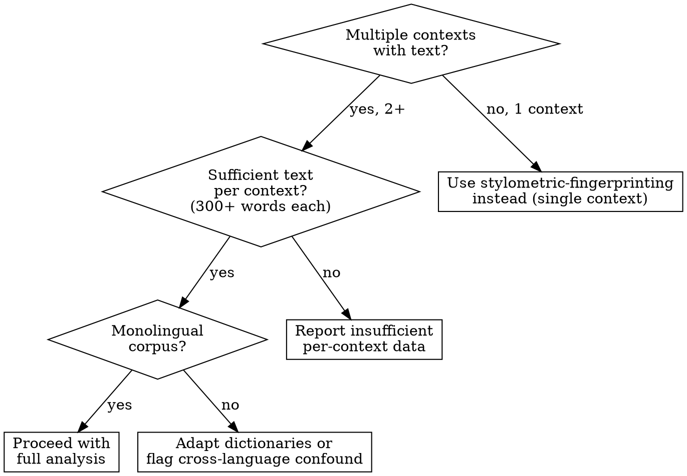
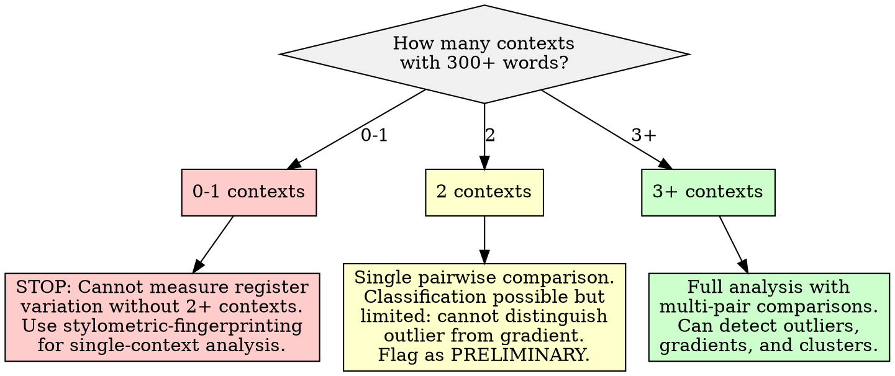

# Register Variation and Code-Switching Analysis

## Overview

Measure how much a user's writing voice varies across different contexts by comparing feature distributions (vocabulary, formality, sentence length, sentiment) across context-defined sub-corpora, then classify the user as having a **stable register** (consistent voice across contexts) or a **context-dependent register** (systematic shifts between contexts). The core principle: **compare distributions, not means -- two contexts can share the same average sentence length while having completely different distributions, and it is the distribution comparison that reveals register variation.** When variation is significant, produce conditional style rules ("in context X, use register Y") rather than a single global profile.

**Research foundation:** Biber's (1988, 1995) multi-dimensional analysis framework established that register variation is best captured through co-occurring clusters of linguistic features across situational contexts, not individual features in isolation. Biber identified six dimensions of variation in English, with the "Involved vs. Informational" and "Narrative vs. Non-narrative" dimensions being the most robust cross-linguistically. Register-based code-switching (sometimes called style-shifting) refers to alternating between different levels of formality, vocabulary, or structural patterns within the same language depending on audience, topic, or community (Fraser, 1999; Auer, 1998). For statistical comparison of feature distributions across sub-corpora, Kilgarriff (2001) demonstrated that chi-square is unreliable for word frequency comparison and recommended rank-based alternatives; the two-sample Kolmogorov-Smirnov test and effect size measures (Cohen's d, Cliff's delta) provide more robust distributional comparisons that separate statistical significance from practical significance.

## When to Use

- Analyzing whether a user writes differently across different communities, forums, or contexts
- Comparing vocabulary, formality, sentence structure, or sentiment distributions across sub-corpora defined by context
- Determining if register variation is statistically significant and practically meaningful (effect size)
- Classifying a user's overall profile as stable-register or context-dependent-register
- Producing conditional replication rules when significant variation is detected ("in technical contexts, use X; in casual contexts, use Y")
- Building a multi-context voice profile that captures both the shared core and the context-specific shifts

**When NOT to use:**

- Corpus comes from a single context only (no variation to measure; use stylometric-fingerprinting instead)
- Fewer than 2 contexts with sufficient text in each (see Insufficient Data Handling)
- Goal is to analyze what topics a user discusses (use NMF topic modeling instead)
- Text is multilingual and the goal is to detect language-switching (this skill addresses monolingual register variation, not bilingual code-switching)
- Judging whether register variation is "good" or "bad" (this skill measures variation, not quality)



## Quick Reference

### Feature Dimensions for Register Comparison

| Dimension | Features Measured | Why It Varies by Context | Statistical Test |
|-----------|------------------|--------------------------|-----------------|
| **Vocabulary** | Content word overlap, context-specific vocabulary rate, type-token ratio | Technical contexts use domain jargon; casual contexts use colloquialisms | Chi-square on top-N word frequencies; KS test on TTR distributions |
| **Formality** | Function word density, contraction rate, slang/abbreviation rate, hedging frequency, discourse marker types | Professional contexts demand formal register; peer communities permit informality | KS test on formality score distributions; Mann-Whitney U on composite scores |
| **Sentence length** | Mean, median, std, distribution shape (skewness, kurtosis) | Complex topics produce longer sentences; rapid exchanges produce shorter ones | KS test on sentence length distributions; Cohen's d on means |
| **Sentiment** | Compound sentiment, positivity/negativity rates, emotional intensity | Support communities skew positive; debate communities skew negative or mixed | KS test on compound score distributions; Cliff's delta on polarity |

### Classification Framework

| Classification | Criteria | Interpretation |
|---------------|----------|----------------|
| **Stable register** | No dimension shows large effect size (all Cohen's d < 0.5 or Cliff's delta < 0.33) across context pairs | User maintains a consistent voice regardless of context |
| **Mildly context-dependent** | 1-2 dimensions show medium effect sizes (d = 0.5-0.8) in some context pairs | User adjusts selectively -- e.g., vocabulary shifts but sentence structure stays constant |
| **Strongly context-dependent** | 3+ dimensions show large effect sizes (d > 0.8 or delta > 0.47) across multiple context pairs | User systematically adapts voice to context; conditional replication rules needed |

### Effect Size Thresholds

| Measure | Small | Medium | Large | Use When |
|---------|-------|--------|-------|----------|
| **Cohen's d** | 0.2-0.5 | 0.5-0.8 | > 0.8 | Comparing means of roughly normal distributions (e.g., sentence length) |
| **Cliff's delta** | 0.11-0.28 | 0.28-0.43 | > 0.43 | Non-parametric; robust when distributions are skewed |
| **KS statistic** | 0.1-0.2 | 0.2-0.35 | > 0.35 | Comparing entire distribution shapes (not just location) |

## Workflow

Copy this checklist and track progress:

```
Register Variation & Code-Switching Analysis Progress:
- [ ] Step 1: Validate corpus suitability and define context sub-corpora
- [ ] Step 2: Extract per-context feature distributions (vocabulary, formality, sentence length, sentiment)
- [ ] Step 3: Compare distributions across context pairs (KS test, effect sizes)
- [ ] Step 4: Compute Biber-inspired multi-dimensional profile per context
- [ ] Step 5: Classify register as stable vs. context-dependent
- [ ] Step 6: Generate conditional replication rules (if context-dependent)
- [ ] Step 7: Write findings to docs/analysis/21-register-variation-code-switching.md
```

### Step 1: Validate Corpus Suitability and Define Context Sub-Corpora

Before analysis, verify the corpus supports cross-context comparison and segment it into context-defined sub-corpora.

**Suitability checks:**

| Check | Pass Condition | Fail Action |
|-------|---------------|-------------|
| **Context count** | 2+ distinct contexts with text | Below 2: STOP. Register variation requires multiple contexts. Use stylometric-fingerprinting for single-context analysis. |
| **Per-context word count** | 300+ words in each context | Below 300 in a context: exclude that context from pairwise comparison; note exclusion in report. |
| **Per-context text count** | 5+ texts per context | Below 5: flag context as low-sample; compute features but widen confidence intervals and flag effect sizes as unreliable. |
| **Corpus balance** | No context exceeds 10x the size of another | Heavily imbalanced contexts: subsample the larger context to 3x the smaller before comparison. Document subsampling. |
| **Language** | Predominantly one language | Mixed-language: segment by language first; analyze register variation within each language separately. |
| **Authorship** | Single author | Multi-author: register variation reflects individual differences, not context effects. Must be single-author for this analysis. |
| **Context definition** | Contexts are meaningfully distinct (different communities, audiences, or situations) | Contexts that differ only by timestamp or arbitrary split do not measure register variation. |

```python
import re
from collections import Counter, defaultdict
import numpy as np

def define_context_subcorpora(texts, context_field='context'):
    """Segment corpus into context-defined sub-corpora.
    texts: list of dicts with 'text' and context_field keys.
    Returns dict of {context: {'texts': [...], 'combined': str, 'word_count': int}}."""
    subcorpora = defaultdict(lambda: {'texts': [], 'combined': '', 'word_count': 0})
    for t in texts:
        ctx = t.get(context_field, 'unknown')
        subcorpora[ctx]['texts'].append(t['text'])
        subcorpora[ctx]['combined'] += ' ' + t['text']
        subcorpora[ctx]['word_count'] += len(t['text'].split())

    # Filter contexts meeting minimum thresholds
    valid = {}
    excluded = {}
    for ctx, data in subcorpora.items():
        if data['word_count'] < 300:
            excluded[ctx] = f"Only {data['word_count']} words (minimum: 300)"
        elif len(data['texts']) < 5:
            # Include but flag
            data['low_sample'] = True
            data['text_count'] = len(data['texts'])
            valid[ctx] = data
        else:
            data['low_sample'] = False
            data['text_count'] = len(data['texts'])
            valid[ctx] = data

    return valid, excluded


def check_corpus_balance(subcorpora):
    """Check if contexts are reasonably balanced in size.
    Returns (is_balanced, imbalance_ratio, recommendation)."""
    sizes = {ctx: data['word_count'] for ctx, data in subcorpora.items()}
    if not sizes:
        return False, None, "No valid contexts"
    max_size = max(sizes.values())
    min_size = min(sizes.values())
    ratio = max_size / max(min_size, 1)
    if ratio > 10:
        return False, ratio, (
            f"Imbalance ratio {ratio:.1f}x. Subsample largest context "
            f"to 3x the smallest ({min_size * 3} words) before comparison."
        )
    return True, ratio, "Balanced"
```

### Step 2: Extract Per-Context Feature Distributions

For each context sub-corpus, compute feature distributions across the four dimensions. The key principle: **extract distributions (lists of per-text values), not single aggregated numbers.** Comparing distributions is the foundation of register variation analysis.

```python
from scipy import stats as scipy_stats

def compute_formality_score(text):
    """Compute a composite formality score for a single text.
    Higher = more formal. Range roughly 0-100."""
    text_lower = text.lower()
    words = text_lower.split()
    total_words = len(words)
    if total_words == 0:
        return None

    # Contraction rate (informal signal)
    contractions = len(re.findall(
        r"\b(?:n't|'re|'ve|'ll|'d|'m|'s)\b", text_lower))
    contraction_rate = contractions / total_words

    # Slang/abbreviation indicators (informal signal)
    informal_markers = len(re.findall(
        r'\b(?:lol|lmao|imo|imho|tbh|ngl|idk|smh|af|omg|wtf|'
        r'gonna|wanna|gotta|kinda|sorta|yeah|yep|nah|nope|'
        r'haha|hehe|bruh|dude|bro)\b', text_lower))
    informal_rate = informal_markers / total_words

    # Hedging markers (formal in academic contexts, informal elsewhere)
    hedges = len(re.findall(
        r'\b(?:perhaps|moreover|furthermore|consequently|'
        r'nevertheless|accordingly|whereas|thus|hence|'
        r'notwithstanding|aforementioned)\b', text_lower))
    formal_rate = hedges / total_words

    # Sentence complexity proxy: avg words per sentence
    sentences = re.split(r'[.!?]+', text)
    sentences = [s.strip() for s in sentences if s.strip()]
    avg_sent_len = total_words / max(len(sentences), 1)

    # First-person pronoun rate (informal signal in many registers)
    first_person = len(re.findall(
        r'\b(?:i|me|my|mine|myself)\b', text_lower))
    first_person_rate = first_person / total_words

    # Composite score: higher = more formal
    # Weights reflect relative signal strength from register research
    score = (
        50  # baseline
        - contraction_rate * 100    # contractions reduce formality
        - informal_rate * 150       # slang strongly reduces formality
        + formal_rate * 120         # formal markers increase formality
        + min(avg_sent_len, 40) * 0.5  # longer sentences slightly more formal
        - first_person_rate * 30    # first-person slightly reduces formality
    )
    return max(0, min(100, score))


def extract_context_features(texts):
    """Extract per-text feature values for a list of texts within one context.
    Returns dict of {dimension: {feature: [per_text_values]}}."""
    features = {
        'vocabulary': {'ttr': [], 'avg_word_length': [], 'long_word_pct': []},
        'formality': {'score': [], 'contraction_rate': [],
                      'first_person_rate': []},
        'sentence_length': {'mean': [], 'median': [], 'std': []},
        'sentiment': {'compound': [], 'positive_rate': [],
                      'negative_rate': []},
    }

    for text in texts:
        words = re.findall(r"\b[a-z']+\b", text.lower())
        total = len(words)
        if total < 10:
            continue

        # Vocabulary features
        unique = set(words)
        features['vocabulary']['ttr'].append(len(unique) / total)
        word_lens = [len(w) for w in words]
        features['vocabulary']['avg_word_length'].append(np.mean(word_lens))
        features['vocabulary']['long_word_pct'].append(
            sum(1 for w in words if len(w) >= 7) / total)

        # Formality
        formality = compute_formality_score(text)
        if formality is not None:
            features['formality']['score'].append(formality)
        contractions = len(re.findall(
            r"\b(?:n't|'re|'ve|'ll|'d|'m|'s)\b", text.lower()))
        features['formality']['contraction_rate'].append(
            contractions / total)
        first_p = len(re.findall(
            r'\b(?:i|me|my|mine|myself)\b', text.lower()))
        features['formality']['first_person_rate'].append(first_p / total)

        # Sentence length
        sentences = re.split(r'[.!?]+', text)
        sent_lengths = [len(s.split()) for s in sentences
                        if len(s.strip().split()) >= 2]
        if sent_lengths:
            features['sentence_length']['mean'].append(np.mean(sent_lengths))
            features['sentence_length']['median'].append(
                np.median(sent_lengths))
            features['sentence_length']['std'].append(
                np.std(sent_lengths) if len(sent_lengths) > 1 else 0)

        # Sentiment (using VADER if available, else simple proxy)
        try:
            from vaderSentiment.vaderSentiment import SentimentIntensityAnalyzer
            analyzer = SentimentIntensityAnalyzer()
            scores = analyzer.polarity_scores(text)
            features['sentiment']['compound'].append(scores['compound'])
            features['sentiment']['positive_rate'].append(scores['pos'])
            features['sentiment']['negative_rate'].append(scores['neg'])
        except ImportError:
            # Fallback: skip sentiment or use a simple proxy
            pass

    return features
```

### Step 3: Compare Distributions Across Context Pairs

For every pair of contexts, compare each feature distribution using both a significance test and an effect size measure. **Significance alone is insufficient -- large corpora will produce "significant" differences that are too small to matter. Effect size separates meaningful variation from statistical noise.**

```python
from itertools import combinations

def compare_distributions(values_a, values_b, feature_name):
    """Compare two feature distributions with significance + effect size.
    Returns dict with test results and interpretation."""
    a = np.array(values_a, dtype=float)
    b = np.array(values_b, dtype=float)

    if len(a) < 5 or len(b) < 5:
        return {
            'feature': feature_name,
            'n_a': len(a), 'n_b': len(b),
            'insufficient_data': True,
            'note': 'Need 5+ values per context for reliable comparison',
        }

    # Kolmogorov-Smirnov test (compares entire distributions)
    ks_stat, ks_p = scipy_stats.ks_2samp(a, b)

    # Mann-Whitney U test (non-parametric location test)
    mw_stat, mw_p = scipy_stats.mannwhitneyu(
        a, b, alternative='two-sided')

    # Cohen's d (standardized mean difference)
    pooled_std = np.sqrt(
        ((len(a)-1)*np.var(a, ddof=1) + (len(b)-1)*np.var(b, ddof=1))
        / (len(a) + len(b) - 2))
    cohens_d = (np.mean(a) - np.mean(b)) / pooled_std if pooled_std > 0 else 0

    # Cliff's delta (non-parametric effect size)
    # Proportion of pairs where a > b minus proportion where b > a
    n_greater = sum(1 for x in a for y in b if x > y)
    n_less = sum(1 for x in a for y in b if x < y)
    cliffs_delta = (n_greater - n_less) / (len(a) * len(b))

    # Classify effect size
    abs_d = abs(cohens_d)
    abs_delta = abs(cliffs_delta)
    if abs_d >= 0.8 or abs_delta >= 0.43:
        effect_label = 'large'
    elif abs_d >= 0.5 or abs_delta >= 0.28:
        effect_label = 'medium'
    elif abs_d >= 0.2 or abs_delta >= 0.11:
        effect_label = 'small'
    else:
        effect_label = 'negligible'

    return {
        'feature': feature_name,
        'n_a': len(a), 'n_b': len(b),
        'mean_a': float(np.mean(a)), 'mean_b': float(np.mean(b)),
        'median_a': float(np.median(a)), 'median_b': float(np.median(b)),
        'ks_statistic': float(ks_stat), 'ks_p_value': float(ks_p),
        'mannwhitney_p': float(mw_p),
        'cohens_d': float(cohens_d),
        'cliffs_delta': float(cliffs_delta),
        'effect_size_label': effect_label,
        'significant_p05': ks_p < 0.05,
        'insufficient_data': False,
    }


def compare_all_context_pairs(context_features):
    """Compare all feature distributions across all context pairs.
    context_features: dict of {context_name: features_dict from Step 2}.
    Returns list of comparison results."""
    contexts = list(context_features.keys())
    all_comparisons = []

    for ctx_a, ctx_b in combinations(contexts, 2):
        pair_label = f"{ctx_a} vs {ctx_b}"
        feat_a = context_features[ctx_a]
        feat_b = context_features[ctx_b]

        for dimension in feat_a:
            for feature in feat_a[dimension]:
                vals_a = feat_a[dimension][feature]
                vals_b = feat_b[dimension][feature]
                if vals_a and vals_b:
                    result = compare_distributions(
                        vals_a, vals_b,
                        f"{dimension}.{feature}")
                    result['context_pair'] = pair_label
                    result['dimension'] = dimension
                    all_comparisons.append(result)

    return all_comparisons
```

**Interpreting results -- the effect size matrix:**

When you have N contexts, you get N*(N-1)/2 pairwise comparisons per feature. Build a matrix showing effect sizes across all pairs. Patterns to look for:
- **One context is the outlier**: Most pairs involving context X show large effects, but other pairs show negligible effects. The user shifts register specifically for context X.
- **Gradient**: Contexts arrange along a formality gradient (e.g., professional > hobbyist > casual). Effect sizes increase with distance on the gradient.
- **Cluster structure**: Contexts form 2-3 clusters with small within-cluster and large between-cluster effects.

### Step 4: Compute Biber-Inspired Multi-Dimensional Profile Per Context

Inspired by Biber's (1988) multi-dimensional analysis, compute composite dimension scores per context that capture co-occurring feature patterns, not isolated features.

```python
def compute_biber_dimensions(features):
    """Compute Biber-inspired dimension scores from extracted features.
    Simplified to four dimensions relevant to user-generated text.
    Returns dict of dimension scores."""
    dims = {}

    # Dimension 1: Involved vs. Informational
    # High = involved (personal, interactive); Low = informational (dense, impersonal)
    formality_scores = features['formality'].get('score', [])
    first_person = features['formality'].get('first_person_rate', [])
    sent_means = features['sentence_length'].get('mean', [])

    if formality_scores and first_person and sent_means:
        # Involved signals: high first-person, short sentences, low formality
        involved = (
            np.mean(first_person) * 100
            - np.mean(formality_scores) * 0.5
            - np.mean(sent_means) * 0.3
        )
        dims['involved_vs_informational'] = float(involved)

    # Dimension 2: Narrative vs. Non-narrative
    # Approximated by past tense usage and sentence length variance
    sent_stds = features['sentence_length'].get('std', [])
    if sent_stds and sent_means:
        narrative = (
            np.mean(sent_stds) * 2  # varied sentence length = more narrative
        )
        dims['narrative_vs_nonnarrative'] = float(narrative)

    # Dimension 3: Explicit vs. Situation-dependent
    # Approximated by vocabulary richness and word length
    ttrs = features['vocabulary'].get('ttr', [])
    long_pct = features['vocabulary'].get('long_word_pct', [])
    if ttrs and long_pct:
        explicit = (
            np.mean(ttrs) * 50
            + np.mean(long_pct) * 100
        )
        dims['explicit_vs_situated'] = float(explicit)

    # Dimension 4: Emotional tone
    compound = features['sentiment'].get('compound', [])
    if compound:
        dims['emotional_tone'] = float(np.mean(compound))

    return dims
```

### Step 5: Classify Register as Stable vs. Context-Dependent

Using the pairwise comparison results from Step 3, classify the user's overall register profile.

```python
def classify_register_variation(comparisons):
    """Classify overall register variation from pairwise comparisons.
    Returns classification, evidence summary, and per-dimension breakdown."""
    # Count large/medium/small effects per dimension
    dim_effects = defaultdict(list)
    for comp in comparisons:
        if comp.get('insufficient_data'):
            continue
        dim = comp['dimension']
        dim_effects[dim].append(comp['effect_size_label'])

    # Per-dimension summary
    dim_summary = {}
    large_dim_count = 0
    for dim, labels in dim_effects.items():
        large_count = labels.count('large')
        medium_count = labels.count('medium')
        total_pairs = len(labels)
        dim_summary[dim] = {
            'total_pairs': total_pairs,
            'large': large_count,
            'medium': medium_count,
            'small': labels.count('small'),
            'negligible': labels.count('negligible'),
            'pct_large_or_medium': (
                (large_count + medium_count) / max(total_pairs, 1) * 100),
        }
        if large_count > 0 or medium_count >= total_pairs * 0.5:
            large_dim_count += 1

    # Classification logic
    if large_dim_count == 0:
        classification = 'stable_register'
        description = (
            'The user maintains a consistent writing voice across all '
            'measured contexts. No dimension shows meaningful variation.')
    elif large_dim_count <= 2:
        classification = 'mildly_context_dependent'
        varying_dims = [d for d, s in dim_summary.items()
                        if s['large'] > 0 or
                        s['medium'] >= s['total_pairs'] * 0.5]
        description = (
            f'The user shows selective register adaptation in '
            f'{len(varying_dims)} dimension(s): {", ".join(varying_dims)}. '
            f'Other dimensions remain stable across contexts.')
    else:
        classification = 'strongly_context_dependent'
        description = (
            f'The user systematically adapts voice across contexts, with '
            f'{large_dim_count} of {len(dim_summary)} dimensions showing '
            f'meaningful variation. Conditional replication rules are needed.')

    return {
        'classification': classification,
        'description': description,
        'dimension_summary': dim_summary,
        'large_dimension_count': large_dim_count,
        'total_dimensions': len(dim_summary),
    }
```

### Step 6: Generate Conditional Replication Rules

If the user is classified as context-dependent, produce conditional rules. If stable, produce a single global rule set.

**For stable register:** Produce a single set of replication constraints (mean values with ranges) that apply across all contexts. Reference stylometric-fingerprinting for the detailed fingerprint.

**For context-dependent register:** Produce conditional rules with this structure:

```markdown
## Conditional Style Rules

### Global (all contexts):
- [Features that are stable across contexts -- use these universally]

### When writing in [Context A]:
- Formality: [target score range]
- Sentence length: [target mean and distribution shape]
- Vocabulary: [domain-specific terms, TTR target]
- Sentiment: [target polarity range]

### When writing in [Context B]:
- Formality: [different target score range]
- ...
```

**Rule generation approach:**

```python
def generate_replication_rules(classification, context_features,
                               comparisons, dim_summary):
    """Generate conditional or global replication rules."""
    rules = {'global': [], 'conditional': {}}

    if classification['classification'] == 'stable_register':
        # Aggregate all contexts for global rules
        for dim in ['vocabulary', 'formality', 'sentence_length', 'sentiment']:
            all_values = defaultdict(list)
            for ctx, feats in context_features.items():
                for feat, vals in feats.get(dim, {}).items():
                    all_values[feat].extend(vals)
            for feat, vals in all_values.items():
                if vals:
                    arr = np.array(vals)
                    rules['global'].append({
                        'dimension': dim,
                        'feature': feat,
                        'target': float(np.median(arr)),
                        'range': (float(np.percentile(arr, 25)),
                                  float(np.percentile(arr, 75))),
                    })
    else:
        # Identify which dimensions are stable vs. varying
        stable_dims = [d for d, s in dim_summary.items()
                       if s['large'] == 0 and
                       s['medium'] < s['total_pairs'] * 0.5]
        varying_dims = [d for d in dim_summary
                        if d not in stable_dims]

        # Global rules from stable dimensions
        for dim in stable_dims:
            all_values = defaultdict(list)
            for ctx, feats in context_features.items():
                for feat, vals in feats.get(dim, {}).items():
                    all_values[feat].extend(vals)
            for feat, vals in all_values.items():
                if vals:
                    arr = np.array(vals)
                    rules['global'].append({
                        'dimension': dim,
                        'feature': feat,
                        'target': float(np.median(arr)),
                        'range': (float(np.percentile(arr, 25)),
                                  float(np.percentile(arr, 75))),
                    })

        # Conditional rules from varying dimensions, per context
        for ctx, feats in context_features.items():
            ctx_rules = []
            for dim in varying_dims:
                for feat, vals in feats.get(dim, {}).items():
                    if vals:
                        arr = np.array(vals)
                        ctx_rules.append({
                            'dimension': dim,
                            'feature': feat,
                            'target': float(np.median(arr)),
                            'range': (float(np.percentile(arr, 25)),
                                      float(np.percentile(arr, 75))),
                        })
            rules['conditional'][ctx] = ctx_rules

    return rules
```

### Step 7: Write the Report

Write all findings to `docs/analysis/21-register-variation-code-switching.md`.

## Report Output Template

The final report MUST be written to `docs/analysis/21-register-variation-code-switching.md` with this structure:

```markdown
# Register Variation and Code-Switching Analysis

## Methodology
- **Approach:** Cross-context distribution comparison using KS tests, effect sizes (Cohen's d, Cliff's delta), and Biber-inspired multi-dimensional profiling
- **Corpus:** [N words total across N contexts, N texts, date range]
- **Contexts analyzed:** [list of contexts with word counts and text counts]
- **Contexts excluded:** [list with reasons, if any]
- **Feature dimensions:** Vocabulary (TTR, word length, long word %), Formality (composite score, contraction rate, first-person rate), Sentence length (mean, median, std), Sentiment (compound, positive rate, negative rate)
- **Statistical tests:** Two-sample KS test (distribution shape), Mann-Whitney U (location), Cohen's d and Cliff's delta (effect size)
- **Classification thresholds:** Cohen's d: small 0.2-0.5, medium 0.5-0.8, large >0.8; Cliff's delta: small 0.11-0.28, medium 0.28-0.43, large >0.43

## Corpus Suitability Assessment
- **Context count:** [N] contexts with sufficient data
- **Per-context word counts:** [table of context, word count, text count, sufficient?]
- **Corpus balance:** [ratio, balanced/imbalanced, action taken]
- **Overall suitability:** [suitable / suitable with caveats / insufficient]

## Per-Context Feature Profiles

### Context: [Context A]
| Dimension | Feature | Mean | Median | Std | P25 | P75 |
|-----------|---------|------|--------|-----|-----|-----|
| Vocabulary | TTR | | | | | |
| Vocabulary | Avg word length | | | | | |
| Formality | Composite score | | | | | |
| Formality | Contraction rate | | | | | |
| Sentence length | Mean words/sentence | | | | | |
| Sentiment | Compound | | | | | |

[Repeat for each context]

## Pairwise Distribution Comparisons

### [Context A] vs [Context B]
| Feature | Mean A | Mean B | KS stat | KS p | Cohen's d | Cliff's delta | Effect Size |
|---------|--------|--------|---------|------|-----------|---------------|-------------|
| vocabulary.ttr | | | | | | | [label] |
| formality.score | | | | | | | [label] |
| sentence_length.mean | | | | | | | [label] |
| sentiment.compound | | | | | | | [label] |

[Repeat for each context pair]

## Effect Size Summary Matrix

### By Dimension (max effect size across all context pairs)
| Dimension | Max Cohen's d | Max Cliff's delta | Overall Variation Level |
|-----------|---------------|-------------------|----------------------|
| Vocabulary | | | [negligible/small/medium/large] |
| Formality | | | |
| Sentence length | | | |
| Sentiment | | | |

## Biber-Inspired Dimensional Profile Per Context
| Dimension | [Context A] | [Context B] | [Context C] | Interpretation |
|-----------|-------------|-------------|-------------|----------------|
| Involved vs. Informational | | | | |
| Narrative vs. Non-narrative | | | | |
| Explicit vs. Situated | | | | |
| Emotional tone | | | | |

## Register Classification

**Classification:** [stable_register / mildly_context_dependent / strongly_context_dependent]

**Summary:** [1-3 sentence description of the finding]

**Per-Dimension Breakdown:**
| Dimension | Pairs with Large Effect | Pairs with Medium Effect | Verdict |
|-----------|----------------------|------------------------|---------|
| Vocabulary | [N] of [N] | [N] of [N] | [stable/varying] |
| Formality | | | |
| Sentence length | | | |
| Sentiment | | | |

## Replication Rules

### Global Rules (apply in all contexts)
| Feature | Target | Range (P25-P75) | Source |
|---------|--------|-----------------|--------|
| [feature] | [value] | [range] | [stable across all N contexts] |

### Conditional Rules (context-specific)
[Only present if classification is context-dependent]

#### When writing in [Context A]:
| Feature | Target | Range (P25-P75) | Differs From Global By |
|---------|--------|-----------------|----------------------|
| [feature] | [value] | [range] | [direction and magnitude] |

#### When writing in [Context B]:
[Same format]

## Limitations and Caveats
- Register variation analysis measures observable distributional differences; it does NOT determine whether variation is intentional, conscious, or deliberate
- Topic effects are confounded with register effects: a user may use longer words in technical contexts because the topic demands technical vocabulary, not because they adopt a formal register
- Statistical significance with large sample sizes is nearly guaranteed; only effect sizes (Cohen's d, Cliff's delta) distinguish meaningful from trivial differences
- The formality composite score is a proxy; no single score captures the full complexity of register
- Pairwise comparisons with unbalanced sample sizes may overestimate or underestimate effects; subsampling was applied where imbalance exceeded 10x
- Context labels are taken as given; the analysis assumes contexts are meaningfully distinct
- Sentiment variation may reflect topic (negative topics produce negative sentiment) rather than register adaptation
- This analysis captures monolingual register variation (style-shifting), not multilingual code-switching
- [Corpus-specific limitations]

## References
- Biber, D. (1988). *Variation across Speech and Writing*. Cambridge University Press.
- Biber, D. (1995). *Dimensions of Register Variation: A Cross-Linguistic Comparison*. Cambridge University Press.
- Kilgarriff, A. (2001). Comparing Corpora. *International Journal of Corpus Linguistics*, 6(1), 97-133.
- Fraser, B. (1999). What are discourse markers? *Journal of Pragmatics*, 31(7), 931-952.
- Auer, P. (1998). *Code-Switching in Conversation: Language, Interaction and Identity*. Routledge.
- Cohen, J. (1988). *Statistical Power Analysis for the Behavioral Sciences* (2nd ed.). Lawrence Erlbaum.
- Cliff, N. (1993). Dominance statistics: Ordinal analyses to answer ordinal questions. *Psychological Bulletin*, 114(3), 494-509.
```

## Good Patterns

- **Compare distributions, not just means** -- two contexts with the same mean sentence length of 15 words could have radically different distribution shapes; the KS test captures this while t-tests miss it
- **Use effect sizes alongside significance tests** -- with a large corpus, virtually every comparison will be "significant" at p < 0.05; effect sizes (Cohen's d, Cliff's delta) distinguish meaningful from trivial differences
- **Apply Biber's multi-dimensional approach** -- register variation is best captured by co-occurring feature clusters (involved vs. informational, narrative vs. non-narrative), not isolated features
- **Classify variation as stable vs. context-dependent** -- the binary classification with an intermediate tier (mildly context-dependent) is more actionable than a continuous "variation score"
- **Produce conditional replication rules when variation is significant** -- "in context X, formality is 70; in context Y, formality is 40" is actionable; "average formality is 55" loses the signal
- **Check corpus balance before comparison** -- comparing 50,000 words from context A against 500 words from context B produces unreliable effect sizes; subsample or flag
- **Report the effect size matrix** -- showing effect sizes across all context pairs and all dimensions reveals the structure of variation (outlier context, gradient, clusters)
- **Separate vocabulary effects from true register effects** -- a user discussing medicine will use longer words than when discussing games; this is topic effect, not register adaptation; note the confound

## Anti-Patterns

| Anti-Pattern | Why It Fails | Instead |
|--------------|-------------|---------|
| Using only means to compare registers | Two distributions can share the same mean while differing in spread, shape, and tails; means hide register differences | Compare full distributions using KS tests; report distributions alongside means |
| Treating any statistically significant difference as code-switching | With enough data, even trivially small differences reach p < 0.05; significance does not imply meaningfulness | Require medium or large effect sizes (d > 0.5 or delta > 0.28) before labeling a difference as register variation |
| Ignoring sample size effects on significance | 10,000 texts per context will produce significant p-values for negligible differences; 5 texts per context will miss real differences | Always pair significance tests with effect sizes; flag low-sample contexts |
| Comparing contexts with vastly different corpus sizes | A 50,000-word context vs. a 200-word context produces unreliable statistics | Check balance; subsample if imbalance exceeds 10x; flag remaining imbalance |
| Assuming register variation is deliberate or conscious | Style-shifting is often automatic and audience-driven, not a strategic choice | Frame as "observed distributional difference," not "the user chooses to shift register" |
| Treating topic-driven vocabulary differences as register change | A user discussing law uses legal terms; this is topic, not register | Separate content vocabulary analysis from function-word and structural analysis; note topic confounds |
| Computing a single "variation score" instead of classifying | A continuous score has no natural threshold for "this matters" | Classify as stable / mildly context-dependent / strongly context-dependent with explicit criteria |
| Comparing only the most extreme context pair | Cherry-picking the two most different contexts overstates variation | Compare ALL context pairs; report the distribution of effect sizes, not just the maximum |
| Ignoring that small per-context samples inflate effect size estimates | Cohen's d is positively biased in small samples | Apply Hedges' g correction for small samples (n < 20); flag contexts with fewer than 5 texts |

## Boundaries

**This skill SHOULD produce:**
- Feature distributions (vocabulary, formality, sentence length, sentiment) extracted per context sub-corpus
- Pairwise distribution comparisons across all context pairs using KS tests and effect sizes
- Biber-inspired multi-dimensional profile per context
- Classification of register as stable, mildly context-dependent, or strongly context-dependent
- Conditional replication rules for context-dependent users (global rules + per-context overrides)
- Effect size summary matrix showing variation structure across dimensions and context pairs
- Written report at `docs/analysis/21-register-variation-code-switching.md`

**This skill should NOT:**
- Judge register variation as positive or negative, skilled or unskilled, authentic or performative
- Assume variation reflects communicative competence or strategic choice (it may be automatic)
- Ignore that topic affects vocabulary and sentence structure independent of register
- Claim to detect conscious or deliberate code-switching (this measures distributional differences, not intent)
- Produce a register profile from a single context (use stylometric-fingerprinting instead)
- Compare contexts without reporting effect sizes (significance alone is insufficient)
- Present results from unbalanced sub-corpora without subsampling or flagging the imbalance
- Conflate multilingual code-switching with monolingual register variation
- Treat the four measured dimensions as exhaustive (register variation has additional dimensions not captured here)

## Insufficient Data Handling



| Condition | Action |
|-----------|--------|
| **0-1 contexts with 300+ words** | STOP. Register variation analysis requires at least 2 contexts with sufficient text. Use stylometric-fingerprinting for single-context profiling. Report the number of contexts found and their word counts. |
| **2 contexts with 300+ words** | Proceed with a single pairwise comparison. Classification is possible but limited: you cannot distinguish an outlier context from a gradient or cluster pattern. Label the classification as PRELIMINARY. |
| **3+ contexts with 300+ words** | Full analysis. Multi-pair comparisons enable detection of outlier contexts, formality gradients, and cluster structures. |
| **A context has 300-1,000 words** | Include in analysis but flag as low-confidence. Effect size estimates may be inflated. Apply Hedges' g correction. Widen reported ranges. |
| **A context has fewer than 5 texts** | Include in analysis but flag: "This context has [N] texts; per-text feature distributions may not represent the context reliably." Do not draw strong conclusions from this context's comparisons. |
| **All contexts are topically similar** | Analysis is valid but findings may underestimate true register variation. If contexts differ only in community (not topic), vocabulary differences reflect genuine register adaptation. If contexts differ only in time period, variation may reflect temporal drift, not register. Flag prominently. |
| **Corpus is heavily imbalanced** | Subsample the larger context(s) to no more than 3x the smallest context before running comparisons. Document the subsampling. Report both the full-corpus and subsampled results if they differ substantially. |
| **Sentiment data unavailable** | If VADER or equivalent sentiment library is not available, skip the sentiment dimension. Report analysis on the remaining three dimensions. Note the gap in the report. |
| **Only 2-3 features show any variation** | This is a finding, not a failure. Report: "Register variation is narrow, limited to [features]. The user's voice is largely stable with selective context-dependent shifts in [specific dimension]." |

## Common Mistakes

| Mistake | Fix |
|---------|-----|
| Running only t-tests on means and ignoring distribution shapes | Use KS tests to compare full distributions. Two contexts can have identical means but completely different shapes. |
| Reporting p-values without effect sizes | Always report Cohen's d or Cliff's delta alongside p-values. Large corpora produce significant p-values for trivially small differences. |
| Labeling any difference as "code-switching" | Reserve "code-switching" language for large effect sizes (d > 0.8). Small effects are normal noise, not register shifts. |
| Comparing vocabulary across contexts without noting topic confounds | A user discussing medicine WILL use different vocabulary than when discussing cooking. Note which vocabulary differences are topic-driven vs. register-driven. |
| Ignoring corpus balance | Always check the size ratio between contexts. Subsample or flag if one context is 10x+ larger. |
| Using raw TTR to compare contexts of different sizes | TTR mechanically decreases with text length. Use MTLD or MATTR if context sizes vary. |
| Treating the classification as permanent | Register variation profiles reflect the corpus analyzed, not a permanent trait. The user may vary more or less in contexts not represented in the corpus. |
| Not producing conditional rules for context-dependent users | The whole point of detecting variation is to produce context-specific replication rules. A single global profile for a context-dependent user is misleading. |
| Over-interpreting two-context comparisons | With only two contexts, you cannot tell if one context is the outlier or if both are typical points on a gradient. Flag as preliminary. |
| Conflating statistical significance with practical importance | A p-value of 0.001 with Cohen's d of 0.1 means the difference is real but tiny. Only medium-to-large effect sizes warrant conditional rules. |

## References

- [Biber, D. (1988). *Variation across Speech and Writing*. Cambridge University Press.](https://www.cambridge.org/core/books/variation-across-speech-and-writing/E7F0A569A15D0CF8E52C1B5E01B3A803)
- [Biber, D. (1995). *Dimensions of Register Variation: A Cross-Linguistic Comparison*. Cambridge University Press.](https://www.cambridge.org/core/books/dimensions-of-register-variation/FF817F2C32378B398C8019090381352E)
- [Kilgarriff, A. (2001). Comparing Corpora. *International Journal of Corpus Linguistics*, 6(1), 97-133.](https://www.sketchengine.eu/wp-content/uploads/comparing_corpora_2001.pdf)
- [Fraser, B. (1999). What are discourse markers? *Journal of Pragmatics*, 31(7), 931-952.](https://www.sciencedirect.com/science/article/pii/S0378216698001015)
- Auer, P. (1998). *Code-Switching in Conversation: Language, Interaction and Identity*. Routledge.
- Cohen, J. (1988). *Statistical Power Analysis for the Behavioral Sciences* (2nd ed.). Lawrence Erlbaum.
- [Cliff, N. (1993). Dominance statistics: Ordinal analyses to answer ordinal questions. *Psychological Bulletin*, 114(3), 494-509.](https://psycnet.apa.org/record/1994-08169-001)
- [Heylighen, F. & Dewaele, J.-M. (1999). Formality of Language: Definition, Measurement and Behavioral Determinants. *Internal Report, Free University of Brussels*.](https://www.researchgate.net/publication/239547839_Formality_of_Language_definition_measurement_and_behavioral_determinants)
- [CALCS: Computational Approaches to Linguistic Code-Switching (ACL Workshop Series)](https://aclanthology.org/2023.calcs-1.pdf)
- [Neurobiber: Fast and Interpretable Stylistic Feature Extraction (2025)](https://arxiv.org/html/2502.18590v1)
- [Gonzales, W.D.W. (2025). Predicting language choice in a digital medium: A computational approach to analyzing WhatsApp code-switching. *Bilingualism: Language and Cognition*.](https://journals.sagepub.com/doi/10.1177/13670069251325036)
