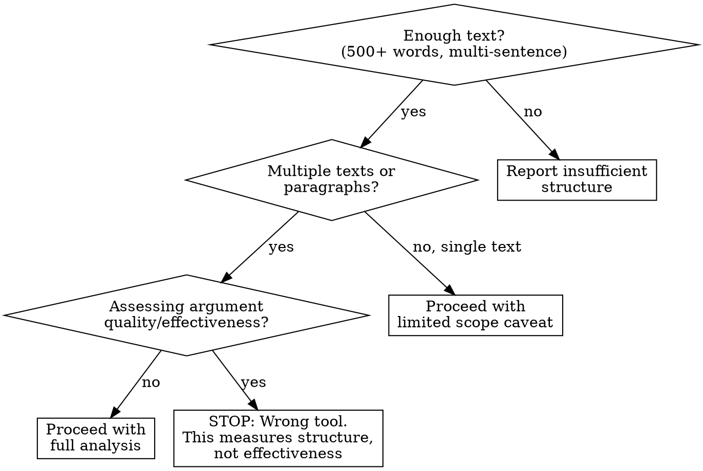
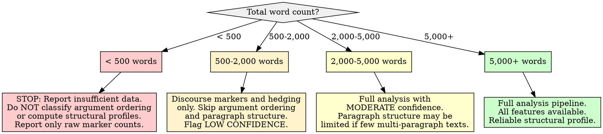

# Rhetorical and Discourse Structure Analysis

## Overview

Analyze how an author constructs arguments and organizes text beyond the word level: argument ordering (claim-first vs. evidence-first vs. dialectical), rhetorical devices (hedging, concessions, rhetorical questions, analogies), discourse marker usage by functional type, and paragraph/post structural habits (length distributions, list vs. prose ratios, summary positions). The core principle: **discourse structure reveals argumentation habits that are more stable across topics than word choice** -- a person who leads with evidence before stating conclusions does so whether discussing technology, politics, or cooking. These structural patterns produce replicable constraints for voice matching that complement but do not duplicate lexical or sentiment analysis.

**Research foundation:** Rhetorical Structure Theory (Mann & Thompson, 1988) established that texts have hierarchical discourse relations between nucleus (core content) and satellite (supporting content) units. The enhanced RST framework (eRST; Zeldes, 2024, *Computational Linguistics* 51(1)) extends this to discourse relation graphs with non-projective and concurrent relations plus explicit signaling. Argument mining research (Lawrence & Reed, 2019, *Computational Linguistics* 45(4)) formalized the pipeline of component identification, component classification (claim vs. premise), and structure identification (support/attack relations). Fraser's (1999) taxonomy of discourse markers classifies them by function: contrastive ("but", "however"), elaborative ("moreover", "also"), inferential ("therefore", "thus"), and topic-management ("anyway", "so"). Hedge detection research (Medlock & Briscoe, 2007; Vincze et al., 2008) established lexicon-based and syntactic approaches to identifying epistemic uncertainty markers.

## When to Use

- Characterizing how an author orders arguments (do they lead with claims or evidence?)
- Quantifying rhetorical device frequency: hedges, concessions, rhetorical questions, analogies
- Profiling discourse marker usage patterns by functional type (contrastive, elaborative, inferential)
- Analyzing structural habits: paragraph length distributions, list-vs-prose ratios, summary positioning
- Building structural constraints for voice replication that go beyond word choice and sentiment
- Comparing argumentation styles across authors or across time periods for the same author

**When NOT to use:**

- Corpus contains fewer than 500 words total (see Insufficient Data Handling)
- All texts are single sentences (no paragraph or argument structure to analyze)
- Goal is to assess argument quality or persuasive effectiveness (this measures structure, not effect)
- Text is heavily formatted by a platform (e.g., auto-generated templates) where structure reflects the tool, not the author
- Translated text where discourse markers and argument ordering may reflect the translator's habits



## Quick Reference

### Argument Ordering Patterns

| Pattern | Structure | Discourse Signals | Example Flow |
|---------|-----------|-------------------|--------------|
| **Claim-first** | Position stated, then supporting evidence | "I think X. Here's why...", "My view is... because..." | Thesis -> Evidence -> Conclusion restatement |
| **Evidence-first** | Data/examples presented, then conclusion drawn | "Looking at X, Y, Z... therefore...", "Given that... it follows..." | Evidence -> Reasoning -> Claim |
| **Dialectical** | Opposing view acknowledged, then own position argued | "Some say X, but...", "While X is true, Y matters more..." | Counter-position -> Concession -> Own claim -> Evidence |
| **Exploratory** | Multiple positions weighed without firm conclusion | "On one hand... on the other...", "It could be X or Y..." | Position A -> Position B -> Tentative synthesis |
| **Narrative-embedded** | Argument wrapped in a story or personal experience | "When I experienced X, I realized Y..." | Anecdote -> Lesson -> Generalized claim |

### Discourse Marker Categories (Fraser 1999 taxonomy, extended)

| Category | Function | Example Markers |
|----------|----------|----------------|
| **Contrastive** | Signal opposition, contrast, or concession | but, however, although, nevertheless, on the other hand, yet, still, whereas, despite |
| **Elaborative** | Signal continuation, addition, or specification | and, also, moreover, furthermore, in addition, specifically, for example, in fact, indeed |
| **Inferential** | Signal conclusion, consequence, or reasoning | therefore, thus, hence, so, consequently, as a result, it follows that, this means |
| **Topic-management** | Signal topic shifts, returns, or framing | anyway, so, now, well, regarding, as for, speaking of, incidentally, by the way |
| **Hedging** | Signal epistemic uncertainty or tentativeness | maybe, perhaps, I think, probably, it seems, might, could, arguably, tend to, in my opinion |
| **Concessive** | Signal yielding a point while maintaining position | admittedly, granted, I concede, fair point, to be fair, true but, while I agree |
| **Emphatic** | Signal strengthening or intensification | clearly, obviously, certainly, definitely, without doubt, absolutely, undeniably |

### Rhetorical Devices

| Device | Detection Method | Example |
|--------|-----------------|---------|
| **Hedging** | Modal verbs (might, could, may), epistemic adverbs (perhaps, probably), cognitive verbs (I think, I believe, I guess) | "I think this might be related to..." |
| **Rhetorical questions** | Question marks in declarative contexts; questions not seeking information | "Who would actually want that?" |
| **Concessions** | Concessive markers followed by contrastive markers | "Granted, X is true, but Y matters more" |
| **Analogies** | "like", "as if", "similar to", "imagine", "think of it as", comparative framing | "It's like trying to fill a leaky bucket" |
| **Enumeration/listing** | Numbered lists, bullet points, "first... second... third..." | "There are three reasons: 1)... 2)... 3)..." |
| **Repetition/anaphora** | Repeated phrase at start of consecutive clauses | "We need X. We need Y. We need Z." |
| **Qualification** | Narrowing scope of a claim after stating it | "This works in most cases, though not for..." |

### Structural Metrics

| Metric | What It Measures | Computation |
|--------|-----------------|-------------|
| **Avg paragraph length** | Verbosity and density preference | Total words / number of paragraphs |
| **Paragraph length variance** | Consistency vs. varied pacing | Standard deviation of paragraph word counts |
| **List-to-prose ratio** | Structured vs. flowing exposition | Paragraphs with list markers / total paragraphs |
| **Summary position** | Where the author places the main point | First paragraph, last paragraph, or distributed |
| **Sentence-per-paragraph ratio** | Granularity of paragraph breaks | Total sentences / total paragraphs |
| **Question density** | Frequency of interrogative sentences | Questions / total sentences |
| **Parenthetical density** | Frequency of inline asides and qualifications | Parenthetical phrases / total sentences |

## Workflow

Copy this checklist and track progress:

```
Rhetorical & Discourse Structure Analysis Progress:
- [ ] Step 1: Validate corpus suitability and structural richness
- [ ] Step 2: Classify argument ordering patterns per text
- [ ] Step 3: Detect and count discourse markers by functional type
- [ ] Step 4: Measure rhetorical device frequencies
- [ ] Step 5: Analyze paragraph and post structure distributions
- [ ] Step 6: Compute structural profile and cross-dimension patterns
- [ ] Step 7: Write findings to docs/analysis/20-rhetorical-discourse-structure.md
```

### Step 1: Validate Corpus Suitability

Before analysis, verify the corpus has sufficient structural material to analyze.

**Suitability checks:**

| Check | Pass Condition | Fail Action |
|-------|---------------|-------------|
| **Total word count** | 500+ words across corpus | Below 500: STOP. Report insufficient data. Structural patterns cannot be measured. |
| **Multi-sentence texts** | At least 50% of texts contain 2+ sentences | If most texts are single sentences, structural analysis is limited to discourse marker counting only. Flag prominently. |
| **Paragraph structure** | At least some texts have 2+ paragraphs | If all texts are single-paragraph, skip paragraph structure analysis (Step 5). |
| **Language** | Predominantly English | Non-English text invalidates the marker dictionaries below. Adapt or flag. |
| **Authorship** | Single author or known author set | Mixed authorship produces community-level patterns, not individual structural habits. |
| **Genre diversity** | Note the genre(s) present | Genre strongly constrains discourse structure. Academic writing uses different markers than casual discussion. Document genre prominently. |
| **Platform formatting** | Author-controlled formatting | If a platform auto-formats (e.g., template-driven posts), structural metrics reflect the platform, not the author. |

**If corpus fails suitability:** Report the failure. State what was checked, what failed, and why structural analysis is unreliable. Do not force analysis on unsuitable data.

### Step 2: Classify Argument Ordering Patterns

For each text of sufficient length (3+ sentences), classify its primary argument ordering pattern.

**Classification approach:**

1. **Identify the main claim** -- what position or conclusion does the text advance?
2. **Identify supporting elements** -- evidence, examples, reasoning, concessions
3. **Map the sequence** -- does the claim appear before, after, or interleaved with support?
4. **Assign pattern** -- match to the five ordering types (claim-first, evidence-first, dialectical, exploratory, narrative-embedded)

```python
import re
from collections import Counter

# Signal phrases that suggest ordering patterns.
# These are INDICATORS, not deterministic classifiers.
# A text with "I think" at the start may still be evidence-first
# if the body presents data before restating the claim.

CLAIM_FIRST_SIGNALS = [
    r'^I think\b', r'^I believe\b', r'^My view is\b',
    r'^In my opinion\b', r'^The answer is\b', r'^Here\'s the thing\b',
    r'^The point is\b', r'^My position is\b',
]

EVIDENCE_FIRST_SIGNALS = [
    r'\btherefore\b', r'\bthus\b', r'\bhence\b',
    r'\bso (?:it|we|I|this)\b', r'\bthis (?:shows|means|suggests|indicates)\b',
    r'\bgiven (?:that|this)\b', r'\blooking at\b',
    r'\bthe data (?:shows|suggests)\b',
]

DIALECTICAL_SIGNALS = [
    r'\bsome (?:say|argue|think|believe)\b',
    r'\bwhile (?:it\'s|this is|that is) true\b',
    r'\bon the other hand\b', r'\bopponents (?:say|argue)\b',
    r'\bthe counterargument\b', r'\bcritics (?:say|argue|point)\b',
]

CONCESSIVE_PAIRS = [
    (r'\badmittedly\b', r'\bbut\b'),
    (r'\bgranted\b', r'\bhowever\b'),
    (r'\bwhile I agree\b', r'\bI (?:think|believe|maintain)\b'),
    (r'\bto be fair\b', r'\bbut\b'),
]

def classify_argument_order(text):
    """Classify the primary argument ordering pattern of a text.
    Returns (pattern_label, confidence, signals_found).
    Confidence: 'high' if multiple signals converge, 'low' if ambiguous."""
    text_lower = text.lower()
    sentences = re.split(r'[.!?]+', text)
    sentences = [s.strip() for s in sentences if s.strip()]
    if len(sentences) < 3:
        return ('too_short', 'n/a', [])

    first_third = ' '.join(sentences[:max(len(sentences)//3, 1)])
    last_third = ' '.join(sentences[-max(len(sentences)//3, 1):])

    signals = {'claim_first': [], 'evidence_first': [],
               'dialectical': [], 'exploratory': []}

    # Check claim-first: claim signals in first third
    for pattern in CLAIM_FIRST_SIGNALS:
        if re.search(pattern, first_third, re.IGNORECASE):
            signals['claim_first'].append(pattern)

    # Check evidence-first: inferential markers in last third
    for pattern in EVIDENCE_FIRST_SIGNALS:
        if re.search(pattern, last_third, re.IGNORECASE):
            signals['evidence_first'].append(pattern)

    # Check dialectical: concessive structure
    for pattern in DIALECTICAL_SIGNALS:
        if re.search(pattern, text_lower):
            signals['dialectical'].append(pattern)

    # Determine dominant pattern
    counts = {k: len(v) for k, v in signals.items()}
    if max(counts.values()) == 0:
        return ('indeterminate', 'low', [])

    dominant = max(counts, key=counts.get)
    confidence = 'high' if counts[dominant] >= 2 else 'low'
    return (dominant, confidence, signals[dominant])
```

**Important caveats for argument ordering classification:**
- Signal phrases are indicators, not proof. A text starting with "I think" may still present evidence before the actual claim.
- Many texts use hybrid patterns. Assign the DOMINANT pattern but note secondary patterns.
- Short texts (under 3 sentences) cannot be reliably classified. Mark as "too_short."
- The same discourse marker can serve different functions in different contexts (see Anti-Patterns).

**Aggregate across corpus:**

```python
def compute_ordering_profile(texts):
    """Compute argument ordering distribution across a corpus."""
    classifications = [classify_argument_order(t) for t in texts]
    pattern_counts = Counter(c[0] for c in classifications)
    total_classified = sum(v for k, v in pattern_counts.items()
                          if k not in ('too_short', 'indeterminate'))
    high_confidence = sum(1 for c in classifications if c[1] == 'high')

    return {
        'pattern_distribution': dict(pattern_counts),
        'total_classified': total_classified,
        'high_confidence_count': high_confidence,
        'dominant_pattern': pattern_counts.most_common(1)[0]
            if total_classified > 0 else ('indeterminate', 0),
        'classification_rate': total_classified / max(len(texts), 1),
    }
```

### Step 3: Detect and Count Discourse Markers by Functional Type

Count discourse markers using a dictionary-based approach, categorized by Fraser's functional taxonomy.

```python
DISCOURSE_MARKERS = {
    'contrastive': [
        'but', 'however', 'although', 'though', 'nevertheless',
        'nonetheless', 'yet', 'still', 'whereas', 'despite',
        'in contrast', 'on the other hand', 'on the contrary',
        'conversely', 'instead', 'rather', 'while',
    ],
    'elaborative': [
        'also', 'moreover', 'furthermore', 'in addition',
        'additionally', 'specifically', 'for example', 'for instance',
        'in fact', 'indeed', 'in particular', 'that is',
        'namely', 'such as', 'especially', 'notably',
    ],
    'inferential': [
        'therefore', 'thus', 'hence', 'so', 'consequently',
        'as a result', 'accordingly', 'it follows',
        'this means', 'this suggests', 'this implies',
        'which means', 'because of this',
    ],
    'topic_management': [
        'anyway', 'now', 'well', 'regarding', 'as for',
        'speaking of', 'incidentally', 'by the way',
        'moving on', 'turning to', 'back to',
    ],
    'concessive': [
        'admittedly', 'granted', 'to be fair', 'fair enough',
        'i concede', 'i admit', 'true', 'of course',
        'naturally', 'sure', 'no doubt',
    ],
    'emphatic': [
        'clearly', 'obviously', 'certainly', 'definitely',
        'undeniably', 'absolutely', 'without doubt',
        'undoubtedly', 'plainly', 'evidently',
    ],
}

def count_discourse_markers(text):
    """Count discourse markers by functional category.
    Returns per-category counts and per-1000-word rates."""
    text_lower = text.lower()
    words = text_lower.split()
    total_words = len(words)
    if total_words == 0:
        return None

    counts = {}
    for category, markers in DISCOURSE_MARKERS.items():
        cat_count = 0
        found_markers = []
        for marker in markers:
            # Use word boundary matching for multi-word markers
            occurrences = len(re.findall(
                r'\b' + re.escape(marker) + r'\b', text_lower
            ))
            if occurrences > 0:
                cat_count += occurrences
                found_markers.append((marker, occurrences))
        counts[category] = {
            'count': cat_count,
            'rate_per_1000': cat_count / total_words * 1000,
            'markers_found': found_markers,
        }

    counts['total_markers'] = sum(c['count'] for c in counts.values()
                                  if isinstance(c, dict))
    counts['total_rate_per_1000'] = (
        counts['total_markers'] / total_words * 1000
    )
    return counts
```

**Critical caveat -- polysemy of discourse markers:** The word "so" can be inferential ("So we conclude..."), topic-management ("So, what happened next?"), or a filler. The word "well" can be topic-management ("Well, let me explain"), a hedge ("Well, maybe"), or literal ("a well of water"). Dictionary-based counting cannot disambiguate these. Document this limitation. For high-stakes analysis, manually review the top 5 most frequent markers in context.

### Step 4: Measure Rhetorical Device Frequencies

```python
HEDGE_MARKERS = {
    'modal_verbs': ['might', 'could', 'may', 'would'],
    'epistemic_adverbs': [
        'perhaps', 'probably', 'possibly', 'arguably',
        'seemingly', 'apparently', 'supposedly', 'allegedly',
    ],
    'cognitive_verbs': [
        'i think', 'i believe', 'i suppose', 'i guess',
        'i imagine', 'i feel', 'it seems', 'it appears',
    ],
    'approximators': [
        'about', 'around', 'roughly', 'approximately',
        'sort of', 'kind of', 'somewhat', 'fairly',
        'rather', 'tend to',
    ],
    'shields': [
        'in my opinion', 'from my perspective',
        'as far as i know', 'to my knowledge',
        'in my experience', 'i could be wrong',
    ],
}

RHETORICAL_QUESTION_PATTERNS = [
    r'(?:who|what|how|why|where|when)\s+(?:would|could|can|does|is|are|was|were)\s+.*\?',
    r'(?:isn\'t|aren\'t|doesn\'t|don\'t|won\'t|can\'t|couldn\'t|wouldn\'t)\s+.*\?',
    r'(?:right|really|seriously|honestly)\s*\?',
]

ANALOGY_SIGNALS = [
    r'\blike (?:trying|having|being|watching|living)\b',
    r'\bas if\b', r'\bsimilar to\b', r'\banalogous to\b',
    r'\bthink of it as\b', r'\bimagine (?:a|that|if)\b',
    r'\bthe equivalent of\b', r'\bjust as\b.*\bso too\b',
    r'\bit\'s (?:like|as though)\b',
]

def measure_rhetorical_devices(text):
    """Measure frequency of rhetorical devices in text.
    Returns counts and rates per 1000 words."""
    text_lower = text.lower()
    words = text_lower.split()
    total_words = len(words)
    sentences = re.split(r'[.!?]+', text)
    sentences = [s.strip() for s in sentences if s.strip()]
    total_sentences = max(len(sentences), 1)

    if total_words == 0:
        return None

    # Hedging
    hedge_counts = {}
    total_hedges = 0
    for category, markers in HEDGE_MARKERS.items():
        cat_count = sum(
            len(re.findall(r'\b' + re.escape(m) + r'\b', text_lower))
            for m in markers
        )
        hedge_counts[category] = cat_count
        total_hedges += cat_count

    # Rhetorical questions
    rq_count = sum(
        len(re.findall(p, text_lower))
        for p in RHETORICAL_QUESTION_PATTERNS
    )

    # Analogies
    analogy_count = sum(
        len(re.findall(p, text_lower))
        for p in ANALOGY_SIGNALS
    )

    # Concession-contrast pairs (concessive marker followed by contrastive)
    concession_count = 0
    for sent in sentences:
        sent_lower = sent.lower()
        has_concessive = any(
            re.search(r'\b' + re.escape(m) + r'\b', sent_lower)
            for m in DISCOURSE_MARKERS['concessive']
        )
        has_contrastive = any(
            re.search(r'\b' + re.escape(m) + r'\b', sent_lower)
            for m in DISCOURSE_MARKERS['contrastive']
        )
        if has_concessive and has_contrastive:
            concession_count += 1

    return {
        'hedging': {
            'total': total_hedges,
            'rate_per_1000': total_hedges / total_words * 1000,
            'by_type': hedge_counts,
        },
        'rhetorical_questions': {
            'count': rq_count,
            'rate_per_sentence': rq_count / total_sentences,
        },
        'analogies': {
            'count': analogy_count,
            'rate_per_1000': analogy_count / total_words * 1000,
        },
        'concession_contrast_pairs': {
            'count': concession_count,
            'rate_per_sentence': concession_count / total_sentences,
        },
    }
```

**Important: hedging in genuinely uncertain contexts.** Not all hedging is rhetorical strategy. In scientific writing or genuinely uncertain situations, hedges like "might", "could", and "it seems" reflect actual epistemic state, not a discourse habit. When the corpus is domain-specific technical writing, discount hedge frequency by noting the genre baseline. Do NOT over-count hedges in contexts where uncertainty is the appropriate epistemic stance.

### Step 5: Analyze Paragraph and Post Structure

```python
def analyze_structure(text):
    """Analyze paragraph-level structural patterns."""
    # Split into paragraphs (double newline or significant whitespace)
    paragraphs = re.split(r'\n\s*\n', text)
    paragraphs = [p.strip() for p in paragraphs if p.strip()]

    if not paragraphs:
        return None

    # Paragraph metrics
    para_word_counts = [len(p.split()) for p in paragraphs]
    para_sentence_counts = [
        len([s for s in re.split(r'[.!?]+', p) if s.strip()])
        for p in paragraphs
    ]

    # List detection: paragraphs containing bullet/number markers
    list_pattern = r'(?:^|\n)\s*(?:[-*+]|\d+[.)]|\([a-z]\))\s+'
    list_paragraphs = sum(
        1 for p in paragraphs if re.search(list_pattern, p)
    )

    # Summary position detection
    # Heuristic: the paragraph with the highest density of inferential
    # markers and claim-first signals is likely the summary
    summary_position = 'distributed'
    if len(paragraphs) >= 3:
        inferential_density = []
        for p in paragraphs:
            p_lower = p.lower()
            density = sum(
                len(re.findall(r'\b' + re.escape(m) + r'\b', p_lower))
                for m in DISCOURSE_MARKERS.get('inferential', [])
            )
            inferential_density.append(density)
        if inferential_density:
            max_idx = inferential_density.index(max(inferential_density))
            if max_idx == 0:
                summary_position = 'opening'
            elif max_idx == len(paragraphs) - 1:
                summary_position = 'closing'
            else:
                summary_position = 'middle'

    import statistics
    return {
        'paragraph_count': len(paragraphs),
        'avg_paragraph_length': statistics.mean(para_word_counts),
        'median_paragraph_length': statistics.median(para_word_counts),
        'paragraph_length_std': (
            statistics.stdev(para_word_counts)
            if len(para_word_counts) > 1 else 0
        ),
        'min_paragraph_length': min(para_word_counts),
        'max_paragraph_length': max(para_word_counts),
        'avg_sentences_per_paragraph': statistics.mean(para_sentence_counts),
        'list_paragraph_count': list_paragraphs,
        'list_to_prose_ratio': list_paragraphs / max(len(paragraphs), 1),
        'summary_position': summary_position,
        'paragraph_length_distribution': para_word_counts,
    }
```

### Step 6: Compute Structural Profile and Cross-Dimension Patterns

Synthesize findings from Steps 2-5 into a unified structural profile describing the author's discourse habits.

**Profile structure:**

```markdown
## Discourse Structure Profile

### Argument Ordering
| Pattern | Frequency | Percentage | Confidence |
|---------|-----------|------------|------------|
| [pattern] | [N] | [X%] | [high/low] |

Dominant pattern: [X] ([N]% of classified texts)

### Discourse Marker Profile
| Category | Rate per 1000 words | Most Used Markers |
|----------|---------------------|-------------------|
| Contrastive | [X.X] | [marker1, marker2] |
| Elaborative | [X.X] | [marker1, marker2] |
| Inferential | [X.X] | [marker1, marker2] |
| Concessive | [X.X] | [marker1, marker2] |
| Emphatic | [X.X] | [marker1, marker2] |
| Topic-management | [X.X] | [marker1, marker2] |
Total marker density: [X.X] per 1000 words

### Rhetorical Device Profile
| Device | Rate | Interpretation |
|--------|------|----------------|
| Hedging | [X.X] per 1000 words | [low/moderate/high -- see thresholds] |
| Rhetorical questions | [X.X] per 100 sentences | [rare/occasional/frequent] |
| Analogies | [X.X] per 1000 words | [rare/occasional/frequent] |
| Concession-contrast pairs | [X.X] per 100 sentences | [rare/occasional/frequent] |

### Structural Habits
| Metric | Value | Interpretation |
|--------|-------|----------------|
| Avg paragraph length | [N] words | [short/moderate/long] |
| Paragraph length variance | [N] std dev | [consistent/varied/highly varied] |
| List-to-prose ratio | [X.X] | [prose-dominant/mixed/list-heavy] |
| Summary position | [opening/closing/distributed] | [top-down/bottom-up/distributed] |
| Sentences per paragraph | [N] | [terse/moderate/dense] |
```

**Interpretation thresholds (approximate baselines from published research):**

| Metric | Low | Moderate | High |
|--------|-----|----------|------|
| Hedging rate (per 1000 words) | < 5 | 5-15 | > 15 |
| Discourse marker density (per 1000 words) | < 10 | 10-25 | > 25 |
| Rhetorical questions (per 100 sentences) | < 2 | 2-8 | > 8 |
| Avg paragraph length (words) | < 30 (short) | 30-80 (moderate) | > 80 (long) |
| List-to-prose ratio | < 0.1 (prose-dominant) | 0.1-0.3 (mixed) | > 0.3 (list-heavy) |

**Cross-dimension patterns to look for:**

- **Hedging + concessive markers + evidence-first ordering** = tentative, exploratory argumentative style
- **Emphatic markers + claim-first ordering + low hedging** = assertive, declarative style
- **High contrastive markers + dialectical ordering + concessions** = nuanced, dialectical style
- **High list-to-prose ratio + short paragraphs + claim-first** = structured, directive style
- **Low marker density + long paragraphs + narrative-embedded ordering** = flowing, narrative style

### Step 7: Write the Report

Write all findings to `docs/analysis/20-rhetorical-discourse-structure.md`.

## Report Output Template

The final report MUST be written to `docs/analysis/20-rhetorical-discourse-structure.md` with this structure:

```markdown
# Rhetorical and Discourse Structure Analysis

## Methodology
- **Approach:** Discourse marker dictionary matching, argument ordering classification, rhetorical device detection, paragraph structure measurement
- **Corpus:** [N words, N texts/documents, date range, source description]
- **Marker framework:** Fraser (1999) discourse marker taxonomy, extended with hedging categories from Hyland (2005) and Medlock & Briscoe (2007)
- **Argument ordering:** Five-pattern classification (claim-first, evidence-first, dialectical, exploratory, narrative-embedded) using signal-phrase heuristics
- **Structural analysis:** Paragraph segmentation, list detection, summary position heuristics

## Corpus Suitability Assessment
- **Word count:** [N] words ([sufficient / insufficient / marginal])
- **Multi-sentence texts:** [N] of [N] texts have 2+ sentences ([X%])
- **Paragraph structure:** [N] texts have 2+ paragraphs
- **Language:** [English / mixed]
- **Authorship:** [Single / multiple / unknown]
- **Genre:** [list genres present and their frequency]
- **Platform formatting influence:** [none / minor / significant]
- **Overall suitability:** [Suitable / suitable with caveats / unsuitable]

## Argument Ordering Distribution

| Pattern | Count | Percentage | High-Confidence Count |
|---------|-------|------------|----------------------|
| Claim-first | [N] | [X%] | [N] |
| Evidence-first | [N] | [X%] | [N] |
| Dialectical | [N] | [X%] | [N] |
| Exploratory | [N] | [X%] | [N] |
| Narrative-embedded | [N] | [X%] | [N] |
| Indeterminate | [N] | [X%] | -- |
| Too short | [N] | [X%] | -- |

**Dominant pattern:** [pattern] ([X]% of classified texts)
**Classification rate:** [X]% of texts successfully classified
**Interpretation:** [1-2 sentences on what this ordering preference reveals about argumentation habits]

## Discourse Marker Profile

### Marker Frequency by Category

| Category | Count | Rate per 1000 Words | Top Markers |
|----------|-------|---------------------|-------------|
| Contrastive | [N] | [X.X] | [marker1 (N), marker2 (N)] |
| Elaborative | [N] | [X.X] | [marker1 (N), marker2 (N)] |
| Inferential | [N] | [X.X] | [marker1 (N), marker2 (N)] |
| Topic-management | [N] | [X.X] | [marker1 (N), marker2 (N)] |
| Concessive | [N] | [X.X] | [marker1 (N), marker2 (N)] |
| Emphatic | [N] | [X.X] | [marker1 (N), marker2 (N)] |
| **Total** | **[N]** | **[X.X]** | |

**Interpretation:** [Which categories dominate? What does the ratio of contrastive-to-elaborative markers suggest about argumentative style?]

## Rhetorical Device Frequencies

| Device | Count | Rate | Level | Notes |
|--------|-------|------|-------|-------|
| Hedging (total) | [N] | [X.X] per 1000 words | [low/moderate/high] | [breakdown by type if informative] |
| Rhetorical questions | [N] | [X.X] per 100 sentences | [rare/occasional/frequent] | |
| Analogies | [N] | [X.X] per 1000 words | [rare/occasional/frequent] | |
| Concession-contrast pairs | [N] | [X.X] per 100 sentences | [rare/occasional/frequent] | |

### Hedging Detail
| Hedge Type | Count | Rate per 1000 | Examples from Corpus |
|------------|-------|---------------|---------------------|
| Modal verbs | [N] | [X.X] | [top examples] |
| Epistemic adverbs | [N] | [X.X] | [top examples] |
| Cognitive verbs | [N] | [X.X] | [top examples] |
| Approximators | [N] | [X.X] | [top examples] |
| Shields | [N] | [X.X] | [top examples] |

## Paragraph and Post Structure

| Metric | Value | Interpretation |
|--------|-------|----------------|
| Paragraph count (total) | [N] | |
| Avg paragraph length | [N] words | [short/moderate/long] |
| Median paragraph length | [N] words | |
| Paragraph length std dev | [N] | [consistent/varied/highly varied] |
| Avg sentences per paragraph | [N] | [terse/moderate/dense] |
| List paragraphs | [N] ([X%]) | [prose-dominant/mixed/list-heavy] |
| Summary position tendency | [opening/closing/distributed] | [top-down/bottom-up thinker] |

### Paragraph Length Distribution
[Histogram or frequency table of paragraph lengths by bucket: 1-20 words, 21-50, 51-100, 100+]

## Structural Writing Constraints (for Voice Replication)

| Dimension | Constraint | Derived From |
|-----------|-----------|--------------|
| Argument ordering | [e.g., "Lead with claim, then provide evidence"] | [Step 2 findings] |
| Discourse marker density | [e.g., "Use 15-20 markers per 1000 words, favoring contrastive"] | [Step 3 findings] |
| Hedging level | [e.g., "Moderate hedging; use 'I think' and 'probably' but not shields"] | [Step 4 findings] |
| Rhetorical questions | [e.g., "Use sparingly, ~1 per 500 words"] | [Step 4 findings] |
| Paragraph style | [e.g., "Short paragraphs (30-50 words), consistent length, prose-dominant"] | [Step 5 findings] |
| Summary position | [e.g., "State main point in opening paragraph"] | [Step 5 findings] |
| List usage | [e.g., "Use numbered lists for procedural content only"] | [Step 5 findings] |

## Cross-Dimension Synthesis
[Which composite style pattern does this author match? Refer to cross-dimension patterns from Step 6. Identify the 1-2 most descriptive composite labels.]

## Limitations and Caveats
- Dictionary-based discourse marker detection cannot disambiguate polysemous markers ("so" as inferential vs. filler vs. intensifier). Counts reflect maximum possible frequency; true functional frequency is lower.
- Argument ordering classification uses surface-level signal phrases, not deep semantic parsing. Classification confidence is reported per-text; low-confidence classifications should be interpreted cautiously.
- Rhetorical question detection uses syntactic patterns that may capture genuine information-seeking questions. Manual review of flagged questions is recommended.
- Hedge counts in technical or scientific corpora may reflect appropriate epistemic caution rather than a discourse habit. Genre baseline comparison is needed.
- Paragraph structure analysis depends on consistent formatting. If the corpus source strips or normalizes whitespace, paragraph metrics are unreliable.
- [Corpus-specific limitations from Step 1]
- Structural patterns are descriptive, not prescriptive. They describe what an author DOES, not what they SHOULD do or what makes writing effective.

## References
- Mann, W.C. & Thompson, S.A. (1988). Rhetorical Structure Theory: Toward a functional theory of text organization. *Text*, 8(3), 243-281.
- Fraser, B. (1999). What are discourse markers? *Journal of Pragmatics*, 31(7), 931-952.
- Lawrence, J. & Reed, C. (2019). Argument Mining: A Survey. *Computational Linguistics*, 45(4), 765-818.
- Zeldes, A. (2024). eRST: A Signaled Graph Theory of Discourse Relations and Organization. *Computational Linguistics*, 51(1), 23-90.
- Hyland, K. (2005). *Metadiscourse: Exploring Interaction in Writing*. Continuum.
- Medlock, B. & Briscoe, T. (2007). Weakly supervised learning for hedge classification in scientific literature. *ACL 2007*.
- Stab, C. & Gurevych, I. (2017). Parsing Argumentation Structures in Persuasive Essays. *Computational Linguistics*, 43(3), 619-659.
- Hutto, C.J. & Gilbert, E. (2014). VADER: A Parsimonious Rule-based Model for Sentiment Analysis of Social Media Text. *ICWSM 2014*.
```

## Good Patterns

- **Use marker dictionaries for systematic, reproducible detection** -- dictionary-based counting is transparent and reproducible across analysts
- **Count discourse markers by functional type, not just total count** -- the ratio of contrastive to elaborative markers reveals more than total density
- **Classify argument ordering patterns with explicit confidence levels** -- "claim-first (high confidence)" is more useful than just "claim-first"
- **Measure hedging frequency with type breakdown** -- modal verbs, epistemic adverbs, cognitive verbs, and shields serve different rhetorical functions
- **Analyze paragraph structure distributions, not just averages** -- variance and distribution shape reveal consistency vs. situational adaptation
- **Produce replicable structural constraints** -- the output should be specific enough that another writer or LLM can reproduce the structural patterns
- **Report marker polysemy as a limitation** -- "but" counted 47 times does not mean 47 contrastive moves. Some are filler, some are elaborative.
- **Cross-reference structural patterns across dimensions** -- hedging frequency alone means less than hedging combined with argument ordering and concession patterns

## Anti-Patterns

| Anti-Pattern | Why It Fails | Instead |
|--------------|-------------|---------|
| Treating discourse markers as infallible indicators of argument structure | "So" can be inferential, topic-managing, or filler. "While" can be contrastive or temporal. Context determines function. | Report marker counts as upper bounds. Note polysemy. Manually review top markers if analysis is high-stakes. |
| Ignoring that the same marker serves different functions | Counting every "but" as contrastive inflates the contrastive category. Many "but"s are elaborative ("not only X but also Y"). | Acknowledge polysemy in limitations. For critical analysis, sample and hand-code the top 5 markers. |
| Analyzing structure without sufficient text length | A single 3-sentence text cannot reveal paragraph structure patterns or argument ordering preferences. | Require 500+ words for any structural analysis. Require 2,000+ words for reliable paragraph structure distributions. |
| Confusing formatting choices with rhetorical strategy | Using bullet points may reflect platform norms (Reddit, Slack) rather than the author's structural preference. | Document the platform and its formatting affordances. Note when list usage may be platform-driven. |
| Over-counting hedges in genuinely uncertain contexts | Scientific writing about uncertain findings SHOULD use hedges. Counting them as a "discourse habit" conflates epistemic accuracy with rhetorical strategy. | Note the genre. If the domain is inherently uncertain, discount hedge frequency or compare against a genre-matched baseline. |
| Inferring intent from structure alone | Claim-first ordering does not mean the author is "assertive" or "closed-minded." It may reflect genre norms, audience adaptation, or time pressure. | Describe structural patterns without attributing personality or intent. Structure describes WHAT the author does, not WHY. |
| Claiming discourse analysis captures persuasive effectiveness | High discourse marker density does not mean more persuasive. Frequent hedging does not mean less convincing. | Measure structure, not effect. Note explicitly that structural analysis does not predict persuasive outcomes. |
| Ignoring genre effects on structure | Academic papers use "however" and "therefore" at very different rates than casual forum posts. Comparing across genres without normalizing is invalid. | Document genre. Compare within genre when possible. Flag cross-genre comparisons prominently. |
| Treating structural patterns as conscious choices | Most discourse habits are automatic, not deliberate. An author who leads with claims is not "choosing" claim-first strategy. | Frame patterns as habits or tendencies, not strategies or choices. |
| Using raw counts without normalization | A 10,000-word text will have more markers than a 500-word text. Raw counts are useless for comparison. | Always report rates (per 1000 words, per 100 sentences). Use raw counts only alongside rates. |

## Boundaries

**This skill SHOULD produce:**
- Argument ordering pattern classifications with confidence levels for each text and aggregate distributions
- Discourse marker frequency tables by functional category (contrastive, elaborative, inferential, concessive, emphatic, topic-management) with per-1000-word rates
- Rhetorical device frequency measurements (hedging by type, rhetorical questions, analogies, concession-contrast pairs)
- Paragraph structure distributions (length, variance, list-to-prose ratio, summary position)
- Cross-dimension structural profile synthesizing all measurements into a coherent description
- Replicable structural constraints suitable for voice matching or style replication
- Written report at `docs/analysis/20-rhetorical-discourse-structure.md`

**This skill should NOT:**
- Infer intent, personality, or motivation from structural patterns alone (structure describes habits, not reasons)
- Claim that discourse analysis captures persuasive effectiveness or argument quality
- Ignore genre effects on discourse structure (academic vs. casual vs. professional produce different baselines)
- Treat structural patterns as conscious, deliberate choices by the author
- Present dictionary-based marker counts as exact functional counts (polysemy makes them upper bounds)
- Compare discourse patterns across genres without noting the genre difference
- Produce a structural profile from fewer than 500 words
- Claim that argument ordering classification is definitive (it is heuristic-based and confidence-rated)
- Substitute for deep RST parsing or manual discourse annotation (this is a scalable approximation, not ground truth)

## Insufficient Data Handling



| Condition | Action |
|-----------|--------|
| **Corpus < 500 words** | STOP. Do NOT classify argument ordering or compute structural profiles. Report only: raw word count and raw marker counts without interpretation. State that the corpus is too small for discourse structure analysis. |
| **Corpus 500-2,000 words** | Compute discourse marker frequencies and hedging rates only. Skip argument ordering classification (too few texts for pattern distribution). Skip paragraph structure analysis unless corpus contains at least 5 multi-paragraph texts. Flag all results as LOW CONFIDENCE. |
| **Corpus 2,000-5,000 words** | Full analysis with MODERATE confidence. Argument ordering classification is possible but distribution may be sparse. Paragraph structure analysis is possible if 10+ paragraphs exist. Note limited sample size in report. |
| **Corpus 5,000+ words** | Full analysis pipeline. All features are available. Structural profiles are reliable if corpus has 10+ multi-paragraph texts. |
| **All single-sentence texts** | Skip argument ordering and paragraph structure entirely. Report only discourse marker frequency and hedging rates. Note that structural analysis requires multi-sentence texts. |
| **Single very long text** | All metrics are valid for that text, but they describe one writing occasion, not a stable habit. Flag that cross-text pattern analysis requires multiple texts. |
| **Corpus from a single genre** | All analysis is valid but genre-bound. Note prominently that discourse patterns may differ in other genres. Do not generalize from a single genre to "the author's style." |
| **Rhetorical devices are rare (< 5 instances total)** | Report the low frequency as a finding (some authors rarely use analogies or rhetorical questions). Do NOT fabricate patterns from sparse data. State "insufficient instances for pattern analysis" for any device with < 3 occurrences. |
| **Platform-formatted text** | If the platform auto-formats (templates, required fields), paragraph structure and list metrics reflect the platform. Discount or skip structural analysis. Focus on within-paragraph discourse markers and hedging. |

## Common Mistakes

| Mistake | Fix |
|---------|-----|
| Counting "but" as always contrastive | Note polysemy. "Not only X but also Y" is elaborative, not contrastive. Report as upper bound. |
| Classifying argument ordering from a single sentence | Require 3+ sentences minimum per text. Mark shorter texts as "too_short." |
| Reporting raw marker counts without per-word rates | Always compute rate per 1000 words. Raw counts are meaningless without normalization. |
| Treating high hedge frequency as "weakness" | Hedging can reflect precision, epistemic humility, or genre convention. Describe frequency, do not evaluate quality. |
| Comparing marker rates across genres without caveat | Academic text has 2-3x the discourse marker density of casual text. Genre must be documented and compared within-genre. |
| Ignoring the confidence level of argument ordering classification | Report high-confidence and low-confidence classifications separately. Aggregate statistics should weight or separate by confidence. |
| Measuring paragraph structure from text without preserved formatting | If source strips paragraph breaks (e.g., single-line JSON fields), paragraph metrics are invalid. Verify formatting preservation first. |
| Claiming structural patterns are stable personality traits | Structural patterns are habits that vary by genre, audience, and medium. Frame as "observed tendencies in this corpus." |
| Skipping the cross-dimension synthesis | Individual metrics (hedging rate, ordering pattern, paragraph length) are less informative than their combination. Always synthesize. |
| Not reporting the polysemy limitation | Every report must acknowledge that dictionary-based markers are upper bounds due to polysemy. This is the single largest validity threat. |

## References

- [Mann, W.C. & Thompson, S.A. (1988). Rhetorical Structure Theory: Toward a functional theory of text organization. *Text*, 8(3), 243-281.](https://www.sfu.ca/rst/)
- [Fraser, B. (1999). What are discourse markers? *Journal of Pragmatics*, 31(7), 931-952.](https://www.sciencedirect.com/science/article/pii/S0378216698001015)
- [Lawrence, J. & Reed, C. (2019). Argument Mining: A Survey. *Computational Linguistics*, 45(4), 765-818.](https://direct.mit.edu/coli/article/45/4/765/93362/Argument-Mining-A-Survey)
- [Zeldes, A. (2024). eRST: A Signaled Graph Theory of Discourse Relations and Organization. *Computational Linguistics*, 51(1).](https://direct.mit.edu/coli/article/51/1/23/124464/eRST-A-Signaled-Graph-Theory-of-Discourse)
- [Stab, C. & Gurevych, I. (2017). Parsing Argumentation Structures in Persuasive Essays. *Computational Linguistics*, 43(3), 619-659.](https://arxiv.org/abs/1612.08994)
- Hyland, K. (2005). *Metadiscourse: Exploring Interaction in Writing*. Continuum.
- [Medlock, B. & Briscoe, T. (2007). Weakly supervised learning for hedge classification in scientific literature. *ACL 2007*.](https://www.researchgate.net/publication/220874057_Finding_Hedges_by_Chasing_Weasels_Hedge_Detection_Using_Wikipedia_Tags_and_Shallow_Linguistic_Features)
- [Maschler, Y. (1994). Metalanguaging and discourse markers in bilingual conversation. *Language in Society*, 23(3).](https://en.wikipedia.org/wiki/Discourse_marker)
- [Open Argument Mining Framework (oAMF). *ACL 2025 Demo*.](https://aclanthology.org/2025.acl-demo.31/)
- [Ferrara, E. et al. (2025). Unveiling Global Discourse Structures. *arXiv:2502.08371*.](https://arxiv.org/abs/2502.08371)
