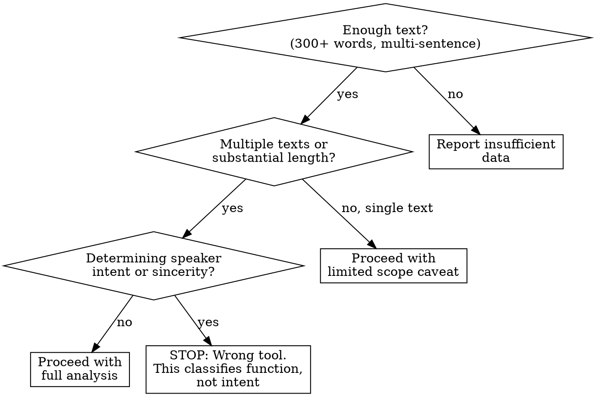
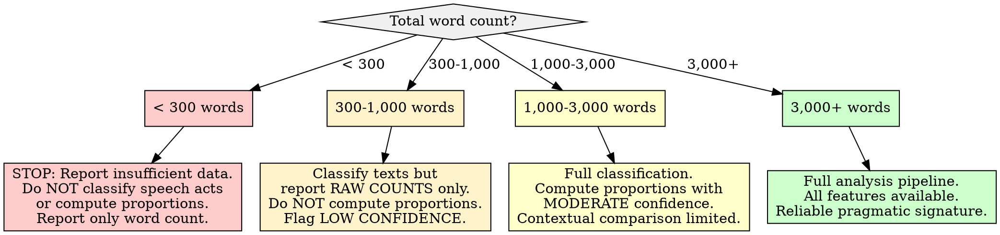

# Speech Act and Pragmatic Analysis

## Overview

Speech act analysis classifies texts by their communicative function -- what the author is DOING with language (asserting, advising, explaining, questioning, challenging, agreeing/supporting) rather than what they are saying. By measuring the proportion of each speech act type across a corpus, the analysis produces a **pragmatic signature**: a distributional profile of how an author uses language to act in the world. The core principle: **speech acts reveal communicative habits that persist across topics** -- a person who predominantly explains and qualifies does so whether discussing technology, politics, or cooking. These proportions produce replicable constraints for voice matching that complement lexical, sentiment, and structural analyses.

**Research foundation:** Speech act theory originates with Austin (1962, *How to Do Things with Words*) who distinguished locutionary (saying), illocutionary (doing by saying), and perlocutionary (effect of saying) acts. Searle (1976) systematized this into five illocutionary categories: assertives (committing to truth), directives (getting hearer to do something), commissives (committing speaker to action), expressives (expressing psychological states), and declarations (bringing about states of affairs). The CMC Act Taxonomy (Herring, Das, & Penumarthy, 2005) adapted speech act theory to computer-mediated communication with 18 act types suitable for online discourse. For pragmatic analysis of written corpora, a hybrid approach combining dictionary-based signal detection with contextual classification produces the most reliable results (Zhang et al., 2011; Qadir & Riloff, 2011).

## When to Use

- Categorizing posts, comments, or documents by what the author is doing (asserting, explaining, questioning, etc.)
- Measuring proportions of speech act types across a corpus to build a communicative profile
- Comparing how an author's communicative function shifts across topics, time periods, or contexts
- Building pragmatic constraints for voice replication ("this author advises 25% of the time, questions 15%")
- Identifying whether an author predominantly informs, persuades, supports, or challenges
- Complementing lexical and sentiment analyses with a functional layer

**When NOT to use:**

- Corpus contains fewer than 300 words total (see Insufficient Data Handling)
- All texts are single words or very short phrases (no illocutionary structure to classify)
- Goal is to determine speaker intent or sincerity (speech acts classify function, not intent)
- Text is machine-generated or heavily templated (speech act distributions reflect the template)
- You need to assess argument quality or persuasive effectiveness (this measures function, not effect)
- Translated text where pragmatic markers may reflect the translator's habits



## Quick Reference

### Speech Act Taxonomy for Written Discourse

This taxonomy is optimized for written online and offline text. It draws from Searle's (1976) illocutionary categories and the CMC Act Taxonomy (Herring et al., 2005), consolidated into six primary categories plus two secondary categories for practical classification.

#### Primary Speech Act Categories

| Speech Act | Illocutionary Function | Linguistic Indicators | Example Signals |
|------------|----------------------|----------------------|-----------------|
| **Asserting** | Committing to the truth of a proposition; stating facts, opinions, or beliefs | Declarative sentences, "I think", "it is", "the fact is", "in my opinion", present tense state verbs, evidential markers | "The problem is that X.", "I believe this is the right approach.", "This is factually incorrect." |
| **Explaining** | Providing reasons, causes, elaborations, or clarifications for a proposition | "because", "the reason is", "this means", "in other words", "what happens is", causal connectives, elaborative markers | "The reason this works is...", "What I mean is...", "This happens because..." |
| **Advising** | Recommending, suggesting, or directing a course of action | Imperatives, "you should", "try", "I recommend", "consider", "make sure", modal verbs of obligation, conditional suggestions | "You should try X.", "I'd recommend doing Y.", "Make sure to check Z." |
| **Questioning** | Seeking information, opinions, or confirmation | Interrogative syntax, question marks, "does anyone know", "how do you", "what is", tag questions, embedded questions | "How does this work?", "Has anyone tried X?", "What would happen if...?" |
| **Challenging** | Disputing, disagreeing, critiquing, or pushing back on a claim | Negation + assertion, "but", "however", "that's not", "I disagree", counter-evidence markers, rhetorical questions as challenges | "That's not correct because...", "I disagree -- the evidence shows...", "How can you say X when Y?" |
| **Agreeing/Supporting** | Endorsing, affirming, validating, or expressing solidarity | "I agree", "exactly", "this", "good point", "+1", affirmative markers, echoing/restating another's position, praise | "Exactly this.", "I completely agree.", "Great point about X.", "This is the right answer." |

#### Secondary Speech Act Categories

| Speech Act | Illocutionary Function | Linguistic Indicators | When to Use |
|------------|----------------------|----------------------|-------------|
| **Expressing** | Conveying emotional reactions, personal experiences, or subjective states without asserting truth | Exclamations, emotion words, personal narratives, "I feel", "I love/hate", interjections | When a text's primary function is emotional expression rather than assertion |
| **Commissive** | Committing oneself to a future action; promising, volunteering, planning | "I will", "I'm going to", "let me", "I'll try", future tense commitments | When a text primarily makes commitments rather than advising others |

### Classification Priority Rules

A single text often performs multiple speech acts. Apply these rules:

1. **Identify the dominant act** -- the primary communicative function of the text as a whole
2. **Identify secondary acts** -- subordinate functions that support or frame the dominant act
3. **When ambiguous**, prefer the act that best describes the OVERALL purpose, not individual sentences
4. **Indirect speech acts** are common -- a question ("Isn't it true that X?") may function as a challenge; an assertion ("You might want to try X") may function as advice. Classify by FUNCTION, not surface form.

### Signal Phrase Dictionaries

```python
import re
from collections import Counter

# Signal phrases for each speech act category.
# These are INDICATORS for initial classification, not deterministic rules.
# Context determines the actual speech act -- a question mark does not
# always indicate questioning (rhetorical questions may challenge).

SPEECH_ACT_SIGNALS = {
    'asserting': {
        'strong': [
            r'\b(?:I think|I believe|in my (?:opinion|view|experience))\b',
            r'\b(?:the (?:fact|truth|reality|point|thing) is)\b',
            r'\b(?:it is|it\'s|this is|that is|that\'s) (?:clear|obvious|true|false|wrong|right|correct|important)\b',
            r'\b(?:clearly|obviously|certainly|undeniably|undoubtedly)\b',
            r'\b(?:I (?:know|see|find|notice|realize|understand) that)\b',
        ],
        'moderate': [
            r'\b(?:actually|basically|essentially|fundamentally)\b',
            r'\b(?:the (?:problem|issue|challenge|question) (?:is|here is))\b',
            r'\b(?:it (?:seems|appears|turns out) (?:that)?)\b',
            r'\b(?:from what I (?:can see|understand|gather))\b',
        ],
    },
    'explaining': {
        'strong': [
            r'\b(?:because|the reason (?:is|being|for this))\b',
            r'\b(?:this (?:means|implies|suggests|indicates) (?:that)?)\b',
            r'\b(?:in other words|put (?:simply|differently)|what (?:this|I) mean[s]? is)\b',
            r'\b(?:to (?:explain|clarify|elaborate|illustrate))\b',
            r'\b(?:what happens is|the way (?:it|this) works)\b',
        ],
        'moderate': [
            r'\b(?:so (?:basically|essentially|what happens))\b',
            r'\b(?:for (?:example|instance)|such as|e\.g\.|i\.e\.)\b',
            r'\b(?:that is to say|namely|specifically)\b',
            r'\b(?:here\'s (?:why|how|what))\b',
        ],
    },
    'advising': {
        'strong': [
            r'\b(?:you should|you need to|you have to|you must)\b',
            r'\b(?:I (?:would |\'d )?recommend|I (?:would |\'d )?suggest)\b',
            r'\b(?:make sure (?:to|you)|be sure to|don\'t forget to)\b',
            r'\b(?:try (?:to |doing |using )?|consider (?:doing |using )?)\b',
            r'^(?:do|use|check|look at|start with|go with)\b',
        ],
        'moderate': [
            r'\b(?:you (?:might|could|may) (?:want to|try|consider))\b',
            r'\b(?:it (?:would be|might be|could be) (?:worth|good|better|helpful) (?:to)?)\b',
            r'\b(?:if I were you|in your (?:place|shoes|position))\b',
            r'\b(?:my (?:advice|suggestion|recommendation) (?:is|would be))\b',
            r'\b(?:pro tip|tip:|fwiw|for what it\'s worth)\b',
        ],
    },
    'questioning': {
        'strong': [
            r'\?$',  # Ends with question mark
            r'\b(?:does anyone (?:know|have|else))\b',
            r'\b(?:how (?:do|does|can|would|should|did) (?:you|I|we|one))\b',
            r'\b(?:what (?:is|are|was|were|do|does|would|should))\b',
            r'\b(?:can (?:someone|anyone|you) (?:explain|help|tell|point))\b',
            r'\b(?:is (?:there|it|this) (?:a|any|the))\b.*\?',
        ],
        'moderate': [
            r'\b(?:(?:I\'m |I am )?(?:wondering|curious) (?:if|about|whether))\b',
            r'\b(?:any (?:thoughts|ideas|suggestions|recommendations))\b',
            r'\b(?:has anyone (?:tried|used|experienced|seen))\b',
            r'\b(?:thoughts\??|opinions\??|suggestions\??)\b',
        ],
    },
    'challenging': {
        'strong': [
            r'\b(?:I disagree|I (?:don\'t|do not) (?:agree|think|believe))\b',
            r'\b(?:that\'s (?:not|wrong|incorrect|false|misleading|inaccurate))\b',
            r'\b(?:no,? (?:that\'s|it\'s|this is) (?:not|wrong))\b',
            r'\b(?:you\'re (?:wrong|mistaken|missing|ignoring|overlooking))\b',
            r'\b(?:this (?:is|seems) (?:wrong|incorrect|misleading|false))\b',
        ],
        'moderate': [
            r'\b(?:but (?:that|this|the|what about))\b',
            r'\b(?:(?:however|on the other hand|conversely),? )\b',
            r'\b(?:the (?:problem|issue|flaw) with (?:this|that|your))\b',
            r'\b(?:that (?:doesn\'t|does not) (?:make sense|hold up|follow|work))\b',
            r'\b(?:I\'m not (?:sure|convinced|persuaded) (?:that|about))\b',
        ],
    },
    'agreeing_supporting': {
        'strong': [
            r'\b(?:I (?:completely |totally |fully |strongly )?agree)\b',
            r'\b(?:exactly|precisely|absolutely|100%|this \^+)\b',
            r'\b(?:(?:great|good|excellent|fantastic) (?:point|answer|explanation|post))\b',
            r'^(?:this\.?|this!|same\.?|\+1|seconded|agreed)$',
            r'\b(?:you\'re (?:right|correct|absolutely right|spot on))\b',
        ],
        'moderate': [
            r'\b(?:I (?:also |additionally )?(?:think|feel|find) (?:the same|so too|similarly))\b',
            r'\b(?:fair (?:point|enough)|well (?:said|put))\b',
            r'\b(?:to add to (?:this|that|what|your point))\b',
            r'\b(?:building on (?:this|that|what))\b',
            r'\b(?:I (?:second|endorse|support|echo) (?:this|that|your))\b',
        ],
    },
}

# Secondary categories (used when primary categories don't fit well)
SECONDARY_SIGNALS = {
    'expressing': {
        'strong': [
            r'\b(?:I (?:love|hate|enjoy|despise|adore|loathe))\b',
            r'\b(?:(?:so |really |incredibly |extremely )?(?:frustrated|excited|amazed|disappointed|impressed|annoyed))\b',
            r'\b(?:ugh|wow|yikes|lol|omg|smh|sigh)\b',
            r'(?:!{2,})',  # Multiple exclamation marks
        ],
    },
    'commissive': {
        'strong': [
            r'\b(?:I (?:will|\'ll|am going to|plan to|intend to))\b',
            r'\b(?:let me (?:try|check|look|see|get back))\b',
            r'\b(?:I (?:promise|commit|pledge|guarantee))\b',
        ],
    },
}
```

### Confidence Levels

| Confidence | Criteria | Treatment |
|------------|----------|-----------|
| **High** | 2+ strong signals for the same act; no conflicting signals for other acts | Count toward primary distribution |
| **Moderate** | 1 strong signal or 2+ moderate signals; minor conflicting signals | Count toward primary distribution with note |
| **Low** | Only moderate signals; conflicting signals for multiple acts | Flag as ambiguous; count primary but note ambiguity |
| **Indeterminate** | No clear signals; text too short; multiple acts equally represented | Exclude from proportional analysis; report separately |

## Workflow

Copy this checklist and track progress:

```
Speech Act & Pragmatic Analysis Progress:
- [ ] Step 1: Validate corpus suitability and classify text units
- [ ] Step 2: Classify each text unit by primary and secondary speech acts
- [ ] Step 3: Compute speech act proportions and dominance profile
- [ ] Step 4: Analyze speech act distribution across contexts
- [ ] Step 5: Identify indirect speech acts and pragmatic patterns
- [ ] Step 6: Compute pragmatic signature and replication constraints
- [ ] Step 7: Write findings to docs/analysis/22-speech-act-pragmatic.md
```

### Step 1: Validate Corpus Suitability

Before analysis, verify the corpus has sufficient material for speech act classification.

**Suitability checks:**

| Check | Pass Condition | Fail Action |
|-------|---------------|-------------|
| **Total word count** | 300+ words across corpus | Below 300: STOP. Report insufficient data. Speech acts cannot be reliably classified. |
| **Multi-sentence texts** | At least 40% of texts contain 2+ sentences | If most texts are single sentences, classification is possible but confidence is reduced. Flag prominently. |
| **Text unit count** | At least 10 classifiable text units | Fewer than 10: proportions are unreliable. Report raw counts only; do NOT compute percentages. |
| **Language** | Predominantly English | Non-English text invalidates the signal dictionaries. Adapt or flag. |
| **Authorship** | Single author or known author set | Mixed authorship produces community-level pragmatic patterns, not individual signatures. Document prominently. |
| **Contextual diversity** | Note the contexts/topics present | If all texts are from a single narrow context (e.g., all responses to tech questions), the pragmatic profile is context-bound. Do NOT generalize. |
| **Platform conventions** | Note platform norms | Some platforms encourage specific speech acts (Q&A sites encourage questioning/explaining; debate forums encourage challenging). |

**If corpus fails suitability:** Report the failure. State what was checked, what failed, and why speech act analysis is unreliable. Do not force analysis on unsuitable data.

**Defining text units:** A text unit is the smallest independently classifiable segment. Typically:
- One post or comment = one text unit (for online corpora)
- One paragraph = one text unit (for long-form documents)
- One conversational turn = one text unit (for dialogue)

For long texts with multiple speech acts, segment at paragraph boundaries and classify each paragraph.

### Step 2: Classify Each Text Unit

For each text unit, determine the primary and (optionally) secondary speech act.

**Classification approach (hybrid: signal-based + contextual):**

1. **Signal scan:** Match text against signal phrase dictionaries to identify candidate speech acts
2. **Contextual override:** Review candidates in context -- indirect speech acts are common; surface form may not match function
3. **Dominance determination:** Assign the primary speech act based on overall communicative purpose
4. **Secondary assignment:** If a subordinate function is clearly present, assign a secondary speech act

```python
def classify_speech_act(text, context=None):
    """Classify a text unit by its primary speech act.

    Returns: {
        'primary': (act_label, confidence),
        'secondary': (act_label, confidence) or None,
        'signals_found': {act: [signals]},
        'is_indirect': bool,
        'notes': str
    }
    """
    text_lower = text.lower().strip()
    if len(text_lower.split()) < 3:
        return {
            'primary': ('indeterminate', 'n/a'),
            'secondary': None,
            'signals_found': {},
            'is_indirect': False,
            'notes': 'Text too short for reliable classification'
        }

    # Phase 1: Signal scan
    act_scores = {}
    signals_found = {}

    for act, signal_groups in SPEECH_ACT_SIGNALS.items():
        strong_count = 0
        moderate_count = 0
        found = []
        for pattern in signal_groups.get('strong', []):
            matches = re.findall(pattern, text_lower, re.IGNORECASE | re.MULTILINE)
            if matches:
                strong_count += len(matches)
                found.append(('strong', pattern, len(matches)))
        for pattern in signal_groups.get('moderate', []):
            matches = re.findall(pattern, text_lower, re.IGNORECASE | re.MULTILINE)
            if matches:
                moderate_count += len(matches)
                found.append(('moderate', pattern, len(matches)))

        # Weighted score: strong signals count double
        score = strong_count * 2 + moderate_count
        if score > 0:
            act_scores[act] = score
            signals_found[act] = found

    if not act_scores:
        return {
            'primary': ('indeterminate', 'low'),
            'secondary': None,
            'signals_found': {},
            'is_indirect': False,
            'notes': 'No clear speech act signals detected'
        }

    # Phase 2: Rank candidates
    ranked = sorted(act_scores.items(), key=lambda x: x[1], reverse=True)
    primary_act = ranked[0][0]
    primary_score = ranked[0][1]

    # Confidence determination
    if primary_score >= 4:
        confidence = 'high'
    elif primary_score >= 2:
        confidence = 'moderate'
    else:
        confidence = 'low'

    # Check for close second (potential multi-act or indirect)
    secondary = None
    is_indirect = False
    notes = ''

    if len(ranked) > 1:
        second_act = ranked[1][0]
        second_score = ranked[1][1]
        if second_score >= primary_score * 0.6:
            secondary = (second_act, 'moderate')
            notes = f'Close secondary: {second_act} (score ratio: {second_score/primary_score:.2f})'

        # Detect common indirect patterns
        if primary_act == 'questioning' and second_act == 'challenging':
            is_indirect = True
            notes += ' | Possible rhetorical question functioning as challenge'
        elif primary_act == 'asserting' and second_act == 'advising':
            is_indirect = True
            notes += ' | Possible indirect advice via assertion'

    return {
        'primary': (primary_act, confidence),
        'secondary': secondary,
        'signals_found': signals_found,
        'is_indirect': is_indirect,
        'notes': notes,
    }
```

**Critical caveat -- indirect speech acts:** Surface form frequently diverges from communicative function in written text:

| Surface Form | Actual Function | Example |
|-------------|----------------|---------|
| Question | Challenge | "How can you possibly justify X?" |
| Assertion | Advice | "I found that doing X works well" (implying: you should try X) |
| Question | Request/Advice | "Have you tried restarting?" (implying: restart it) |
| Assertion | Agreement | "That's exactly what happened to me" (implying: I support your point) |
| Explanation | Challenge | "Well, technically, the definition of X is..." (implying: you are wrong) |

When signal-based classification suggests one act but contextual reading suggests another, **classify by function, not form**. Note the indirectness in the classification record.

### Step 3: Compute Speech Act Proportions

```python
def compute_speech_act_profile(classifications):
    """Compute speech act proportions from a list of classifications.

    Args:
        classifications: list of dicts from classify_speech_act()

    Returns: dict with proportions, dominance ranking, and confidence metrics.
    """
    primary_counts = Counter()
    secondary_counts = Counter()
    confidence_counts = {'high': 0, 'moderate': 0, 'low': 0, 'n/a': 0}
    indirect_count = 0
    total = len(classifications)

    for c in classifications:
        primary_act, conf = c['primary']
        primary_counts[primary_act] += 1
        confidence_counts[conf] += 1

        if c['secondary']:
            sec_act, _ = c['secondary']
            secondary_counts[sec_act] += 1

        if c['is_indirect']:
            indirect_count += 1

    # Remove indeterminate from proportion calculations
    classifiable = total - primary_counts.get('indeterminate', 0)

    if classifiable == 0:
        return {
            'error': 'No classifiable texts',
            'total_texts': total,
            'indeterminate_count': primary_counts.get('indeterminate', 0),
        }

    # Compute proportions (excluding indeterminate)
    proportions = {}
    for act in ['asserting', 'explaining', 'advising', 'questioning',
                 'challenging', 'agreeing_supporting']:
        count = primary_counts.get(act, 0)
        proportions[act] = {
            'count': count,
            'proportion': round(count / classifiable, 3),
            'percentage': round(count / classifiable * 100, 1),
        }

    # Dominance ranking
    ranked = sorted(proportions.items(),
                    key=lambda x: x[1]['count'], reverse=True)

    # Pragmatic diversity: how evenly distributed are the speech acts?
    # Shannon entropy normalized to [0, 1]
    import math
    entropy = 0
    for act_data in proportions.values():
        p = act_data['proportion']
        if p > 0:
            entropy -= p * math.log2(p)
    max_entropy = math.log2(len(proportions))  # maximum if perfectly even
    normalized_entropy = entropy / max_entropy if max_entropy > 0 else 0

    return {
        'total_texts': total,
        'classifiable_texts': classifiable,
        'indeterminate_count': primary_counts.get('indeterminate', 0),
        'proportions': proportions,
        'dominance_ranking': [(act, data) for act, data in ranked],
        'dominant_act': ranked[0][0] if ranked else None,
        'dominant_proportion': ranked[0][1]['proportion'] if ranked else 0,
        'secondary_act_counts': dict(secondary_counts),
        'indirect_speech_act_count': indirect_count,
        'indirect_rate': round(indirect_count / max(total, 1), 3),
        'pragmatic_diversity': round(normalized_entropy, 3),
        'confidence_distribution': confidence_counts,
        'classification_rate': round(classifiable / max(total, 1), 3),
    }
```

**Interpreting pragmatic diversity (normalized Shannon entropy):**

| Diversity Score | Interpretation |
|----------------|----------------|
| 0.0 - 0.3 | **Highly concentrated**: author overwhelmingly uses 1-2 speech act types |
| 0.3 - 0.6 | **Moderately concentrated**: 2-3 dominant types with others present |
| 0.6 - 0.8 | **Balanced**: several speech act types used regularly |
| 0.8 - 1.0 | **Highly diverse**: speech acts are nearly evenly distributed |

### Step 4: Analyze Distribution Across Contexts

If the corpus includes metadata (topic, subreddit, time period, audience), compare speech act distributions across contexts.

```python
def compare_distributions(profile_a, profile_b, label_a='Context A', label_b='Context B'):
    """Compare speech act distributions between two contexts.
    Returns per-act differences and an overall shift metric."""
    acts = ['asserting', 'explaining', 'advising', 'questioning',
            'challenging', 'agreeing_supporting']

    comparisons = []
    total_shift = 0

    for act in acts:
        prop_a = profile_a['proportions'].get(act, {}).get('proportion', 0)
        prop_b = profile_b['proportions'].get(act, {}).get('proportion', 0)
        diff = prop_b - prop_a
        total_shift += abs(diff)

        comparisons.append({
            'act': act,
            f'{label_a}_pct': round(prop_a * 100, 1),
            f'{label_b}_pct': round(prop_b * 100, 1),
            'shift_pct': round(diff * 100, 1),
            'direction': 'increase' if diff > 0 else 'decrease' if diff < 0 else 'stable',
        })

    return {
        'comparisons': comparisons,
        'total_shift': round(total_shift, 3),
        'interpretation': (
            'minimal shift' if total_shift < 0.1 else
            'moderate shift' if total_shift < 0.3 else
            'substantial shift'
        ),
    }
```

**What contextual shifts reveal:**
- Shift from explaining to advising across topics may indicate domain confidence
- Shift from questioning to asserting over time may indicate growing expertise
- Shift from agreeing to challenging across audiences may indicate audience adaptation
- Stable distributions across contexts suggest deeply embedded communicative habits

### Step 5: Identify Indirect Speech Acts and Pragmatic Patterns

Beyond individual classifications, look for corpus-level pragmatic patterns.

**Patterns to detect:**

| Pattern | Detection Method | Significance |
|---------|-----------------|-------------|
| **High indirect rate** | >20% of texts classified as indirect | Author frequently uses indirect communication; surface-level analysis would misclassify |
| **Act sequences** | Pairs of consecutive speech acts (in threaded conversations) | Reveals conversational patterns: does author explain-then-advise? question-then-challenge? |
| **Dominant act concentration** | Top act >50% of corpus | Strong pragmatic specialization; author has a clear communicative default |
| **Challenge-to-agree ratio** | challenging / agreeing_supporting | High ratio = confrontational pragmatic style; low = affiliative |
| **Question-to-explain ratio** | questioning / explaining | High ratio = inquiry-oriented; low = exposition-oriented |
| **Advising density** | advising proportion | High advising = authoritative/helpful posture; low = descriptive/analytical posture |

### Step 6: Compute Pragmatic Signature and Replication Constraints

Synthesize all findings into a pragmatic signature -- a compact profile of the author's communicative habits.

**Pragmatic signature format:**

```markdown
## Pragmatic Signature

### Speech Act Distribution
| Act | Proportion | Rank | Replication Weight |
|-----|-----------|------|--------------------|
| [dominant act] | [X%] | 1 | HIGH |
| [second act] | [X%] | 2 | HIGH |
| [third act] | [X%] | 3 | MEDIUM |
| ... | ... | ... | LOW |

### Pragmatic Ratios
- Challenge-to-Agree ratio: [X.XX] ([confrontational/balanced/affiliative])
- Question-to-Explain ratio: [X.XX] ([inquiry-oriented/balanced/exposition-oriented])
- Indirect speech act rate: [X%] ([low/moderate/high])
- Pragmatic diversity: [X.XX] ([concentrated/moderate/diverse])

### Replication Constraints
1. [Top act] should appear in approximately [X]% of generated texts
2. [Second act] should appear in approximately [X]% of generated texts
3. Indirect speech acts should occur at [X]% rate
4. [Specific ratio constraint, e.g., "Challenge roughly twice as often as agree"]
5. [Context-specific constraint if applicable]
```

**Replication weight assignment:**

| Criterion | Weight |
|-----------|--------|
| Dominant act (rank 1-2) with proportion > 20% | HIGH |
| Acts with proportion 10-20% | MEDIUM |
| Acts with proportion < 10% | LOW (include for completeness but don't force in replication) |
| Pragmatic ratios with extreme values (>2.0 or <0.5) | HIGH (distinctive feature) |
| Indirect speech act rate if >15% | HIGH (must replicate indirectness) |

### Step 7: Write the Report

Write all findings to `docs/analysis/22-speech-act-pragmatic.md`. See the report template below.

## Report Output Template

The final report MUST be written to `docs/analysis/22-speech-act-pragmatic.md` with this structure:

```markdown
# Speech Act and Pragmatic Analysis

## Methodology
- **Approach:** Hybrid signal-based + contextual speech act classification
- **Taxonomy:** Six primary acts (asserting, explaining, advising, questioning, challenging, agreeing/supporting) + two secondary acts (expressing, commissive), adapted from Searle (1976) and CMC Act Taxonomy (Herring et al., 2005)
- **Corpus:** [N words, N text units, date range, source description]
- **Classification method:** Signal phrase dictionary matching with contextual override for indirect speech acts
- **Confidence levels:** High (2+ strong signals), Moderate (1 strong or 2+ moderate), Low (ambiguous signals), Indeterminate (excluded from proportions)

## Corpus Suitability Assessment
- **Word count:** [N] words ([sufficient / insufficient / marginal])
- **Text unit count:** [N] units ([sufficient for proportions / raw counts only])
- **Multi-sentence texts:** [N] of [N] texts have 2+ sentences ([X%])
- **Language:** [English / mixed]
- **Authorship:** [single / multiple / unknown]
- **Contextual diversity:** [list contexts/topics present]
- **Platform conventions:** [platform norms that may bias speech act distribution]
- **Overall suitability:** [suitable / suitable with caveats / unsuitable]

## Speech Act Distribution

### Primary Speech Acts

| Speech Act | Count | Proportion | Percentage | Confidence (High/Mod/Low) |
|-----------|-------|-----------|------------|--------------------------|
| Asserting | [N] | [X.XXX] | [X.X%] | [N] / [N] / [N] |
| Explaining | [N] | [X.XXX] | [X.X%] | [N] / [N] / [N] |
| Advising | [N] | [X.XXX] | [X.X%] | [N] / [N] / [N] |
| Questioning | [N] | [X.XXX] | [X.X%] | [N] / [N] / [N] |
| Challenging | [N] | [X.XXX] | [X.X%] | [N] / [N] / [N] |
| Agreeing/Supporting | [N] | [X.XXX] | [X.X%] | [N] / [N] / [N] |
| **Classifiable total** | **[N]** | **1.000** | **100%** | |
| Indeterminate | [N] | -- | -- | |

**Dominant speech act:** [act] ([X%])
**Classification rate:** [X%] of text units successfully classified

### Secondary Speech Acts (where detected)
| Speech Act | Count | Notes |
|-----------|-------|-------|
| Expressing | [N] | [context notes] |
| Commissive | [N] | [context notes] |

### Dominance Ranking
1. [Act]: [X%] -- [interpretation of what this dominance means for communicative style]
2. [Act]: [X%]
3. [Act]: [X%]
4. [Act]: [X%]
5. [Act]: [X%]
6. [Act]: [X%]

## Pragmatic Ratios and Metrics

| Metric | Value | Interpretation |
|--------|-------|----------------|
| Challenge-to-Agree ratio | [X.XX] | [confrontational / balanced / affiliative] |
| Question-to-Explain ratio | [X.XX] | [inquiry-oriented / balanced / exposition-oriented] |
| Indirect speech act rate | [X%] | [low (<10%) / moderate (10-20%) / high (>20%)] |
| Pragmatic diversity (entropy) | [X.XX] | [concentrated / moderate / diverse] |
| Advising density | [X%] | [low / moderate / high -- authoritative/helpful posture indicator] |

## Indirect Speech Act Analysis

| Indirect Pattern | Count | Example | Surface Form -> Actual Function |
|-----------------|-------|---------|-------------------------------|
| [pattern] | [N] | [example from corpus] | [form] -> [function] |

**Overall indirect rate:** [X%] of classified texts contain indirect speech acts
**Most common indirect pattern:** [description]

## Contextual Distribution Comparison
[If multiple contexts available]

| Speech Act | [Context A] | [Context B] | Shift | Direction |
|-----------|-------------|-------------|-------|-----------|
| Asserting | [X%] | [X%] | [+/-X%] | [increase/decrease/stable] |
| Explaining | [X%] | [X%] | [+/-X%] | [increase/decrease/stable] |
| ... | ... | ... | ... | ... |

**Total shift magnitude:** [X.XXX] ([minimal / moderate / substantial])
**Key contextual findings:** [What do the shifts reveal about audience adaptation, topic expertise, or communicative flexibility?]

## Pragmatic Signature

### Speech Act Profile
| Act | Proportion | Rank | Replication Weight |
|-----|-----------|------|--------------------|
| [act] | [X%] | 1 | HIGH |
| [act] | [X%] | 2 | HIGH |
| [act] | [X%] | 3 | MEDIUM |
| [act] | [X%] | 4 | LOW |
| [act] | [X%] | 5 | LOW |
| [act] | [X%] | 6 | LOW |

### Pragmatic Constraints for Voice Replication
| Constraint | Value | Priority |
|-----------|-------|----------|
| Dominant act proportion | [act] at ~[X%] | HIGH |
| Secondary act proportion | [act] at ~[X%] | HIGH |
| Challenge-to-agree ratio | ~[X.XX] | [HIGH if extreme, else MEDIUM] |
| Indirect speech act rate | ~[X%] | [HIGH if >15%, else LOW] |
| Pragmatic diversity target | [X.XX] ([concentrated/diverse]) | MEDIUM |
| [Context-specific constraint] | [value] | [priority] |

### Composite Pragmatic Style
[1-2 sentence characterization: e.g., "Predominantly explanatory-assertive style with moderate advising. Low challenge rate and high indirect speech act usage suggest a cooperative, non-confrontational communicative posture that teaches rather than argues."]

## Limitations and Caveats
- Signal-based classification uses surface-level linguistic markers. Indirect speech acts (estimated at [X%] of this corpus) are identified through contextual heuristics, not deep pragmatic parsing.
- Speech act classification is inherently judgment-based. Inter-annotator agreement in published studies typically ranges from kappa = 0.65-0.80 for coarse categories. Automated signal-matching may fall below this.
- Proportions are meaningful only with sufficient text units (10+ recommended). With [N] text units, the margin of error on proportions is approximately +/- [computed or estimated margin].
- Speech act distributions are context-sensitive. This profile reflects the author's communicative habits IN THIS CORPUS and may differ in other contexts, audiences, or platforms.
- The taxonomy collapses Searle's five categories into six primary acts optimized for written discourse. Declarations (performatives) are excluded as they are rare in non-institutional written text.
- Platform conventions may bias distributions: Q&A sites inflate questioning/explaining; debate forums inflate challenging; social platforms inflate agreeing/expressing.
- [Corpus-specific limitations from Step 1]
- These results describe communicative FUNCTION, not speaker INTENT. An author who frequently challenges may do so out of intellectual rigor, hostility, or pedagogical habit -- speech act analysis cannot distinguish these motivations.

## References
- Austin, J.L. (1962). *How to Do Things with Words*. Oxford University Press.
- Searle, J.R. (1976). A classification of illocutionary acts. *Language in Society*, 5(1), 1-23.
- Herring, S.C., Das, A., & Penumarthy, S. (2005). CMC Act Taxonomy. Indiana University.
- Zhang, R., Gao, D., & Li, W. (2011). What are tweeters doing: Recognizing speech acts in Twitter. *AAAI-11 Workshop on Analyzing Microtext*.
- Qadir, A. & Riloff, E. (2011). Classifying sentences as speech acts in message board posts. *EMNLP 2011*.
- Bach, K. & Harnish, R.M. (1979). *Linguistic Communication and Speech Acts*. MIT Press.
- Jurafsky, D. et al. (1997). Automatic detection of discourse structure for speech recognition and understanding. *IEEE Workshop on Automatic Speech Recognition and Understanding*.
```

## Good Patterns

- **Classify by communicative function, not surface form** -- "Have you tried X?" is advice disguised as a question; classify it as advising
- **Use a clear, consolidated taxonomy** -- six primary acts are enough for written discourse; finer-grained taxonomies reduce reliability without adding insight
- **Combine signal-based detection with contextual classification** -- dictionaries find candidates, human/LLM judgment resolves ambiguity
- **Report proportions, not just counts** -- "35% asserting, 25% explaining" is interpretable; "47 assertions, 33 explanations" is not
- **Assign confidence levels per classification** -- distinguish high-confidence from ambiguous classifications; report confidence distributions
- **Compute pragmatic diversity** -- a single dominance number misses whether the remaining acts are evenly spread or all concentrated in one alternative
- **Compare distributions across contexts** -- a stable distribution reveals deep communicative habits; shifts reveal audience adaptation
- **Produce replicable pragmatic constraints** -- the output should specify target proportions, not just describe patterns
- **Flag indirect speech acts explicitly** -- indirect acts are common (10-25% in most corpora) and are the single largest source of misclassification
- **Use the pragmatic signature as a voice differentiator** -- two authors with identical vocabulary may have very different speech act profiles

## Anti-Patterns

| Anti-Pattern | Why It Fails | Instead |
|--------------|-------------|---------|
| Treating speech acts as mutually exclusive per text | Many texts perform multiple speech acts simultaneously. A text can assert AND explain AND advise. | Assign primary and secondary acts. Note multi-act texts. Use the dominant act for proportions. |
| Relying solely on surface markers without context | "Have you tried restarting?" has a question mark but functions as advice. "Isn't that wrong?" is a challenge, not a question. | Use signal dictionaries for candidates, then apply contextual override for indirect speech acts. |
| Ignoring that indirect speech acts are common | 10-25% of speech acts in typical online discourse are indirect. Ignoring this produces systematically biased proportions. | Explicitly detect and classify indirect acts. Report the indirect rate. Note which acts are most commonly indirect. |
| Using too fine-grained a taxonomy | 15+ categories reduce inter-rater reliability below useful thresholds. Distinguishing "requesting" from "suggesting" from "recommending" adds noise. | Use 6 primary categories. Sub-classify only when a specific analysis question demands it. |
| Assuming speech act distribution is stable across all topics | An author may explain on technical topics, question on political topics, and advise on personal topics. | Compare distributions across contexts when metadata allows. Report context-bound findings, not universal claims. |
| Claiming to capture speaker intent | Speech act analysis classifies communicative FUNCTION. "Why did the author challenge?" requires psychological inference beyond pragmatics. | Describe function. Never attribute motivation, sincerity, or psychological state from speech act distributions alone. |
| Counting question marks as questions | Question marks are punctuation, not speech acts. Rhetorical questions, challenges-as-questions, and advice-as-questions are all common. | Use full signal pattern matching plus contextual review. A question mark is ONE signal among many. |
| Ignoring platform conventions | Q&A sites inflate questioning; debate forums inflate challenging; social platforms inflate agreeing. Treating these as individual habits is an ecological fallacy. | Document platform norms. Note which proportions may be platform-driven rather than author-driven. |
| Computing proportions from fewer than 10 texts | With 5 texts, one text = 20% of the distribution. A single misclassification changes the entire profile. | Require 10+ text units for proportional analysis. Below 10, report only raw counts with a "proportions unreliable" caveat. |

## Boundaries

**This skill SHOULD produce:**
- Classification of each text unit by primary (and optionally secondary) speech act with confidence levels
- Speech act proportion distribution across the corpus with dominance ranking
- Pragmatic ratios (challenge-to-agree, question-to-explain, advising density) as voice differentiators
- Indirect speech act detection with rate measurement and pattern identification
- Contextual distribution comparisons when metadata supports it
- Pragmatic diversity measurement (Shannon entropy) for distributional characterization
- A pragmatic signature with ranked proportions and replicable constraints for voice matching
- Written report at `docs/analysis/22-speech-act-pragmatic.md`

**This skill should NOT:**
- Claim to capture speaker intent, sincerity, or psychological motivation from speech act distributions
- Ignore indirect/implied speech acts (which are common and cause systematic bias if missed)
- Use pragmatic analysis for deception detection, credibility assessment, or trustworthiness scoring
- Assume speech acts map 1:1 to linguistic forms (surface form frequently diverges from function)
- Generalize a context-bound pragmatic profile to all contexts the author writes in
- Treat speech act classifications as deterministic (they are probabilistic and judgment-dependent)
- Use this analysis to make evaluative claims about communication quality or effectiveness
- Attribute personality traits or character assessments from speech act proportions
- Compute proportions from fewer than 10 text units (report raw counts only)
- Apply the English signal dictionaries to non-English text without adaptation

## Insufficient Data Handling



| Condition | Action |
|-----------|--------|
| **Corpus < 300 words** | STOP. Do NOT classify speech acts or compute proportions. Report only: total word count and text unit count. State that the corpus is too small for pragmatic profiling. |
| **Corpus 300-1,000 words** | Classify individual texts but report RAW COUNTS only. Do NOT compute proportions (too few units for reliable percentages). Flag all results as LOW CONFIDENCE. Skip contextual comparison. |
| **Corpus 1,000-3,000 words** | Full classification with MODERATE confidence. Compute proportions but note that the margin of error is wide. Contextual comparison is possible only if each context has 5+ text units. |
| **Corpus 3,000+ words** | Full analysis pipeline. All features available. Pragmatic signature is reliable if 10+ text units exist. |
| **Fewer than 10 text units** | Report raw counts only. Do NOT compute proportions. State that proportional analysis requires at least 10 classifiable text units. |
| **Most texts are highly ambiguous (>50% indeterminate)** | Report the high ambiguity rate as a finding. Compute proportions only over the classifiable subset, but note that the subset may not be representative. Investigate why texts are ambiguous (too short? mixed acts? unusual register?). |
| **Single context only** | All analysis is valid but context-bound. Note prominently that the pragmatic profile may differ in other contexts. Do NOT claim the profile represents the author's general communicative style. |
| **Single very long text** | Segment at paragraph boundaries. If fewer than 10 segments result, treat as low-confidence. The profile describes one writing occasion, not a stable habit. |
| **Corpus lacks contextual diversity** | Proportions are valid but context-specific. Note that the pragmatic profile reflects behavior in [specific context] and may differ elsewhere. |

## Common Mistakes

| Mistake | Fix |
|---------|-----|
| Classifying every text with a "?" as questioning | Many questions function as challenges, advice, or rhetorical devices. Check function, not punctuation. |
| Ignoring indirect speech acts | Budget 10-25% of texts as potentially indirect. Use contextual override after signal matching. |
| Computing proportions from 5 texts | With 5 texts, one misclassification = 20% error. Require 10+ units. Below that, report counts only. |
| Treating all asserting as equivalent | "I think X" and "X is definitely true" are both assertive but differ in epistemic commitment. Note hedged vs. emphatic assertions if relevant. |
| Assuming stable distributions across contexts | Compare across contexts when possible. Report context-bound findings. |
| Confusing high challenge rate with negativity | Challenging is a speech act function, not a sentiment. Intellectual challenge can be positive, constructive, and collaborative. Do not conflate with negative affect. |
| Counting advice-as-question as questioning | "Have you tried X?" is advice. "Why don't you do X?" is advice. Classify by function. |
| Not reporting confidence levels | Without confidence, high-quality and low-quality classifications are treated equally. Always report confidence distribution. |
| Applying proportions as hard targets for replication | Proportions are approximate targets, not exact quotas. Use ranges (e.g., "25-35% asserting") not point estimates ("29.3% asserting"). |
| Skipping the pragmatic signature synthesis | Individual proportions and ratios are less useful than the composite signature. Always synthesize into a coherent pragmatic characterization. |

## References

- [Austin, J.L. (1962). *How to Do Things with Words*. Oxford University Press.](https://en.wikipedia.org/wiki/How_to_Do_Things_with_Words)
- [Searle, J.R. (1976). A classification of illocutionary acts. *Language in Society*, 5(1), 1-23.](https://en.wikipedia.org/wiki/Speech_act)
- [Herring, S.C., Das, A., & Penumarthy, S. (2005). CMC Act Taxonomy.](https://homes.luddy.indiana.edu/herring/cmc.acts.html)
- [Speech Acts (Stanford Encyclopedia of Philosophy).](https://plato.stanford.edu/entries/speech-acts/)
- [Zhang, R., Gao, D., & Li, W. (2011). What are tweeters doing: Recognizing speech acts in Twitter. *AAAI-11 Workshop on Analyzing Microtext*.](https://www.aaai.org/ocs/index.php/WS/AAAIW11/paper/view/3994)
- [Qadir, A. & Riloff, E. (2011). Classifying sentences as speech acts in message board posts. *EMNLP 2011*.](https://aclanthology.org/D11-1141/)
- Bach, K. & Harnish, R.M. (1979). *Linguistic Communication and Speech Acts*. MIT Press.
- [Jurafsky, D. (2004). Pragmatics and Computational Linguistics. In *Handbook of Pragmatics*.](https://web.stanford.edu/~jurafsky/prag.pdf)
- [Viera, A.J. & Garrett, J.M. (2005). Understanding interobserver agreement: the kappa statistic. *Family Medicine*, 37(5), 360-363.](https://pubmed.ncbi.nlm.nih.gov/15883903/)
- [Herring, S.C. (2010). Introduction to the pragmatics of computer-mediated communication.](https://homes.luddy.indiana.edu/herring/CMC.pragmatics.intro.herring.et.al.pdf)
