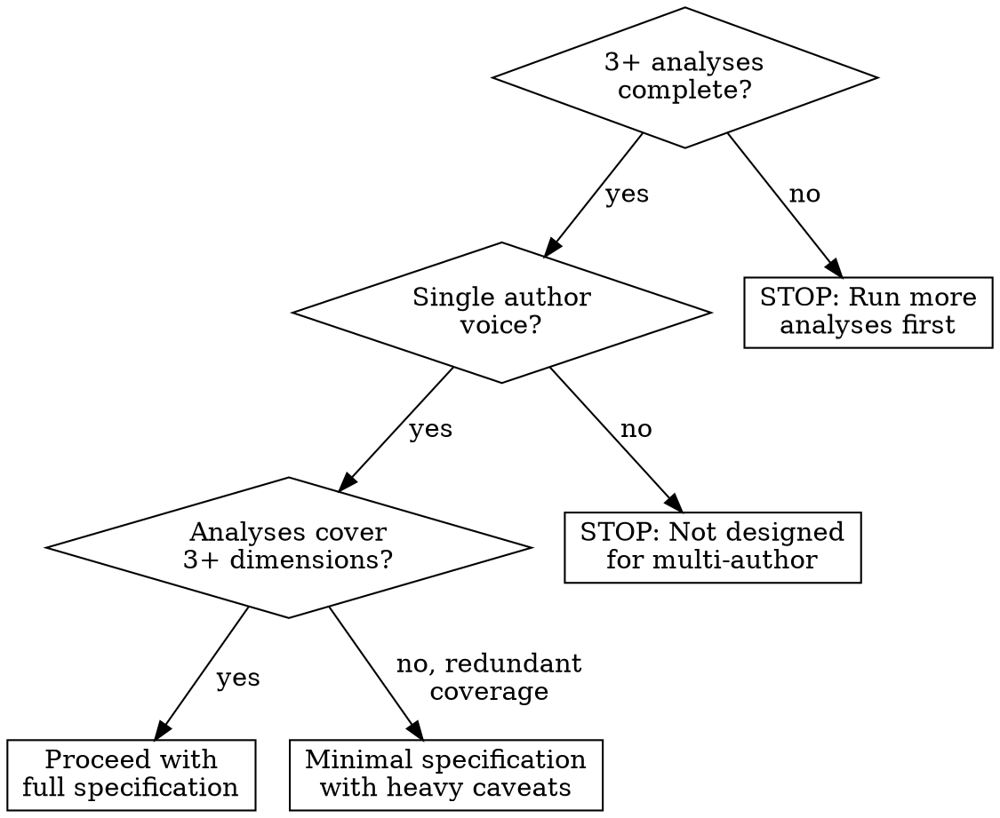
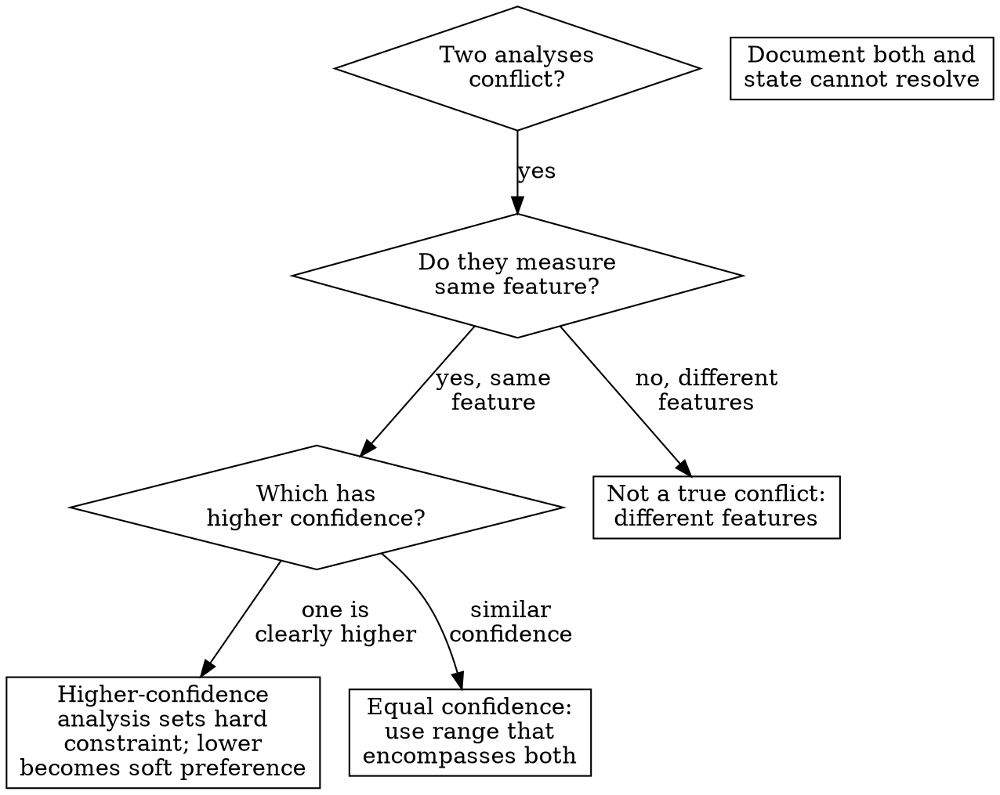

# Building the Style Specification

## Overview

Translate all prior analysis outputs into a single, implementable style specification by mapping each finding to a concrete writing constraint, resolving conflicts between analyses, and producing both a numeric profile and a prose description usable as an LLM system prompt or human writing guide. The core principle: **every constraint in the specification must trace to a specific analysis finding with a stated confidence level, and no analysis finding should appear in the specification without being translated into an actionable constraint.** Raw analysis outputs are observations; the style specification is a set of instructions. This skill performs the translation.

**Why this is the penultimate step:** All upstream analyses (personality profiling, stylometric fingerprinting, psycholinguistic categorization, readability metrics, rhetorical structure, accommodation patterns, archetype classification, register variation, speech act distribution, audience patterns, and persona framing) produce findings in their own frameworks. Without a specification-building step, those findings remain siloed observations. The style specification resolves them into a single coherent document that the final step (voice prompt engineering or human style guide creation) can consume directly.

**Design influences:** Nielsen Norman Group's four dimensions of tone (formal/casual, serious/funny, respectful/irreverent, enthusiastic/matter-of-fact); the COSTAR prompt framework (Context, Objective, Style, Tone, Audience, Response); Mailchimp and Google voice-and-tone documentation patterns; meta-analytic evidence that LLMs follow 5-12 well-prioritized constraints more reliably than 30+ undifferentiated rules.

## When to Use

- Multiple linguistic analyses have been completed and need consolidation into one voice profile
- Building an LLM system prompt that replicates a specific writing voice
- Creating a human-readable style guide from quantitative analysis outputs
- Need to resolve contradictions between different analyses (e.g., personality suggests formality but stylometrics show casual function-word patterns)
- Preparing the penultimate deliverable before final prompt engineering or style guide assembly
- Converting a set of analysis reports into actionable writing constraints

**When NOT to use:**

- Fewer than 3 upstream analyses are complete (see Insufficient Data Handling)
- No analysis has been performed yet (run analyses first; this skill consumes their outputs)
- Goal is to analyze text (this skill synthesizes existing analyses, not raw text)
- The specification is for a team or brand voice with multiple contributors (this produces a single-author voice specification)
- Analysis outputs are from different authors being merged (this maps one voice, not a composite)



## Quick Reference: The Analysis-to-Constraint Mapping

Each upstream analysis maps to specific constraint categories. This table is the backbone of the specification.

| Source Analysis | Constraint Category | What It Controls | Example Constraint |
|----------------|--------------------|-----------------|--------------------|
| **MDPI Archetype** | Emotional valence boundaries | Permissible emotional range and arousal level | "Positive base, moderate arousal; aggressive emphasis acceptable but not dominant" |
| **Big Five Openness** | Vocabulary complexity level | Word sophistication, abstraction, variety | "Varied vocabulary, 6+ char words at 18-22% rate, abstract framing permitted" |
| **Big Five Conscientiousness** | Formality and structural rigor | Organization, discourse markers, precision | "Moderate-to-high structure; use discourse markers (however, therefore); organized paragraphs" |
| **LIWC Dominant Dimensions** | Linguistic register priorities | Which psychological registers to foreground | "Prioritize cognitive-process vocabulary (28% of total); social-process secondary (15%)" |
| **Stylometric Fingerprint** | Function-word patterns and sentence structure | Unconscious grammatical habits | "Article rate 6.2-7.1%; mean sentence length 16-20 words; semicolon usage 0.8-1.2 per 1000 words" |
| **Readability / Lexical Diversity** | Measurable complexity targets | Grade level, TTR, sentence/word metrics | "FK grade 11-13; MTLD 85-110; Coleman-Liau grade 12-14" |
| **CAT/LSM Target Communities** | Professional standards convergence | Which community norms to match | "Accommodate toward r/science norms (LSM 0.82); diverge from r/casual (LSM 0.61)" |
| **Rhetorical Structure** | Argument ordering, hedging frequency | How arguments are built | "Evidence-first ordering; hedge rate 3.1-4.5 per 100 clauses; concession-before-rebuttal pattern" |
| **Register Variation** | Single voice vs. context-dependent voices | Whether style shifts by context | "Two registers: technical (FK 13-15) and conversational (FK 9-11); switch triggers documented" |
| **Speech Act Distribution** | Proportions of communicative functions | Balance of explaining, advising, challenging | "Explaining 45%, advising 20%, challenging 15%, supporting 12%, questioning 8%" |
| **Social Graph / Audience Patterns** | Audience-awareness requirements | Whether voice adapts to interlocutor | "Adjusts formality +1 tier when replying to authority figures; maintains base register otherwise" |
| **Persona Archetype** | Overall voice and role framing | The meta-identity of the voice | "Knowledgeable peer, not authority figure; teaches by sharing experience, not by instructing" |

## Workflow

Copy this checklist and track progress:

```
Style Specification Building Progress:
- [ ] Step 1: Inventory available analyses and assess coverage
- [ ] Step 2: Extract key findings from each analysis report
- [ ] Step 3: Translate each finding into a constraint (with confidence)
- [ ] Step 4: Detect and resolve cross-analysis conflicts
- [ ] Step 5: Prioritize constraints by confidence and impact
- [ ] Step 6: Build the numeric profile
- [ ] Step 7: Write the prose specification
- [ ] Step 8: Validate specification implementability
- [ ] Step 9: Write findings to docs/analysis/24-style-specification.md
```

### Step 1: Inventory Available Analyses and Assess Coverage

Before building the specification, determine which analyses are available and what dimensions they cover. Not all analyses need to be complete -- the specification handles missing inputs gracefully.

**Coverage assessment matrix:**

| Dimension | Required Analyses | Minimum for Constraint | Available? | Confidence |
|-----------|------------------|----------------------|------------|------------|
| Emotional valence | MDPI Archetype | Archetype label + typicality | [ ] | |
| Vocabulary complexity | Big Five (O), Readability/LD | At least one of these two | [ ] | |
| Formality/structure | Big Five (C), Stylometric | At least one of these two | [ ] | |
| Linguistic registers | LIWC Psycholinguistic | Dimension percentages | [ ] | |
| Function-word patterns | Stylometric Fingerprint | Feature distributions | [ ] | |
| Complexity targets | Readability/Lexical Diversity | Grade-level range + TTR | [ ] | |
| Community convergence | CAT/LSM | LSM scores per community | [ ] | |
| Argument structure | Rhetorical Structure | Ordering + device frequencies | [ ] | |
| Register switching | Register Variation | Context-dependent distributions | [ ] | |
| Speech act balance | Speech Act Distribution | Act proportions | [ ] | |
| Audience adaptation | Social Graph/Audience | Interaction pattern analysis | [ ] | |
| Voice identity | Persona Archetype | Archetype label + description | [ ] | |

**Minimum viable specification:** At least 3 analyses covering at least 3 different dimensions. A specification built from fewer than 3 analyses or covering fewer than 3 dimensions should be labeled "partial specification" and must document which constraint categories have no evidential basis.

**Dimension classification:**

| Analyses Available | Specification Type | Coverage Label |
|-------------------|-------------------|----------------|
| 10-12 analyses | Full specification | Comprehensive |
| 7-9 analyses | Strong specification | Broad coverage |
| 4-6 analyses | Moderate specification | Partial coverage; document gaps |
| 3 analyses | Minimal specification | Sparse; label as preliminary |
| < 3 analyses | STOP | Insufficient; do not build specification |

### Step 2: Extract Key Findings from Each Analysis Report

For each available analysis, extract the findings that will translate into constraints. Read each report (from `docs/analysis/`) and record:

1. **The finding** (what was measured and what value was observed)
2. **The confidence level** (as stated in the original report: high, moderate, low, or indeterminate)
3. **The evidence basis** (corpus size, number of samples, statistical measure)
4. **Any caveats** the original analysis flagged

**Extraction format per analysis:**

```markdown
### [Analysis Name] (Report: docs/analysis/NN-name.md)

| Finding | Value/Range | Confidence | Evidence Basis | Caveats |
|---------|-------------|------------|----------------|---------|
| [metric] | [value] | [H/M/L] | [basis] | [caveats] |
```

**Critical rule:** Do NOT reinterpret or re-analyze raw data at this step. Accept the upstream report's findings and confidence levels as given. If an upstream report flagged low confidence, preserve that flag. The specification is a translation layer, not a re-analysis.

### Step 3: Translate Each Finding into a Constraint

This is the core translation step. For each extracted finding, produce a concrete writing constraint using the mapping table from Quick Reference.

**Translation rules:**

1. **Use ranges, not exact values.** A finding of "FK grade 12.3" becomes a constraint of "FK grade 11-13" (typically +/- 1 grade level). A finding of "article rate 6.7%" becomes "article rate 6.2-7.2%" (typically +/- 0.5 percentage points for function-word rates).

2. **Scale constraint precision to confidence:**

| Confidence Level | Constraint Precision | Range Width |
|-----------------|---------------------|-------------|
| High | Narrow range | +/- 10-15% of value |
| Moderate | Medium range | +/- 20-30% of value |
| Low | Wide range or soft preference | +/- 40-50% of value, stated as "prefer" not "require" |
| Indeterminate | No constraint | Omit or state "no constraint; insufficient data" |

3. **Use constraint verbs that match confidence:**

| Confidence | Verb | Example |
|------------|------|---------|
| High | MUST / ALWAYS / NEVER | "Sentence length MUST average 16-20 words" |
| Moderate | SHOULD / PREFER | "SHOULD use discourse markers at 2-4 per paragraph" |
| Low | MAY / CONSIDER | "MAY include rhetorical questions; frequency uncertain" |
| Indeterminate | [omit] | Do not generate a constraint |

4. **Every constraint must cite its source analysis.** Format: `[constraint text] (Source: [analysis name], confidence: [H/M/L])`

**Translation examples per analysis type:**

**From MDPI Archetype (e.g., HHL classification):**
- Finding: "Classified as HHL (High Score, High Sentiment, Low Toxicity) with typicality 0.87"
- Constraint: "Emotional register MUST maintain positive-to-neutral valence. Toxicity markers (profanity, aggressive rhetoric) MUST be avoided. Arousal level SHOULD be moderate -- enthusiastic but measured. (Source: MDPI Archetype, confidence: High)"

**From Big Five Openness (e.g., score 72 +/- 12):**
- Finding: "Openness score 72 (High), confidence band +/- 12"
- Constraint: "Vocabulary SHOULD include sophisticated/abstract terms. Long words (6+ chars) SHOULD constitute 18-24% of text. Type-token ratio SHOULD target 0.45-0.55 on 1000-word windows. Intellectual framing and tentative language ('perhaps', 'consider') are appropriate. (Source: Big Five Openness, confidence: Moderate)"

**From Readability/Lexical Diversity (e.g., FK 12.3, MTLD 94):**
- Finding: "FK grade 12.3, Coleman-Liau 13.1, MTLD 94, MATTR-50 0.72"
- Constraint: "Readability MUST target FK grade 11-14 (consensus range). MTLD MUST exceed 80. Average sentence length SHOULD be 18-22 words. Average word length SHOULD be 4.8-5.4 characters. (Source: Readability/LD, confidence: High)"

### Step 4: Detect and Resolve Cross-Analysis Conflicts

Different analyses can produce contradictory constraints. This step identifies and resolves them.

**Common conflict patterns:**

| Conflict | Typical Sources | Resolution Strategy |
|----------|----------------|-------------------|
| Formality disagreement | Big Five (C) says formal; Stylometric shows casual function words | Stylometric wins for function-word patterns (unconscious); Big Five informs structural organization (conscious). Both can coexist: formal organization with casual word-level texture. |
| Complexity disagreement | Big Five (O) suggests complex vocabulary; Readability shows low grade level | Readability metrics are measured; Big Five is inferred. Use readability range as the hard constraint, Big Five as the vocabulary selection guide within that range. |
| Emotional range disagreement | MDPI says positive base; Big Five (N) suggests anxiety/negativity | Check which has higher confidence. If MDPI typicality is high and Big Five N has wide confidence band, favor MDPI. Document the tension. |
| Register disagreement | Register Variation shows multiple voices; Persona suggests single identity | Not a true conflict: multiple registers within one persona is common. Specification should define the persona, then document register switches. |
| Accommodation vs. fingerprint | CAT/LSM shows convergence to community X; Stylometric fingerprint differs from community X norms | Distinguish accommodated features (content words, topic framing) from stable fingerprint features (function words). Both are valid for different feature sets. |

**Conflict resolution protocol:**



**Documenting resolutions:** Every conflict MUST be documented in the specification with:
1. The conflicting findings (with sources)
2. Why they conflict
3. How the conflict was resolved
4. What evidence supported the resolution

### Step 5: Prioritize Constraints by Confidence and Impact

Not all constraints are equally important or reliable. Prioritize them into tiers.

**Tier assignment criteria:**

| Tier | Confidence | Impact | Constraint Count Target | Role in Specification |
|------|------------|--------|------------------------|----------------------|
| **Tier 1: Core** | High confidence from measured analysis | High impact on voice identity | 5-8 constraints | MUST-follow rules; these define the voice |
| **Tier 2: Strong** | Moderate-to-high confidence | Moderate impact | 5-10 constraints | SHOULD-follow preferences; these refine the voice |
| **Tier 3: Soft** | Low-to-moderate confidence | Lower impact or narrow scope | 3-7 constraints | MAY-follow suggestions; these add nuance |
| **Omitted** | Indeterminate or contradicted | N/A | 0 | Not included; documented as gaps |

**Why tier and limit:** Research on LLM prompt engineering (Lakera, 2026; Palantir, 2025) shows that models follow 5-12 well-prioritized constraints reliably. Beyond ~20 constraints, adherence drops and constraints begin to cancel each other out. The tier system ensures the most important constraints get the most weight.

**Total constraint budget:** Aim for 15-25 total constraints across all tiers. If you have more than 25, merge overlapping constraints or demote low-confidence ones.

**Priority signals:**

| Signal | Priority Boost | Rationale |
|--------|---------------|-----------|
| Measured directly (readability, stylometric) | +1 tier | Direct measurement > inference |
| Confirmed by multiple analyses | +1 tier | Convergent evidence is more reliable |
| High confidence in upstream report | Maintains tier | Trust the upstream assessment |
| Flagged as low-confidence upstream | -1 tier | Preserve upstream caveats |
| Based on small sample or single context | -1 tier | Less generalizable |

### Step 6: Build the Numeric Profile

Assemble all quantitative constraints into a structured numeric profile. This is the machine-readable half of the specification.

**Numeric profile structure:**

```markdown
## Numeric Profile

### Readability Targets
| Metric | Target Range | Hard Floor | Hard Ceiling | Source | Confidence |
|--------|-------------|------------|--------------|--------|------------|
| FK Grade Level | [X-Y] | [min] | [max] | Readability/LD | [H/M/L] |
| Coleman-Liau Grade | [X-Y] | [min] | [max] | Readability/LD | [H/M/L] |
| Avg Sentence Length (words) | [X-Y] | [min] | [max] | Stylometric + Readability | [H/M/L] |
| Avg Word Length (chars) | [X-Y] | [min] | [max] | Readability/LD | [H/M/L] |

### Lexical Diversity Targets
| Metric | Target Range | Source | Confidence |
|--------|-------------|--------|------------|
| MTLD | [X-Y] | Readability/LD | [H/M/L] |
| MATTR-50 | [X-Y] | Readability/LD | [H/M/L] |
| Long Word % (6+ chars) | [X-Y%] | Big Five (O) + Readability | [H/M/L] |

### Function-Word Targets
| Feature | Target Rate (per 1000 words) | Stability | Source | Confidence |
|---------|------------------------------|-----------|--------|------------|
| Articles | [X-Y] | [high/mod/low] | Stylometric | [H/M/L] |
| Prepositions | [X-Y] | [high/mod/low] | Stylometric | [H/M/L] |
| 1st person singular | [X-Y] | [high/mod/low] | Stylometric + Big Five (N) | [H/M/L] |
| 1st person plural | [X-Y] | [high/mod/low] | Stylometric + Big Five (E) | [H/M/L] |
| Conjunctions | [X-Y] | [high/mod/low] | Stylometric | [H/M/L] |
| [other measured features] | ... | ... | ... | ... |

### Psycholinguistic Dimension Targets
| LIWC Dimension | Target % of Vocabulary | Priority Rank | Source | Confidence |
|---------------|----------------------|--------------|--------|------------|
| Cognitive processes | [X-Y%] | [1-N] | LIWC | [H/M/L] |
| Social processes | [X-Y%] | [1-N] | LIWC | [H/M/L] |
| Affective processes | [X-Y%] | [1-N] | LIWC | [H/M/L] |
| [other dominant dimensions] | ... | ... | ... | ... |

### Rhetorical Structure Targets
| Feature | Target Rate | Unit | Source | Confidence |
|---------|------------|------|--------|------------|
| Hedges | [X-Y] | per 100 clauses | Rhetorical Structure | [H/M/L] |
| Discourse markers | [X-Y] | per paragraph | Rhetorical Structure | [H/M/L] |
| Concessions | [X-Y] | per 1000 words | Rhetorical Structure | [H/M/L] |
| Rhetorical questions | [X-Y] | per 1000 words | Rhetorical Structure | [H/M/L] |

### Speech Act Distribution
| Act Type | Target % | Range | Source | Confidence |
|----------|---------|-------|--------|------------|
| Explaining | [X%] | [X-Y%] | Speech Act | [H/M/L] |
| Advising | [X%] | [X-Y%] | Speech Act | [H/M/L] |
| Challenging | [X%] | [X-Y%] | Speech Act | [H/M/L] |
| Supporting | [X%] | [X-Y%] | Speech Act | [H/M/L] |
| Questioning | [X%] | [X-Y%] | Speech Act | [H/M/L] |
```

### Step 7: Write the Prose Specification

Translate the numeric profile into natural-language writing instructions. This is the human-readable half and the part most directly usable as an LLM system prompt.

**Prose specification structure:**

The prose specification has four sections, ordered by decreasing importance:

**Section A: Voice Identity (from Persona Archetype + MDPI + Big Five composite)**
- Who is this voice? What role does it play?
- What is the emotional register? (valence boundaries, arousal level)
- What is the social stance? (peer, authority, subordinate, observer)
- 2-3 sentences maximum. This is the anchor.

**Section B: Core Writing Rules (Tier 1 constraints in natural language)**
- The 5-8 most important constraints, stated as clear instructions
- Each rule cites its source but reads as natural prose
- These rules are non-negotiable

**Section C: Stylistic Preferences (Tier 2 constraints)**
- The 5-10 secondary constraints, stated as preferences
- "Prefer X over Y" or "When possible, use X"
- These shape the voice but allow flexibility

**Section D: Contextual Nuance (Tier 3 + register variation + audience adaptation)**
- How the voice shifts across contexts (if register variation was detected)
- Audience-awareness rules (if social graph analysis was available)
- Soft constraints that add authenticity

**Writing the prose:**

For each section, convert numeric constraints into natural instructions:

| Numeric Constraint | Prose Translation |
|-------------------|-------------------|
| "FK grade 11-14" | "Write at a level accessible to college-educated adults. Use technical terms when precision requires them, but prefer clarity over jargon." |
| "Article rate 6.2-7.1%" | [Do NOT translate function-word rates into prose. Keep these in the numeric profile only. LLMs cannot consciously control function-word frequencies.] |
| "Hedge rate 3.1-4.5 per 100 clauses" | "Qualify claims moderately. Use hedges like 'tends to', 'suggests', 'in most cases' several times per paragraph, but avoid hedging every statement." |
| "Explaining 45%, Advising 20%" | "Spend most of your words explaining how things work. Include practical advice, but explanation should outweigh recommendation roughly 2:1." |
| "Evidence-first argument ordering" | "Present evidence before stating your conclusion. Let the reader follow your reasoning rather than leading with the takeaway." |

**What NOT to translate into prose:** Function-word frequencies, punctuation rates, and other unconscious features should remain in the numeric profile only. Telling an LLM "use articles at 6.5% rate" is counterproductive -- it forces conscious attention to something that should emerge naturally from following higher-level voice constraints. These numeric targets are for post-hoc validation, not real-time instruction.

### Step 8: Validate Specification Implementability

Before finalizing, check that the specification can actually be followed.

**Validation checks:**

| Check | Pass Condition | Fail Action |
|-------|---------------|-------------|
| **Constraint count** | 15-25 total across all tiers | If >25: merge or demote. If <10: check if analyses were too sparse. |
| **Tier 1 count** | 5-8 Tier 1 constraints | If >8: some must be demoted. If <5: check for missing high-confidence analyses. |
| **Internal consistency** | No Tier 1 constraints contradict each other | Resolve any remaining conflicts before finalizing. |
| **Prose clarity** | Each prose rule can be understood without reading the source analysis | Rewrite unclear rules. |
| **Numeric feasibility** | All numeric ranges are achievable simultaneously | Check that grade-level targets, sentence-length targets, and vocabulary targets are mutually compatible. |
| **Gap documentation** | Every omitted dimension is documented with a reason | Add missing gap documentation. |
| **Source traceability** | Every constraint cites its source analysis | Add missing citations. |
| **Exemplar test** | Can you write 2-3 sentences that satisfy all Tier 1 constraints? | If not, constraints may be over-specified or internally contradictory. Revise. |

**The exemplar test is critical.** Write 2-3 test sentences following only the Tier 1 constraints. If you cannot produce sentences that satisfy all of them simultaneously, the specification is over-constrained and must be relaxed.

### Step 9: Write the Report

Write all findings to `docs/analysis/24-style-specification.md`.

## Report Output Template

The final report MUST be written to `docs/analysis/24-style-specification.md` with this structure:

```markdown
# Style Specification

## Analysis Coverage

### Available Analyses
| # | Analysis | Report Location | Findings Used | Confidence |
|---|----------|----------------|---------------|------------|
| [N] | [name] | docs/analysis/NN-name.md | [count] findings | [overall H/M/L] |

### Coverage Assessment
- **Specification type:** [Full / Strong / Moderate / Minimal]
- **Dimensions covered:** [N] of 12
- **Dimensions missing:** [list with reasons]
- **Overall confidence:** [assessment]

## Constraint Derivation

### Extracted Findings
[Per-analysis finding tables from Step 2]

### Analysis-to-Constraint Translations
[Per-finding constraint translations from Step 3, organized by source analysis]

### Conflict Resolutions
| Conflict | Source A | Source B | Resolution | Rationale |
|----------|---------|---------|------------|-----------|
| [description] | [finding] | [finding] | [resolution] | [why] |

## Prioritized Constraints

### Tier 1: Core Constraints (MUST)
| # | Constraint | Source Analysis | Confidence | Rationale |
|---|-----------|----------------|------------|-----------|
| 1 | [constraint] | [source] | [H/M] | [why Tier 1] |

### Tier 2: Strong Preferences (SHOULD)
| # | Constraint | Source Analysis | Confidence | Rationale |
|---|-----------|----------------|------------|-----------|
| 1 | [constraint] | [source] | [M/H] | [why Tier 2] |

### Tier 3: Soft Suggestions (MAY)
| # | Constraint | Source Analysis | Confidence | Rationale |
|---|-----------|----------------|------------|-----------|
| 1 | [constraint] | [source] | [L/M] | [why Tier 3] |

### Omitted (Insufficient Evidence)
| Dimension | Reason Omitted | What Would Be Needed |
|-----------|---------------|---------------------|
| [dimension] | [reason] | [what analysis or data is missing] |

## Numeric Profile
[Complete numeric profile from Step 6]

## Prose Specification

### A. Voice Identity
[2-3 sentence voice anchor]

### B. Core Writing Rules
[Tier 1 constraints as natural prose instructions]

### C. Stylistic Preferences
[Tier 2 constraints as preference statements]

### D. Contextual Nuance
[Tier 3 + register variation + audience rules]

## Validation

### Constraint Summary
- **Total constraints:** [N]
- **Tier 1:** [N] | **Tier 2:** [N] | **Tier 3:** [N]
- **Internal consistency:** [pass/fail with notes]
- **Numeric feasibility:** [pass/fail with notes]

### Exemplar Sentences
[2-3 sentences written to satisfy all Tier 1 constraints, demonstrating the voice]

### Known Gaps
[Dimensions not covered, with impact assessment]

## NNGroup Tone Dimensions
Map the specification to the four standard tone-of-voice dimensions:
| Dimension | Position | Evidence |
|-----------|----------|----------|
| Formal <---> Casual | [position on spectrum] | [which analyses support this] |
| Serious <---> Funny | [position on spectrum] | [which analyses support this] |
| Respectful <---> Irreverent | [position on spectrum] | [which analyses support this] |
| Enthusiastic <---> Matter-of-fact | [position on spectrum] | [which analyses support this] |

## Limitations and Caveats
- Style specification is derived from analysis of [corpus description], not from direct observation of the author's intent
- Confidence levels propagate from upstream analyses; low-confidence upstream = low-confidence constraint
- The specification captures patterns in a specific corpus and time period; the author's voice may vary in other contexts
- LLMs cannot consciously control all specified features (especially function-word rates); numeric targets for unconscious features are for post-hoc validation only
- [Corpus-specific limitations]
- [Analysis-gap limitations]

## References
- [Upstream analysis reports cited]
- Nielsen Norman Group (2016). The Four Dimensions of Tone of Voice.
- Boyd, R.L., et al. (2022). LIWC-22 Manual.
- [Other methodological references used]
```

## Good Patterns

- **Map every analysis to a specific constraint** using the mapping table. No analysis output should sit unused unless confidence is too low.
- **Use ranges, not exact values.** A finding of "FK 12.3" becomes a constraint of "FK 11-14." Exact values create false precision and are impossible for writers or LLMs to hit.
- **Prioritize constraints by confidence.** High-confidence findings from direct measurement (readability, stylometric) become Tier 1. Low-confidence inferences (personality traits with wide bands) become Tier 3 or are omitted.
- **Resolve conflicts explicitly.** When two analyses disagree, document both findings, explain the conflict, and state how it was resolved. Never silently drop a finding.
- **Produce both numeric and prose forms.** The numeric profile enables post-hoc validation; the prose specification enables real-time writing guidance. Both are needed.
- **Keep total constraints to 15-25.** Research shows diminishing returns beyond this range. Merge overlapping constraints rather than listing every sub-finding.
- **Separate conscious from unconscious features.** Function-word rates belong in the numeric profile for validation, not in the prose specification as instructions.
- **Write exemplar sentences** that demonstrate all Tier 1 constraints working together. If you cannot, the specification is over-constrained.
- **Cite sources for every constraint.** Traceability enables future revision when upstream analyses are re-run.
- **Document gaps.** Missing analyses are information; they tell the reader which constraint categories lack evidential backing.

## Anti-Patterns

| Anti-Pattern | Why It Fails | Instead |
|--------------|-------------|---------|
| Including raw analysis outputs without translating to constraints | Analysis outputs are observations; the specification needs instructions. Dumping "LIWC cognitive process: 28.3%" into a spec gives no guidance. | Translate every finding into an actionable writing instruction with confidence level |
| Over-specifying (30+ constraints) | LLMs and humans cannot track 30+ simultaneous constraints; lower-priority constraints will be randomly ignored | Limit to 15-25 total; merge overlapping constraints; use the tier system |
| Ignoring conflicts between analyses | Contradictory constraints produce inconsistent output and undermine the specification's credibility | Detect, document, and resolve every conflict using the resolution protocol |
| Treating low-confidence findings as hard constraints | Promotes a false sense of precision; a Big Five score of 55 +/- 20 does not justify a "MUST" constraint | Match constraint verb (MUST/SHOULD/MAY) to upstream confidence level |
| Producing a specification too abstract to implement | "Write in an engaging, thoughtful manner" is not implementable; it lacks any measurable target | Every constraint must be either measurable (numeric) or demonstrable (exemplar sentences) |
| Translating function-word rates into prose instructions | Telling a writer "use articles at 6.5%" is unnatural and counterproductive; function-word usage is unconscious | Keep function-word targets in the numeric profile for validation; do not include in prose instructions |
| Skipping the exemplar test | Without testing that constraints can coexist in actual sentences, the specification may be internally contradictory | Always write 2-3 exemplar sentences satisfying all Tier 1 constraints |
| Building a specification from < 3 analyses | Too few inputs means too many constraint categories are unsupported; the resulting "specification" is mostly gaps | Require minimum 3 analyses across 3+ dimensions; label anything less as insufficient |
| Merging multi-author findings into one specification | Different authors have different voices; averaging them produces a generic voice that matches no one | One specification per author; create separate specifications and note commonalities if needed |
| Inventing constraints not supported by any analysis | Intuition-based constraints undermine the evidence chain; the specification should be traceable to data | Every constraint must cite its source analysis; if no analysis supports a dimension, document the gap |

## Boundaries

**This skill SHOULD:**

- Map all available analysis outputs to concrete writing constraints
- Translate findings using ranges, not exact values, scaled to confidence
- Detect and resolve conflicts between analyses using the resolution protocol
- Prioritize constraints into tiers (Core/Strong/Soft) by confidence and impact
- Produce both a numeric profile (for validation) and prose specification (for writing guidance)
- Limit total constraints to 15-25 to maintain LLM and human followability
- Document every gap where analyses were unavailable
- Write exemplar sentences demonstrating the specification
- Cite the source analysis for every constraint
- Write the complete specification to `docs/analysis/24-style-specification.md`

**This skill should NOT:**

- Invent constraints not supported by any analysis finding
- Include all findings regardless of confidence (low-confidence findings should be Tier 3 or omitted)
- Produce a specification longer than an LLM context window can reasonably process (~2000 words for the prose section)
- Skip conflict resolution when analyses disagree
- Translate unconscious features (function-word rates) into conscious prose instructions
- Re-analyze raw data (accept upstream report findings as given)
- Build a specification from fewer than 3 analyses
- Merge findings from different authors into a single-voice specification
- Claim the specification captures the author's "true voice" (it captures patterns in a specific corpus)
- Produce only a numeric profile without prose, or only prose without numeric targets

## Insufficient Data Handling

### When Some Analyses Were Not Completed

| Missing Analysis | Impact on Specification | Mitigation |
|-----------------|----------------------|------------|
| **MDPI Archetype missing** | No emotional valence boundaries | Use Big Five (N, E, A) to approximate emotional register if available; document as lower-confidence substitute |
| **Big Five missing** | No personality-derived vocabulary/formality constraints | Rely on Readability/LD for complexity and Stylometric for structural patterns; document that personality dimension is uncharacterized |
| **LIWC missing** | No psycholinguistic register priorities | Use Stylometric function-word categories as a partial substitute for register characterization; document gap |
| **Stylometric Fingerprint missing** | No function-word targets, no sentence-structure distributions | Readability metrics provide some structural info; function-word validation cannot be performed. Document as significant gap. |
| **Readability/Lexical Diversity missing** | No measurable complexity targets | Big Five (O) can suggest a complexity direction but not a numeric range. Specification will lack hard readability constraints. |
| **CAT/LSM missing** | No community convergence targets | Specification describes the author's own voice without accommodation targets. Document that community calibration is unavailable. |
| **Rhetorical Structure missing** | No argument ordering or hedging frequency constraints | Specification covers what to say but not how to structure arguments. Document as gap in structural guidance. |
| **Register Variation missing** | Cannot determine if one voice or multiple registers are needed | Default to single-register specification. Note that context-dependent switching may exist but was not measured. |
| **Speech Act Distribution missing** | No communicative function proportions | Specification cannot prescribe the balance of explaining vs. advising vs. challenging. Document gap. |
| **Social Graph/Audience missing** | No audience-adaptation rules | Specification assumes a fixed register regardless of interlocutor. Document that audience sensitivity was not measured. |
| **Persona Archetype missing** | No overarching voice identity anchor | Synthesize a voice identity paragraph from available analyses (Big Five, MDPI, Speech Acts). Label as inferred rather than analyzed. |

### When Analyses Produce Contradictory Results

Follow the conflict resolution protocol in Step 4. Additional handling:

| Contradiction Type | Resolution |
|-------------------|------------|
| **Two analyses give opposite directions for the same feature** | Use the analysis with higher confidence and more direct measurement. Demote the contradicted analysis's constraint to Tier 3 or omit it. Document the contradiction. |
| **One analysis gives a tight range, another gives a wide range for the same metric** | Adopt the union of both ranges. The specification is less precise but internally consistent. |
| **Personality says X but behavioral analysis shows not-X** | Behavioral/measured analysis trumps inferred personality. Personality inference has inherent limits (~5% variance explained). Document the discrepancy. |
| **Multiple analyses contradict on 3+ dimensions** | Indicates possible corpus issue (mixed authorship, strong context effects, or insufficient data in upstream analyses). Flag the specification as unreliable and recommend re-running upstream analyses with stricter data. |

### When Confidence Is Low Across the Board

If most available analyses report low confidence:

| Condition | Action |
|-----------|--------|
| **All analyses are low-confidence** | Produce a "preliminary specification" with ALL constraints at Tier 3 (MAY). State explicitly that the specification requires validation against new data. Do not include Tier 1 constraints. |
| **Mix of moderate and low confidence** | Only moderate-confidence findings get Tier 1-2 status. The specification will be sparse at the core but honest about its limitations. |
| **High confidence on some, indeterminate on others** | Build a focused specification around the high-confidence dimensions. Clearly mark which dimensions are data-driven vs. uncharacterized. |

### Minimum Viable Specification Requirements

| Requirement | Threshold | Consequence if Not Met |
|-------------|----------|----------------------|
| **Minimum analyses** | 3 analyses from 3+ different dimensions | Do not produce a specification; document what is available and what is needed |
| **Minimum Tier 1 constraints** | At least 3 high-confidence constraints | Label as "partial specification"; usable for rough guidance but not voice matching |
| **Minimum dimensions** | At least 3 of the 12 dimension categories | Specification covers only a subset of voice characteristics; document which are missing |
| **Minimum prose specification** | Voice Identity + Core Writing Rules at minimum | If only numeric profile is possible (no personality/persona/archetype data), label as "metric profile" not "style specification" |

## Common Mistakes

| Mistake | Fix |
|---------|-----|
| Dumping all analysis findings into the specification without translating them | Each finding must become a constraint with an action verb, a range, and a confidence level |
| Writing 40+ constraints because every analysis produced many findings | Merge overlapping constraints and use the tier system; target 15-25 total |
| Ignoring a conflict because "it's just a minor disagreement" | All conflicts must be documented and resolved; minor disagreements still produce confusing specifications |
| Setting Tier 1 constraints from low-confidence analyses | Only high or moderate confidence findings qualify for Tier 1; low confidence goes to Tier 3 or is omitted |
| Writing a prose specification that restates the numeric profile | Prose and numeric serve different purposes; prose guides real-time writing, numeric enables post-hoc validation |
| Producing a specification without exemplar sentences | Without exemplars, you do not know if the constraints can coexist; always test with 2-3 sentences |
| Including function-word rate targets as prose writing instructions | Function-word usage is unconscious; prose instructions like "use 6.5% articles" are unnatural. Keep in numeric profile only. |
| Not documenting which analyses were unavailable | Gaps are critical metadata; a reader must know which parts of the specification have evidential backing |
| Giving equal weight to all constraints | Tiering by confidence and impact is the entire point of this skill; flat constraint lists are less effective |
| Creating the specification before upstream analyses are finalized | The specification translates finalized findings; if upstream reports are still in draft, the specification will need re-building |

## References

- Mann, W.C. & Thompson, S.A. (1988). Rhetorical Structure Theory: Toward a functional theory of text organization. *Text*, 8(3), 243-281.
- Nielsen Norman Group (2016). [The Four Dimensions of Tone of Voice](https://www.nngroup.com/articles/tone-of-voice-dimensions/).
- Mailchimp Content Style Guide: [Voice and Tone](https://styleguide.mailchimp.com/voice-and-tone/).
- Google Developer Documentation Style Guide: [Voice and Tone](https://developers.google.com/style/tone).
- Lakera (2026). [The Ultimate Guide to Prompt Engineering](https://www.lakera.ai/blog/prompt-engineering-guide).
- Palantir (2025). [Best practices for LLM prompt engineering](https://www.palantir.com/docs/foundry/aip/best-practices-prompt-engineering).
- Latitude (2025). [How Examples Improve LLM Style Consistency](https://latitude-blog.ghost.io/blog/how-examples-improve-llm-style-consistency/).
- Scale AI (2025). [Using LLMs While Preserving Your Voice](https://scale.com/blog/using-llms-while-preserving-your-voice).
- Boyd, R.L., et al. (2022). LIWC-22 Manual: Development and Psychometrics.
- Stachl, C., et al. (2022). The kernel of truth in text-based personality assessment. *Psychological Bulletin*.
- Ferrara, E., et al. (2025). Characterizing User Archetypes and Discussions on Social Hypernetworks. *MDPI Big Data and Cognitive Computing*, 9(9), 236.
- Mosteller, F. & Wallace, D.L. (1963). Inference in an authorship problem. *Journal of the American Statistical Association*, 58(302), 275-309.
- Ireland, M.E., et al. (2011). Language Style Matching Predicts Relationship Initiation and Stability. *Psychological Science*, 22(1), 39-44.
