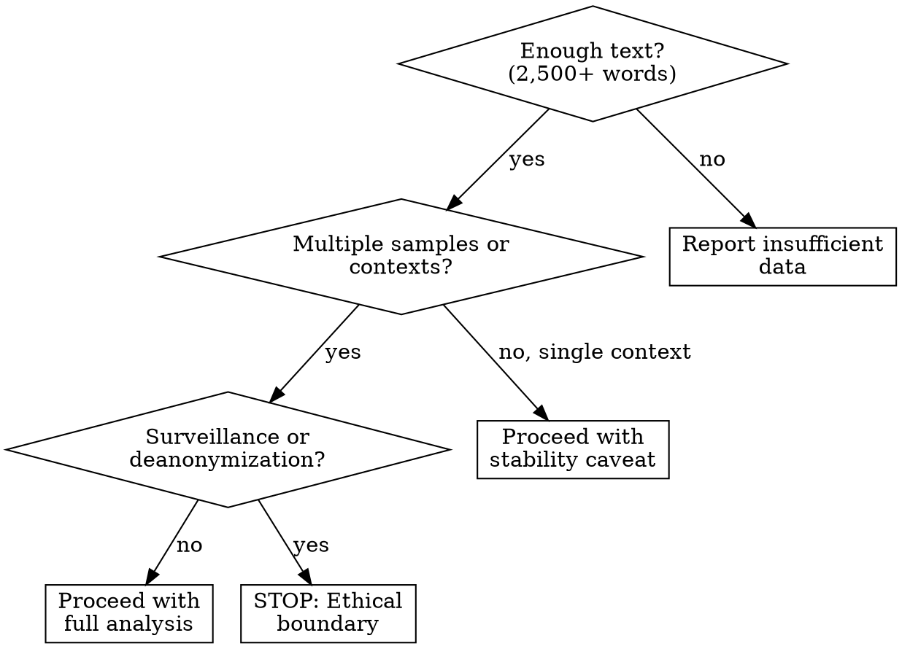

# Stylometric Fingerprinting

## Overview

Extract a stable stylometric fingerprint from a text corpus by measuring function word frequencies, sentence structure distributions, and punctuation patterns -- the features that remain consistent across topics and time periods because they are produced unconsciously. The core principle: **function words and syntactic patterns are more stable authorship markers than content words** because content words change with topic while function words reflect deeply ingrained grammatical habits (Mosteller & Wallace, 1963; Kestemont, 2014). The fingerprint is a distributional profile, not a set of point estimates -- each feature is characterized by its mean, standard deviation, and cross-context stability coefficient.

**Research foundation:** Function words have been the backbone of computational stylometry since the Federalist Papers attribution (Mosteller & Wallace, 1963). Argamon & Levitan (2005) demonstrated that function word frequencies alone achieve 80%+ accuracy in authorship attribution across genres. Eder (2011) established that 2,500+ words are needed for reliable frequency estimation with the 100 most frequent words, while Stamatatos (2009) showed that character n-grams and function word distributions are among the most robust features for cross-domain authorship identification.

## When to Use

- Extracting an author's stable writing signature from a corpus of their text
- Building a style profile for writing voice replication that survives topic changes
- Defining syntactic constraints that characterize an author's habitual patterns
- Comparing writing style consistency across contexts, time periods, or platforms
- Creating a feature set for authorship verification or attribution tasks
- Feeding stable stylometric features into a persona or archetype system

**When NOT to use:**

- Corpus contains fewer than 2,500 words (see Insufficient Data Handling)
- Text is heavily edited by others, machine-translated, or ghostwritten (author signal is diluted)
- Goal is content analysis or topic modeling (use NMF or LDA instead)
- Deanonymizing or surveilling individuals without their knowledge or consent
- Claiming definitive authorship proof in legal or forensic contexts without validated tooling (use JGAAP or stylo with proper validation)
- Single very short text (< 500 words) as the sole sample



## Quick Reference

### Feature Categories and Stability Ranking

| Feature Category | Example Features | Cross-Context Stability | Minimum Words for Reliable Estimate |
|-----------------|-----------------|------------------------|--------------------------------------|
| **Function words** (articles, prepositions, conjunctions, pronouns, auxiliaries) | the, of, and, to, a, in, is, that, it, for, was, with, but, not, as, be, have, which | Highest -- unconscious, topic-independent | 2,500+ |
| **Punctuation patterns** | Comma rate, semicolon usage, dash frequency, ellipsis rate, exclamation/question ratio | High -- habitual, genre-sensitive | 1,500+ |
| **Sentence length distribution** | Mean, median, std, skewness of words-per-sentence | High -- reflects planning complexity | 2,000+ (50+ sentences) |
| **Word length distribution** | Mean word length, % short (1-3 char), % long (7+ char) | Moderate-High | 2,000+ |
| **Type-token ratio (TTR)** | Vocabulary richness (unique/total, MATTR for longer texts) | Moderate -- affected by topic and text length | 2,500+ (use MATTR for texts > 5,000 words) |
| **POS tag ratios** | Noun/verb ratio, adjective density, adverb rate | Moderate -- partly topic-sensitive | 3,000+ |
| **Character n-grams** | Most frequent 2-3 character sequences | High -- captures morphological habits | 3,000+ |
| **Readability metrics** | Flesch-Kincaid, Coleman-Liau, average syllables/word | Moderate-High -- reflects complexity habits | 2,000+ |

### Core Function Word List (English)

These 50 function words form the minimum stable feature set, derived from Mosteller & Wallace (1963), Burrows (2002), and Kestemont (2014):

```
Articles:       a, an, the
Prepositions:   at, by, for, from, in, of, on, to, with, about, after, between, through, into, over, upon
Conjunctions:   and, but, or, nor, so, yet, although, because, if, than, that, while
Pronouns:       i, me, my, we, us, our, you, your, he, him, his, she, her, it, its, they, them, their
Auxiliaries:    be, is, am, are, was, were, been, have, has, had, do, does, did, will, would, shall, should, can, could, may, might, must
Determiners:    this, that, these, those, each, every, some, any, no, all, both
Adverbs:        not, very, also, then, there, here, now, just, only, still, even, already, always, never
```

### Key Metric Thresholds

| Parameter | Value | Source |
|-----------|-------|--------|
| **Minimum corpus (basic profile)** | 2,500 words | Eder (2011) on MFW reliability |
| **Minimum corpus (stable profile)** | 5,000+ words | Consensus across Stamatatos (2009), Eder (2011) |
| **Optimal corpus** | 10,000+ words across 5+ contexts | Multiple studies; diminishing returns beyond 20,000 |
| **Minimum samples for stability test** | 3+ independent texts | Cross-context comparison requires multiple samples |
| **Stability coefficient threshold** | CV < 0.30 for "stable" feature | Coefficient of variation across contexts |
| **Function word count** | 50-150 most frequent | Burrows (2002): 150 MFW; minimum viable: 50 |
| **Sentence count for length distribution** | 50+ sentences | Below 50, distribution statistics are unreliable |
| **Character n-gram order** | 2-3 characters | Higher orders become content-sensitive |

## Workflow

Copy this checklist and track progress:

```
Stylometric Fingerprinting Progress:
- [ ] Step 1: Validate corpus suitability and segment into samples
- [ ] Step 2: Extract function word frequency profiles
- [ ] Step 3: Measure sentence structure distributions
- [ ] Step 4: Compute punctuation pattern profiles
- [ ] Step 5: Calculate supplementary features (word length, TTR, readability)
- [ ] Step 6: Test cross-context stability of all features
- [ ] Step 7: Define the stable fingerprint and syntactic constraints
- [ ] Step 8: Write findings to docs/analysis/18-stylometric-fingerprinting.md
```

### Step 1: Validate Corpus Suitability and Segment

Before analysis, verify the corpus can support fingerprint extraction and divide it into independent samples for stability testing.

**Suitability checks:**

| Check | Pass Condition | Fail Action |
|-------|---------------|-------------|
| **Word count** | 2,500+ words total | Below 2,500: STOP. Report insufficient data. Do not compute fingerprint. |
| **Word count confidence** | 5,000+ words for stable profile | 2,500-5,000: Proceed but flag ALL features as "preliminary." |
| **Language** | Predominantly one language | Mixed-language text invalidates function word frequency comparison. Segment by language first. |
| **Authorship** | Single author | Multi-author corpus produces a blended fingerprint. Must segment by author. |
| **Sample diversity** | Text from 2+ contexts, topics, or time periods | Single-context text may reflect genre constraints, not personal style. Flag prominently. |
| **Editing level** | Natural writing, minimally edited | Heavily edited text reflects editorial process, not author habit. Document limitation. |
| **Text type** | Prose (not poetry, code, or structured data) | Non-prose text has fundamentally different function word distributions. |

**Segmentation for stability testing:**

Divide the corpus into 3+ roughly equal samples, ideally along natural boundaries (different threads, time periods, topics). Each segment should contain at least 800 words. If the corpus is too small to segment, skip stability testing (Step 6) and flag in report.

```python
import re
from collections import Counter

def segment_corpus(texts, min_words_per_segment=800, target_segments=5):
    """Divide a list of texts into segments for cross-context stability testing.
    Each text is a dict with 'text' and optionally 'context' (topic/time/source)."""
    # If context labels exist, group by context
    if all('context' in t for t in texts):
        from itertools import groupby
        sorted_texts = sorted(texts, key=lambda t: t['context'])
        segments = []
        for context, group in groupby(sorted_texts, key=lambda t: t['context']):
            combined = ' '.join(t['text'] for t in group)
            word_count = len(combined.split())
            if word_count >= min_words_per_segment:
                segments.append({
                    'context': context,
                    'text': combined,
                    'word_count': word_count,
                })
        return segments

    # Otherwise, divide sequentially
    all_text = ' '.join(t['text'] for t in texts)
    words = all_text.split()
    total = len(words)
    seg_size = max(min_words_per_segment, total // target_segments)
    segments = []
    for i in range(0, total, seg_size):
        chunk = ' '.join(words[i:i + seg_size])
        if len(chunk.split()) >= min_words_per_segment:
            segments.append({
                'context': f'segment_{len(segments)+1}',
                'text': chunk,
                'word_count': len(chunk.split()),
            })
    return segments
```

### Step 2: Extract Function Word Frequency Profiles

Measure the frequency of each function word as a proportion of total words. This is the most stable and important feature category.

```python
FUNCTION_WORDS = [
    # Articles
    'a', 'an', 'the',
    # Prepositions
    'at', 'by', 'for', 'from', 'in', 'of', 'on', 'to', 'with',
    'about', 'after', 'between', 'through', 'into', 'over', 'upon',
    # Conjunctions
    'and', 'but', 'or', 'nor', 'so', 'yet', 'although', 'because',
    'if', 'than', 'that', 'while',
    # Pronouns
    'i', 'me', 'my', 'we', 'us', 'our', 'you', 'your',
    'he', 'him', 'his', 'she', 'her', 'it', 'its',
    'they', 'them', 'their',
    # Auxiliaries
    'be', 'is', 'am', 'are', 'was', 'were', 'been',
    'have', 'has', 'had', 'do', 'does', 'did',
    'will', 'would', 'shall', 'should',
    'can', 'could', 'may', 'might', 'must',
    # Determiners
    'this', 'these', 'those', 'each', 'every',
    'some', 'any', 'no', 'all', 'both',
    # Adverbs (function-like)
    'not', 'very', 'also', 'then', 'there', 'here',
    'now', 'just', 'only', 'still', 'even',
    'already', 'always', 'never',
]

def extract_function_word_profile(text):
    """Extract function word frequencies as proportions of total words."""
    words = re.findall(r"\b[a-z']+\b", text.lower())
    total = len(words)
    if total == 0:
        return None
    word_counts = Counter(words)
    profile = {}
    for fw in FUNCTION_WORDS:
        profile[fw] = word_counts.get(fw, 0) / total
    # Also compute aggregate categories
    articles = sum(profile.get(w, 0) for w in ['a', 'an', 'the'])
    prepositions = sum(profile.get(w, 0) for w in [
        'at', 'by', 'for', 'from', 'in', 'of', 'on', 'to', 'with',
        'about', 'after', 'between', 'through', 'into', 'over', 'upon'])
    pronouns_1s = sum(profile.get(w, 0) for w in ['i', 'me', 'my'])
    pronouns_1p = sum(profile.get(w, 0) for w in ['we', 'us', 'our'])
    pronouns_3 = sum(profile.get(w, 0) for w in [
        'he', 'him', 'his', 'she', 'her', 'they', 'them', 'their'])
    profile['_articles_total'] = articles
    profile['_prepositions_total'] = prepositions
    profile['_pronouns_1s_total'] = pronouns_1s
    profile['_pronouns_1p_total'] = pronouns_1p
    profile['_pronouns_3_total'] = pronouns_3
    profile['_total_words'] = total
    profile['_function_word_density'] = sum(
        profile[fw] for fw in FUNCTION_WORDS)
    return profile
```

**Interpreting function word profiles:**
- **Function word density** (total function words / total words): Typically 40-60% of English prose. Higher density suggests more syntactically complex, connective writing. Lower density suggests more nominal, content-heavy writing.
- **Pronoun ratios** (1st singular vs. 1st plural vs. 3rd person): Reflects self-focus, group orientation, and narrative perspective respectively.
- **Article rate**: Higher article usage correlates with noun-heavy, descriptive writing and with Openness (Pennebaker & King, 1999).
- **Conjunction patterns**: Heavy "but/although/while" usage reflects contrastive thinking. Heavy "and/or" usage reflects additive thinking.

### Step 3: Measure Sentence Structure Distributions

Capture not just average sentence length but the full distribution -- the shape reveals more about style than the mean alone.

```python
import numpy as np
from scipy import stats as scipy_stats

def extract_sentence_structure(text):
    """Extract sentence-level structural features."""
    # Split into sentences (handles common abbreviations)
    sentences = re.split(r'(?<=[.!?])\s+(?=[A-Z])', text)
    sentences = [s.strip() for s in sentences if len(s.strip().split()) >= 3]

    if len(sentences) < 10:
        return {'_insufficient_sentences': True, 'sentence_count': len(sentences)}

    lengths = [len(s.split()) for s in sentences]
    lengths_arr = np.array(lengths)

    # Sentence-initial word patterns (reveals habitual openings)
    openers = [s.split()[0].lower() for s in sentences if s.split()]
    opener_counts = Counter(openers)
    top_openers = opener_counts.most_common(10)

    # Sentence type distribution
    question_rate = sum(1 for s in sentences if s.rstrip().endswith('?')) / len(sentences)
    exclamation_rate = sum(1 for s in sentences if s.rstrip().endswith('!')) / len(sentences)
    declarative_rate = 1.0 - question_rate - exclamation_rate

    return {
        'sentence_count': len(sentences),
        'mean_length': float(np.mean(lengths_arr)),
        'median_length': float(np.median(lengths_arr)),
        'std_length': float(np.std(lengths_arr)),
        'min_length': int(np.min(lengths_arr)),
        'max_length': int(np.max(lengths_arr)),
        'skewness': float(scipy_stats.skew(lengths_arr)),
        'kurtosis': float(scipy_stats.kurtosis(lengths_arr)),
        'iqr': float(np.percentile(lengths_arr, 75) - np.percentile(lengths_arr, 25)),
        'pct_short': float(np.mean(lengths_arr <= 10)),      # short sentences
        'pct_medium': float(np.mean((lengths_arr > 10) & (lengths_arr <= 25))),
        'pct_long': float(np.mean(lengths_arr > 25)),         # long sentences
        'question_rate': question_rate,
        'exclamation_rate': exclamation_rate,
        'declarative_rate': declarative_rate,
        'top_openers': top_openers,
        'length_distribution': lengths,  # raw data for histogram
    }
```

**Interpreting sentence structure:**
- **Positive skewness**: Most sentences are short with occasional long ones (common in informal writing).
- **Negative skewness**: Most sentences are long with occasional short punchy ones (common in academic/formal writing).
- **High kurtosis**: Sentence lengths cluster tightly around the mean (uniform rhythm).
- **Low kurtosis**: Wide variety of sentence lengths (varied rhythm).
- **High question rate**: Interrogative style, engagement-seeking.
- **Top openers**: Habitual sentence-initial words (e.g., frequent "I" openers vs. "The" openers) reveal deep syntactic habits.

### Step 4: Compute Punctuation Pattern Profiles

Punctuation habits are highly individualized and relatively stable across contexts.

```python
def extract_punctuation_profile(text):
    """Extract punctuation usage patterns."""
    total_chars = len(text)
    sentences = re.split(r'(?<=[.!?])\s+', text)
    sentence_count = max(len(sentences), 1)
    word_count = len(text.split())

    # Per-sentence rates (normalized by sentence count)
    # Per-word rates (normalized by word count)
    features = {
        'comma_per_sentence': text.count(',') / sentence_count,
        'semicolon_per_sentence': text.count(';') / sentence_count,
        'colon_per_sentence': text.count(':') / sentence_count,
        'dash_per_sentence': (text.count('--') + text.count('\u2014')) / sentence_count,
        'ellipsis_per_sentence': (text.count('...') + text.count('\u2026')) / sentence_count,
        'paren_per_sentence': text.count('(') / sentence_count,
        'quote_per_sentence': (text.count('"') + text.count('\u201c')) / (2 * sentence_count),

        # Rates per 1000 words
        'comma_per_1k': text.count(',') / word_count * 1000,
        'semicolon_per_1k': text.count(';') / word_count * 1000,
        'colon_per_1k': text.count(':') / word_count * 1000,
        'dash_per_1k': (text.count('--') + text.count('\u2014')) / word_count * 1000,
        'ellipsis_per_1k': (text.count('...') + text.count('\u2026')) / word_count * 1000,
        'paren_per_1k': text.count('(') / word_count * 1000,
        'exclamation_per_1k': text.count('!') / word_count * 1000,
        'question_per_1k': text.count('?') / word_count * 1000,

        # Ratios
        'excl_to_question_ratio': (
            text.count('!') / max(text.count('?'), 1)
        ),
        'total_punctuation_density': sum(
            text.count(p) for p in ',.;:!?'
        ) / max(word_count, 1),
    }
    return features
```

**Interpreting punctuation profiles:**
- **High comma rate**: Complex, multi-clause sentences (correlates with sentence length).
- **Semicolon/colon usage**: Formal or precise writing style. Many authors use these at near-zero rates.
- **Dash and ellipsis usage**: Conversational, thought-in-progress style. Highly variable and highly individual.
- **Parenthetical usage**: Aside-heavy writing, often academic or digressive.
- **Exclamation-to-question ratio**: Emphatic vs. interrogative orientation.

### Step 5: Calculate Supplementary Features

These features add resolution to the fingerprint but are less stable than function words and punctuation.

```python
def extract_supplementary_features(text):
    """Compute word-level and readability features."""
    words = re.findall(r"\b[a-z']+\b", text.lower())
    total = len(words)
    if total == 0:
        return None
    unique = set(words)

    # Word length distribution
    word_lengths = [len(w) for w in words]
    wl_arr = np.array(word_lengths)

    # Type-Token Ratio (for short texts) or MATTR (for long texts)
    ttr = len(unique) / total
    # Moving Average TTR for texts > 1000 words (window=500)
    mattr = None
    if total > 1000:
        window = 500
        ratios = []
        for i in range(0, total - window + 1, window // 2):
            chunk = words[i:i + window]
            ratios.append(len(set(chunk)) / len(chunk))
        mattr = float(np.mean(ratios))

    # Hapax legomena (words appearing exactly once)
    word_freq = Counter(words)
    hapax = sum(1 for w, c in word_freq.items() if c == 1)
    hapax_ratio = hapax / total

    # Syllable approximation for readability
    def approx_syllables(word):
        word = word.lower()
        count = len(re.findall(r'[aeiouy]+', word))
        if word.endswith('e'):
            count = max(count - 1, 1)
        return max(count, 1)

    syllables_per_word = np.mean([approx_syllables(w) for w in words])

    # Flesch-Kincaid Grade Level
    sentences = re.split(r'[.!?]+', text)
    sentences = [s for s in sentences if s.strip()]
    words_per_sentence = total / max(len(sentences), 1)
    fk_grade = 0.39 * words_per_sentence + 11.8 * syllables_per_word - 15.59

    return {
        'mean_word_length': float(np.mean(wl_arr)),
        'std_word_length': float(np.std(wl_arr)),
        'pct_short_words': float(np.mean(wl_arr <= 3)),
        'pct_long_words': float(np.mean(wl_arr >= 7)),
        'ttr': ttr,
        'mattr': mattr,
        'hapax_ratio': hapax_ratio,
        'syllables_per_word': float(syllables_per_word),
        'flesch_kincaid_grade': float(fk_grade),
    }
```

### Step 6: Test Cross-Context Stability of All Features

This is the critical step that separates a fingerprint from a description. Compute each feature across the segments from Step 1, then measure stability using the coefficient of variation (CV = std / mean).

```python
def compute_stability(segment_profiles, feature_keys):
    """Compute cross-context stability for each feature.
    segment_profiles: list of dicts, one per segment
    feature_keys: list of feature names to evaluate
    Returns: dict of {feature: {mean, std, cv, stable}} """
    stability = {}
    for key in feature_keys:
        values = [p[key] for p in segment_profiles if key in p and p[key] is not None]
        if len(values) < 2:
            stability[key] = {'mean': values[0] if values else None,
                              'std': None, 'cv': None, 'stable': None,
                              'n_segments': len(values)}
            continue
        arr = np.array(values, dtype=float)
        mean = float(np.mean(arr))
        std = float(np.std(arr, ddof=1))  # sample std
        cv = std / mean if mean != 0 else float('inf')
        stability[key] = {
            'mean': mean,
            'std': std,
            'cv': cv,
            'stable': cv < 0.30,  # CV < 0.30 = stable feature
            'n_segments': len(values),
            'values': values,
        }
    return stability

def classify_feature_stability(stability_results):
    """Classify features into stability tiers."""
    highly_stable = []   # CV < 0.15
    stable = []          # CV 0.15-0.30
    moderate = []        # CV 0.30-0.50
    unstable = []        # CV > 0.50
    for key, data in stability_results.items():
        if data['cv'] is None:
            continue
        if data['cv'] < 0.15:
            highly_stable.append((key, data))
        elif data['cv'] < 0.30:
            stable.append((key, data))
        elif data['cv'] < 0.50:
            moderate.append((key, data))
        else:
            unstable.append((key, data))
    return {
        'highly_stable': highly_stable,
        'stable': stable,
        'moderate': moderate,
        'unstable': unstable,
    }
```

**Stability interpretation:**
- **Highly stable (CV < 0.15)**: Core fingerprint features. These define the author across contexts. Typically: common function words (the, of, and, to), total function word density, comma rate.
- **Stable (CV 0.15-0.30)**: Reliable fingerprint features with some context sensitivity. Typically: pronoun ratios, sentence length mean/median, dash and parenthetical usage.
- **Moderate (CV 0.30-0.50)**: Context-influenced features. Include in fingerprint with caveat. Typically: question rate, exclamation rate, some less frequent function words.
- **Unstable (CV > 0.50)**: Exclude from fingerprint. These vary too much across contexts to be authorial markers. Report as "context-dependent features."

### Step 7: Define the Stable Fingerprint and Syntactic Constraints

Assemble the fingerprint from stable features only, and translate into replicable syntactic constraints.

**Fingerprint assembly rules:**
1. Include ALL highly stable features (CV < 0.15)
2. Include stable features (CV 0.15-0.30)
3. Exclude unstable features (CV > 0.50) entirely
4. Include moderate features (CV 0.30-0.50) only as "secondary markers" with explicit variability notes
5. For each included feature, report: mean value, standard deviation across contexts, CV, and the range observed

**Syntactic constraint derivation:**

Convert the numeric fingerprint into prose constraints that a writer (human or AI) could follow:

| Feature Type | Constraint Template |
|-------------|-------------------|
| Function word density | "Use function words at approximately [X]% of total words (range: [min]-[max]%)" |
| Article rate | "Articles (a/an/the) should comprise approximately [X]% of words" |
| Pronoun balance | "First-person singular pronouns at [X]%, first-person plural at [Y]%, third-person at [Z]%" |
| Sentence length | "Target sentences of [mean] words on average (std [S]), with [X]% short (<10), [Y]% medium (10-25), [Z]% long (>25)" |
| Sentence length skewness | "Sentence length distribution should be [positively/negatively] skewed (skew=[X])" |
| Comma rate | "Use approximately [X] commas per sentence (range: [min]-[max])" |
| Dash/ellipsis usage | "[Frequent/occasional/rare] use of dashes ([X] per 1k words) and ellipses ([Y] per 1k words)" |
| Question/exclamation ratio | "Questions in [X]% of sentences, exclamations in [Y]%" |
| Vocabulary complexity | "Target Flesch-Kincaid grade [X], with [Y]% long words (7+ chars)" |
| Sentence openers | "Commonly begin sentences with: [top 5 opener words with frequencies]" |

### Step 8: Write the Report

Write all findings to `docs/analysis/18-stylometric-fingerprinting.md`.

## Report Output Template

The final report MUST be written to `docs/analysis/18-stylometric-fingerprinting.md` with this structure:

```markdown
# Stylometric Fingerprint

## Methodology
- **Approach:** Distributional analysis of function word frequencies, sentence structure, punctuation patterns, and supplementary lexical features
- **Corpus:** [N words total, N texts/documents, N contexts/topics, date range if available]
- **Segmentation:** [N segments of ~N words each, segmented by context/time/sequential]
- **Feature categories:** Function words (N features), sentence structure (N features), punctuation (N features), supplementary (N features)
- **Stability metric:** Coefficient of variation (CV) across segments; threshold CV < 0.30 for inclusion
- **Tools/approach:** [Custom Python implementation / stylo / JGAAP -- describe what was used]

## Corpus Suitability Assessment
- **Word count:** [N] words ([sufficient / marginal / insufficient])
- **Language:** [English / other]
- **Authorship:** [Single / multiple]
- **Context diversity:** [N contexts -- list them]
- **Sample count for stability:** [N segments]
- **Overall suitability:** [Suitable for full fingerprint / suitable with caveats / insufficient]

## Function Word Profile

### Top 20 Function Words by Frequency
| Rank | Word | Frequency (%) | CV Across Segments | Stability |
|------|------|--------------|--------------------|-----------|
| 1 | [word] | [X.XX%] | [X.XX] | [highly stable / stable / moderate / unstable] |
| ... | ... | ... | ... | ... |

### Function Word Category Totals
| Category | Rate (%) | CV | Stability |
|----------|---------|-----|-----------|
| Articles | [X.XX] | [X.XX] | [label] |
| Prepositions | [X.XX] | [X.XX] | [label] |
| Conjunctions | [X.XX] | [X.XX] | [label] |
| 1st person singular pronouns | [X.XX] | [X.XX] | [label] |
| 1st person plural pronouns | [X.XX] | [X.XX] | [label] |
| 3rd person pronouns | [X.XX] | [X.XX] | [label] |
| Auxiliaries | [X.XX] | [X.XX] | [label] |
| Total function word density | [X.XX] | [X.XX] | [label] |

## Sentence Structure Profile

| Metric | Value | CV | Stability |
|--------|-------|-----|-----------|
| Mean sentence length (words) | [X.X] | [X.XX] | [label] |
| Median sentence length | [X.X] | [X.XX] | [label] |
| Std sentence length | [X.X] | [X.XX] | [label] |
| Skewness | [X.XX] | [X.XX] | [label] |
| % short sentences (<=10 words) | [X.X%] | [X.XX] | [label] |
| % medium sentences (11-25 words) | [X.X%] | [X.XX] | [label] |
| % long sentences (>25 words) | [X.X%] | [X.XX] | [label] |
| Question rate | [X.X%] | [X.XX] | [label] |
| Exclamation rate | [X.X%] | [X.XX] | [label] |

### Habitual Sentence Openers
| Rank | Opener Word | Frequency (%) |
|------|------------|--------------|
| 1 | [word] | [X.X%] |
| ... | ... | ... |

## Punctuation Profile

| Feature | Rate (per 1k words) | CV | Stability |
|---------|---------------------|-----|-----------|
| Commas | [X.X] | [X.XX] | [label] |
| Semicolons | [X.X] | [X.XX] | [label] |
| Colons | [X.X] | [X.XX] | [label] |
| Dashes | [X.X] | [X.XX] | [label] |
| Ellipses | [X.X] | [X.XX] | [label] |
| Parentheses | [X.X] | [X.XX] | [label] |
| Total punctuation density | [X.XX] | [X.XX] | [label] |

## Supplementary Features

| Feature | Value | CV | Stability |
|---------|-------|-----|-----------|
| Mean word length | [X.XX] | [X.XX] | [label] |
| % short words (<=3 chars) | [X.X%] | [X.XX] | [label] |
| % long words (>=7 chars) | [X.X%] | [X.XX] | [label] |
| Type-token ratio / MATTR | [X.XX] | [X.XX] | [label] |
| Hapax ratio | [X.XX] | [X.XX] | [label] |
| Flesch-Kincaid grade | [X.X] | [X.XX] | [label] |

## Cross-Context Stability Summary

### Stability Tiers
| Tier | Count | Features |
|------|-------|----------|
| Highly stable (CV < 0.15) | [N] | [list] |
| Stable (CV 0.15-0.30) | [N] | [list] |
| Moderate (CV 0.30-0.50) | [N] | [list] |
| Unstable (CV > 0.50) | [N] | [list] |

### Fingerprint Reliability Assessment
- **Core fingerprint features:** [N] features with CV < 0.30
- **Fingerprint confidence:** [high / moderate / low] based on [corpus size, segment count, feature stability]
- **Most distinctive features:** [top 3-5 features that are both stable AND deviate most from typical English prose]

## The Stylometric Fingerprint

### Numeric Profile (Stable Features Only)
[Table of all features with CV < 0.30, showing mean, std, range]

### Syntactic Constraints for Replication
[Prose description of each stable feature translated into an actionable writing constraint, using the templates from Step 7]

Example format:
- **Function word density:** Use function words at approximately [X]% of total words (observed range: [min]-[max]%)
- **Sentence rhythm:** Target [mean] words per sentence with [description of distribution shape]
- **Pronoun balance:** [constraint]
- **Punctuation habits:** [constraint]
- **Vocabulary level:** [constraint]
- **Sentence openers:** [constraint]

### Exemplar Sentences
[3-5 sentences from the corpus that best exemplify the fingerprint -- sentences where the most stable features are at their mean values]

## Limitations and Caveats
- Stylometric fingerprints capture habitual patterns, not immutable traits. Style can shift over time, with audience, or with deliberate effort.
- Function word frequencies require [minimum word count] for reliable estimation. This corpus contained [N] words.
- [Stability was / was not] tested across multiple contexts. [If not: fingerprint may reflect genre constraints rather than personal style.]
- Cross-domain stability was measured across [N] segments. More diverse samples would strengthen confidence.
- This fingerprint should NOT be used for deanonymization, surveillance, or forensic attribution without proper validation using established tools (JGAAP, stylo) and expert review.
- Features marked "moderate" or "unstable" were excluded from / flagged in the core fingerprint.
- [Corpus-specific limitations from Step 1]

## References
- Mosteller, F. & Wallace, D.L. (1963). Inference in an Authorship Problem. *Journal of the American Statistical Association*, 58(302), 275-309.
- Burrows, J. (2002). 'Delta': A Measure of Stylistic Difference and a Guide to Likely Authorship. *Literary and Linguistic Computing*, 17(3), 267-287.
- Stamatatos, E. (2009). A Survey of Modern Authorship Attribution Methods. *Journal of the American Society for Information Science and Technology*, 60(3), 538-556.
- Eder, M. (2011). Style-markers in authorship attribution: A cross-language study of the authorial fingerprint. *Studies in Polish Linguistics*, 6, 99-114.
- Argamon, S. & Levitan, S. (2005). Measuring the usefulness of function words for authorship attribution. *Proceedings of the 2005 ACH/ALLC Conference*.
- Kestemont, M. (2014). Function words in authorship attribution: From black magic to theory? *Proceedings of the 3rd Workshop on Computational Linguistics for Literature*, 59-66.
- Eder, M., Rybicki, J. & Kestemont, M. (2016). Stylometry with R: A Package for Computational Text Analysis. *The R Journal*, 8(1), 107-121.
- Juola, P. (2006). Authorship Attribution. *Foundations and Trends in Information Retrieval*, 1(3), 233-334.
- Koppel, M., Schler, J. & Argamon, S. (2009). Computational methods in authorship attribution. *Journal of the American Society for Information Science and Technology*, 60(1), 9-26.
```

## Good Patterns

- **Use function words over content words** -- function words are topic-independent and unconsciously produced, making them the most stable authorship markers across contexts and time
- **Measure distributions, not just means** -- a mean sentence length of 15 words could be all-15-word sentences or a mix of 5 and 25; the distribution shape (std, skewness, kurtosis) is part of the fingerprint
- **Test cross-context stability** -- compute each feature across multiple independent text segments and retain only features with CV < 0.30; unstable features are noise, not signal
- **Compute multiple feature types** -- combine function words (lexical), sentence structure (syntactic), and punctuation (orthographic) for a multi-dimensional fingerprint that is harder to spoof or misidentify
- **Establish minimum feature sets** -- define which features are sufficient for replication vs. which add resolution; the core set (top 20 function words + sentence length distribution + comma rate) is the minimum viable fingerprint
- **Report confidence in stability** -- a fingerprint from 3 segments is less reliable than one from 10; document the evidence base
- **Translate numeric profiles into prose constraints** -- raw frequencies are not actionable; "use 'the' at 6.2% of words" needs context like "slightly below typical English prose (6.5-7.0%)"
- **Preserve the full distribution for each feature** -- store per-segment values, not just the aggregate; this enables future stability re-testing with new data

## Anti-Patterns

| Anti-Pattern | Why It Fails | Instead |
|--------------|-------------|---------|
| Using content/topic words as fingerprint features | Content words change with topic; "python" appears in tech discussions, not cooking forums | Use only function words and structural features that are topic-independent |
| Treating a single text sample as representative | One sample captures a single context, mood, and topic; it may be atypical | Require 3+ independent samples across contexts; test stability |
| Ignoring context effects on style | Professional emails vs. casual Reddit posts produce different function word distributions for the same person | Segment by context; measure within-context and cross-context stability separately |
| Over-fitting to a small corpus | With <2,500 words, function word frequencies are dominated by sampling noise | Enforce minimum corpus size; widen confidence intervals for small corpora |
| Assuming all features are equally stable | Some features (article rate) are highly stable; others (question rate) vary wildly by context | Measure CV for each feature; tier by stability; exclude unstable features |
| Computing only point estimates (means) | A mean without a standard deviation hides critical variability information | Report mean, std, CV, and full per-segment values for every feature |
| Using raw counts instead of proportions | Raw counts confound feature frequency with text length | Always normalize: frequency = count / total_words (or per sentence, per 1k words) |
| Including stopword removal in preprocessing | Stopwords ARE the signal in stylometry; removing them destroys the fingerprint | Never apply stopword removal to stylometric analysis |
| Claiming the fingerprint is immutable | Writing style shifts with age, education, audience adaptation, and deliberate effort | Frame as "habitual patterns observed in this corpus" not "permanent identity markers" |
| Using stylometric analysis for unauthorized deanonymization | Ethical and legal risks; function word profiles can identify individuals in anonymous corpora | Obtain consent; document ethical review; do not use for surveillance |

## Boundaries

**This skill SHOULD produce:**
- Function word frequency profiles with per-feature stability metrics (CV across segments)
- Sentence structure distributions (length mean, median, std, skewness, opener patterns)
- Punctuation pattern profiles (per-sentence and per-1k-word rates)
- Supplementary features (word length, TTR/MATTR, readability scores)
- Cross-context stability classification for every feature (highly stable / stable / moderate / unstable)
- A stable fingerprint composed only of features with CV < 0.30
- Syntactic constraints translated into prose replication instructions
- Confidence assessment based on corpus size, segment count, and feature stability
- Written report at `docs/analysis/18-stylometric-fingerprinting.md`

**This skill should NOT:**
- Use stylometric fingerprints for surveillance, deanonymization, or identification of individuals without consent
- Claim perfect or forensic-grade identification accuracy from this analysis alone (use validated tools like JGAAP or stylo for forensic applications)
- Include content words or topic-specific vocabulary in the fingerprint
- Treat a single text sample or single context as sufficient for a stable fingerprint
- Ignore that writing style can and does shift over time, with audience, and with deliberate effort
- Treat the fingerprint as an immutable identity marker rather than a snapshot of habitual patterns
- Skip the cross-context stability test (Step 6) without documenting why
- Produce a fingerprint from fewer than 2,500 words
- Apply stopword removal during preprocessing (function words are the primary signal)
- Present results without confidence caveats and stability classification

## Insufficient Data Handling

```dot
digraph insufficient_data {
    rankdir=TB;
    node [shape=diamond, style=filled, fillcolor="#f0f0f0"];

    start [label="Total word count?", shape=diamond];
    tiny [label="< 1,000 words", shape=box, fillcolor="#ffcccc"];
    small [label="1,000-2,500 words", shape=box, fillcolor="#fff3cc"];
    marginal [label="2,500-5,000 words", shape=box, fillcolor="#ffffcc"];
    good [label="5,000-10,000 words", shape=box, fillcolor="#ccffcc"];
    optimal [label="10,000+ words", shape=box, fillcolor="#ccffcc"];

    start -> tiny [label="< 1,000"];
    start -> small [label="1,000-2,500"];
    start -> marginal [label="2,500-5,000"];
    start -> good [label="5,000-10,000"];
    start -> optimal [label="10,000+"];

    tiny_action [label="STOP: Report insufficient data.\nDo NOT compute fingerprint.\nReport only raw word count.", shape=box, fillcolor="#ffcccc"];
    small_action [label="Compute raw feature values only.\nDo NOT test stability.\nDo NOT define constraints.\nLabel all features UNRELIABLE.", shape=box, fillcolor="#fff3cc"];
    marginal_action [label="Compute features.\nStability test if 3+ segments possible.\nWiden CV threshold to 0.35.\nLabel fingerprint PRELIMINARY.", shape=box, fillcolor="#ffffcc"];
    good_action [label="Full analysis pipeline.\nStability test with 5+ segments.\nStandard CV threshold 0.30.\nModerate confidence.", shape=box, fillcolor="#ccffcc"];
    optimal_action [label="Full analysis pipeline.\nStability test with 5-10 segments.\nHighest confidence achievable.\nDiminishing returns beyond 20k.", shape=box, fillcolor="#ccffcc"];

    tiny -> tiny_action;
    small -> small_action;
    marginal -> marginal_action;
    good -> good_action;
    optimal -> optimal_action;
}
```



| Condition | Action |
|-----------|--------|
| **Corpus < 1,000 words** | STOP. Do NOT compute a fingerprint. Report only: total word count and a statement that the corpus is too small for stylometric analysis. Function word frequencies at this scale are dominated by sampling noise. |
| **Corpus 1,000-2,500 words** | Compute raw feature values (function word frequencies, sentence lengths, punctuation rates) as a descriptive summary only. Do NOT test cross-context stability (corpus cannot be meaningfully segmented). Do NOT derive syntactic constraints. Label all output as "descriptive only, not a stable fingerprint." |
| **Corpus 2,500-5,000 words** | Compute features. Attempt stability testing if the corpus can be divided into 3+ segments of 800+ words each. Widen the stability threshold to CV < 0.35 (more lenient due to smaller samples). Label the fingerprint as "preliminary" in all outputs. |
| **Corpus 5,000-10,000 words** | Full analysis pipeline. Divide into 5+ segments for stability testing. Use standard CV < 0.30 threshold. Moderate confidence in the fingerprint. |
| **Corpus 10,000+ words** | Full analysis with highest achievable confidence. 5-10 segments for robust stability testing. Diminishing returns beyond ~20,000 words for most features. |
| **Single-context corpus** | Proceed but flag prominently: "All text comes from a single context ([name it]). The fingerprint may reflect genre or situational constraints rather than personal authorial style. Cross-context stability could not be tested." Widen confidence intervals. |
| **High variance in key features** | If >50% of function words have CV > 0.30, the "fingerprint" is too noisy to be useful. Report: "Insufficient stylometric stability for a reliable fingerprint. The author's style varies substantially across the sampled contexts." List which features ARE stable (if any) as "partial fingerprint elements." |
| **Fewer than 50 sentences** | Sentence structure features are unreliable. Compute function word and punctuation profiles only. Skip sentence length distribution analysis. Note: "Insufficient sentences for structural analysis." |
| **Fewer than 3 segments possible** | Cannot test cross-context stability. Compute feature values but do NOT classify stability tiers. Report all features as "unvalidated for cross-context stability." |

## Common Mistakes

| Mistake | Fix |
|---------|-----|
| Removing stopwords before stylometric analysis | NEVER remove stopwords. Function words (a, the, of, and, but) ARE the primary features. Stopword removal destroys the fingerprint. |
| Using only mean sentence length | Compute the full distribution: mean, median, std, skewness, kurtosis, and the short/medium/long percentage breakdown. Two authors can have the same mean with completely different distributions. |
| Treating all function words as equally informative | The top 10-20 most frequent function words are the most stable. Rare function words (e.g., "upon", "nor") have high variance in short texts. Weight by stability, not assumed importance. |
| Reporting a fingerprint without testing stability | A fingerprint from a single sample is just a description. Without cross-context stability testing, you do not know which features are authorial vs. contextual. |
| Computing TTR on a large corpus without MATTR | Standard TTR decreases mechanically as text length increases. For texts >1,000 words, use Moving Average TTR (MATTR) with a fixed window instead. |
| Normalizing by character count instead of word count | Function word frequencies should be word-count normalized (fw_count / total_words). Character-count normalization confounds function word frequency with word length. |
| Including quoted or cited text in the analysis | Quoted text reflects someone else's style. Strip quotations, citations, and clearly attributed material before analysis. |
| Conflating the fingerprint with identity | A stylometric fingerprint is a statistical summary of writing habits, not a unique identifier. Multiple authors can have similar profiles. Frame results as "characteristic patterns" not "unique identifiers." |
| Skipping the segmentation step | Without segmentation, you cannot assess stability, and without stability assessment, you do not have a fingerprint -- you have a snapshot. |
| Using fingerprint for forensic attribution without validated tools | This skill produces an exploratory fingerprint. Forensic attribution requires validated tools (JGAAP, stylo R package), proper experimental design, and expert review. |

## References

- Mosteller, F. & Wallace, D.L. (1963). Inference in an Authorship Problem. *JASA*, 58(302), 275-309.
- [Burrows, J. (2002). 'Delta': A Measure of Stylistic Difference. *LLC*, 17(3), 267-287.](https://academic.oup.com/dsh/article/17/3/267/929277)
- [Stamatatos, E. (2009). A Survey of Modern Authorship Attribution Methods. *JASIST*, 60(3), 538-556.](https://onlinelibrary.wiley.com/doi/10.1002/asi.21001)
- [Eder, M., Rybicki, J. & Kestemont, M. (2016). Stylometry with R. *The R Journal*, 8(1), 107-121.](https://journal.r-project.org/archive/2016/RJ-2016-007/index.html)
- [Kestemont, M. (2014). Function words in authorship attribution: From black magic to theory?](https://www.researchgate.net/publication/301404098_Function_Words_in_Authorship_Attribution_From_Black_Magic_to_Theory)
- [Argamon, S. & Levitan, S. (2005). Measuring the usefulness of function words for authorship attribution.](https://www.researchgate.net/publication/227400638_Measuring_the_Usefulness_of_Function_Words_for_Authorship_Attribution)
- [Juola, P. (2006). Authorship Attribution. *Foundations and Trends in IR*, 1(3), 233-334.](https://dl.acm.org/doi/10.1561/1500000005)
- [Koppel, M., Schler, J. & Argamon, S. (2009). Computational methods in authorship attribution. *JASIST*, 60(1), 9-26.](https://onlinelibrary.wiley.com/doi/10.1002/asi.20961)
- [Introduction to stylometry with Python -- Programming Historian](https://programminghistorian.org/en/lessons/introduction-to-stylometry-with-python)
- [Stylometry with R: stylo package documentation](https://computationalstylistics.github.io/stylo_nutshell/)
- [JGAAP: Java Graphical Authorship Attribution Program](https://github.com/evllabs/JGAAP)
- Pennebaker, J.W. & King, L.A. (1999). Linguistic styles: Language use as an individual difference. *JPSP*, 77(6), 1296-1312.
