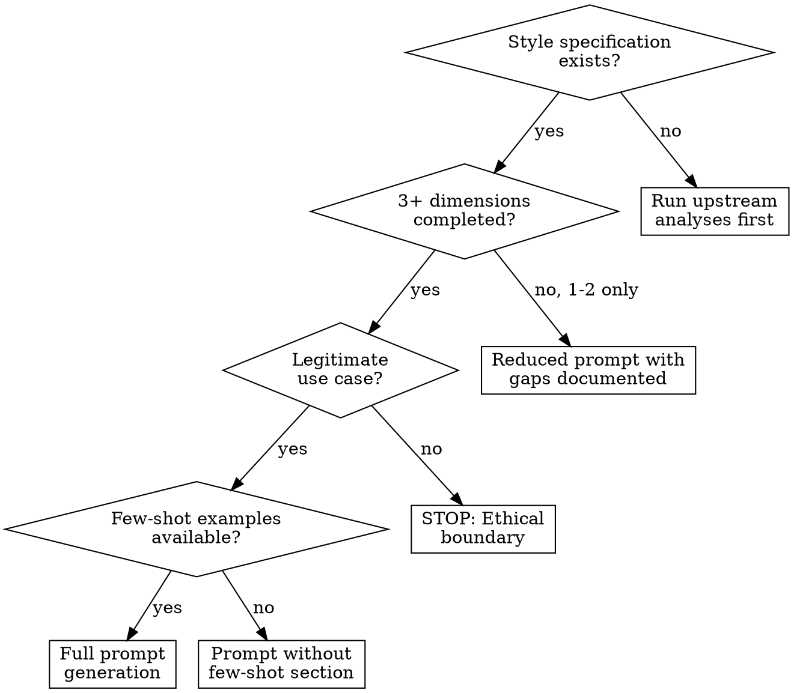
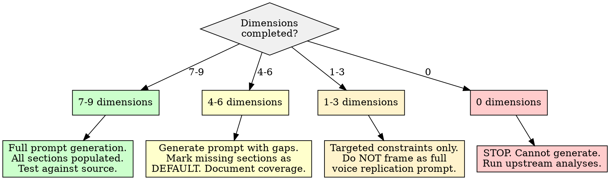

# Subagent Instruction Operationalization

## Overview

Translate a completed style specification into a structured LLM subagent prompt that can reproduce a target voice. The core principle: **every constraint in the style specification must become either a concrete, measurable prompt directive or be explicitly documented as aspirational.** A style specification is an analytical artifact (what the voice IS); a subagent instruction is a generative artifact (how to PRODUCE the voice). This skill bridges the gap by converting each upstream analysis output into a prompt section with verification criteria.

**Why this is hard:** LLMs respond to instructions with varying fidelity depending on constraint type. Lexical constraints ("use grade-level 12 vocabulary") are moderately enforceable. Structural constraints ("lead with evidence before claims") are somewhat enforceable. Distributional constraints ("maintain a 40/30/20/10 split of explaining/advising/challenging/asserting") are weakly enforceable without few-shot examples. The prompt must be designed with awareness of these enforcement gradients.

**Research foundation:** Persona-based prompting (role assignment) produces measurably different output style, tone, and vocabulary (Brim Labs, 2025; PromptHub, 2025). Detailed persona specifications consistently outperform vague ones, and LLM-generated personas often outperform human-written ones (LearnPrompting, 2025). Few-shot examples are often more effective than lengthy instructions for style constraints (Palantir, 2025). Stylometric research confirms that function-word patterns, sentence-length distributions, and punctuation habits are the most stable authorship markers -- and therefore the most important features to replicate (Mosteller & Wallace, 1963; Kestemont, 2014). Recent work on LLM style transfer shows that instruction-tuned models can approximate target styles with one-shot accuracy between 67.6% and 94.7% depending on prompting strategy (arXiv:2509.24930).

## When to Use

- Style specification from upstream pipeline is complete (or partially complete -- see Insufficient Data Handling)
- Need to produce a prompt that an LLM subagent can use to generate text in a target voice
- Translating psycholinguistic analysis (LIWC, Big Five, MDPI archetype, stylometrics, readability, CAT, rhetorical structure, speech acts) into generative instructions
- Building a voice-replication prompt for ANY text corpus, not limited to any specific platform
- Creating a testable, versioned persona prompt with verification criteria

**When NOT to use:**

- No style specification exists yet (run the upstream analyses first)
- Goal is to impersonate someone for deception, fraud, or harassment (ethical boundary -- this skill produces writing style approximations for legitimate purposes such as content assistance, ghostwriting with consent, or creative writing)
- Target voice is "generic professional" or "standard formal" -- these do not require specification-driven prompting; a simple role prompt suffices
- Style specification contains only one or two dimensions (e.g., only readability) -- the prompt would be too thin to constitute a voice; use the individual constraint directly



## Quick Reference

### Prompt Section Architecture

The subagent prompt is organized into sections, each derived from a specific upstream analysis. The order below reflects enforcement priority -- strongest constraints first.

| Section | Source Analysis | Enforcement Strength | What It Controls |
|---------|---------------|---------------------|-----------------|
| **Role Frame** | Persona archetype + MDPI archetype | Strong | Overall persona identity and emotional register |
| **Few-Shot Examples** | Original corpus samples | Strong | Concrete style demonstrations (most powerful constraint) |
| **Complexity Targets** | Readability + Lexical Diversity | Strong (measurable) | Grade level, sentence length, vocabulary diversity |
| **Syntactic Stability** | Stylometric Fingerprint | Moderate-Strong | Function-word rates, punctuation patterns, sentence-length distribution |
| **Emotional Valence** | MDPI Archetype + VADER | Moderate | Affective register boundaries, toxicity limits |
| **Informational Density** | LIWC dimensions + Archetype | Moderate | Noun-heavy vs. conversational, process/content word ratio |
| **Evidence Framing** | Big Five (Conscientiousness) + Archetype | Moderate | Degree claims require support, qualification habits |
| **Rhetorical Structure** | Rhetorical/Discourse Analysis | Moderate-Weak | Argument ordering, hedging, post structure |
| **Pragmatic Distribution** | Speech Act Analysis | Weak (needs examples) | Ratio of explaining vs. advising vs. challenging |
| **Register Rules** | Register Variation Analysis | Conditional | Context-dependent style switching rules |
| **Community Convergence** | CAT / LSM | Weak (ambient) | Target community standards for function-word convergence |

### Enforcement Gradient

| Strength | Meaning | Prompt Strategy |
|----------|---------|----------------|
| **Strong** | LLM reliably follows | Direct numerical constraints + few-shot examples |
| **Moderate** | LLM follows with drift | Constraints + self-check instructions + exemplars |
| **Weak** | LLM approximates | Few-shot examples as primary driver; instructions as secondary |
| **Conditional** | Context-triggered | If/then rules with explicit context detection |

### Minimum Specification Completeness

| Dimensions Completed | Viability | Action |
|---------------------|-----------|--------|
| 7+ of 9 dimensions | Full prompt | Generate complete subagent instruction |
| 4-6 dimensions | Partial prompt | Generate prompt with gap documentation; mark missing sections as "DEFAULT: use natural style" |
| 1-3 dimensions | Minimal prompt | Generate targeted constraints only; do NOT frame as a full voice replication prompt |
| 0 dimensions | Not viable | STOP. Run upstream analyses. |

## Workflow

Copy this checklist and track progress:

```
Subagent Instruction Operationalization Progress:
- [ ] Step 1: Inventory the style specification and assess completeness
- [ ] Step 2: Select few-shot examples from the source corpus
- [ ] Step 3: Compose the Role Frame
- [ ] Step 4: Translate complexity targets into numerical constraints
- [ ] Step 5: Encode syntactic stability constraints
- [ ] Step 6: Define emotional valence boundaries
- [ ] Step 7: Set informational density directives
- [ ] Step 8: Specify evidence framing requirements
- [ ] Step 9: Encode rhetorical structure patterns
- [ ] Step 10: Define pragmatic distribution targets
- [ ] Step 11: Write register rules (if context-dependent)
- [ ] Step 12: Encode community convergence as ambient style guidance
- [ ] Step 13: Add self-verification instructions
- [ ] Step 14: Assemble the complete prompt and check token budget
- [ ] Step 15: Test the prompt against source material
- [ ] Step 16: Write findings to docs/analysis/25-subagent-instruction.md
```

### Step 1: Inventory the Style Specification

Before writing any prompt directives, audit which upstream analyses are available and their confidence levels.

**Inventory table:**

| Dimension | Source Report | Status | Confidence | Key Constraints to Extract |
|-----------|-------------|--------|-----------|---------------------------|
| Informational Density | `16-liwc-psycholinguistic.md` | [done/partial/missing] | [high/moderate/low] | Process/content word ratio, dominant dimension |
| Emotional Valence | `14-mdpi-hypernetwork-archetype.md` | [done/partial/missing] | [high/moderate/low] | Archetype label, valence constraints |
| Evidence Framing | `15-big-five-personality.md` | [done/partial/missing] | [high/moderate/low] | Conscientiousness score, assertion style |
| Syntactic Stability | `18-stylometric-fingerprinting.md` | [done/partial/missing] | [high/moderate/low] | Function-word rates, sentence-length distribution |
| Complexity Targets | `19-readability-lexical-diversity.md` | [done/partial/missing] | [high/moderate/low] | FK grade, MTLD, sentence length range |
| Rhetorical Structure | `20-rhetorical-discourse-structure.md` | [done/partial/missing] | [high/moderate/low] | Argument ordering, hedging rate, structure patterns |
| Pragmatic Distribution | `22-speech-act-pragmatic.md` | [done/partial/missing] | [high/moderate/low] | Speech act ratios |
| Register Rules | `21-register-variation.md` | [done/partial/missing] | [high/moderate/low] | Stable vs. context-dependent classification |
| Community Convergence | `17-cat-linguistic-style-matching.md` | [done/partial/missing] | [high/moderate/low] | LSM targets, top-accommodated communities |

**If fewer than 4 dimensions are complete:** Generate a reduced prompt. Document which sections are missing and what the default behavior will be. Do NOT fabricate constraints from missing data.

### Step 2: Select Few-Shot Examples

Few-shot examples are the single most powerful style constraint. They demonstrate what instructions can only describe.

**Selection criteria:**

| Criterion | Requirement |
|-----------|------------|
| **Typicality** | Choose examples that are stylistically typical, not outliers. Use typicality scores from archetype analysis if available. |
| **Topic diversity** | Select examples spanning at least 2-3 different topics to show that the style persists across subjects. |
| **Length variety** | Include both short (1-3 sentences) and medium (1-2 paragraphs) examples to demonstrate the voice at different scales. |
| **Recency** | Prefer recent examples that reflect the current voice, unless temporal analysis shows style stability. |
| **Count** | 3-5 examples is optimal. More than 7 consumes excessive context without proportional benefit. |

**Example framing in the prompt:**

```
Here are examples of the target voice. Study the sentence structure,
word choice, hedging patterns, and argument flow -- not the topic content.

Example 1 (technical context):
[verbatim text from corpus]

Example 2 (casual context):
[verbatim text from corpus]

Example 3 (disagreement context):
[verbatim text from corpus]
```

**When few-shot examples are unavailable:** If the original corpus is not accessible, rely on the specification constraints alone but note in the prompt: "No reference examples available. Follow the constraints below as closely as possible. Err toward the conservative end of each range."

### Step 3: Compose the Role Frame

The role frame is the first section of the prompt. It establishes identity, not mechanics.

**Template:**

```
You are a writing voice replication agent. Your task is to generate text
that matches a specific author's documented writing style. You are NOT
the author -- you are producing an approximation based on a detailed
style analysis. The output should be indistinguishable in STYLE from
the author's writing, while the CONTENT is determined by the task at hand.

Voice profile: [archetype label, e.g., "HHL -- high-visibility, positive,
constructive communicator"] with [personality summary, e.g., "moderate-high
Openness, high Conscientiousness"].

Primary register: [from LIWC, e.g., "Analytical-reflective with
social-relational secondary emphasis"].
```

**Rules for the role frame:**
- State explicitly that this is an approximation, not identity theft
- Include the MDPI archetype label and its behavioral signature
- Include the Big Five summary (trait positions, not raw scores)
- Include the LIWC register classification
- Keep under 150 words -- detail belongs in constraint sections below

### Step 4: Complexity Targets

Translate readability and lexical diversity measurements into numerical prompt constraints. These are among the most reliably enforceable constraints.

**Directive template:**

```
## Complexity Constraints

Target readability: Flesch-Kincaid grade level [X-Y] (consensus range
from [N] formulas). The measured corpus average is [X.X] with standard
deviation [X.X].

Sentence length: Target [X-Y] words per sentence on average. Vary
individual sentences between [min] and [max] words. Do NOT produce
uniform sentence lengths.

Vocabulary diversity: Maintain lexical diversity (MTLD) in the range
[X-Y]. This means introducing new vocabulary at a rate consistent with
[high/moderate/low] diversity. In practice: [concrete guidance, e.g.,
"avoid repeating the same content word within 3 sentences unless it is
a technical term"].

Word length: Target average word length of [X.X] characters.
[X%] of words should be 6+ characters (long words).
```

**Mapping from upstream data:**

| Upstream Metric | Prompt Constraint |
|----------------|------------------|
| FK grade level (consensus range across formulas) | "Target FK grade [X-Y]" |
| Average sentence length + std dev | "Average [X-Y] words/sentence, range [min-max]" |
| MTLD score | "MTLD [X-Y]" with concrete vocabulary reuse guidance |
| MATTR score | Secondary check: "Moving-average TTR should approximate [X.XX]" |
| Hapax ratio | Informational: "Approximately [X%] of words should appear only once" |
| Average word length + long-word % | "Average [X.X] chars/word; [X%] words 6+ chars" |

### Step 5: Syntactic Stability

Encode the stylometric fingerprint as structural constraints. These maintain the author's unconscious grammatical habits.

**Directive template:**

```
## Syntactic Fingerprint

Function word targets (percentage of total words):
- Articles (a, an, the): [X.X%] (+/- [X.X%])
- Prepositions: [X.X%] (+/- [X.X%])
- Personal pronouns: [X.X%] (+/- [X.X%])
  - I/me/my: [X.X%] | we/us/our: [X.X%] | you/your: [X.X%]
- Conjunctions: [X.X%] (+/- [X.X%])
- Auxiliary verbs: [X.X%] (+/- [X.X%])

Punctuation patterns:
- Comma rate: [X.X] per sentence
- Semicolons: [rare/occasional/frequent]
- Dashes (em/en): [rare/occasional/frequent]
- Exclamation marks: [rare/occasional/frequent]
- Parenthetical asides: [rare/occasional/frequent]

Sentence length distribution:
- Mean: [X] words | Median: [X] words | Std dev: [X]
- [X%] short sentences (< 10 words)
- [X%] medium sentences (10-25 words)
- [X%] long sentences (> 25 words)

Paragraph length: Average [X] sentences per paragraph. Range [X-Y].
```

**Only include features with stability coefficient CV < 0.30** from the stylometric fingerprint. Unstable features (CV >= 0.30) should be omitted or marked as aspirational.

### Step 6: Emotional Valence Boundaries

Translate the MDPI archetype into emotional register rules.

**Directive template based on archetype:**

| Archetype | Valence Directive |
|-----------|------------------|
| **HHH** | "Express positive sentiment as the baseline. Aggressive emphasis (strong language, exclamations, intensifiers) is permitted and expected. High emotional arousal. Positive intent with forceful delivery." |
| **HHL** | "Maintain a consistently positive, constructive tone. Avoid aggressive language, profanity, or confrontational framing. Supportive and measured. Low arousal, high warmth." |
| **HLH** | "Express criticism and negative assessments directly. Confrontational and assertive. Toxic/aggressive language markers are part of the voice. High arousal, combative register." |
| **HLL** | "Express criticism through substantive analysis, not aggressive language. Skeptical and evaluative but restrained. Analytical negativity without hostility." |
| **LHH** | "Positive intent expressed through confrontational or aggressive delivery. 'Tough love' framing. Supportive conclusions reached through blunt, sometimes profane, language." |
| **LHL** | "Quietly positive and encouraging. Gentle, affirming tone. Low-key delivery. Avoid assertiveness or dominance." |
| **LLH** | "Negative and hostile. Bitter or resentful framing. Express discontent through aggressive language. Low-visibility, high-toxicity patterns." |
| **LLL** | "Subdued negativity. Resigned or withdrawn tone. Express dissatisfaction through measured, low-energy commentary. Avoid both enthusiasm and aggression." |

**Include VADER calibration:** "The target sentiment compound score across outputs should average approximately [X.XX] (range [X.XX to X.XX])."

### Step 7: Informational Density

Translate LIWC dimension profile and process/content word split into density directives.

**Directive template:**

```
## Informational Density

Content density: [content-dense / balanced / process-heavy]
- Function word percentage target: [X%] (baseline: 55-65%)
- Content word percentage target: [X%]
- This voice [is / is not] noun-heavy.

Dominant psycholinguistic registers (from LIWC):
1. [Primary register, e.g., "Cognitive-analytical: elevated insight
   and causation language"]
2. [Secondary register, e.g., "Social-relational: above-baseline
   social process words"]

Register guidance:
- [Elevated dimension]: Use [specific word types] more frequently
  than a generic voice would. Target [X%] vs. baseline [Y%].
- [Reduced dimension]: Use [specific word types] less frequently.
  Target [X%] vs. baseline [Y%].
```

### Step 8: Evidence Framing

Derive from Big Five Conscientiousness score and archetype.

**Mapping:**

| Conscientiousness | Archetype Score | Evidence Framing Directive |
|------------------|----------------|---------------------------|
| High (65+) | High | "Support claims with evidence, examples, or reasoning. Use discourse markers (therefore, because, given that). Qualify assertions with scope limitations. Structure arguments with clear premises before conclusions." |
| High (65+) | Low | "Support claims when possible but accept that lower-visibility contexts permit more casual assertion." |
| Average (35-65) | Any | "Mix supported and unsupported claims naturally. Some assertions can stand alone; complex or controversial claims should include reasoning." |
| Low (0-35) | Any | "State opinions directly without obligatory evidence scaffolding. Casual assertion is the default. Include reasoning only when the point is complex or when challenged." |

### Step 9: Rhetorical Structure

Encode argument ordering and rhetorical device usage.

**Directive template:**

```
## Rhetorical Structure

Argument ordering: [claim-first / evidence-first / dialectical /
exploratory / narrative-embedded]
- [Concrete description: e.g., "State your position in the first
  sentence, then provide 2-3 supporting points, then anticipate
  a counter-argument."]

Hedging frequency: [X.X%] of assertions include hedging markers
(I think, perhaps, might, arguably, it seems).
- [Concrete guidance: e.g., "Hedge approximately 1 in every 4
  evaluative claims. Never hedge factual statements."]

Concession patterns: [rare / occasional / frequent]
- [If frequent: "Acknowledge opposing views before presenting
  your own position. Use 'to be fair', 'granted', 'I see your
  point but'."]

Rhetorical questions: [rare / occasional / frequent]
- [If used: "Approximately [X] per [Y] paragraphs."]

List vs. prose ratio: [X%] of multi-point arguments use enumerated
lists vs. flowing prose.

Post structure:
- Opening: [direct claim / question / anecdote / context-setting]
- Body: [sequential points / point-counterpoint / narrative]
- Closing: [summary / call to action / open question / none]
```

### Step 10: Pragmatic Distribution

Translate speech act analysis into output ratios.

**Directive template:**

```
## Pragmatic Distribution (Speech Act Targets)

Target distribution across output:
- Explaining (causal reasoning, teaching): ~[X%]
- Advising (recommendations, suggestions): ~[X%]
- Asserting (declarative claims, opinions): ~[X%]
- Challenging (counter-arguments, disagreement): ~[X%]
- Questioning (interrogatives, prompts): ~[X%]
- Supporting (agreement, affirmation): ~[X%]

Primary mode: [The dominant speech act, e.g., "This voice primarily
EXPLAINS -- most responses walk through reasoning rather than
declaring conclusions."]

Note: These are approximate targets. Do not mechanically count
speech acts. Instead, use the primary mode as the default and
deviate when context requires it.
```

**Enforcement note:** Pragmatic distribution is weakly enforceable through instructions alone. The few-shot examples (Step 2) are the primary mechanism for establishing this distribution. The directive above provides a calibration target.

### Step 11: Register Rules (Conditional)

Only include this section if the register variation analysis classified the voice as context-dependent.

**Directive template (for context-dependent voices):**

```
## Register Rules

This voice shifts style based on context. Apply these rules:

WHEN writing about [technical/professional domain]:
- Increase formality by [specific changes]
- Reduce hedging frequency to [X%]
- Increase evidence framing density
- Target FK grade [X-Y] (higher than default)

WHEN writing in [casual/social context]:
- Decrease sentence length to [X-Y] words average
- Increase pronoun usage (I/you) by [X%]
- Permit informal constructions and contractions
- Target FK grade [X-Y] (lower than default)

WHEN disagreeing or challenging:
- [Archetype-specific: e.g., "Maintain analytical tone (HLL),
  do not escalate to aggressive framing"]

DEFAULT (no specific context detected):
- Use the primary register described above.
```

**For stable-register voices:** Replace this section with: "This voice maintains a consistent register across contexts. Do not adjust style based on topic or audience. Apply all constraints uniformly."

### Step 12: Community Convergence

Translate CAT/LSM findings into ambient style guidance. This is not a mechanical constraint but a generative principle.

**Directive template:**

```
## Community Convergence

This voice naturally converges toward the norms of [top 1-2
communities by LSM score]. When generating text:

- Function word usage should approximate the norms of [community
  name] (composite LSM: [X.XX])
- Specifically, match these function-word rates from the target
  community: [list 2-3 highest-convergence categories with rates]
- The voice [accommodates / resists accommodation to] [community
  name], so [match / diverge from] their norms for [specific
  categories]

This is a soft constraint. It shapes the ambient tone rather than
overriding the specific structural constraints above.
```

### Step 13: Self-Verification Instructions

Build verification steps into the prompt itself. This catches drift during generation.

**Directive template:**

```
## Self-Verification

After generating text, verify these checkpoints before finalizing:

1. READABILITY: Is the output within FK grade [X-Y]? Are sentences
   averaging [X-Y] words?
2. TONE: Does the sentiment match the [archetype] profile? Is the
   emotional register [specific description]?
3. STRUCTURE: Does the argument follow [ordering pattern]? Are
   hedges present at approximately the target frequency?
4. VOICE MARKERS: Check for the presence of characteristic patterns:
   [list 3-5 specific markers from the fingerprint, e.g., "frequent
   use of parenthetical asides", "semicolons linking independent
   clauses", "rhetorical questions before key points"]
5. ANTI-MARKERS: Check for the ABSENCE of patterns this voice
   does NOT use: [list 2-3 patterns to avoid, e.g., "never uses
   exclamation marks", "avoids bullet-point lists", "does not
   use emoji"]

If any checkpoint fails, revise the output before presenting it.
```

### Step 14: Assemble and Check Token Budget

Combine all sections into the final prompt. Check total length against context limits.

**Token budget guidelines:**

| Prompt Component | Target Tokens | Maximum Tokens |
|-----------------|--------------|---------------|
| Role Frame | 100-150 | 200 |
| Few-Shot Examples | 300-800 | 1,500 |
| Complexity Targets | 100-150 | 200 |
| Syntactic Stability | 150-250 | 400 |
| Emotional Valence | 50-100 | 200 |
| Informational Density | 80-120 | 200 |
| Evidence Framing | 50-80 | 150 |
| Rhetorical Structure | 100-200 | 300 |
| Pragmatic Distribution | 80-120 | 200 |
| Register Rules | 0-200 | 300 |
| Community Convergence | 50-100 | 150 |
| Self-Verification | 100-150 | 250 |
| **Total** | **1,160-2,420** | **4,050** |

**If over budget:** Prioritize by enforcement strength. Cut community convergence and pragmatic distribution directives first (they are weakly enforceable). Never cut few-shot examples or complexity targets (they are strongly enforceable).

**Compression strategies:**
- Merge register rules into other sections when only 1-2 context rules exist
- Reduce few-shot examples from 5 to 3
- Combine syntactic stability and complexity targets into one section
- Remove aspirational constraints that cannot be verified

### Step 15: Test the Prompt

Generate 3-5 test outputs using the assembled prompt and compare against the source corpus.

**Test procedure:**

1. **Generate** text on 3 different topics using the prompt
2. **Measure** readability (FK grade, sentence length) of generated output
3. **Compare** function-word frequencies between generated output and source corpus fingerprint
4. **Assess** emotional valence of generated output against archetype target
5. **Check** structural patterns: argument ordering, hedging frequency, post structure
6. **Calculate** a style similarity score if possible (cosine distance on stylometric feature vectors)

**Pass/fail criteria:**

| Metric | Pass | Marginal | Fail |
|--------|------|----------|------|
| FK grade level | Within +/- 1 of target range | Within +/- 2 | Outside +/- 2 |
| Sentence length avg | Within +/- 3 words of target | Within +/- 5 | Outside +/- 5 |
| Sentiment compound | Within +/- 0.15 of target | Within +/- 0.25 | Outside +/- 0.25 |
| Function word rates (top 5) | Within +/- 1.5% of fingerprint | Within +/- 3% | Outside +/- 3% |
| Argument ordering | Matches specified pattern | Partial match | Wrong pattern |
| Hedging frequency | Within +/- 50% of target rate | Within +/- 100% | No hedging or all hedging |

**If tests fail:** Revise the failing constraint section. The most common fixes:
- Add or improve few-shot examples (if structural constraints fail)
- Make numerical targets more explicit (if readability drifts)
- Add anti-markers to self-verification (if unwanted patterns appear)
- Simplify over-constrained sections that the LLM cannot satisfy simultaneously

### Step 16: Write Report

Write all findings to `docs/analysis/25-subagent-instruction.md`. See the report template below.

## Report Output Template

The final report MUST be written to `docs/analysis/25-subagent-instruction.md` with this structure:

```markdown
# Subagent Instruction Operationalization

## Style Specification Inventory

| Dimension | Source Report | Status | Confidence | Constraints Extracted |
|-----------|-------------|--------|-----------|---------------------|
| Informational Density | [report] | [status] | [level] | [summary] |
| Emotional Valence | [report] | [status] | [level] | [summary] |
| Evidence Framing | [report] | [status] | [level] | [summary] |
| Syntactic Stability | [report] | [status] | [level] | [summary] |
| Complexity Targets | [report] | [status] | [level] | [summary] |
| Rhetorical Structure | [report] | [status] | [level] | [summary] |
| Pragmatic Distribution | [report] | [status] | [level] | [summary] |
| Register Rules | [report] | [status] | [level] | [summary] |
| Community Convergence | [report] | [status] | [level] | [summary] |

**Specification completeness:** [X/9 dimensions] -- [full/partial/minimal] prompt

## Few-Shot Example Selection

| # | Source | Topic | Word Count | Why Selected |
|---|--------|-------|-----------|-------------|
| 1 | [reference] | [topic] | [N] | [typicality/diversity rationale] |
| ... | | | | |

## Assembled Prompt

[The complete subagent instruction prompt, formatted and ready for use]

## Prompt Statistics

- **Total tokens:** [estimated count]
- **Sections included:** [N of 12]
- **Sections omitted:** [list with reasons]
- **Constraints enforced (measurable):** [N]
- **Constraints aspirational (not directly measurable):** [N]

## Constraint Enforcement Assessment

| Constraint | Type | Enforceability | Verification Method |
|-----------|------|----------------|-------------------|
| FK grade [X-Y] | Measurable | Strong | Post-generation readability scoring |
| Sentence length [X-Y] | Measurable | Strong | Word count per sentence |
| Sentiment compound [X.XX] | Measurable | Moderate | VADER scoring of output |
| Function word rates | Measurable | Moderate | Frequency analysis of output |
| Argument ordering | Structural | Moderate | Manual inspection |
| Hedging frequency | Countable | Moderate-Weak | Hedge marker counting |
| Speech act ratios | Distributional | Weak | Manual classification |
| Community convergence | Ambient | Weak | LSM computation against baseline |
| [etc.] | | | |

## Test Results

### Test 1: [Topic]
- **Generated text:** [first 100 words or full text if short]
- **FK grade:** [measured] (target: [X-Y]) -- [PASS/FAIL]
- **Sentence length:** [measured] (target: [X-Y]) -- [PASS/FAIL]
- **Sentiment:** [measured] (target: [X.XX]) -- [PASS/FAIL]
- **Structure match:** [assessment] -- [PASS/FAIL]

[Repeat for each test]

### Aggregate Test Results
| Metric | Tests Passed | Tests Failed | Notes |
|--------|-------------|-------------|-------|
| [metric] | [N/total] | [N/total] | [notes] |

## Prompt Revision History

| Version | Change | Reason | Test Impact |
|---------|--------|--------|-------------|
| v1 | Initial assembly | -- | -- |
| v2 | [change] | [test failure] | [improvement] |

## Limitations and Caveats

- This prompt produces an APPROXIMATION of the target voice, not the
  voice itself. Output quality depends on the LLM's capacity to follow
  layered constraints.
- Distributional constraints (speech act ratios, community convergence)
  are weakly enforceable through instructions alone. Few-shot examples
  are the primary mechanism for these.
- The prompt was tested with [model name/size]. Different models may
  require constraint adjustments.
- Style drift increases with output length. For outputs exceeding
  [X] words, consider segmented generation with re-anchoring.
- Constraints derived from low-confidence upstream analyses
  ([list them]) should be treated as provisional.
- The prompt does not capture: [list known gaps -- e.g., humor timing,
  cultural references, domain-specific jargon not in examples].

## References

- [Upstream analysis reports referenced]
- Brim Labs (2025). LLM Personas: How System Prompts Influence Style,
  Tone, and Intent. https://brimlabs.ai/blog/llm-personas-how-system-prompts-influence-style-tone-and-intent/
- LearnPrompting (2025). Role Prompting: Guide LLMs with Persona-Based
  Tasks. https://learnprompting.org/docs/advanced/zero_shot/role_prompting
- PromptHub (2025). Role-Prompting: Does Adding Personas Really Make a
  Difference? https://www.prompthub.us/blog/role-prompting-does-adding-personas-to-your-prompts-really-make-a-difference
- Palantir (2025). Best Practices for LLM Prompt Engineering.
  https://www.palantir.com/docs/foundry/aip/best-practices-prompt-engineering
- Mosteller, F. & Wallace, D.L. (1963). Inference in an authorship
  problem. JASA, 58(302), 275-309.
- Kestemont, M. (2014). Function Words in Authorship Attribution.
  Literary and Linguistic Computing, 29(1), 107-114.
- Stachl, C., et al. (2022). The kernel of truth in text-based
  personality assessment. Psychological Bulletin.
- arXiv:2509.24930 -- How Well Do LLMs Imitate Human Writing Style?
```

## Good Patterns

- **Few-shot examples are the strongest constraint** -- always include them when the source corpus is available; one well-chosen example teaches more than 200 words of instruction
- **Order prompt sections by enforcement strength** -- put strongly enforceable constraints (readability, sentence length) before weakly enforceable ones (speech act ratios, community convergence) so they are processed first
- **Use numerical targets with tolerance ranges** -- "FK grade 11-13" is enforceable; "write at an educated level" is not
- **Include self-verification** in the prompt itself -- LLMs can check their own output against explicit criteria when instructed to do so
- **Document which constraints are measurable vs. aspirational** -- this sets honest expectations and enables iterative refinement
- **Test against the source material** -- generate test outputs and compare stylometric features against the fingerprint; adjust constraints that produce drift
- **Keep the total prompt under 4,000 tokens** -- beyond this, constraint interference increases and the LLM begins to ignore lower-priority sections
- **Use anti-markers** (patterns the voice does NOT use) alongside positive markers -- absence constraints are often more distinctive than presence constraints
- **Version the prompt** -- track changes and their effects on test results; prompts require iterative refinement like code

## Anti-Patterns

| Anti-Pattern | Why It Fails | Instead |
|--------------|-------------|---------|
| "Write like the user" | Vague instruction; LLM defaults to generic helpful voice. No measurable criteria. | Decompose into specific constraints: readability targets, function-word rates, emotional register, structural patterns |
| Overloading a single prompt with 20+ constraints | LLMs exhibit constraint interference -- later constraints override or conflict with earlier ones. Quality degrades. | Prioritize by enforcement strength. Keep total under ~4,000 tokens. Cut weakly enforceable constraints first. |
| No few-shot examples | Instructions alone cannot fully specify a voice. The LLM has no concrete reference point. | Include 3-5 representative corpus samples spanning different topics and contexts. |
| No verification loop | First-draft prompts rarely match the target style. Without testing, drift goes undetected. | Generate test outputs, measure against the fingerprint, revise failing sections. |
| Assuming one prompt works for all contexts | Context-dependent voices need conditional rules; a single prompt produces a flat, averaged style. | Check register variation analysis. If context-dependent, include IF/THEN register rules. |
| Including unmeasurable constraints | "Maintain the user's sense of humor" or "capture their worldview" cannot be verified and create false confidence. | Mark such constraints as aspirational. Invest prompt space in measurable alternatives. |
| Fabricating constraints from missing data | If no LIWC analysis was performed, inventing an informational density target produces a fabricated voice, not the target voice. | Leave the section as "DEFAULT: use natural style" and document the gap. |
| Skipping the token budget check | A 6,000-token prompt may exceed system-prompt limits or cause the LLM to ignore late sections. | Check total tokens. Compress or cut sections to stay within budget. |
| Treating the prompt as final | Prompt engineering is iterative. A prompt that passes initial tests may drift on new topics or longer outputs. | Version the prompt. Re-test periodically. Expect 2-3 revision cycles. |

## Boundaries

**This skill SHOULD produce:**

- A complete, structured LLM subagent prompt organized into sections by enforcement strength
- Explicit numerical constraints for measurable dimensions (readability, sentence length, function-word rates, sentiment)
- Few-shot examples from the source corpus (when available)
- Self-verification instructions built into the prompt
- A clear distinction between enforced (measurable) and aspirational (non-measurable) constraints
- Test results comparing generated output against the source corpus style fingerprint
- Documentation of which specification dimensions are covered and which are missing
- A written report at `docs/analysis/25-subagent-instruction.md`
- A versioned prompt with revision history

**This skill should NOT:**

- Claim the output IS the user's voice (it is always an approximation based on analyzed patterns)
- Include constraints that cannot be verified or tested against any criterion
- Produce a prompt exceeding ~4,000 tokens without explicit justification and constraint triage
- Skip testing against source material
- Fabricate constraints from dimensions that were not analyzed
- Include ethical or value judgments about the target voice (the prompt replicates patterns, it does not evaluate them)
- Assume the prompt will work without iterative refinement
- Treat distributional constraints (speech act ratios, community convergence) as strongly enforceable without few-shot support
- Ignore the enforcement gradient (treating all constraints as equally followable)
- Produce platform-specific prompts when the voice specification is platform-agnostic

## Insufficient Data Handling



| Condition | Action |
|-----------|--------|
| **0 dimensions completed** | STOP. Cannot produce a subagent instruction. Run upstream analyses first. |
| **1-3 dimensions completed** | Produce targeted constraints only (e.g., "write at FK grade 12 with sentences averaging 18 words"). Do NOT frame this as a voice replication prompt -- it is a partial style constraint. Document what is missing. |
| **4-6 dimensions completed** | Produce a structured prompt with explicit gaps. Each missing section gets: "DEFAULT: No specification available for [dimension]. Use natural style for this aspect." List all defaults in the report. |
| **7-9 dimensions completed** | Full prompt generation. All sections populated. Test against source material. |
| **Few-shot examples unavailable** | Omit the examples section. Add to role frame: "No reference examples available. Follow constraints below as primary guidance. Err toward conservative interpretation of ranges." Note that enforcement quality will be lower for structural and distributional constraints. |
| **Low confidence on key dimensions** | Include the constraint but mark it: "[LOW CONFIDENCE -- derived from limited data. May not accurately reflect target style.]" The consumer of the prompt can decide whether to apply it. |
| **Style specification is too generic** | If the upstream analyses show a style indistinguishable from population baselines on most dimensions (e.g., FK grade 10-12, average sentiment, no distinctive function-word patterns), the voice may not be sufficiently distinctive to replicate. Report this finding: "The analyzed style does not deviate meaningfully from baseline norms on [N] dimensions. A generic voice prompt may be as effective as a specification-driven prompt for this target." |
| **Conflicting constraints across dimensions** | When two upstream analyses produce contradictory directives (e.g., high Openness suggests complex vocabulary, but readability measures show low FK grade), document the conflict and resolve by: (1) trusting the more direct measurement (readability over personality inference), (2) noting the conflict in the report, (3) testing both versions. |

## Common Mistakes

| Mistake | Fix |
|---------|-----|
| Writing "match the user's tone" without specifying what that means | Decompose tone into measurable components: sentiment compound, emotional register (archetype), hedging frequency, exclamation rate |
| Including 10+ few-shot examples | Diminishing returns after 5 examples. 3-5 well-selected examples are optimal. Use the saved token budget for better constraints. |
| Setting constraints at point values instead of ranges | "FK grade 12.3" is unfollowable. "FK grade 11-13" accommodates natural variation. Always use ranges. |
| Not testing the prompt before deploying | Generate 3-5 test outputs and measure against the fingerprint. First-draft prompts almost always need revision. |
| Treating all constraints as equally important | Use the enforcement gradient. Readability and examples are strongly enforceable. Speech act ratios are weakly enforceable. Prioritize accordingly. |
| Including constraints from analyses that were not performed | If no LIWC analysis was done, do not guess at informational density. Mark the section as DEFAULT. |
| Making the prompt too long (5,000+ tokens) | Constraint interference increases with length. Compress, merge, or cut lower-priority sections. Target < 4,000 tokens. |
| Forgetting anti-markers | Specifying what the voice DOES is insufficient. Specifying what it does NOT do (never uses exclamation marks, avoids emoji, does not enumerate with numbered lists) is equally distinctive. |
| No self-verification section | Without verification instructions, the LLM has no mechanism to catch its own drift. Include 4-6 checkpoints. |
| Treating the prompt as permanent | Voices evolve. Prompt constraints should be re-derived when new corpus data is available or when test results degrade. Version and date the prompt. |

## References

- Brim Labs (2025). [LLM Personas: How System Prompts Influence Style, Tone, and Intent](https://brimlabs.ai/blog/llm-personas-how-system-prompts-influence-style-tone-and-intent/).
- LearnPrompting (2025). [Role Prompting: Guide LLMs with Persona-Based Tasks](https://learnprompting.org/docs/advanced/zero_shot/role_prompting).
- PromptHub (2025). [Role-Prompting: Does Adding Personas Really Make a Difference?](https://www.prompthub.us/blog/role-prompting-does-adding-personas-to-your-prompts-really-make-a-difference).
- Palantir (2025). [Best Practices for LLM Prompt Engineering](https://www.palantir.com/docs/foundry/aip/best-practices-prompt-engineering).
- VKTR (2025). [A Guide to Persona Prompting: Why Your AI Needs an Identity](https://www.vktr.com/ai-upskilling/a-guide-to-persona-prompting-why-your-ai-needs-an-identity-to-perform/).
- Paradiso Solutions (2025). [Role Prompting & Persona Specification](https://www.paradisosolutions.com/blog/role-prompting-and-persona-specification/).
- eesel.ai (2025). [Subagent Orchestration: The Complete Guide for AI Workflows](https://www.eesel.ai/blog/subagent-orchestration).
- Anthropic (2025). [How We Built Our Multi-Agent Research System](https://www.anthropic.com/engineering/multi-agent-research-system).
- Towards Data Science (2025). [Design Smarter Prompts and Boost Your LLM Output](https://towardsdatascience.com/boost-your-llm-outputdesign-smarter-prompts-real-tricks-from-an-ai-engineers-toolbox/).
- arXiv:2511.13972. [Show and Tell: Prompt Strategies for Style Control in Multi-Turn LLM Code Generation](https://arxiv.org/html/2511.13972).
- arXiv:2509.24930. How Well Do LLMs Imitate Human Writing Style?
- arXiv:2507.00838. [Stylometry Recognizes Human and LLM-Generated Texts in Short Samples](https://arxiv.org/abs/2507.00838).
- Mosteller, F. & Wallace, D.L. (1963). Inference in an Authorship Problem. *JASA*, 58(302), 275-309.
- Kestemont, M. (2014). Function Words in Authorship Attribution. *Literary and Linguistic Computing*, 29(1), 107-114.
- Stachl, C., et al. (2022). The kernel of truth in text-based personality assessment: A meta-analysis. *Psychological Bulletin*.
- Mann, W.C. & Thompson, S.A. (1988). Rhetorical Structure Theory. *Text*, 8(3), 243-281.
- Fraser, B. (1999). What are discourse markers? *Journal of Pragmatics*, 31, 931-952.
- Ireland, M.E., et al. (2011). Language style matching predicts relationship initiation and stability. *Psychological Science*, 22(1), 39-44.
- Giles, H. (1973). Accent mobility: A model and some data. *Anthropological Linguistics*, 15, 87-105.
- Boyd, R.L., et al. (2022). The development and psychometric properties of LIWC-22.
- Pennebaker, J.W. & King, L.A. (1999). Linguistic styles: Language use as an individual difference. *JPSP*, 77(6), 1296-1312.
- Yarkoni, T. (2010). Personality in 100,000 Words. *Journal of Research in Personality*, 44(3), 363-373.
- Ferrara, E., Ferrara, A., & Ferrara, M. (2025). Characterizing User Archetypes and Discussions on Social Hypernetworks. *BDCC*, 9(9), 236.
