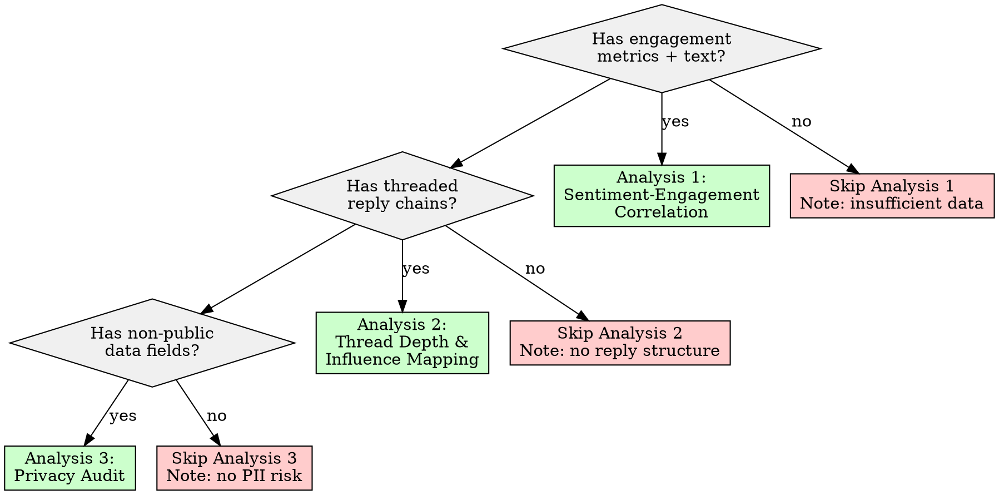

# Supplementary Engagement Analyses

## Overview

Three complementary analyses that answer questions engagement metrics alone cannot: (1) does emotionally charged content actually correlate with high engagement, (2) which threads sustain influence long after the original poster leaves, and (3) what non-public data is exposed in the corpus. The core principle: **engagement is multi-dimensional -- score counts measure attention, sentiment-engagement correlation measures resonance, thread depth measures influence persistence, and a privacy audit measures risk.**

## When to Use

- Corpus has both engagement metrics (scores, votes, likes, reactions) AND text content with measurable sentiment
- Threaded discussions with reply chains (comments referencing parents)
- Content export that may contain non-public data (IPs, emails, linked identities)
- Need to distinguish authentic voice from crowd-pleasing content
- Investigating whether high-scoring content is also the most emotionally charged
- Identifying "discursive catalysts" -- posts/comments that spark deep conversation threads

**When NOT to use:**
- Corpus has no engagement metrics at all (skip Analysis 1; Analyses 2-3 may still apply)
- Content is flat (no reply structure) -- skip Analysis 2
- Corpus is already fully public with no PII risk -- skip Analysis 3
- Need causal claims about what drives engagement (this skill measures correlation, not causation)



## Workflow

Copy this checklist and track progress:

```
Supplementary Engagement Analyses Progress:
- [ ] Step 1: Validate data prerequisites for each analysis
- [ ] Step 2: Sentiment-Engagement Correlation (Analysis 1)
- [ ] Step 3: Thread Depth & Influence Mapping (Analysis 2)
- [ ] Step 4: Privacy Audit (Analysis 3)
- [ ] Step 5: Cross-analysis synthesis
- [ ] Step 6: Write findings to docs/analysis/09-supplementary-engagement.md
```

## Quick Reference

| Analysis | Input Required | Key Output | Minimum Data |
|----------|---------------|------------|--------------|
| Sentiment-Engagement Correlation | Text + numeric engagement metric | Scatter plot, Pearson/Spearman r, p-value | 30+ items with both fields |
| Thread Depth & Influence Mapping | Reply chains with parent references | Depth distribution, catalyst identification | 20+ threads with 3+ levels |
| Privacy Audit | Any non-public fields | PII inventory, risk classification | Any corpus (always run if data exists) |

## Step 1: Validate Data Prerequisites

Before running any analysis, verify what is available.

```python
def validate_prerequisites(df, text_col, engagement_col, parent_col=None):
    """Check which analyses are viable given the data."""
    viable = {}

    # Analysis 1: Sentiment-Engagement Correlation
    has_text = text_col in df.columns and df[text_col].notna().sum() > 0
    has_engagement = (engagement_col in df.columns
                      and df[engagement_col].notna().sum() > 0)
    n_both = df[[text_col, engagement_col]].dropna().shape[0] if (
        has_text and has_engagement) else 0
    viable['sentiment_engagement'] = {
        'can_run': n_both >= 30,
        'n': n_both,
        'reason': f"{n_both} items with both text and engagement"
                  if n_both >= 30
                  else f"Only {n_both} items (need 30+)"
    }

    # Analysis 2: Thread Depth
    has_parents = (parent_col and parent_col in df.columns
                   and df[parent_col].notna().sum() > 0)
    viable['thread_depth'] = {
        'can_run': has_parents,
        'reason': "Reply chain structure available"
                  if has_parents
                  else "No parent references found"
    }

    # Analysis 3: Privacy Audit (always viable if data exists)
    viable['privacy_audit'] = {
        'can_run': len(df) > 0,
        'reason': f"{len(df)} records to audit"
    }

    return viable
```

**If an analysis cannot run:** Document why in the output report. Do not skip silently. Do not fabricate results for missing data.

## Step 2: Analysis 1 -- Sentiment-Engagement Correlation

**Question:** Is high-scoring content also the most emotionally charged? Or does moderate, measured content perform equally well?

### 2a. Score Sentiment

Use a sentiment analyzer appropriate to the corpus domain. For general-purpose text:

```python
from textblob import TextBlob
import numpy as np
import pandas as pd
from scipy import stats

def score_sentiment(texts):
    """Return polarity (-1 to +1) and subjectivity (0 to 1)."""
    results = []
    for text in texts:
        if not text or not isinstance(text, str):
            results.append({'polarity': np.nan, 'subjectivity': np.nan})
            continue
        blob = TextBlob(str(text))
        results.append({
            'polarity': blob.sentiment.polarity,
            'subjectivity': blob.sentiment.subjectivity
        })
    return pd.DataFrame(results)

# Compute absolute polarity (emotional intensity regardless of direction)
df['abs_polarity'] = df['polarity'].abs()
```

**Why absolute polarity matters:** Both strongly positive AND strongly negative content may correlate with engagement. Testing raw polarity alone misses the "controversy drives engagement" pattern.

### 2b. Correlation Analysis

```python
def correlate_sentiment_engagement(df, sentiment_col, engagement_col,
                                    min_n=30):
    """Compute Pearson and Spearman correlations with significance."""
    clean = df[[sentiment_col, engagement_col]].dropna()
    n = len(clean)

    if n < min_n:
        return {
            'error': f'Insufficient data: {n} items (minimum {min_n})',
            'n': n
        }

    # Pearson (assumes linear relationship, normal distribution)
    pearson_r, pearson_p = stats.pearsonr(
        clean[sentiment_col], clean[engagement_col]
    )

    # Spearman (rank-based, no distribution assumption -- preferred)
    spearman_r, spearman_p = stats.spearmanr(
        clean[sentiment_col], clean[engagement_col]
    )

    return {
        'n': n,
        'pearson_r': round(pearson_r, 4),
        'pearson_p': round(pearson_p, 6),
        'spearman_r': round(spearman_r, 4),
        'spearman_p': round(spearman_p, 6),
        'significant_at_05': spearman_p < 0.05,
        'significant_at_01': spearman_p < 0.01,
    }

# Run for BOTH raw polarity and absolute polarity
corr_raw = correlate_sentiment_engagement(df, 'polarity', 'score')
corr_abs = correlate_sentiment_engagement(df, 'abs_polarity', 'score')
corr_subj = correlate_sentiment_engagement(df, 'subjectivity', 'score')
```

### 2c. Interpretation Framework

| Spearman r | Strength | Interpretation |
|------------|----------|----------------|
| 0.00 - 0.10 | Negligible | Sentiment does not predict engagement |
| 0.10 - 0.30 | Weak | Minor tendency; other factors dominate |
| 0.30 - 0.50 | Moderate | Meaningful relationship worth investigating |
| 0.50 - 0.70 | Strong | Sentiment is a significant engagement predictor |
| 0.70 - 1.00 | Very strong | Rare in real-world content data; verify for artifacts |

**Always report:** The correlation coefficient, the p-value, and the sample size. A "significant" correlation with n=30 means something different from one with n=3000.

**Key distinction -- authentic voice vs. crowd-pleasing:** If absolute polarity correlates strongly with engagement but raw polarity does not, the pattern is "emotional intensity drives engagement regardless of direction." If only positive polarity correlates, the pattern is "crowd-pleasing positivity." Report which pattern the data shows.

## Step 3: Analysis 2 -- Thread Depth and Influence Mapping

**Question:** Which threads sustain conversation long after the original poster leaves? These are "discursive catalysts" -- content that triggers self-sustaining discussion.

### 3a. Compute Thread Depth

```python
def compute_thread_depths(df, id_col, parent_col):
    """Build reply tree and compute depth for each item.

    Depth 0 = top-level post/comment (no parent).
    Depth N = N levels of replies deep.
    """
    # Build parent lookup
    parent_map = dict(zip(df[id_col], df[parent_col]))

    def get_depth(item_id, memo={}):
        if item_id in memo:
            return memo[item_id]
        parent = parent_map.get(item_id)
        if pd.isna(parent) or parent not in parent_map:
            memo[item_id] = 0
            return 0
        depth = 1 + get_depth(parent, memo)
        memo[item_id] = depth
        return depth

    depths = {item_id: get_depth(item_id) for item_id in df[id_col]}
    return depths

def build_thread_stats(df, id_col, parent_col, author_col=None):
    """Compute per-thread statistics."""
    depths = compute_thread_depths(df, id_col, parent_col)
    df['thread_depth'] = df[id_col].map(depths)

    # Find root of each thread
    def get_root(item_id):
        parent = parent_map.get(item_id)
        if pd.isna(parent) or parent not in parent_map:
            return item_id
        return get_root(parent)

    parent_map = dict(zip(df[id_col], df[parent_col]))
    df['thread_root'] = df[id_col].apply(
        lambda x: get_root(x)
    )

    # Per-thread stats
    thread_stats = df.groupby('thread_root').agg(
        max_depth=('thread_depth', 'max'),
        reply_count=('thread_depth', 'count'),
        unique_authors=(author_col, 'nunique') if author_col else
            ('thread_depth', 'count'),
    ).reset_index()

    return thread_stats
```

### 3b. Identify Discursive Catalysts

A discursive catalyst is a thread where:
1. **Max depth >= 4** (conversation goes 4+ levels deep)
2. **Unique participants >= 3** (not just a two-person back-and-forth)
3. **Original poster's last reply is at depth < max_depth / 2** (thread continues well beyond OP's participation)

```python
def find_catalysts(thread_stats, df, author_col, id_col,
                   min_depth=4, min_participants=3):
    """Identify threads that sustain conversation beyond OP."""
    catalysts = []
    for _, thread in thread_stats.iterrows():
        if (thread['max_depth'] < min_depth
                or thread['unique_authors'] < min_participants):
            continue

        root_id = thread['thread_root']
        thread_items = df[df['thread_root'] == root_id]

        # Find OP (author of root item)
        root_row = thread_items[thread_items[id_col] == root_id]
        if root_row.empty:
            continue
        op_author = root_row[author_col].iloc[0]

        # Find OP's deepest participation
        op_items = thread_items[thread_items[author_col] == op_author]
        op_max_depth = op_items['thread_depth'].max()

        # Catalyst = thread continued well beyond OP
        if op_max_depth < thread['max_depth'] / 2:
            catalysts.append({
                'thread_root': root_id,
                'max_depth': thread['max_depth'],
                'reply_count': thread['reply_count'],
                'unique_authors': thread['unique_authors'],
                'op_max_depth': op_max_depth,
                'continuation_ratio': round(
                    1 - (op_max_depth / thread['max_depth']), 2
                ),
            })

    return pd.DataFrame(catalysts)
```

### 3c. Thread Depth Distribution

Report the distribution shape, not just the mean:

| Metric | What It Reveals |
|--------|----------------|
| Median depth | Typical conversation length |
| 90th percentile depth | Where the deep discussions are |
| % threads at depth 1 only | Fraction of content with zero follow-up |
| % threads at depth 5+ | Fraction with sustained discourse |
| Catalyst count / total threads | Rate of self-sustaining discussions |

## Step 4: Analysis 3 -- Privacy Audit

**Question:** What non-public data is exposed in this corpus, and what is its risk level?

**This analysis is NOT optional.** If the corpus contains any data, run the privacy audit. Do not assume all data is safe.

### 4a. Systematic PII Identification

```python
import re

PII_PATTERNS = {
    'email': {
        'pattern': r'[a-zA-Z0-9._%+-]+@[a-zA-Z0-9.-]+\.[a-zA-Z]{2,}',
        'risk': 'HIGH',
        'action': 'Redact before any redistribution',
    },
    'ip_address': {
        'pattern': r'\b(?:\d{1,3}\.){3}\d{1,3}\b',
        'risk': 'HIGH',
        'action': 'Redact; can geolocate to city level',
    },
    'phone_number': {
        'pattern': r'\b(?:\+?1[-.\s]?)?\(?\d{3}\)?[-.\s]?\d{3}[-.\s]?\d{4}\b',
        'risk': 'HIGH',
        'action': 'Redact before any redistribution',
    },
    'url_with_username': {
        'pattern': r'https?://[^\s]*(?:user|profile|u)/[^\s/]+',
        'risk': 'MEDIUM',
        'action': 'Assess if profile is public; flag if not',
    },
    'date_of_birth': {
        'pattern': r'\b(?:born|dob|birthday)[:\s]+\d{1,2}[/\-]\d{1,2}[/\-]\d{2,4}\b',
        'risk': 'MEDIUM',
        'action': 'Flag; sensitive when combined with other fields',
    },
}

def audit_pii(df, text_columns=None):
    """Scan all string columns for PII patterns.

    Returns inventory of findings with risk levels.
    """
    if text_columns is None:
        text_columns = df.select_dtypes(include='object').columns.tolist()

    findings = []
    for col in text_columns:
        for pii_type, config in PII_PATTERNS.items():
            matches = df[col].dropna().str.contains(
                config['pattern'], regex=True, na=False
            )
            match_count = matches.sum()
            if match_count > 0:
                findings.append({
                    'column': col,
                    'pii_type': pii_type,
                    'match_count': int(match_count),
                    'risk_level': config['risk'],
                    'recommended_action': config['action'],
                    'sample_rows': matches[matches].index[:3].tolist(),
                })
    return pd.DataFrame(findings) if findings else pd.DataFrame()
```

### 4b. Column-Level Risk Classification

Beyond regex pattern matching, classify columns by their structural risk:

| Column Type | Risk Level | Rationale |
|-------------|-----------|-----------|
| IP addresses | HIGH | Geolocatable, linkable to ISP records |
| Email addresses | HIGH | Directly identifies individuals |
| Phone numbers | HIGH | Directly identifies individuals |
| Linked account identifiers | HIGH | Cross-platform identity linking |
| Location fields (city, zip) | MEDIUM | Quasi-identifier when combined |
| Timestamps with sub-minute precision | MEDIUM | Behavioral fingerprinting potential |
| User-agent strings | MEDIUM | Device fingerprinting potential |
| Usernames (public platforms) | LOW | Already public, but aggregation increases exposure |
| Content body text | LOW* | May contain self-disclosed PII within text |

*Content body is LOW structurally but must still be scanned for embedded PII (Step 4a).

### 4c. Risk Tiering

Classify the overall corpus risk:

| Tier | Criteria | Action |
|------|----------|--------|
| **CRITICAL** | Contains HIGH-risk PII in 3+ columns or HIGH-risk PII in content body | Do NOT proceed with any analysis that could redistribute this data without redaction |
| **ELEVATED** | Contains HIGH-risk PII in 1-2 structural columns only | Redact HIGH-risk columns; proceed with caution |
| **MODERATE** | Contains MEDIUM-risk PII only | Note in report; apply principle of minimal disclosure |
| **LOW** | No PII detected or only LOW-risk fields | Proceed normally; note audit was performed |

## Step 5: Cross-Analysis Synthesis

After running all viable analyses, synthesize findings:

1. **Sentiment-Depth intersection:** Do discursive catalysts have different sentiment profiles than shallow threads? Emotionally charged posts that also generate deep threads are the strongest engagement signals.

2. **Privacy-Engagement intersection:** Are any PII-containing fields correlated with engagement data? If engagement metrics are derived from private interactions (e.g., DMs, saved items), note this in the privacy section.

3. **Authentic voice signal:** Content with moderate sentiment but high thread depth suggests authentic voice -- it generates conversation through substance, not emotional charge. Content with extreme sentiment and high score but shallow threads suggests crowd-pleasing.

## Good Patterns

- **Use Spearman over Pearson** for sentiment-engagement correlation -- engagement metrics are rarely normally distributed and often have heavy tails
- **Measure absolute polarity alongside raw polarity** -- emotional intensity matters regardless of positive/negative direction
- **Count unique participants per thread**, not just reply count -- a 20-reply thread between 2 people differs fundamentally from one with 10 participants
- **Always run the privacy audit**, even when you think the data is clean -- PII appears in unexpected places (embedded in URLs, self-disclosed in text)
- **Report effect sizes alongside p-values** -- statistical significance with tiny effect sizes is not practically meaningful

## Anti-Patterns

| Anti-Pattern | Why It Fails | Instead |
|--------------|-------------|---------|
| Assuming correlation implies causation | "Positive sentiment causes high engagement" is unsupported by correlation alone | Report "X correlates with Y" not "X causes Y" |
| Measuring only direct replies | Misses full thread depth; a reply to a reply is depth 2, not 1 | Recursively traverse parent chains to compute true depth |
| Ignoring that high engagement can come from controversy | Treating all high-engagement content as "good" misses negative virality | Segment by sentiment direction: positive-high-engagement vs. negative-high-engagement |
| Treating all non-public data as equally risky | An IP address is far more dangerous than a public username | Use tiered risk classification (HIGH/MEDIUM/LOW) |
| Reporting p < 0.05 without effect size | Statistically significant but r = 0.05 is practically meaningless | Always pair p-value with correlation coefficient and interpret both |
| Conflating thread depth with quality | Deep threads can be flame wars, not substantive discourse | Cross-reference depth with unique participant count and sentiment variance |
| Running correlation on < 30 data points | Results are unstable and unreliable | Report insufficient data rather than unreliable statistics |
| Skipping the privacy audit because "it looks clean" | PII hides in text fields, URL parameters, metadata | Always run the systematic scan regardless of initial impression |

## Boundaries

**SHOULD do:**
- Correlate sentiment with engagement using Pearson and Spearman with significance testing
- Produce scatter plots of sentiment vs. engagement
- Measure full thread depth from recursive parent traversal
- Identify discursive catalysts (self-sustaining threads beyond OP's participation)
- Systematically scan for PII with regex patterns
- Classify risk levels for all non-public data fields
- Flag risk tiers and recommend handling actions
- Report effect sizes, sample sizes, and confidence caveats

**Should NOT do:**
- Make causal claims about what drives engagement ("positive posts get more upvotes" is causal; "positive polarity correlates with score at r=0.23" is correlational)
- Expose or redistribute PII found during audit -- findings are for the report only
- Skip the privacy audit under any circumstances when non-public data exists
- Conflate depth with quality without checking participant diversity and sentiment variance
- Report statistical results without sample size context
- Force analysis on insufficient data -- document what cannot be computed and why

## Insufficient Data Handling

| Condition | Impact | Action |
|-----------|--------|--------|
| **< 30 items with both text and engagement** | Correlation analysis is unreliable | Do NOT compute correlation. Report: "Insufficient paired data (n=X, minimum 30). Correlation analysis skipped." List raw descriptive statistics instead (mean, median sentiment; mean, median engagement). |
| **No engagement metrics at all** | Analysis 1 is impossible | Skip Analysis 1 entirely. Document: "No engagement metrics available in corpus." Proceed to Analyses 2 and 3. |
| **Reply chains lack parent references** | Cannot compute thread depth | Skip Analysis 2. Document: "No parent reference column found. Thread depth analysis requires a parent ID field." |
| **Flat structure (no nesting)** | Thread depth is uniformly 0 or 1 | Report the flat structure as a finding: "All content is top-level; no threaded discussion structure detected." |
| **< 20 threads with depth >= 2** | Catalyst identification is unreliable | Compute depth statistics descriptively but flag: "Insufficient threaded discussions for catalyst identification (n=X threads with depth >= 2)." |
| **No non-public data fields** | Analysis 3 has nothing to audit | Report: "Privacy audit complete. No non-public data fields detected in corpus schema. No PII found in content scan." This is still a finding -- the absence of PII is worth documenting. |
| **30-100 items for correlation** | Low confidence results | Compute but flag every result as "low confidence (n=X)." Do not draw strong conclusions. |
| **> 100 items for correlation** | Standard confidence | Full analysis. Still report n alongside every statistic. |

**Minimum requirements for meaningful correlation analysis:**
- 30+ items with both sentiment and engagement values (absolute minimum; results are exploratory)
- 100+ items for standard-confidence results
- 500+ items for high-confidence results suitable for strong claims
- Engagement metric must have variance (if all items have score=1, correlation is undefined)
- Sentiment must have variance (if all items are neutral, correlation is undefined)

## Common Mistakes

| Mistake | Fix |
|---------|-----|
| Using Pearson on engagement data with extreme outliers | Use Spearman (rank-based) as primary; report Pearson as secondary |
| Computing thread depth iteratively instead of recursively | Use memoized recursive traversal to handle arbitrary nesting |
| Counting thread depth as "number of replies" | Depth is the longest path from root to leaf, not the total reply count |
| Treating the privacy audit as optional | It is mandatory whenever non-public data exists in the corpus |
| Reporting "no PII found" without scanning content body | Structural columns may be clean while text contains self-disclosed PII |
| Ignoring subjectivity in sentiment analysis | Highly subjective content (opinions, personal stories) has different engagement patterns than objective content |
| Not segmenting correlation by content type | Overall correlation may mask opposite trends in different content types (posts vs. comments, long vs. short) |

## Report Output

Write all findings to `docs/analysis/09-supplementary-engagement.md` with this structure:

```markdown
# Supplementary Engagement Analyses

## Data Prerequisites
- Corpus size: [N items]
- Items with text + engagement: [N] (Analysis 1 viable: [yes/no])
- Items with parent references: [N] (Analysis 2 viable: [yes/no])
- Non-public data fields: [list or "none"] (Analysis 3 viable: [yes/no])

## Analysis 1: Sentiment-Engagement Correlation

### Methodology
- Sentiment analyzer: [tool/library used]
- Engagement metric: [column name and description]
- Sample size: [N paired observations]

### Sentiment Distribution
- Mean polarity: [value], Median: [value], Std: [value]
- Mean subjectivity: [value], Median: [value]
- Mean absolute polarity: [value]

### Correlation Results

| Metric Pair | Pearson r | Pearson p | Spearman r | Spearman p | n |
|-------------|-----------|-----------|------------|------------|---|
| Polarity vs. Engagement | [r] | [p] | [r] | [p] | [n] |
| Abs. Polarity vs. Engagement | [r] | [p] | [r] | [p] | [n] |
| Subjectivity vs. Engagement | [r] | [p] | [r] | [p] | [n] |

### Interpretation
[Which pattern does the data show: emotional intensity, positive crowd-pleasing,
 or no meaningful correlation? Always state effect size and practical significance.]

### Scatter Plot Description
[Describe the scatter plot shape: linear trend, fan-shaped, clustered, etc.
 Include the plot file path if generated.]

## Analysis 2: Thread Depth and Influence Mapping

### Thread Depth Distribution
| Metric | Value |
|--------|-------|
| Total threads | [N] |
| Median depth | [value] |
| Mean depth | [value] |
| 90th percentile depth | [value] |
| Max depth | [value] |
| Threads at depth 1 only | [N] ([%]) |
| Threads at depth 5+ | [N] ([%]) |

### Discursive Catalysts
[Table of identified catalysts: thread root, max depth, unique participants,
 OP max depth, continuation ratio]

### Influence Patterns
[What types of content generate self-sustaining threads?
 Any correlation between catalyst threads and sentiment profiles?]

## Analysis 3: Privacy Audit

### PII Scan Results
| Column | PII Type | Match Count | Risk Level | Recommended Action |
|--------|----------|-------------|------------|-------------------|
| [col]  | [type]   | [N]         | [HIGH/MED/LOW] | [action]      |

### Column-Level Risk Classification
[Table of all non-public columns with risk tier]

### Overall Risk Tier: [CRITICAL / ELEVATED / MODERATE / LOW]
[Justification for tier assignment]

### Recommended Actions
[Specific steps based on findings]

## Cross-Analysis Synthesis
[Intersection of sentiment, depth, and privacy findings]

## Limitations and Caveats
- [Correlation is not causation]
- [Sample size considerations]
- [Analyses skipped and why]
- [Known limitations of sentiment analyzer used]
```

## References

- [Sentiment Benchmarking Best Practices (Growth-onomics)](https://growth-onomics.com/sentiment-benchmarking-best-practices/)
- [Social Media Sentiment Analysis (Sprout Social)](https://sproutsocial.com/insights/social-media-sentiment-analysis/)
- [Thread Level and Perceived Persuasiveness (Springer)](https://link.springer.com/chapter/10.1007/978-3-031-10464-0_55)
- [Creating Reply Networks from Comment Threads (Ashford, 2022)](https://james.ashford.phd/2022/01/21/creating-reply-networks-from-reddit-comment-threads/)
- [Predicting Hierarchical Structure of Conversation Threads (PMC)](https://pmc.ncbi.nlm.nih.gov/articles/PMC3942392/)
- [Sample Size for Pearson, Kendall, and Spearman Correlations (Psychometrika)](https://link.springer.com/article/10.1007/BF02294183)
- [PII Compliance Checklist 2025 (Sentra)](https://www.sentra.io/learn/pii-compliance-checklist)
- [NIST SP 800-122: Guide to Protecting PII Confidentiality](https://nvlpubs.nist.gov/nistpubs/legacy/sp/nistspecialpublication800-122.pdf)
- [PII Data Classification Best Practices (SearchInform)](https://searchinform.com/articles/data-management/privacy/personal-information/pii-data-classification/)
- [Discourse Analysis Step-by-Step (MAXQDA)](https://www.maxqda.com/research-guides/discourse-analysis)
