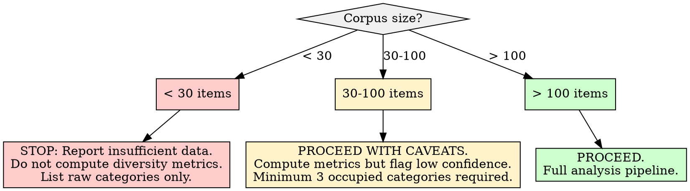

# Taxonomic Interest Classification

## Overview

Map a text corpus against a hierarchical interest taxonomy to measure interest diversity (orthogonality) and classify profiles as polymathic or specialist. The core insight: interest diversity is a measurable property of a content distribution, not a subjective impression.

## When to Use

- Corpus of user-generated content needs interest profiling
- Need to quantify how diverse or concentrated someone's activity is
- Mapping posts, comments, articles, or other text to interest categories
- Determining polymathic vs. specialist profile classification
- Feeding interest distribution into downstream archetype assignment

**Not for:**
- Single-document topic extraction (use NMF or LDA instead)
- Keyword frequency analysis without categorical framing
- Content recommendation (this measures what IS, not what SHOULD BE)

## Workflow

Copy this checklist and track progress:

```
Taxonomic Interest Classification Progress:
- [ ] Step 1: Select and document the reference taxonomy
- [ ] Step 2: Map corpus items to taxonomy categories
- [ ] Step 3: Build the distribution table
- [ ] Step 4: Compute diversity metrics (Shannon, Simpson, orthogonality)
- [ ] Step 5: Classify the profile (polymathic/specialist/moderate)
- [ ] Step 6: Identify interest pillars and flag ambiguities
- [ ] Step 7: Write findings to docs/analysis/04-taxonomic-interest-classification.md
```

### Step 1: Select a Reference Taxonomy

Use an established hierarchical taxonomy as the classification framework. The taxonomy is a LENS, not ground truth -- it shapes what you can see.

**Recommended reference:** IAB Content Taxonomy (v2.0+) provides a two-tier hierarchy with 26 Tier-1 groups and 366+ Tier-2 subgroups. Adapt or subset as needed for the corpus domain.

**IAB Tier-1 Categories (reference baseline):**

| Code | Category | Code | Category |
|------|----------|------|----------|
| IAB1 | Arts & Entertainment | IAB14 | Society |
| IAB2 | Automotive | IAB15 | Science |
| IAB3 | Business | IAB16 | Pets |
| IAB4 | Careers | IAB17 | Sports |
| IAB5 | Education | IAB18 | Style & Fashion |
| IAB6 | Family & Parenting | IAB19 | Technology & Computing |
| IAB7 | Health & Fitness | IAB20 | Travel |
| IAB8 | Food & Drink | IAB21 | Real Estate |
| IAB9 | Hobbies & Interests | IAB22 | Shopping |
| IAB10 | Home & Garden | IAB23 | Religion & Spirituality |
| IAB11 | Law, Gov't & Politics | IAB24 | Uncategorized |
| IAB12 | News / Weather / Info | IAB25 | Non-Standard Content |
| IAB13 | Personal Finance | IAB26 | Illegal Content |

**When to adapt the taxonomy:**
- Corpus is domain-specific (e.g., all technical content) -- use a finer-grained taxonomy for that domain
- Source already has native categories (e.g., subreddits, tags, forums) -- map native categories to the reference taxonomy
- Too many items fall into "Uncategorized" (>15%) -- taxonomy needs refinement for this corpus

**Document your taxonomy choice and any adaptations in the output report.**

### Step 2: Map Corpus Items to Categories

For each content item (post, comment, article, document), assign ONE primary Tier-1 category and optionally ONE Tier-2 subcategory.

**Mapping approaches (choose based on corpus):**

| Approach | When to Use | Tradeoff |
|----------|-------------|----------|
| **Metadata-based** | Source has native categories (subreddits, tags, channels) | Fast, but native categories may not align cleanly |
| **LLM-assisted** | Free-text content without metadata categories | Flexible, but requires review for consistency |
| **Keyword heuristic** | Large corpus, need speed, categories have clear vocabularies | Scalable, but misses nuance |
| **Hybrid** | Metadata for obvious mappings, LLM for ambiguous ones | Best accuracy, highest effort |

**Handling ambiguous items:**
- If content spans two categories nearly equally, assign the PRIMARY category and record the secondary as a cross-reference
- Track ambiguous mappings separately -- report them in the output as "cross-category items"
- If >20% of items are ambiguous, the taxonomy may be too coarse for this corpus

**Handling unmappable items:**
- Content that genuinely does not fit any category goes to "Uncategorized"
- Do NOT force-fit items -- unmappable content is signal, not noise
- If unmappable items cluster around a theme, consider adding a custom category

### Step 3: Build the Distribution Table

Count items per category and compute proportions.

```
Category            | Count (n_i) | Proportion (p_i) | Normalized*
--------------------|-------------|-------------------|------------
Technology          | 142         | 0.355             | --
Science             | 68          | 0.170             | --
Hobbies & Interests | 51          | 0.128             | --
...                 | ...         | ...               | --
TOTAL               | 400         | 1.000             | --
```

*Normalization is optional -- use when comparing profiles against a population baseline. Normalized proportion = (observed p_i) / (expected p_i from baseline), then re-normalized to sum to 1.

**Exclude from distribution:** Categories with 0 items. Only include categories that have at least 1 item. Empty categories inflate diversity metrics artificially if included as zero-count bins.

### Step 4: Compute Diversity Metrics

Calculate three complementary metrics. Each captures a different aspect of diversity.

**4a. Shannon Entropy (H)**

Measures information content of the distribution. Higher = more diverse.

```
H = -SUM(p_i * ln(p_i))  for all categories where p_i > 0
```

- **Minimum:** 0 (all activity in one category)
- **Maximum:** ln(k) where k = number of occupied categories
- **Normalized Shannon (H_norm):** H / ln(k) -- ranges 0 to 1, comparable across different k values

**4b. Simpson's Diversity Index (1 - D)**

Measures probability that two randomly selected items come from different categories. Higher = more diverse.

```
D = SUM(p_i^2)
Simpson's Diversity = 1 - D
```

- **Minimum:** 0 (all activity in one category)
- **Maximum:** 1 - 1/k (uniform distribution across k categories)

**4c. Orthogonality Score**

A composite metric specifically designed for interest classification. Captures both breadth and evenness.

```
Orthogonality = H_norm * (1 - D) * (k_occupied / k_total)
```

Where:
- H_norm = normalized Shannon entropy (evenness of distribution)
- (1 - D) = Simpson's diversity (concentration resistance)
- k_occupied / k_total = proportion of taxonomy covered (breadth)

**Interpretation scale:**

| Orthogonality | Classification | Description |
|---------------|---------------|-------------|
| 0.00 - 0.10 | Deep Specialist | Activity concentrated in 1-2 categories |
| 0.10 - 0.25 | Specialist | Strong focus with minor secondary interests |
| 0.25 - 0.45 | Moderate | Clear primary domain with genuine secondary interests |
| 0.45 - 0.65 | Broad | Multiple significant interest areas |
| 0.65 - 1.00 | Polymathic | Widely distributed across many categories |

### Step 5: Classify the Profile

Use the orthogonality score as the primary classifier, with the following qualifications:

**Primary classification** from Step 4c orthogonality table.

**Secondary qualification -- identify the interest shape:**
- **Peaked:** One category holds >40% of activity. Report the dominant category.
- **Bimodal:** Two categories each hold >20%. Report both pillars.
- **Plateau:** Three or more categories each hold >15%. Report the plateau set.
- **Flat:** No category holds >15%. Genuinely distributed.

**Cross-check:** If orthogonality says "Broad" but the shape is "Peaked," the score is being inflated by many tiny categories. Trust the shape analysis and downgrade the classification. The reverse (low orthogonality but plateau shape) suggests the occupied categories are themselves related -- note this in the report.

### Step 6: Identify Interest Pillars and Flag Ambiguities

**Interest pillars** are categories that represent genuine, sustained engagement -- not incidental mentions.

**Pillar threshold:** A category qualifies as a pillar if:
- It contains >= 5% of total items AND
- It contains >= 10 items (absolute minimum for statistical relevance)

**Report:**
- Primary pillars (top 1-3 categories meeting threshold)
- Secondary pillars (remaining categories meeting threshold)
- Cross-category items and what they bridge
- Items that were unmappable and any emerging patterns

### Step 7: Write the Report

Write findings to `docs/analysis/04-taxonomic-interest-classification.md`.

**Required report structure:**

```markdown
# Taxonomic Interest Classification

## Methodology
- Taxonomy used: [name, version, any adaptations]
- Mapping approach: [metadata/LLM/keyword/hybrid]
- Corpus size: [N items mapped, M items unmappable]
- Date of analysis: [date]

## Distribution Results

### Category Distribution Table
[Full table from Step 3]

### Distribution Shape
[Peaked/Bimodal/Plateau/Flat with specifics]

## Diversity Metrics

| Metric | Value | Interpretation |
|--------|-------|----------------|
| Shannon Entropy (H) | [value] | [context] |
| Normalized Shannon (H_norm) | [value] | [0-1 scale] |
| Simpson's Diversity (1-D) | [value] | [context] |
| Orthogonality Score | [value] | [classification] |
| Occupied Categories | [k_occupied / k_total] | [breadth] |

## Profile Classification

**Classification:** [Deep Specialist / Specialist / Moderate / Broad / Polymathic]
**Interest Shape:** [Peaked / Bimodal / Plateau / Flat]
**Cross-check:** [Agreement or discrepancy between score and shape]

## Interest Pillars

### Primary Pillars
[List with proportions and item counts]

### Secondary Pillars
[List with proportions and item counts]

### Cross-Category Bridges
[Items that span categories, what they connect]

## Ambiguities and Limitations
- [Unmappable items and patterns]
- [Ambiguous categorizations]
- [Taxonomy fit issues]
- [Sample size considerations]

## Downstream Use
[How this classification feeds into archetype assignment or other analyses]
```

## Good Patterns

- **Use established taxonomies** (IAB, ACM CCS, Library of Congress) as starting frameworks rather than inventing categories
- **Measure orthogonality across Tier-1 categories** -- Tier-2 is for drill-down, not primary diversity measurement
- **Normalize for category size differences** when comparing against a population baseline
- **Report the shape alongside the score** -- a single number always loses nuance
- **Track cross-category items** -- they reveal the most about how interests connect

## Anti-Patterns

| Anti-Pattern | Why It Fails | Instead |
|--------------|-------------|---------|
| Overly granular categories | Fragments the picture; 50 categories with 2 items each looks "polymathic" but is noise | Use Tier-1 for diversity, Tier-2 for depth analysis |
| Ignoring cross-category overlap | Misses the most interesting connections | Track and report ambiguous mappings |
| Treating taxonomy as ground truth | Categories are constructed lenses, not natural laws | Document taxonomy choice, note where it fits poorly |
| Conflating volume with interest strength | 100 casual comments != 5 deep analyses | Consider weighting by engagement quality if available |
| Force-fitting every item | Distorts distribution, hides gaps | Allow "uncategorized" and report patterns in unmapped items |
| Using raw Shannon without normalizing | Values are incomparable across different k | Always report H_norm alongside raw H |

## Boundaries

**SHOULD do:**
- Map content to categories using the documented approach
- Measure diversity with multiple complementary metrics
- Identify primary and secondary interest pillars
- Flag ambiguous categorizations and unmappable content
- Document the taxonomy used and any adaptations
- Report confidence caveats for small samples

**Should NOT do:**
- Infer MOTIVATION from category membership (knowing someone posts in Finance does not tell you WHY)
- Assume interests are STATIC (this is a snapshot, not a trajectory -- use longitudinal analysis for change)
- Make VALUE JUDGMENTS about interest combinations (polymathic is not "better than" specialist)
- Claim precision beyond what the data supports (orthogonality to two decimal places does not mean two-decimal-place confidence)

## Insufficient Data Handling



| Condition | Action |
|-----------|--------|
| **Corpus < 30 items** | Do NOT compute diversity metrics. Report only: raw category list, item counts, and a statement that the sample is too small for meaningful distribution analysis. |
| **Corpus 30-100 items** | Compute metrics but flag every result as "low confidence." Require at least 3 occupied Tier-1 categories to proceed. If fewer, report as "insufficient category spread." |
| **Corpus > 100 items** | Full analysis. Still flag if any single category has < 5 items (unstable proportion). |
| **>15% items uncategorized** | Taxonomy may be wrong for this corpus. Report the mismatch. Consider adapting taxonomy before computing metrics. |
| **All items in 1 category** | Orthogonality = 0 by definition. Report as "Single-domain profile" without computing Shannon/Simpson (division by zero or meaningless). |
| **Content doesn't map to taxonomy** | If the text is too short, too generic, or from a domain the taxonomy doesn't cover, document the gap. Do not force mappings. |

## Common Mistakes

| Mistake | Fix |
|---------|-----|
| Computing diversity on Tier-2 subcategories | Use Tier-1 for primary diversity. Tier-2 measures depth within a pillar. |
| Including empty categories in Shannon calculation | Only sum over categories where p_i > 0. |
| Reporting raw Shannon without context | Always include H_norm and the number of occupied categories. |
| Skipping the shape cross-check | A score alone is misleading. Always verify score against distribution shape. |
| Mapping source categories 1:1 without review | Native categories rarely align perfectly. Review and document the mapping. |

## References

- [IAB Tech Lab Content Taxonomy](https://iabtechlab.com/standards/content-taxonomy/) -- Hierarchical category system for content classification
- [IAB Taxonomies GitHub](https://github.com/InteractiveAdvertisingBureau/Taxonomies) -- Machine-readable taxonomy files
- [Shannon Diversity Index](https://www.omnicalculator.com/ecology/shannon-index) -- Calculator and formula reference
- [Diversity Index (Wikipedia)](https://en.wikipedia.org/wiki/Diversity_index) -- Shannon, Simpson, Gini-Simpson formulas
- [Hierarchical Text Classification Review (MDPI Electronics)](https://www.mdpi.com/2079-9292/13/7/1199) -- Survey of HTC approaches
- [Measuring Diversity (PAIR)](https://pair.withgoogle.com/explorables/measuring-diversity/) -- Interactive diversity metric exploration
