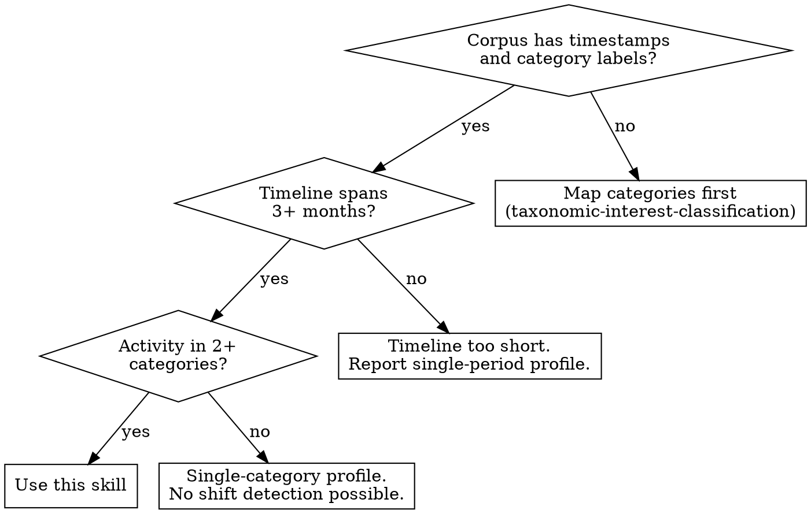
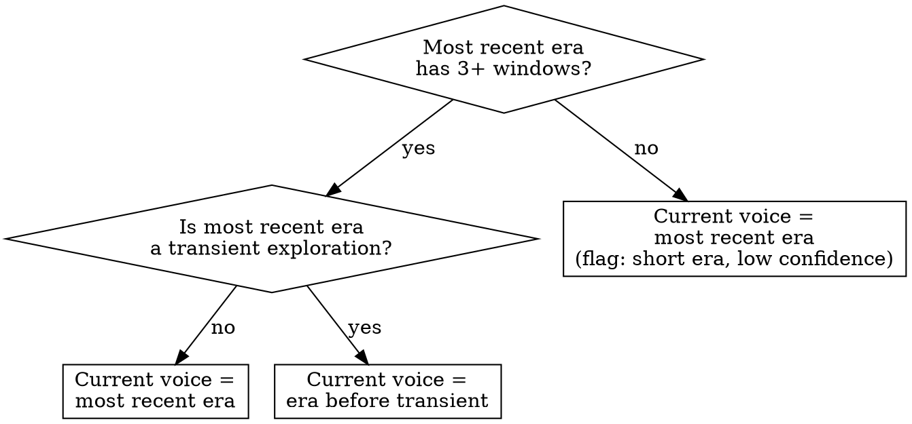
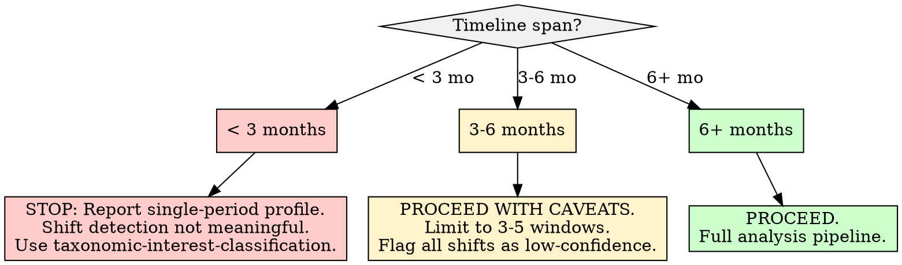

# Taxonomic Shift Detection

## Overview

Detect when a content producer migrates from one interest subgroup to another over time by comparing windowed category distributions, applying change point detection to the distribution time series, and identifying which historical period best represents the current voice. The core insight: **interest shifts are measurable changes in category distribution shape, not just changes in the most-frequent category** -- a user who gradually spreads across three new domains has shifted just as meaningfully as one who abruptly swaps a primary interest.

**REQUIRED BACKGROUND:** You MUST have a category-mapped corpus before using this skill. Use taxonomic-interest-classification to map content items to categories first. This skill operates on the temporal evolution of those category distributions, not on raw text.

## When to Use

- Corpus of categorized content spans a meaningful time period (months to years) and you need to detect interest migrations
- Need to identify the "current voice" period -- which era of the timeline best represents the user's present interests
- Investigating whether observed category changes are genuine shifts or temporary exploration
- Feeding era-segmented profiles into downstream archetype assignment or voice modeling
- Detecting life transitions, professional pivots, or topic drift from behavioral data patterns

**Not for:**
- Single-timepoint interest profiling (use taxonomic-interest-classification instead)
- Detecting sentiment changes over time (use vader-sentiment-analysis)
- Topic discovery within a single time period (use nmf-topic-modeling)
- Corpora without timestamps or temporal ordering
- Corpora concentrated entirely in a single category (nothing to shift between)



## Quick Reference

| Concept | Value / Guideline |
|---------|-------------------|
| **Minimum timeline** | 3 months of activity for meaningful shift detection |
| **Minimum items** | 50+ categorized items; 100+ preferred for robust windowing |
| **Window sizing** | Adaptive: enough items per window for stable distributions (15+ items minimum) |
| **Divergence metric** | Jensen-Shannon Divergence (JSD) between adjacent window distributions |
| **JSD range** | [0, 1] when using base-2 log; 0 = identical distributions, 1 = no overlap |
| **Change point detection** | ruptures library (Python): PELT or Binseg with custom JSD-based cost |
| **Shift threshold** | JSD > 0.15 between adjacent windows suggests meaningful shift (validate per corpus) |
| **Drift threshold** | Cumulative JSD increasing monotonically over 3+ windows = gradual drift |
| **Current voice window** | Most recent era after the last detected change point |
| **Minimum era length** | 3+ windows to qualify as a stable era (not transient exploration) |

## Workflow

Copy this checklist and track progress:

```
Taxonomic Shift Detection Progress:
- [ ] Step 1: Validate temporal corpus requirements
- [ ] Step 2: Construct adaptive temporal windows
- [ ] Step 3: Compute per-window category distributions
- [ ] Step 4: Calculate inter-window divergence series (JSD)
- [ ] Step 5: Detect change points in the divergence series
- [ ] Step 6: Segment timeline into eras
- [ ] Step 7: Characterize each era (dominant categories, diversity)
- [ ] Step 8: Validate shifts (permanent vs. transient)
- [ ] Step 9: Identify the current voice period
- [ ] Step 10: Write findings to docs/analysis/13-taxonomic-shift-detection.md
```

### Step 1: Validate Temporal Corpus Requirements

Before running shift detection, verify the corpus meets minimum requirements for longitudinal analysis.

**Required inputs:**
- A corpus where each item has: (a) a timestamp, (b) an assigned category from taxonomic-interest-classification
- Items sorted chronologically

**Validation checks:**

| Check | Pass Condition | Fail Action |
|-------|---------------|-------------|
| **Timeline span** | >= 3 months between first and last item | Report: "Timeline too short for shift detection." Compute static profile only. |
| **Total items** | >= 50 categorized items | Report: "Insufficient items for windowed analysis." Compute static profile only. |
| **Category spread** | >= 2 distinct categories occupied | Report: "Single-category corpus. No migration possible." |
| **Temporal gaps** | No gap > 25% of total timeline span | Flag gaps. Consider splitting timeline at large gaps and analyzing segments independently. |
| **Temporal density** | Average >= 2 items per month | Warn: "Sparse activity. Windows will be large and may smooth over transitions." |

**If corpus fails validation:** Document which checks failed and what minimum data would be needed. Do not force shift detection on insufficient data.

### Step 2: Construct Adaptive Temporal Windows

Windows must contain enough items for stable category distributions. Fixed calendar windows (monthly, weekly) often split transitions or produce windows with too few items.

**Adaptive window algorithm:**

```python
import pandas as pd
import numpy as np

def build_adaptive_windows(df, date_col, min_items=15, max_items=60):
    """Build temporal windows with adaptive sizing.
    Each window has between min_items and max_items.
    Windows respect chronological order."""
    df = df.sort_values(date_col).reset_index(drop=True)
    windows = []
    current_start = 0

    while current_start < len(df):
        current_end = min(current_start + max_items, len(df))
        # Ensure at least min_items (unless at end of corpus)
        if current_end - current_start < min_items and current_start > 0:
            # Merge remainder into previous window
            if windows:
                windows[-1]['end_idx'] = current_end
                windows[-1]['end_date'] = df[date_col].iloc[current_end - 1]
                break
        windows.append({
            'window_id': len(windows),
            'start_idx': current_start,
            'end_idx': current_end,
            'start_date': df[date_col].iloc[current_start],
            'end_date': df[date_col].iloc[current_end - 1],
            'item_count': current_end - current_start,
        })
        current_start = current_end

    return windows
```

**Window sizing guidance:**

| Corpus Size | Recommended min_items | Expected Windows |
|-------------|----------------------|------------------|
| 50-100 | 10-15 | 4-8 |
| 100-300 | 15-25 | 6-15 |
| 300-1000 | 25-40 | 10-30 |
| 1000+ | 30-60 | 15+ |

**Avoid:** Fixed calendar windows (monthly/weekly) when item density varies significantly across time. A month with 2 posts and a month with 50 posts should not receive equal analytical weight.

### Step 3: Compute Per-Window Category Distributions

For each window, compute the proportion of items in each category.

```python
def compute_window_distributions(df, windows, category_col):
    """Compute category probability distribution for each window."""
    all_categories = sorted(df[category_col].unique())
    distributions = []

    for w in windows:
        subset = df.iloc[w['start_idx']:w['end_idx']]
        counts = subset[category_col].value_counts()
        # Include all categories (zero-fill for absent ones)
        dist = {cat: counts.get(cat, 0) / len(subset) for cat in all_categories}
        distributions.append(dist)

    return pd.DataFrame(distributions, columns=all_categories)
```

**Important:** Include ALL categories from the full corpus in every window distribution, even those with zero items in that window. This ensures distributions are comparable across windows and JSD computation is valid.

### Step 4: Calculate Inter-Window Divergence Series (JSD)

Jensen-Shannon Divergence measures the distance between two probability distributions. It is symmetric, bounded [0, 1] (with base-2 log), and well-defined even when one distribution has zero-probability categories.

```python
from scipy.spatial.distance import jensenshannon

def compute_jsd_series(distributions_df):
    """Compute JSD between each pair of adjacent windows."""
    jsd_values = []
    for i in range(1, len(distributions_df)):
        p = distributions_df.iloc[i - 1].values
        q = distributions_df.iloc[i].values
        # scipy jensenshannon returns the DISTANCE (sqrt of divergence)
        # Square it to get the divergence, or use distance directly
        jsd = jensenshannon(p, q, base=2) ** 2  # JSD divergence
        jsd_values.append({
            'window_pair': f"{i-1}->{i}",
            'jsd': jsd,
        })
    return pd.DataFrame(jsd_values)
```

**Also compute cumulative divergence from the first window:**

```python
def compute_cumulative_jsd(distributions_df):
    """JSD of each window vs. the first window (baseline drift)."""
    baseline = distributions_df.iloc[0].values
    cumulative = []
    for i in range(len(distributions_df)):
        p = distributions_df.iloc[i].values
        jsd = jensenshannon(baseline, p, base=2) ** 2
        cumulative.append({'window': i, 'jsd_from_baseline': jsd})
    return pd.DataFrame(cumulative)
```

**Interpreting JSD values:**

| JSD Value | Interpretation |
|-----------|---------------|
| 0.00 - 0.05 | Negligible difference; distributions are essentially identical |
| 0.05 - 0.15 | Minor variation; normal fluctuation in interests |
| 0.15 - 0.30 | Moderate shift; one or more categories changed meaningfully |
| 0.30 - 0.50 | Major shift; interest distribution has substantially reorganized |
| 0.50+ | Dramatic shift; almost entirely different interest profile |

### Step 5: Detect Change Points in the Divergence Series

Use change point detection to identify where the distribution shifts most significantly. Two complementary approaches:

**Approach A: PELT on the JSD series (sharp break detection)**

```python
import ruptures as rpt

def detect_change_points_pelt(jsd_series, pen=1.0):
    """Detect change points in JSD series using PELT.
    pen (penalty) controls sensitivity: lower = more change points."""
    signal = jsd_series['jsd'].values.reshape(-1, 1)
    algo = rpt.Pelt(model="rbf", min_size=2).fit(signal)
    change_points = algo.predict(pen=pen)
    # ruptures returns indices including the last point; remove it
    change_points = [cp for cp in change_points if cp < len(signal)]
    return change_points
```

**Approach B: Sliding window JSD threshold (gradual drift detection)**

```python
def detect_gradual_drift(cumulative_jsd_df, monotonic_windows=3):
    """Detect gradual drift: cumulative JSD increasing for N+ consecutive windows."""
    vals = cumulative_jsd_df['jsd_from_baseline'].values
    drift_regions = []
    streak = 0
    for i in range(1, len(vals)):
        if vals[i] > vals[i - 1]:
            streak += 1
            if streak >= monotonic_windows:
                drift_regions.append({
                    'start_window': i - streak,
                    'end_window': i,
                    'drift_magnitude': vals[i] - vals[i - streak],
                })
        else:
            streak = 0
    return drift_regions
```

**Use both approaches.** Sharp breaks and gradual drift are different phenomena. A corpus may exhibit both (e.g., gradual drift toward tech, then a sharp pivot into a specific subfield).

**Tuning the penalty parameter (pen):**
- Start with pen=1.0. If too many change points (>1 per 3 windows), increase pen.
- If no change points detected, decrease pen to 0.5, then 0.3.
- Validate detected change points against the JSD series visually or numerically.

### Step 6: Segment Timeline into Eras

Use detected change points to segment the timeline into distinct eras.

```python
def segment_eras(windows, change_points):
    """Segment timeline at change points into eras."""
    boundaries = [0] + sorted(change_points) + [len(windows)]
    eras = []
    for i in range(len(boundaries) - 1):
        start_w = boundaries[i]
        end_w = boundaries[i + 1]
        era_windows = windows[start_w:end_w]
        eras.append({
            'era_id': i,
            'start_window': start_w,
            'end_window': end_w - 1,
            'start_date': era_windows[0]['start_date'],
            'end_date': era_windows[-1]['end_date'],
            'window_count': end_w - start_w,
            'total_items': sum(w['item_count'] for w in era_windows),
        })
    return eras
```

**Era validation:** An era with fewer than 3 windows or fewer than 15 items should be flagged as "transient" rather than a stable period. Consider merging transient eras with their neighbors.

### Step 7: Characterize Each Era

For each era, compute the category distribution, dominant categories, and diversity metrics.

```python
def characterize_era(df, era, category_col):
    """Compute category profile for a single era."""
    subset = df.iloc[era['start_idx']:era['end_idx']]
    counts = subset[category_col].value_counts()
    total = len(subset)
    dist = counts / total

    # Shannon entropy
    h = -sum(p * np.log2(p) for p in dist.values if p > 0)
    h_max = np.log2(len(dist))
    h_norm = h / h_max if h_max > 0 else 0

    return {
        'era_id': era['era_id'],
        'dominant_category': dist.idxmax(),
        'dominant_proportion': dist.max(),
        'top_3_categories': dist.head(3).to_dict(),
        'category_count': len(dist),
        'shannon_entropy': h,
        'normalized_entropy': h_norm,
        'distribution': dist.to_dict(),
    }
```

**Compare eras pairwise:** For each pair of consecutive eras, compute JSD between their aggregate distributions. This gives the "shift magnitude" at each transition.

### Step 8: Validate Shifts -- Permanent vs. Transient

Not every detected change point represents a genuine migration. Validate each shift.

**Validation criteria:**

| Criterion | Permanent Shift | Transient Exploration |
|-----------|----------------|----------------------|
| **Duration** | Era after shift persists 3+ windows | Era after shift is 1-2 windows before reverting |
| **Magnitude** | JSD between eras > 0.15 | JSD between eras < 0.15 |
| **Reversion** | Distribution does NOT return to pre-shift pattern | Distribution returns to pre-shift pattern within 2 windows |
| **Category change** | Different dominant category or substantial redistribution | Same dominant category, minor proportion changes |

```python
def validate_shift(era_before, era_after, era_after_next=None, reversion_threshold=0.10):
    """Classify a shift as permanent or transient."""
    from scipy.spatial.distance import jensenshannon

    # Magnitude check
    p = list(era_before['distribution'].values())
    q = list(era_after['distribution'].values())
    magnitude = jensenshannon(p, q, base=2) ** 2

    # Reversion check (does era_after_next look like era_before?)
    reverted = False
    if era_after_next:
        r = list(era_after_next['distribution'].values())
        reversion_jsd = jensenshannon(p, r, base=2) ** 2
        reverted = reversion_jsd < reversion_threshold

    # Duration check
    short_era = era_after['window_count'] < 3

    if short_era and reverted:
        return 'transient'
    elif magnitude < 0.15:
        return 'minor_fluctuation'
    else:
        return 'permanent'
```

**Report transient shifts separately.** They are not meaningless -- temporary explorations can signal interests that almost became permanent -- but they should not be weighted equally with confirmed migrations.

### Step 9: Identify the Current Voice Period

The "current voice" is the era that best represents the user's present interests. This is typically the most recent stable era, but edge cases require judgment.

**Decision logic:**



**Report for current voice:**
- Category distribution of the current voice era
- How different it is from the overall (all-time) distribution (JSD)
- How different it is from the immediately preceding era (JSD)
- Confidence level: high (3+ windows, validated permanent shift), medium (2 windows, no reversion yet), low (1 window, may be transient)

### Step 10: Write the Report

Write findings to `docs/analysis/13-taxonomic-shift-detection.md`.

**Required report structure:**

```markdown
# Taxonomic Shift Detection

## Methodology
- **Input:** [N items, date range, category source (e.g., taxonomic-interest-classification)]
- **Windowing:** [Adaptive/fixed, min_items, max_items, total windows constructed]
- **Divergence metric:** Jensen-Shannon Divergence (base-2, squared)
- **Change point detection:** [PELT penalty value, plus gradual drift detection parameters]
- **Validation criteria:** [Minimum era length, magnitude threshold, reversion threshold]
- **Date of analysis:** [date]

## Temporal Corpus Summary
- Timeline span: [first date] to [last date] ([N months/years])
- Total items: [N]
- Average density: [N items/month]
- Temporal gaps: [Any gaps > 25% of timeline flagged]
- Categories occupied: [N distinct categories across full timeline]

## Window Construction
| Window | Date Range | Items | Dominant Category |
|--------|-----------|-------|-------------------|
| W0 | [start] - [end] | [N] | [category] |
| ... | ... | ... | ... |

## Divergence Series

### Adjacent Window JSD
| Window Pair | JSD | Interpretation |
|-------------|-----|----------------|
| W0 -> W1 | [X.XXX] | [negligible/minor/moderate/major] |
| ... | ... | ... |

### Cumulative Drift from Baseline (W0)
| Window | JSD from Baseline | Cumulative Trend |
|--------|-------------------|------------------|
| W0 | 0.000 | -- |
| ... | ... | [increasing/stable/decreasing] |

## Detected Change Points
| Change Point | Between Windows | JSD at Transition | Type |
|-------------|----------------|-------------------|------|
| CP1 | W[X] -> W[Y] | [X.XXX] | [sharp break / gradual drift] |
| ... | ... | ... | ... |

## Era Segmentation

### Era Summary
| Era | Windows | Date Range | Items | Dominant Categories | Normalized Entropy |
|-----|---------|-----------|-------|--------------------|--------------------|
| Era 0 | W0-W[X] | [dates] | [N] | [top 2-3] | [H_norm] |
| ... | ... | ... | ... | ... | ... |

### Era-to-Era Transitions
| Transition | JSD | Shift Type | Key Category Changes |
|-----------|-----|-----------|---------------------|
| Era 0 -> Era 1 | [X.XXX] | [permanent/transient/minor] | [gained X, lost Y] |
| ... | ... | ... | ... |

## Shift Validation
| Shift | Magnitude | Duration | Reversion? | Classification |
|-------|-----------|----------|------------|---------------|
| Era 0 -> Era 1 | [X.XXX] | [N windows] | [yes/no] | [permanent/transient/minor] |
| ... | ... | ... | ... | ... |

## Current Voice

**Current voice era:** Era [N] ([date range])
**Confidence:** [high/medium/low] -- [rationale]
**Dominant categories:** [top 3 with proportions]
**Divergence from all-time profile:** JSD = [X.XXX]
**Divergence from preceding era:** JSD = [X.XXX]

### Current Voice Category Distribution
| Category | Proportion | Change from Previous Era |
|----------|-----------|------------------------|
| [cat] | [X.XX%] | [+/-X.XX%] |
| ... | ... | ... |

## Migration Narrative

[Structured summary of the trajectory: what the user started with, how interests evolved, what the current profile looks like. Describe observed distribution changes only -- do NOT speculate on causes (life events, career changes) unless corroborating evidence is available.]

## Gradual Drift Analysis

[If gradual drift detected: describe the drift direction, rate, and whether it is ongoing or has plateaued.]

## Limitations and Caveats
- [Temporal gap impacts if any]
- [Window size constraints]
- [Low-item eras and confidence implications]
- [Category mapping limitations inherited from taxonomic-interest-classification]
- [Change point detection is retrospective -- it cannot predict future shifts]
- [JSD thresholds are guidelines; corpus-specific validation is needed]

## Downstream Use
[How era segmentation feeds into voice modeling, archetype assignment, or content strategy]
```

## Good Patterns

- **Use Jensen-Shannon Divergence** for comparing distributions -- it is symmetric, bounded, and handles zero probabilities gracefully (unlike raw KL divergence)
- **Adaptive windowing** based on item count rather than fixed calendar periods -- ensures each window has enough items for a stable distribution
- **Detect both sharp breaks and gradual drift** -- they are complementary phenomena, and a corpus often contains both
- **Validate shifts with reversion checking** -- temporary exploration looks like a shift until the user reverts; checking the era *after* a candidate shift catches these
- **Characterize the current voice explicitly** -- downstream consumers need to know which era represents "now," not just that shifts occurred
- **Include cumulative drift from baseline** alongside adjacent-window JSD -- cumulative drift reveals slow, steady migration that adjacent-window analysis misses

## Anti-Patterns

| Anti-Pattern | Why It Fails | Instead |
|--------------|-------------|---------|
| Fixed calendar windows (monthly/weekly) when density varies | A month with 2 items produces an unstable distribution; comparing it to a month with 50 items is misleading | Use adaptive windows with minimum item thresholds |
| Treating any category proportion change as a "shift" | Normal stochastic variation produces JSD of 0.02-0.08 between windows even without real change | Apply magnitude thresholds (JSD > 0.15) and validate with duration and reversion checks |
| Confusing temporary exploration with permanent migration | A user who posts in a new category for 2 weeks then stops did not "migrate" | Require 3+ window persistence and check for reversion |
| Detecting only sharp breaks, ignoring gradual drift | Slow migration over 6 months (each adjacent window barely differs) goes undetected by break-only methods | Track cumulative JSD from baseline alongside adjacent-window JSD |
| Inferring life events from distribution shifts | A shift from Gaming to Finance does NOT mean "got a job in finance" | Report observed distribution changes; note that causes cannot be inferred from category data alone |
| Using KL divergence instead of JSD | KL is asymmetric and undefined when q(x) = 0 for any x where p(x) > 0 | JSD is symmetric and always defined; use it for distribution comparison |
| Splitting natural transitions with window boundaries | A gradual 3-month transition cut in half by a window boundary looks like two small changes instead of one meaningful shift | Verify that detected change points align with actual distribution changes, not windowing artifacts |
| Treating all shifts as equally meaningful | A shift from "Science" to "Technology" (related domains) differs from "Science" to "Cooking" (orthogonal domains) | Report which categories were gained and lost at each transition to capture semantic distance |

## Boundaries

**SHOULD do:**
- Detect category distribution shifts using divergence metrics and change point detection
- Measure shift magnitude (JSD) and classify as permanent, transient, or minor fluctuation
- Identify transition periods (windows where the shift is actively occurring)
- Determine which era best represents the current voice
- Report the full migration trajectory with per-era characterization
- Flag insufficient data, temporal gaps, and low-confidence eras

**Should NOT do:**
- Infer the **cause** of shifts (life events, career changes, personal crises) without corroborating evidence external to the category data
- Treat all detected shifts as meaningful -- minor fluctuations (JSD < 0.15) are noise, not signal
- Assume shifts are permanent until validated with reversion checking
- Claim precision beyond what the data supports -- a 4-window era is not high-confidence evidence of a permanent new identity
- Make value judgments about shifts (migration to "simpler" interests is not a decline)
- Predict future shifts based on past patterns (retrospective analysis only)

## Insufficient Data Handling



| Condition | Action |
|-----------|--------|
| **Timeline < 3 months** | Do NOT perform shift detection. Report a single-period profile using taxonomic-interest-classification. State: "Timeline too short for meaningful shift detection." |
| **Timeline 3-6 months** | Proceed with caveats. Construct 3-5 windows maximum. Flag all detected shifts as "low confidence -- short observation period." Do not classify shifts as permanent. |
| **Timeline 6+ months** | Full analysis pipeline. |
| **< 50 items total** | Insufficient for windowed analysis. Report: "Too few items for stable per-window distributions." Compute static profile only. |
| **50-100 items** | Marginal. Use min_items=10 per window. Expect 4-8 windows. Flag as "exploratory -- low item density." |
| **100+ items** | Adequate for full analysis. |
| **Activity concentrated in 1 category (>90%)** | No migration possible. Report: "Single-dominant-category corpus. Minor category fluctuations observed but no migration pattern." |
| **Large temporal gaps (>25% of timeline)** | Split the timeline at the gap. Analyze each segment independently. Report: "Timeline contains [N]-month gap; segments analyzed independently." |
| **Sparse activity (<2 items/month)** | Increase window sizes. Warn: "Low activity density forces large windows, reducing temporal resolution. Detected shifts may be delayed relative to actual transition points." |
| **Only 2 categories occupied** | Binary distribution analysis. JSD is still valid but reflects a simple proportion shift. Report the proportion trajectory and note the limited categorical complexity. |

## Common Mistakes

| Mistake | Fix |
|---------|-----|
| Computing JSD with natural log and expecting [0, 1] range | Use base-2 log for JSD bounded to [0, 1]. scipy.jensenshannon uses base-2 by default when base=2 is specified. |
| Squaring scipy's jensenshannon output incorrectly | scipy.spatial.distance.jensenshannon returns the Jensen-Shannon *distance* (square root of divergence). Square it to get the divergence, or use the distance directly but document which you used. |
| Setting PELT penalty too low, detecting dozens of "shifts" | Start with pen=1.0 and increase. More than 1 change point per 3 windows usually indicates over-detection. |
| Forgetting to zero-fill absent categories in window distributions | If category X exists in window 2 but not window 3, window 3 must have p(X)=0 in its distribution. Otherwise JSD computation will compare distributions of different dimensionality. |
| Reporting shifts without checking reversion | Always check if the era *after* a candidate shift reverts to the pre-shift pattern. Without this check, every temporary exploration looks permanent. |
| Ignoring gradual drift in favor of only sharp breaks | Cumulative JSD from baseline captures slow migration that adjacent-window analysis misses entirely. Always compute both. |
| Applying this skill before taxonomic-interest-classification | This skill requires pre-categorized data. Raw text without category labels cannot be windowed into distributions. |
| Over-interpreting a single window as "the new normal" | One anomalous window does not constitute a shift. Require 3+ window persistence for permanent classification. |

## References

- [ruptures: change point detection in Python](https://github.com/deepcharles/ruptures) -- PELT, Binseg, and custom cost function implementations
- [PELT Algorithm Documentation](https://centre-borelli.github.io/ruptures-docs/user-guide/detection/pelt/) -- Pruned Exact Linear Time change point detection
- [Jensen-Shannon Divergence (Wikipedia)](https://en.wikipedia.org/wiki/Jensen%E2%80%93Shannon_divergence) -- Mathematical definition and properties
- [Detecting dynamical changes in time series by using the Jensen Shannon Divergence (Chaos, 2017)](https://arxiv.org/abs/1702.08276) -- JSD for dynamical change detection in time series
- [Bayesian Online Changepoint Detection (Adams & MacKay, 2007)](https://arxiv.org/abs/0710.3742) -- Foundational Bayesian approach for online change point detection
- [An online Bayesian approach to change-point detection for categorical data (Knowledge-Based Systems, 2020)](https://www.sciencedirect.com/science/article/abs/pii/S0950705120301842) -- Bayesian methods specifically for categorical data
- [Multi-Scale User Migration on Reddit (ICWSM Workshop, 2021)](https://workshop-proceedings.icwsm.org/pdf/2021_13.pdf) -- Micro and macro scale migration analysis methods
- [User Migration in Online Social Networks (ICWSM, 2022)](https://ojs.aaai.org/index.php/ICWSM/article/view/14750) -- Case study on Reddit user migration patterns
- [scipy.spatial.distance.jensenshannon](https://docs.scipy.org/doc/scipy/reference/generated/scipy.spatial.distance.jensenshannon.html) -- Python implementation reference
- [NannyML Univariate Drift Detection Guide](https://www.nannyml.com/blog/comprehensive-guide-univariate-methods) -- Comprehensive comparison of drift detection methods including JSD
