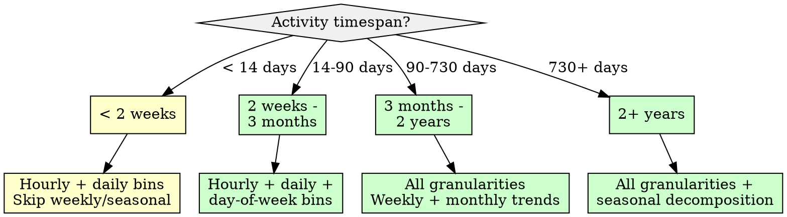
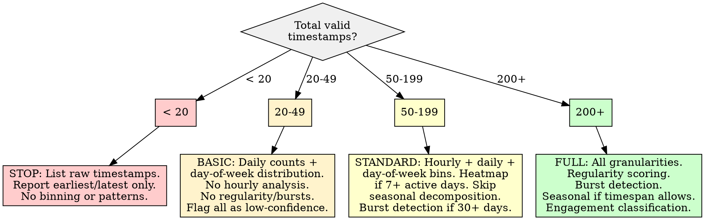

# Temporal and Circadian Pattern Analysis

## Overview

Aggregate timestamps into hourly, daily, weekly, and seasonal bins to reconstruct activity profiles and identify temporal patterns. The core principle: **timestamps encode behavioral rhythms -- binning at multiple granularities reveals daily regularity, weekly cycles, seasonal trends, and intermittent bursts that single-granularity analysis misses.**

## When to Use

- Dataset contains timestamps for user actions (posts, commits, purchases, logins, messages)
- Need to reconstruct when a user or system is most/least active
- Investigating circadian regularity (consistent daily patterns vs. erratic timing)
- Detecting weekly cycles (weekday vs. weekend behavior differences)
- Identifying seasonal trends or long-term activity evolution
- Finding activity bursts (sudden spikes above baseline)
- Classifying engagement style from temporal patterns (steady contributor, binge user, weekend warrior)
- Feeding temporal features into downstream profiling or clustering

**When NOT to use:**
- Timestamps lack any timezone indication AND timezone cannot be reasonably inferred -- temporal binning without timezone normalization produces misleading hour-of-day profiles
- Fewer than 20 total timestamps -- insufficient for any temporal pattern (see Insufficient Data section)
- Need real-time anomaly detection on streaming data -- this skill is for retrospective batch analysis
- Attempting to infer physical location from activity timing (see Boundaries)



## Quick Reference

| Concept | Value / Threshold | Notes |
|---------|-------------------|-------|
| **Minimum timestamps (any analysis)** | 20 | Below this, list raw timestamps only |
| **Minimum for hourly bins** | 50+ across 7+ distinct days | Sparse days produce empty/misleading hour bins |
| **Minimum for weekly patterns** | 4+ weeks of data | Need at least 4 full weeks to detect weekly cycles |
| **Minimum for seasonal decomposition** | 2+ full seasonal cycles | For weekly seasonality: 14+ weeks; for annual: 2+ years |
| **Timezone normalization** | ALWAYS before hour-of-day binning | UTC-only analysis misaligns circadian patterns by offset |
| **DST transitions** | Use `pytz` or `zoneinfo` with `tz_localize` | Naive arithmetic offsets produce duplicate/missing hours at DST boundaries |
| **Burst detection threshold** | Activity > mean + 2*std in a window | Simpler alternative to Kleinberg; adjust multiplier per corpus |
| **Heatmap axes** | Rows = day-of-week, Columns = hour-of-day | Standard orientation; 7x24 grid is the canonical activity heatmap |
| **Resampling aliases (pandas)** | `h`=hourly, `D`=daily, `W`=weekly, `ME`=month-end | Use `ME` not deprecated `M` in pandas >= 2.0 |

## Workflow

Copy this checklist and track progress:

```
Temporal and Circadian Pattern Analysis Progress:
- [ ] Step 1: Validate timestamp data and timezone information
- [ ] Step 2: Normalize timezones and handle DST
- [ ] Step 3: Multi-granularity binning (hourly, daily, weekly, monthly)
- [ ] Step 4: Build activity heatmap (day-of-week x hour-of-day)
- [ ] Step 5: Detect circadian regularity
- [ ] Step 6: Identify weekly and day-of-week patterns
- [ ] Step 7: Seasonal decomposition (if timespan sufficient)
- [ ] Step 8: Burst detection
- [ ] Step 9: Classify engagement style
- [ ] Step 10: Write findings to docs/analysis/12-temporal-circadian-patterns.md
```

### Step 1: Validate Timestamp Data and Timezone Information

Before any binning, verify timestamp quality and timezone availability.

```python
import pandas as pd
import numpy as np

def validate_timestamps(df, ts_col, tz_col=None):
    """Validate timestamp column and assess timezone information.

    Adapt ts_col and tz_col to your data:
    - 'created_utc', 'timestamp', 'date', 'created_at', etc.
    - tz_col may be a dedicated column or embedded in the timestamp string.
    """
    ts = pd.to_datetime(df[ts_col], errors='coerce')
    valid_count = ts.notna().sum()
    invalid_count = ts.isna().sum()
    timespan = (ts.max() - ts.min()) if valid_count >= 2 else pd.Timedelta(0)

    # Timezone assessment
    tz_info = 'none'
    if ts.dt.tz is not None:
        tz_info = f'tz-aware: {ts.dt.tz}'
    elif tz_col and tz_col in df.columns:
        tz_info = f'separate tz column: {df[tz_col].nunique()} unique zones'
    elif ts_col.endswith('_utc') or 'utc' in ts_col.lower():
        tz_info = 'inferred UTC from column name'

    report = {
        'total_records': len(df),
        'valid_timestamps': valid_count,
        'invalid_timestamps': invalid_count,
        'timespan': timespan,
        'timespan_days': timespan.days,
        'earliest': ts.min(),
        'latest': ts.max(),
        'timezone_status': tz_info,
        'distinct_dates': ts.dt.date.nunique(),
        'distinct_hours': ts.dt.hour.nunique(),
    }

    # Determine viable granularities
    report['viable_hourly'] = valid_count >= 50 and report['distinct_dates'] >= 7
    report['viable_weekly'] = timespan.days >= 28
    report['viable_seasonal'] = timespan.days >= 365
    report['viable_any'] = valid_count >= 20

    return report, ts
```

**If timestamps lack timezone info:**
1. Check if column name implies UTC (e.g., `created_utc`, `timestamp_utc`)
2. Check if a separate timezone/offset column exists
3. If neither: document the assumption ("timestamps treated as UTC; hour-of-day analysis may be offset from local time") and proceed with UTC
4. Do NOT guess a timezone from activity patterns -- that reverses the analysis direction (see Boundaries)

### Step 2: Normalize Timezones and Handle DST

```python
from zoneinfo import ZoneInfo  # Python 3.9+; use pytz for older

def normalize_timezone(ts_series, source_tz='UTC', target_tz=None):
    """Convert timestamps to a consistent timezone for analysis.

    source_tz: what the raw timestamps represent
    target_tz: what to convert to (None = keep source)
    """
    # Localize if naive
    if ts_series.dt.tz is None:
        ts_series = ts_series.dt.tz_localize(source_tz)

    # Convert if target specified
    if target_tz and target_tz != source_tz:
        ts_series = ts_series.dt.tz_convert(target_tz)

    return ts_series
```

**DST pitfall:** Naive UTC offset arithmetic (`timestamp + timedelta(hours=-5)` for US Eastern) produces duplicate hours at fall-back and missing hours at spring-forward. Always use `tz_convert()` with a proper timezone database.

### Step 3: Multi-Granularity Binning

```python
def compute_activity_bins(ts_series):
    """Bin timestamps at multiple granularities.
    Returns a dict of Series, each indexed by the bin period."""
    ts = ts_series.dropna().sort_values()

    bins = {}

    # Hourly: count per calendar hour
    bins['hourly'] = ts.dt.floor('h').value_counts().sort_index()

    # Hour-of-day: aggregate across all days (0-23)
    bins['hour_of_day'] = ts.dt.hour.value_counts().sort_index()

    # Daily: count per calendar date
    bins['daily'] = ts.dt.date.value_counts().sort_index()

    # Day-of-week: aggregate across all weeks (0=Monday, 6=Sunday)
    bins['day_of_week'] = ts.dt.dayofweek.value_counts().sort_index()
    bins['day_of_week'].index = ['Mon', 'Tue', 'Wed', 'Thu', 'Fri', 'Sat', 'Sun']

    # Weekly: count per ISO week
    weekly = ts.to_frame('ts').set_index('ts').resample('W').size()
    bins['weekly'] = weekly

    # Monthly: count per month
    monthly = ts.to_frame('ts').set_index('ts').resample('ME').size()
    bins['monthly'] = monthly

    return bins
```

**Always compute hour-of-day and day-of-week aggregates.** These cross-day/cross-week aggregates reveal the repeating patterns that per-instance hourly or daily counts obscure with noise.

### Step 4: Build Activity Heatmap

The 7x24 heatmap (day-of-week rows, hour-of-day columns) is the single most informative temporal visualization.

```python
def build_heatmap_matrix(ts_series):
    """Build a 7x24 activity count matrix for heatmap visualization.
    Rows: Monday(0) through Sunday(6). Columns: hours 0-23."""
    df = pd.DataFrame({
        'dow': ts_series.dt.dayofweek,
        'hour': ts_series.dt.hour,
    })
    matrix = df.groupby(['dow', 'hour']).size().unstack(fill_value=0)
    # Ensure all 24 hours and 7 days are present
    matrix = matrix.reindex(index=range(7), columns=range(24), fill_value=0)
    matrix.index = ['Mon', 'Tue', 'Wed', 'Thu', 'Fri', 'Sat', 'Sun']
    return matrix

# Interpretation: dark cells = high activity, light = low activity
# Look for: diagonal bands (shifting schedule), solid rows (day-specific),
# solid columns (hour-specific), scattered (irregular)
```

### Step 5: Detect Circadian Regularity

Circadian regularity measures how consistently activity clusters at the same hours across different days.

```python
def compute_circadian_regularity(ts_series, min_days=7):
    """Measure consistency of hour-of-day patterns across days.

    Returns regularity score (0-1) where 1 = identical hourly
    distribution every day, 0 = completely random.
    Uses cosine similarity between per-day hourly distributions.
    """
    from sklearn.metrics.pairwise import cosine_similarity

    df = pd.DataFrame({
        'date': ts_series.dt.date,
        'hour': ts_series.dt.hour,
    })

    # Per-day hourly distributions
    daily_profiles = df.groupby(['date', 'hour']).size().unstack(fill_value=0)
    daily_profiles = daily_profiles.reindex(columns=range(24), fill_value=0)

    if len(daily_profiles) < min_days:
        return None, f"Only {len(daily_profiles)} active days (need {min_days}+)"

    # Filter out days with very low activity (< 3 actions)
    daily_profiles = daily_profiles[daily_profiles.sum(axis=1) >= 3]
    if len(daily_profiles) < min_days:
        return None, f"Only {len(daily_profiles)} days with 3+ actions"

    # Normalize each day to proportions
    normalized = daily_profiles.div(daily_profiles.sum(axis=1), axis=0)

    # Pairwise cosine similarity, then average
    sim_matrix = cosine_similarity(normalized)
    # Exclude diagonal (self-similarity = 1.0)
    np.fill_diagonal(sim_matrix, np.nan)
    regularity = np.nanmean(sim_matrix)

    return round(regularity, 3), {
        'active_days': len(daily_profiles),
        'interpretation': interpret_regularity(regularity),
    }

def interpret_regularity(score):
    if score >= 0.85:
        return 'Highly regular -- consistent daily rhythm'
    elif score >= 0.65:
        return 'Moderately regular -- recognizable pattern with variation'
    elif score >= 0.40:
        return 'Weakly regular -- some recurring tendencies but variable'
    else:
        return 'Irregular -- no consistent daily pattern'
```

### Step 6: Identify Weekly and Day-of-Week Patterns

```python
from scipy import stats

def analyze_weekly_patterns(ts_series):
    """Detect whether activity differs significantly by day of week."""
    df = pd.DataFrame({
        'date': ts_series.dt.date,
        'dow': ts_series.dt.dayofweek,
    })

    daily_counts = df.groupby('date').size().reset_index(name='count')
    daily_counts['dow'] = pd.to_datetime(daily_counts['date']).dt.dayofweek

    # Group counts by day-of-week
    dow_groups = [
        daily_counts[daily_counts['dow'] == d]['count'].values
        for d in range(7)
    ]
    # Filter out empty groups
    dow_groups = [g for g in dow_groups if len(g) > 0]

    if len(dow_groups) < 2:
        return None, "Insufficient day-of-week variation"

    # Kruskal-Wallis: non-parametric test for differences across groups
    stat, p_value = stats.kruskal(*dow_groups)

    dow_names = ['Mon', 'Tue', 'Wed', 'Thu', 'Fri', 'Sat', 'Sun']
    dow_means = {
        dow_names[d]: daily_counts[daily_counts['dow'] == d]['count'].mean()
        for d in range(7)
    }

    # Weekday vs weekend comparison
    weekday = daily_counts[daily_counts['dow'] < 5]['count']
    weekend = daily_counts[daily_counts['dow'] >= 5]['count']
    if len(weekday) > 0 and len(weekend) > 0:
        wk_stat, wk_p = stats.mannwhitneyu(
            weekday, weekend, alternative='two-sided'
        )
        weekday_vs_weekend = {
            'weekday_mean': round(weekday.mean(), 2),
            'weekend_mean': round(weekend.mean(), 2),
            'u_statistic': round(wk_stat, 2),
            'p_value': round(wk_p, 4),
            'significant': wk_p < 0.05,
        }
    else:
        weekday_vs_weekend = None

    return {
        'kruskal_wallis_stat': round(stat, 2),
        'kruskal_wallis_p': round(p_value, 4),
        'significant_dow_difference': p_value < 0.05,
        'per_dow_means': dow_means,
        'weekday_vs_weekend': weekday_vs_weekend,
    }, None
```

### Step 7: Seasonal Decomposition

Only run if the timespan covers at least 2 full seasonal cycles.

```python
from statsmodels.tsa.seasonal import STL

def seasonal_decomposition(ts_series, period='weekly'):
    """Decompose activity time series into trend, seasonal, and residual.

    period: 'weekly' (period=7 on daily data) or 'annual' (period=365).
    STL is preferred over seasonal_decompose for robustness to outliers.
    """
    # Resample to daily counts
    daily = ts_series.to_frame('ts').set_index('ts').resample('D').size()
    daily.name = 'count'

    # Fill missing days with 0 (no activity)
    full_range = pd.date_range(daily.index.min(), daily.index.max(), freq='D')
    daily = daily.reindex(full_range, fill_value=0)

    period_map = {'weekly': 7, 'annual': 365}
    p = period_map.get(period, 7)

    if len(daily) < 2 * p:
        return None, f"Need {2*p}+ days for {period} decomposition, have {len(daily)}"

    # STL decomposition with robust estimation
    stl = STL(daily, period=p, robust=True)
    result = stl.fit()

    return {
        'trend': result.trend,
        'seasonal': result.seasonal,
        'residual': result.resid,
        'trend_direction': 'increasing' if result.trend.iloc[-1] > result.trend.iloc[0]
                           else 'decreasing',
        'seasonal_strength': 1 - (result.resid.var() /
                                   (result.seasonal + result.resid).var()),
    }, None
```

**Seasonal strength interpretation:**
- 0.0-0.2: No meaningful seasonality
- 0.2-0.5: Weak seasonal pattern
- 0.5-0.8: Moderate seasonality
- 0.8-1.0: Strong seasonal pattern

### Step 8: Burst Detection

Identify periods of unusually high activity relative to the baseline.

```python
def detect_bursts(ts_series, window='D', threshold_std=2.0):
    """Detect activity bursts using a statistical threshold.

    A burst is a window where activity exceeds mean + threshold_std * std.
    Uses rolling baseline to account for trend changes.

    For more sophisticated detection, consider Kleinberg's burst detection
    algorithm (burst_detection package).
    """
    counts = ts_series.to_frame('ts').set_index('ts').resample(window).size()
    counts.name = 'count'

    # Rolling baseline (30-window moving average and std)
    rolling_mean = counts.rolling(window=30, min_periods=7, center=True).mean()
    rolling_std = counts.rolling(window=30, min_periods=7, center=True).std()

    threshold = rolling_mean + threshold_std * rolling_std
    bursts = counts[counts > threshold]

    burst_periods = []
    for idx, count in bursts.items():
        burst_periods.append({
            'period': idx,
            'count': int(count),
            'baseline_mean': round(rolling_mean.loc[idx], 2),
            'baseline_std': round(rolling_std.loc[idx], 2),
            'intensity': round(
                (count - rolling_mean.loc[idx]) / rolling_std.loc[idx], 2
            ) if rolling_std.loc[idx] > 0 else float('inf'),
        })

    return {
        'total_windows': len(counts),
        'burst_count': len(bursts),
        'burst_rate': round(len(bursts) / len(counts), 3) if len(counts) > 0 else 0,
        'bursts': pd.DataFrame(burst_periods),
        'interpretation': interpret_burst_rate(
            len(bursts) / len(counts) if len(counts) > 0 else 0
        ),
    }

def interpret_burst_rate(rate):
    if rate < 0.02:
        return 'Steady -- activity rarely spikes above baseline'
    elif rate < 0.10:
        return 'Occasional bursts -- periodic spikes above normal activity'
    elif rate < 0.25:
        return 'Bursty -- frequent activity spikes; engagement comes in waves'
    else:
        return 'Highly bursty -- activity is dominated by spikes rather than steady output'
```

### Step 9: Classify Engagement Style

Synthesize the temporal features into an engagement style classification.

```python
def classify_engagement_style(regularity_score, burst_rate,
                               weekday_vs_weekend, hourly_concentration):
    """Classify the overall temporal engagement pattern.

    hourly_concentration: fraction of activity in the top-3 hours (0-1).
    """
    styles = []

    # Regularity dimension
    if regularity_score and regularity_score >= 0.75:
        styles.append('routine-driven')
    elif regularity_score and regularity_score < 0.40:
        styles.append('irregular')

    # Burst dimension
    if burst_rate >= 0.15:
        styles.append('binge-pattern')
    elif burst_rate < 0.03:
        styles.append('steady-contributor')

    # Schedule dimension
    if weekday_vs_weekend and weekday_vs_weekend.get('significant'):
        if weekday_vs_weekend['weekday_mean'] > weekday_vs_weekend['weekend_mean'] * 1.5:
            styles.append('weekday-focused')
        elif weekday_vs_weekend['weekend_mean'] > weekday_vs_weekend['weekday_mean'] * 1.5:
            styles.append('weekend-warrior')

    # Concentration dimension
    if hourly_concentration >= 0.60:
        styles.append('time-concentrated')
    elif hourly_concentration <= 0.25:
        styles.append('time-dispersed')

    if not styles:
        styles.append('mixed-pattern')

    return styles
```

**Engagement style taxonomy:**

| Style | Indicator | Description |
|-------|-----------|-------------|
| **routine-driven** | Regularity >= 0.75 | Consistent daily rhythm; similar hours each day |
| **irregular** | Regularity < 0.40 | No predictable daily pattern |
| **binge-pattern** | Burst rate >= 15% | Activity comes in intense bursts |
| **steady-contributor** | Burst rate < 3% | Even, sustained activity over time |
| **weekday-focused** | Weekday mean > 1.5x weekend | Activity concentrated on work days |
| **weekend-warrior** | Weekend mean > 1.5x weekday | Activity concentrated on weekends |
| **time-concentrated** | Top-3 hours >= 60% of activity | Active in narrow daily window |
| **time-dispersed** | Top-3 hours <= 25% of activity | Spread across many hours |

### Step 10: Write Report

Write all findings to `docs/analysis/12-temporal-circadian-patterns.md`. See Report Output Template below.

## Report Output Template

The final report MUST be written to `docs/analysis/12-temporal-circadian-patterns.md` with this structure:

```markdown
# Temporal and Circadian Pattern Analysis

## Methodology
- **Data source:** [describe dataset and timestamp field used]
- **Timestamps analyzed:** [N valid of M total, N invalid/excluded]
- **Timespan:** [earliest] to [latest] ([N days])
- **Timezone handling:** [tz-aware / assumed UTC / converted to X / unknown -- state assumption]
- **DST handling:** [proper tz_convert / not applicable / N transitions in range]
- **Granularities computed:** [hourly, daily, day-of-week, weekly, monthly, seasonal]
- **Date of analysis:** [date]

## Timestamp Validation
- Valid timestamps: [N] ([%])
- Invalid/unparseable: [N] ([%])
- Timezone status: [description]
- Timespan: [N days] across [N distinct dates]
- [Any data quality issues or assumptions]

## Activity Distribution by Granularity

### Hour-of-Day Profile
| Hour | Count | % of Total |
|------|-------|-----------|
| 0 | [N] | [%] |
| ... | ... | ... |
| 23 | [N] | [%] |

- Peak hours: [list top 3 hours with counts]
- Quiet hours: [list bottom 3 hours]
- Top-3 hour concentration: [X%] of all activity

### Day-of-Week Profile
| Day | Count | % of Total |
|-----|-------|-----------|
| Monday | [N] | [%] |
| ... | ... | ... |
| Sunday | [N] | [%] |

- Peak day: [day] ([N] actions)
- Weekday mean: [X], Weekend mean: [Y]
- Weekday vs weekend: [significant / not significant] (p=[value])

### Activity Heatmap (Day-of-Week x Hour-of-Day)
[7x24 matrix or description of the heatmap pattern]

### Monthly/Weekly Trend (if applicable)
[Time series of weekly or monthly counts; trend direction]

## Circadian Regularity
- Regularity score: [X.XXX]
- Active days analyzed: [N]
- Interpretation: [highly regular / moderately regular / weakly regular / irregular]
- [Description of the daily rhythm pattern]

## Weekly Patterns
- Kruskal-Wallis test: H=[value], p=[value] -- [significant / not significant]
- Weekday vs weekend: U=[value], p=[value]
- [Interpretation of day-of-week differences]

## Seasonal Decomposition (if applicable)
- Period: [weekly / annual]
- Seasonal strength: [value] -- [none / weak / moderate / strong]
- Trend direction: [increasing / decreasing / stable]
- [Description of seasonal pattern]

## Burst Detection
- Analysis window: [daily / hourly / weekly]
- Threshold: mean + [X] * std
- Bursts detected: [N] out of [M] windows ([X%])
- Burst interpretation: [steady / occasional / bursty / highly bursty]
- [Table of burst periods if count is manageable]

## Engagement Style Classification
- Classified styles: [list of applicable styles]
- Primary pattern: [dominant style]
- [Narrative synthesis of temporal engagement profile]

## Limitations and Caveats
- [Timezone assumptions and their impact on hour-of-day analysis]
- [Timespan limitations on seasonal analysis]
- [Sparse periods and their impact on regularity scores]
- Activity timing does NOT reveal physical location or timezone
- Circadian patterns describe when activity occurs, NOT sleep schedules or health
- [Any granularities skipped and why]

## References
- [List tools and methods used]
```

## Good Patterns

- **Always normalize timezone before hour-of-day binning** -- a UTC-stored timestamp from a US Pacific user is 8 hours off; the "3 AM activity" is actually 7 PM
- **Bin at multiple granularities simultaneously** -- hourly resolution for circadian patterns, daily for burst detection, weekly for cycle detection, monthly for trends
- **Use the 7x24 heatmap as the primary visualization** -- it compresses the most important temporal signals into a single view
- **Apply STL over classical seasonal_decompose** -- STL handles outliers via robust estimation and allows non-integer seasonal smoothing
- **Compare weekday vs. weekend with a non-parametric test** -- activity counts are rarely normally distributed; use Mann-Whitney U, not t-test
- **Compute circadian regularity as cross-day similarity** -- not just "most active hour" but how consistent the full daily profile is
- **Report burst rate as a fraction of total windows** -- "5 bursts" means nothing without knowing the total observation period

## Anti-Patterns

| Anti-Pattern | Why It Fails | Instead |
|--------------|-------------|---------|
| Analyzing hour-of-day without timezone normalization | 2 AM UTC is not 2 AM local time; circadian conclusions are wrong | Always normalize to a known timezone before hourly analysis |
| Using only one granularity | Daily counts miss hourly rhythm; hourly counts miss weekly cycles | Always compute at least hour-of-day, day-of-week, and daily trend |
| Ignoring DST transitions | Naive UTC offset arithmetic creates duplicate or missing hours | Use `tz_convert()` with `zoneinfo` or `pytz`, never manual `timedelta` |
| Over-interpreting patterns from < 4 weeks of data | Weekly cycle detection requires multiple weeks; 1 week is a single observation | Report the timespan limitation; skip weekly statistical tests |
| Treating all activity as equal weight | A 3-word comment and a 2000-word post both count as "1 action" at the same hour | Consider weighting by content length or engagement if available |
| Inferring timezone from peak activity hours | "Peak at 9 PM UTC, so user is probably in US Eastern" reverses the analysis | Report activity timing; do NOT claim to identify physical location |
| Claiming to identify sleep schedules | Low activity from 2-7 AM could be sleep, or a different timezone, or a night shift | Describe "low-activity windows," never "sleep periods" |
| Running seasonal decomposition on < 2 cycles | STL needs at least 2 full periods to separate trend from seasonality | Check timespan before decomposing; skip and document if insufficient |
| Using deprecated pandas frequency aliases | `M` is deprecated in pandas >= 2.0; causes warnings or errors | Use `ME` for month-end, `MS` for month-start, `h` for hourly |
| Making health or psychological assessments | Irregular activity timing does not indicate insomnia, depression, or any condition | Describe temporal patterns objectively; do NOT make health inferences |

## Boundaries

**This skill SHOULD:**
- Reconstruct activity profiles from timestamp aggregation at multiple granularities
- Produce 7x24 day-of-week x hour-of-day heatmap matrices
- Measure circadian regularity via cross-day profile similarity
- Detect weekly cycles and weekday-vs-weekend differences with statistical tests
- Run seasonal decomposition (STL) when timespan is sufficient
- Identify activity bursts above rolling baseline
- Classify engagement style from temporal feature synthesis
- Write report to `docs/analysis/12-temporal-circadian-patterns.md`

**This skill should NOT:**
- Infer physical location or timezone from activity timing patterns (timing reveals when, not where)
- Claim to identify sleep schedules, wake times, or rest periods (low activity has many explanations)
- Make health, psychological, or wellness assessments from activity timing (irregular patterns are not diagnoses)
- Predict future activity or forecast when the user will next be active (this is retrospective analysis)
- Treat timestamps without timezone normalization as valid for hour-of-day analysis
- Force seasonal decomposition when the timespan is insufficient

## Insufficient Data Handling



| Condition | Impact | Action |
|-----------|--------|--------|
| **< 20 timestamps** | No temporal pattern is detectable | List raw timestamps. Report only timespan (earliest to latest). Do NOT compute distributions or patterns. |
| **20-49 timestamps** | Basic distribution visible, hourly bins unreliable | Compute daily counts and day-of-week totals. Skip hourly analysis (too sparse). Flag all statistics as "low-confidence (n=X)." |
| **50-199 timestamps** | Hourly and daily viable, weekly marginal | Full hourly + daily + day-of-week bins. Heatmap if 7+ distinct active days. Skip seasonal decomposition. Burst detection only if 30+ days of data. |
| **200+ timestamps** | Full analysis viable | Complete pipeline. Seasonal decomposition if timespan allows (2+ cycles). |
| **Timestamps lack timezone info** | Hour-of-day analysis may be misleading | Document the assumption explicitly: "Timestamps treated as [UTC/unknown]; hour-of-day profile may not reflect local time." Proceed but caveat every hourly finding. |
| **Timespan < 14 days** | Cannot detect weekly patterns | Skip weekly statistical tests. Report raw day-of-week counts but caveat: "Fewer than 2 full weeks; day-of-week distribution reflects this specific period only." |
| **Timespan < 2 seasonal cycles** | Seasonal decomposition invalid | Skip STL entirely. Document: "Timespan of [N days] is insufficient for [weekly/annual] seasonal decomposition (need [M days])." |
| **> 50% of days have zero activity** | Sparse activity inflates regularity denominator | Report active days vs. total days. Compute regularity only over active days. Note: "Activity occurred on [N] of [M] days ([X%]); regularity measured over active days only." |
| **All activity in a single hour** | No temporal variation to analyze | Report the single active hour. Note: "All [N] actions occurred at hour [H]; no temporal variation detected." |

**Minimum requirements per granularity:**

| Granularity | Minimum Data | Rationale |
|-------------|-------------|-----------|
| Hour-of-day profile | 50+ timestamps, 7+ active days | Fewer days leave most hour bins empty |
| Day-of-week profile | 20+ timestamps, 2+ full weeks | Need multiple instances of each day |
| Daily trend | 14+ days of data | Shorter spans show too few points for trend |
| Weekly aggregation | 4+ weeks of data | Need multiple weeks to detect cycle |
| Monthly aggregation | 3+ months of data | Need multiple months for trend |
| Seasonal decomposition (weekly) | 14+ weeks of data | STL needs 2+ full seasonal periods |
| Seasonal decomposition (annual) | 2+ years of data | Need 2+ annual cycles |
| Circadian regularity | 50+ timestamps, 7+ active days with 3+ actions each | Cosine similarity is meaningless on sparse day profiles |
| Burst detection | 30+ windows (e.g., 30 days for daily bursts) | Rolling statistics need sufficient baseline |

## Common Mistakes

| Mistake | Fix |
|---------|-----|
| Binning by hour without timezone conversion | Always `tz_convert()` to target timezone before extracting `.dt.hour` |
| Using `M` frequency alias in pandas >= 2.0 | Use `ME` (month-end) or `MS` (month-start) to avoid deprecation warnings |
| Computing regularity over all days including zero-activity days | Filter to days with 3+ actions before computing cross-day similarity |
| Reporting "most active at 3 AM" without stating timezone | Always qualify: "most active at 3 AM UTC" or "3 AM US/Eastern" |
| Running Kruskal-Wallis on day-of-week with < 4 weeks | Need multiple instances of each day; skip statistical test and report raw counts |
| Treating seasonal strength > 0.5 as "strong" | 0.5-0.8 is moderate; only > 0.8 is strong. Calibrate language to standard thresholds. |
| Comparing raw activity counts across months of different lengths | Normalize to per-day rates when comparing months (February has 28 days, July has 31) |
| Not filling missing dates with zero before STL | STL requires continuous time series; missing dates break the decomposition |
| Calling burst detection with < 30 windows | Rolling mean/std are unstable with fewer baseline points; results are noise |

## References

- [pandas Time Series / Date Functionality](https://pandas.pydata.org/docs/user_guide/timeseries.html) -- Resampling, frequency aliases, timezone handling
- [statsmodels STL Decomposition](https://www.statsmodels.org/stable/examples/notebooks/generated/stl_decomposition.html) -- Seasonal-Trend decomposition using LOESS
- [statsmodels MSTL](https://www.statsmodels.org/dev/examples/notebooks/generated/mstl_decomposition.html) -- Multi-seasonal decomposition for complex periodicity
- [Kleinberg Burst Detection (2003)](https://www.cs.cornell.edu/home/kleinber/bhs.pdf) -- "Bursty and Hierarchical Structure in Streams" -- foundational burst detection algorithm
- [burst_detection Python Package](https://github.com/nmarinsek/burst_detection) -- Python implementation of Kleinberg's algorithm
- [Procedures for Numerical Analysis of Circadian Rhythms (PMC)](https://pmc.ncbi.nlm.nih.gov/articles/PMC3663600/) -- Cosinor analysis, periodograms, amplitude/phase estimation
- [Wavelet-Based Time Series Analysis of Circadian Rhythms (Leise & Harrington, 2011)](https://journals.sagepub.com/doi/10.1177/0748730411416330) -- Wavelet transforms for non-stationary rhythms
- [scipy.stats.kruskal](https://docs.scipy.org/doc/scipy/reference/generated/scipy.stats.kruskal.html) -- Kruskal-Wallis H-test for non-parametric group comparison
- [Python zoneinfo Module](https://docs.python.org/3/library/zoneinfo.html) -- IANA timezone database access (Python 3.9+)
- [Temporal Dynamics of User Activities (Nature Scientific Reports, 2024)](https://www.nature.com/articles/s41598-024-64120-6) -- Deep learning for long/short-term temporal user profiling
