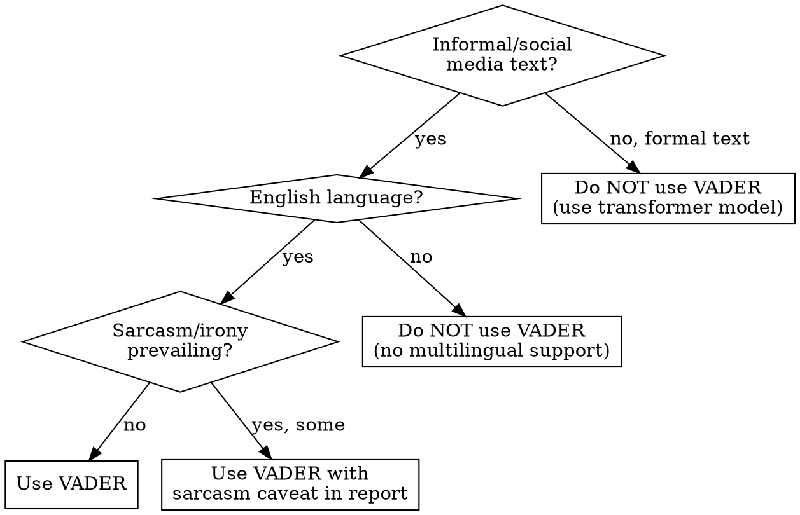
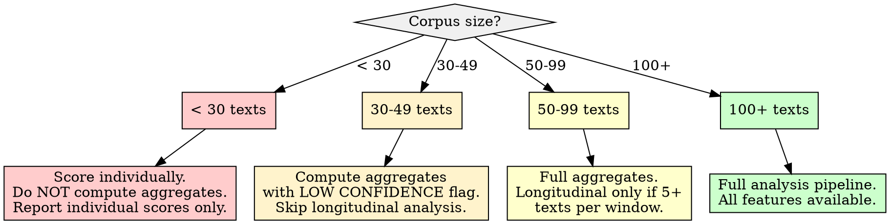

# VADER Sentiment Analysis

## Overview

VADER (Valence Aware Dictionary and sEntiment Reasoner) is a lexicon-and-rule-based sentiment tool optimized for social media and informal text. It produces four scores per text: positive, negative, neutral (proportions summing to 1.0), and a compound score normalized to [-1, +1]. The core principle: **VADER reads sentiment signals that traditional NLP preprocessing destroys** -- capitalization for emphasis, punctuation for intensity, emoticons for affect -- so preprocessing must preserve these signals, not strip them.

**Compound score normalization formula:**

```
S_compound = sum(V_i) / sqrt(sum(V_i)^2 + alpha)
```

Where `V_i` are the valence scores of each token after rule-based adjustments (negation, degree modifiers, capitalization boost, punctuation amplification), and `alpha = 15` is the normalization constant. This bounds the score to [-1, +1] with diminishing sensitivity at extremes.

## When to Use

- Scoring sentiment in social media posts, comments, reviews, or informal text
- Need a fast, deterministic, no-training-required sentiment baseline
- Tracking how sentiment changes over time across a corpus (longitudinal trajectory analysis)
- Multi-tiered analysis: scoring titles separately from body text to detect emphasis mismatches
- Establishing a sentiment baseline before applying more complex models (transformer-based, LLM-based)
- Corpus contains emoticons, slang, capitalized emphasis, exclamation marks

**When NOT to use:**

- Formal, technical, legal, or financial text (domain-specific vocabulary skews scores)
- Text in languages other than English (VADER's lexicon is English-only)
- When sarcasm, irony, or complex negation are prevalent (VADER misreads these systematically)
- When you need aspect-level sentiment (sentiment toward specific entities/features within text)
- As sole evidence of psychological or emotional state (VADER measures lexical valence, not emotion)



## Quick Reference

| Parameter / Concept | Value | Notes |
|---------------------|-------|-------|
| **Compound score range** | [-1.0, +1.0] | Normalized sum of valence; most commonly used metric |
| **Positive threshold** | compound >= 0.05 | Default from Hutto & Gilbert (2014); validate for your corpus |
| **Negative threshold** | compound <= -0.05 | Default; may need tightening for skewed corpora |
| **Neutral band** | -0.05 < compound < 0.05 | Often the largest category; do NOT ignore it |
| **pos/neg/neu scores** | [0.0, 1.0] each, sum to 1.0 | Proportions of text falling in each category |
| **Alpha constant** | 15 | Normalization denominator constant in compound formula |
| **Capitalization boost** | ~0.733 added to valence | ALL CAPS words get intensity amplification |
| **Exclamation amplification** | +0.292 per `!` (up to 4) | Increases magnitude without changing polarity |
| **Negation window** | 3 words | "not" negates the next 3 sentiment-bearing tokens |
| **Degree modifiers** | ~25 booster/dampener words | "very", "extremely" (boost); "barely", "somewhat" (dampen) |
| **Minimum text length** | 3+ words recommended | Single words produce valid but low-confidence scores |
| **Recommended corpus minimum** | 100+ texts for aggregates | Below 50, aggregate statistics are unreliable |

## Workflow

Copy this checklist and track progress:

```
VADER Sentiment Analysis Progress:
- [ ] Step 1: Validate corpus suitability for VADER
- [ ] Step 2: Preprocess text (VADER-safe: preserve sentiment signals)
- [ ] Step 3: Score at multiple tiers (title, body, combined)
- [ ] Step 4: Calibrate thresholds for this corpus
- [ ] Step 5: Compute aggregate sentiment distributions
- [ ] Step 6: Longitudinal windowing and trajectory analysis
- [ ] Step 7: Identify stabilization, volatility, and inflection patterns
- [ ] Step 8: Write findings to docs/analysis/07-vader-sentiment-analysis.md
```

### Step 1: Validate Corpus Suitability

Before scoring, verify VADER is appropriate for this corpus.

**Suitability checks:**

| Check | Pass Condition | Fail Action |
|-------|---------------|-------------|
| **Language** | All or nearly all English | VADER cannot score non-English. Remove or flag non-English texts. |
| **Register** | Informal, conversational, social media | If formal/technical, document the limitation prominently. VADER was calibrated on tweets, not journals. |
| **Text length** | Average 10+ words per text unit | If most texts are 1-3 words, scores are valid but low-confidence. Flag in report. |
| **Corpus size** | 50+ texts for aggregates, 100+ preferred | Below 50, do not compute aggregate distributions. Report individual scores only. |
| **Sarcasm prevalence** | Not the dominant mode | If corpus is heavily sarcastic (e.g., satire subreddits), VADER will systematically invert polarity. Document this. |

**If corpus fails suitability:** Report the failure in the output document. Do not force VADER onto inappropriate text. State what was checked, what failed, and recommend alternatives (TextBlob, transformer models, manual annotation).

### Step 2: Preprocess Text -- Preserve Sentiment Signals

**CRITICAL:** VADER's preprocessing requirements are the OPPOSITE of most NLP pipelines.

**DO preserve (VADER uses these):**
- CAPITALIZATION -- "GREAT" scores higher than "great" (intensity boost ~0.733)
- Punctuation -- "Good!!!" scores higher than "Good" (exclamation amplification)
- Emoticons/emoji -- `:)` has valence +2.2, `:(` has valence -2.2 in the lexicon
- Degree modifiers -- "very", "extremely", "barely" modify adjacent word valence
- Negation words -- "not", "never", "neither" flip polarity within a 3-word window
- Contractions -- "isn't", "won't", "can't" contain negation signals

**DO remove (noise that does not carry sentiment):**
- URLs (replace with empty string, not a token)
- User mentions/handles (@username)
- HTML entities and markup tags
- Hashtag symbols (remove `#` but KEEP the word: `#amazing` becomes `amazing`)
- Repeated whitespace (normalize to single spaces)

```python
import re
from nltk.sentiment.vader import SentimentIntensityAnalyzer

def vader_safe_preprocess(text):
    """Clean text for VADER while preserving sentiment signals.
    DO NOT lowercase. DO NOT strip punctuation. DO NOT remove emoticons."""
    text = re.sub(r'https?://\S+|www\.\S+', '', text)  # Remove URLs
    text = re.sub(r'@\w+', '', text)                     # Remove @mentions
    text = re.sub(r'<[^>]+>', '', text)                   # Remove HTML tags
    text = re.sub(r'&\w+;', '', text)                     # Remove HTML entities
    text = re.sub(r'#(\w+)', r'\1', text)                 # Keep hashtag words
    text = re.sub(r'\s+', ' ', text).strip()              # Normalize whitespace
    return text

# WRONG: Do not do this
# text = text.lower()           # Destroys capitalization signals
# text = re.sub(r'[^\w\s]', '', text)  # Destroys emoticons and punctuation
```

### Step 3: Score at Multiple Tiers

Score titles and body text separately. Titles carry concentrated sentiment (short, emphatic); body text carries diluted sentiment (longer, mixed). Combining them without separation loses this signal.

```python
sia = SentimentIntensityAnalyzer()

def score_multi_tier(record):
    """Score title and body separately, then compute weighted combined."""
    title_text = vader_safe_preprocess(record.get('title', '') or '')
    body_text = vader_safe_preprocess(record.get('body', '') or '')

    title_scores = sia.polarity_scores(title_text) if title_text else None
    body_scores = sia.polarity_scores(body_text) if body_text else None

    # Weighted combination: title gets higher weight per-word
    # because titles are deliberately composed summaries
    combined = None
    if title_scores and body_scores:
        # Weight by inverse length (shorter = more concentrated sentiment)
        t_len = max(len(title_text.split()), 1)
        b_len = max(len(body_text.split()), 1)
        t_weight = 1.0 / t_len
        b_weight = 1.0 / b_len
        total_weight = t_weight + b_weight
        combined = {
            key: (title_scores[key] * t_weight + body_scores[key] * b_weight) / total_weight
            for key in ('neg', 'neu', 'pos', 'compound')
        }
    elif title_scores:
        combined = title_scores
    elif body_scores:
        combined = body_scores

    return {
        'title_compound': title_scores['compound'] if title_scores else None,
        'body_compound': body_scores['compound'] if body_scores else None,
        'combined_compound': combined['compound'] if combined else None,
        'title_scores': title_scores,
        'body_scores': body_scores,
    }
```

**Tier mismatch detection:** When title compound and body compound have opposite signs (one positive, one negative), flag the record as a "sentiment mismatch." These are often the most analytically interesting cases (e.g., sarcastic titles with earnest bodies, clickbait titles with nuanced content).

### Step 4: Calibrate Thresholds

The default thresholds (0.05 / -0.05) were calibrated on a general social media corpus. Your corpus may need different cutoffs.

**Calibration procedure:**

1. Score the full corpus with default thresholds
2. Manually review 20-30 texts near each boundary (compound between -0.1 and 0.1)
3. Count misclassifications: texts labeled neutral that clearly have sentiment, or vice versa
4. Adjust thresholds to minimize boundary misclassification
5. Document the chosen thresholds and the calibration sample size

```python
# Example: Tighter thresholds for a corpus with strong sentiment signals
POSITIVE_THRESHOLD = 0.10   # Raised from 0.05
NEGATIVE_THRESHOLD = -0.10  # Lowered from -0.05

def classify_sentiment(compound, pos_thresh=POSITIVE_THRESHOLD, neg_thresh=NEGATIVE_THRESHOLD):
    if compound >= pos_thresh:
        return 'positive'
    elif compound <= neg_thresh:
        return 'negative'
    else:
        return 'neutral'
```

**If you skip calibration:** Use the defaults (0.05 / -0.05) but document that thresholds were NOT validated for this corpus. This is acceptable for exploratory analysis, not for claims about sentiment distribution.

### Step 5: Compute Aggregate Distributions

```python
import pandas as pd
import numpy as np

def compute_aggregates(scores_df):
    """Compute corpus-level sentiment statistics."""
    compound = scores_df['combined_compound'].dropna()

    return {
        'total_scored': len(compound),
        'mean_compound': compound.mean(),
        'median_compound': compound.median(),
        'std_compound': compound.std(),
        'skewness': compound.skew(),
        'pct_positive': (compound >= POSITIVE_THRESHOLD).mean() * 100,
        'pct_negative': (compound <= NEGATIVE_THRESHOLD).mean() * 100,
        'pct_neutral': ((compound > NEGATIVE_THRESHOLD) & (compound < POSITIVE_THRESHOLD)).mean() * 100,
        'mean_positive_intensity': compound[compound >= POSITIVE_THRESHOLD].mean() if (compound >= POSITIVE_THRESHOLD).any() else None,
        'mean_negative_intensity': compound[compound <= NEGATIVE_THRESHOLD].mean() if (compound <= NEGATIVE_THRESHOLD).any() else None,
    }
```

**Interpreting aggregate distributions:**
- **High neutral percentage (>60%):** Normal for most corpora. Do NOT treat this as "VADER failed." Neutral is information, not absence of signal.
- **Positive skew (mean > median):** A few strongly positive texts pull the mean up. Report median as the more robust central tendency.
- **Bimodal distribution:** Corpus may contain two distinct populations (e.g., supportive vs. critical communities). Consider segmenting before aggregation.

### Step 6: Longitudinal Windowing and Trajectory Analysis

To track sentiment over time, aggregate scores into temporal windows.

**Window selection:**

| Corpus Timespan | Recommended Window | Min Texts per Window |
|-----------------|-------------------|---------------------|
| Days to 1 week | Hourly | 5+ |
| 1 week to 3 months | Daily | 10+ |
| 3 months to 2 years | Weekly | 20+ |
| 2+ years | Monthly | 30+ |

```python
def compute_temporal_trajectory(scores_df, date_column, window='W'):
    """Compute rolling sentiment trajectory.
    window: 'D' (daily), 'W' (weekly), 'M' (monthly), 'H' (hourly)"""
    df = scores_df.copy()
    df[date_column] = pd.to_datetime(df[date_column])
    df = df.set_index(date_column).sort_index()

    trajectory = df['combined_compound'].resample(window).agg([
        'mean', 'median', 'std', 'count'
    ]).rename(columns={
        'mean': 'sentiment_mean',
        'median': 'sentiment_median',
        'std': 'sentiment_volatility',
        'count': 'text_count',
    })

    # Drop windows with insufficient texts
    min_texts = 5
    trajectory = trajectory[trajectory['text_count'] >= min_texts]

    # Compute rolling smoothed trajectory (3-window moving average)
    trajectory['smoothed_mean'] = trajectory['sentiment_mean'].rolling(
        window=3, min_periods=2, center=True
    ).mean()

    return trajectory
```

**If corpus lacks temporal metadata:** Report that longitudinal analysis is not possible. Compute static aggregate distributions only. Do NOT fabricate temporal ordering from file position or row index.

### Step 7: Identify Stabilization, Volatility, and Inflection Patterns

**Pattern definitions:**

| Pattern | Detection Method | Interpretation |
|---------|-----------------|----------------|
| **Stabilization** | Volatility (std) decreasing over 3+ consecutive windows | Sentiment is converging; opinions are settling |
| **Volatility spike** | Window std > 2x the corpus-wide median std | Mixed reactions within the window; polarizing content or event |
| **Positive inflection** | 3+ consecutive windows of increasing smoothed mean | Upward sentiment shift |
| **Negative inflection** | 3+ consecutive windows of decreasing smoothed mean | Downward sentiment shift |
| **Sentiment plateau** | Smoothed mean varies < 0.05 over 5+ windows | Stable affective state; no significant change |
| **Polarity reversal** | Smoothed mean crosses zero | Shift from net-positive to net-negative or vice versa |

```python
def detect_patterns(trajectory):
    """Detect sentiment trajectory patterns."""
    patterns = []
    sm = trajectory['smoothed_mean'].values
    vol = trajectory['sentiment_volatility'].values
    median_vol = np.nanmedian(vol)

    for i in range(2, len(sm)):
        # Volatility spikes
        if vol[i] > 2 * median_vol:
            patterns.append({
                'type': 'volatility_spike',
                'window_index': i,
                'volatility': vol[i],
                'threshold': 2 * median_vol,
            })

        # Positive inflection (3 consecutive increases)
        if i >= 2 and sm[i] > sm[i-1] > sm[i-2]:
            patterns.append({
                'type': 'positive_inflection',
                'window_index': i,
                'values': [sm[i-2], sm[i-1], sm[i]],
            })

        # Negative inflection (3 consecutive decreases)
        if i >= 2 and sm[i] < sm[i-1] < sm[i-2]:
            patterns.append({
                'type': 'negative_inflection',
                'window_index': i,
                'values': [sm[i-2], sm[i-1], sm[i]],
            })

        # Polarity reversal
        if i >= 1 and sm[i] * sm[i-1] < 0:
            patterns.append({
                'type': 'polarity_reversal',
                'window_index': i,
                'from_value': sm[i-1],
                'to_value': sm[i],
            })

    return patterns
```

### Step 8: Write Report

Write all findings to `docs/analysis/07-vader-sentiment-analysis.md`.

## Report Output Template

The final report MUST be written to `docs/analysis/07-vader-sentiment-analysis.md` with this structure:

```markdown
# VADER Sentiment Analysis

## Methodology
- **Tool:** VADER (Valence Aware Dictionary and sEntiment Reasoner) via NLTK
- **Corpus:** [N texts scored, average text length, date range if temporal]
- **Preprocessing:** VADER-safe (preserved capitalization, punctuation, emoticons; removed URLs, mentions, HTML)
- **Tiers scored:** [title / body / combined -- list which were available]
- **Thresholds:** positive >= [X], negative <= [Y] [calibrated / default]
- **Temporal window:** [window size, minimum texts per window] (if longitudinal)

## Corpus Suitability Assessment
- Language: [English / mixed -- percentage]
- Register: [informal / formal / mixed]
- Average text length: [N words]
- Sarcasm/irony prevalence: [low / moderate / high -- impact on reliability]
- **Overall suitability:** [suitable / suitable with caveats / unsuitable]

## Aggregate Sentiment Distribution

| Metric | Value |
|--------|-------|
| Texts scored | [N] |
| Mean compound | [X.XXX] |
| Median compound | [X.XXX] |
| Std deviation | [X.XXX] |
| Skewness | [X.XXX] |
| % Positive | [X.X%] |
| % Negative | [X.X%] |
| % Neutral | [X.X%] |
| Mean positive intensity | [X.XXX] |
| Mean negative intensity | [X.XXX] |

## Multi-Tier Analysis

### Title Sentiment
[Distribution statistics for titles]

### Body Sentiment
[Distribution statistics for body text]

### Tier Comparison
- Correlation between title and body compound: [r = X.XX]
- Sentiment mismatch count: [N texts with opposite-sign title vs. body]
- [Interpretation of mismatches]

## Longitudinal Trajectory (if temporal data available)

### Trajectory Summary
[Table: window, mean, median, volatility, text count]

### Detected Patterns
- Volatility spikes: [N detected, windows where they occurred]
- Positive inflections: [N detected, windows]
- Negative inflections: [N detected, windows]
- Polarity reversals: [N detected, windows]
- Stabilization periods: [windows]
- Plateau periods: [windows]

### Trajectory Interpretation
[Narrative synthesis of the affective trajectory -- what the patterns mean in context]

## Limitations and Caveats
- VADER is lexicon-based and does not understand context, sarcasm, or irony
- Compound scores are NOT probabilities -- they are normalized valence sums
- [Corpus-specific limitations identified in Step 1]
- [Threshold calibration status -- calibrated or default]
- [Any texts excluded and why]
- Results should be cross-validated with a second method (transformer model, manual review) before drawing conclusions

## References
- Hutto, C.J. & Gilbert, E.E. (2014). VADER: A Parsimonious Rule-based Model for Sentiment Analysis of Social Media Text. ICWSM.
- [Additional references as applicable]
```

## Good Patterns

- **Preserve capitalization and punctuation before VADER scoring** -- these are sentiment signals, not noise
- **Score titles and body text separately** -- titles carry concentrated, intentional sentiment; bodies carry diluted, complex sentiment
- **Calibrate thresholds on your corpus** -- the defaults (0.05) were for a general social media dataset, not yours
- **Report neutral percentages** -- high neutral rates are normal and informative, not a failure
- **Use temporal windowing for longitudinal analysis** -- raw per-text scores over time are noisy; windowed aggregates reveal trajectory
- **Document the compound score formula** -- readers need to understand that compound is a normalized sum, not a probability
- **Cross-validate with a second method** -- VADER as baseline, transformer or manual review as validation

## Anti-Patterns

| Anti-Pattern | Why It Fails | Instead |
|--------------|-------------|---------|
| Lowercasing text before VADER | Destroys capitalization intensity boost (~0.733 per ALL CAPS word) | Pass original-case text to VADER |
| Stripping punctuation before VADER | Destroys exclamation amplification (+0.292 per `!`) | Remove only non-sentiment punctuation (URLs, HTML) |
| Using default thresholds without validation | 0.05 was calibrated on general tweets; your corpus may have different neutral bands | Manually review 20-30 boundary cases; adjust thresholds |
| Ignoring neutral scores | Neutral is often 40-70% of a corpus; ignoring it misrepresents the distribution | Report neutral percentage and interpret it as genuine signal |
| Treating compound as probability | Compound is a normalized valence sum, not P(positive). 0.85 does not mean 85% likely positive | Describe compound as "sentiment intensity" not "sentiment probability" |
| Applying VADER to formal/technical text without caveat | VADER was calibrated on informal text; technical jargon gets arbitrary scores | Document the domain mismatch; supplement with domain-tuned tools |
| Averaging compound scores without windowing | Raw chronological averages are noisy and misleading | Aggregate into temporal windows with minimum text counts |
| Claiming VADER detects emotion or psychological state | VADER measures lexical valence, not internal states | Use "sentiment polarity" and "valence intensity," never "emotion" or "feeling" |
| Ignoring sarcasm/irony limitations | "Oh great, another update that breaks everything" scores positive | Flag sarcasm-prone content; note systematic misclassification risk |

## Boundaries

**This skill SHOULD produce:**
- Multi-tiered sentiment scores (title, body, combined compound)
- Calibrated threshold classifications (positive / negative / neutral)
- Aggregate distribution statistics with neutral percentage
- Longitudinal sentiment trajectory with temporal windowing (if timestamps available)
- Pattern detection: stabilization, volatility, inflection, plateau, polarity reversal
- Written report at `docs/analysis/07-vader-sentiment-analysis.md`

**This skill should NOT:**
- Claim VADER captures nuanced emotion, sarcasm, or irony (it does not)
- Use compound scores as sole evidence of psychological or emotional state
- Apply VADER to non-English text without flagging the limitation
- Skip preprocessing validation (a single `text.lower()` upstream destroys the analysis)
- Treat a single threshold set as universally valid across corpora
- Ignore the neutral category or treat it as "no data"
- Draw causal conclusions from sentiment trajectories (correlation in time is not causation)

## Insufficient Data Handling



| Condition | Action |
|-----------|--------|
| **Corpus < 30 texts** | Score individual texts. Do NOT compute aggregate distributions (mean, std, percentages are not meaningful). Report individual scores in a table. |
| **Corpus 30-49 texts** | Compute aggregates but flag every statistic as "low confidence, N < 50." Skip longitudinal trajectory analysis. |
| **Corpus 50-99 texts** | Full aggregate analysis. Longitudinal analysis only if at least 5 texts fall in each temporal window. |
| **Corpus 100+ texts** | Full analysis pipeline including longitudinal trajectory, pattern detection, and tier comparison. |
| **Most texts are 1-3 words** | VADER will produce scores, but they reflect single-word lexicon lookups, not sentence-level analysis. Flag: "scores reflect individual word valence, not compositional sentiment." |
| **No temporal metadata** | Skip Steps 6-7 entirely. Report static aggregates only. Document that longitudinal analysis was not possible. |
| **>60% neutral scores** | This is NORMAL, not a failure. Report the neutral percentage. Analyze the distribution of the non-neutral minority. Consider whether the neutral band is too wide (calibrate thresholds). |
| **All scores near zero** | The corpus may genuinely lack strong sentiment (factual/informational content). Document this finding. Do not widen thresholds to manufacture sentiment. |
| **Tier data missing (no titles, or no body)** | Score available tiers only. Do not fabricate missing tiers. Note which tiers were unavailable in the report. |

## Common Mistakes

| Mistake | Fix |
|---------|-----|
| Running `text.lower()` before VADER | Remove lowercasing from preprocessing. VADER needs original case. |
| Reporting only positive/negative percentages | Always include neutral percentage. It is usually the largest category. |
| Using compound score as a probability | Describe it as "normalized valence intensity" in reports. Never use "likelihood" or "probability." |
| Skipping threshold calibration | Review 20-30 boundary texts manually. Adjust if misclassification rate > 20%. |
| Ignoring title/body differences | Score separately. Titles are short and emphatic; bodies are long and mixed. |
| Aggregating without temporal windowing | Raw chronological scores are too noisy. Use windowed aggregation with minimum text counts. |
| Claiming VADER "detected anger/joy/fear" | VADER detects positive/negative/neutral valence, not discrete emotions. Use valence vocabulary. |
| Not documenting VADER version/library | Report whether using `vaderSentiment` package or `nltk.sentiment.vader`. Lexicons differ slightly. |
| Applying to sarcastic corpus without caveat | VADER reads "Oh great, another failure" as positive. Flag sarcasm risk in limitations. |
| Computing trajectory on < 5 texts per window | Aggregate statistics on tiny windows are noise. Enforce minimum text counts per window. |

## References

- [VADER: A Parsimonious Rule-based Model for Sentiment Analysis of Social Media Text (Hutto & Gilbert, 2014)](https://ojs.aaai.org/index.php/ICWSM/article/download/14550/14399/18068) -- Original VADER paper with lexicon construction and validation methodology
- [vaderSentiment GitHub Repository](https://github.com/cjhutto/vaderSentiment) -- Official Python implementation with 7,500+ lexical features
- [NLTK VADER Module](https://www.nltk.org/_modules/nltk/sentiment/vader.html) -- NLTK implementation reference
- [Tracking Sentiment by Time Series Analysis (ACM SIGIR 2016)](https://dl.acm.org/doi/abs/10.1145/2911451.2914702) -- Sentiment velocity and acceleration for temporal tracking
- [Longitudinal Sentiment Analysis with Conversation Textual Data (Fudan J. Humanities, 2024)](https://link.springer.com/article/10.1007/s40647-024-00417-0) -- Growth curve models for longitudinal textual sentiment
- [Analysis of Customer Reviews with Improved VADER (J. Big Data, 2023)](https://link.springer.com/article/10.1186/s40537-023-00861-x) -- Domain-specific VADER lexicon extensions
