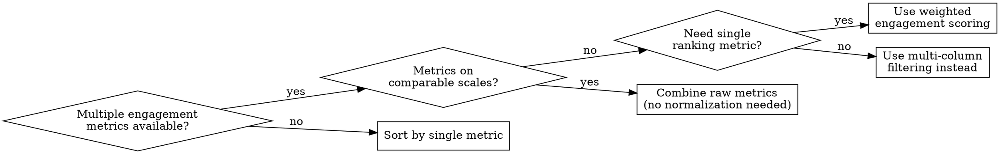
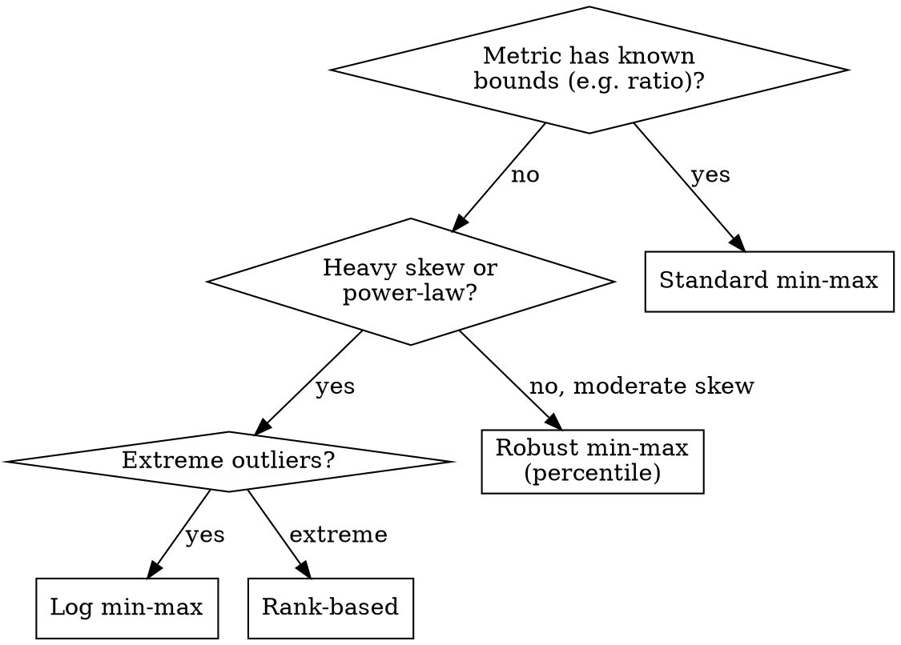
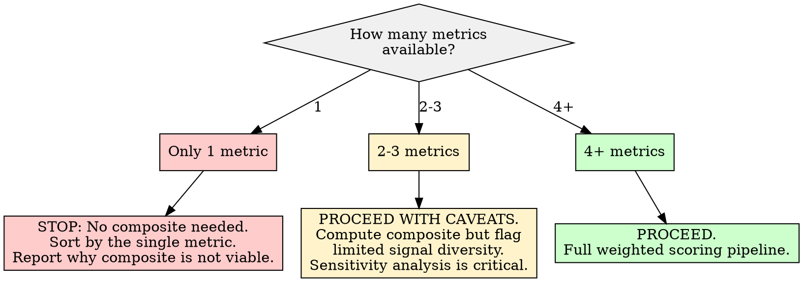

# Weighted Engagement Scoring

## Overview

Calculate a composite engagement score E = sum(w_i * x_i) from multiple heterogeneous signals (votes, ratios, comment volume, sentiment quality, temporal recency) by normalizing each to a common scale and combining via documented weights. The core principle: **raw engagement metrics on different scales cannot be meaningfully combined without normalization, and weights without documented rationale are arbitrary.**

## When to Use

- Multiple engagement signals available (score, upvote ratio, comment count, sentiment, timestamps) and need a single ranking metric
- Raw metrics are on incompatible scales (e.g., scores in thousands, ratios 0-1, comment counts in tens)
- Need to identify representative high-value content from a corpus
- Sorting by a single metric (e.g., top score) misses important content that excels on other dimensions
- Downstream analysis requires a ranked subset of "most engaged" or "most influential" content

**When NOT to use:**
- Only one engagement metric is available (just sort by that metric)
- Comparing scores across different platforms or communities without recalibrating weights
- Ranking users rather than content (engagement scoring measures content reception, not user quality)
- Content quality assessment without a sentiment or quality signal (engagement != quality)



## Core Formula

```
E = w_1 * norm(score) + w_2 * norm(upvote_ratio) + w_3 * norm(comments) + w_4 * norm(sentiment) + w_5 * norm(recency)

where:
  - norm(x) transforms each metric to [0, 1] range
  - sum(w_i) = 1.0 (weights are proportions)
  - Each w_i has a documented rationale
```

## Workflow

Copy this checklist and track progress:

```
Weighted Engagement Scoring Progress:
- [ ] Step 1: Inventory available metrics and assess quality
- [ ] Step 2: Normalize each metric to [0, 1]
- [ ] Step 3: Select and document weights
- [ ] Step 4: Compute composite scores
- [ ] Step 5: Validate scores against human judgment
- [ ] Step 6: Run sensitivity analysis on weights
- [ ] Step 7: Identify high-value content using the composite score
- [ ] Step 8: Write findings to docs/analysis/08-weighted-engagement-scoring.md
```

### Step 1: Inventory Available Metrics and Assess Quality

Before computing anything, catalog what signals are available and their characteristics.

**Common engagement signals:**

| Signal | Typical Range | Distribution Shape | Notes |
|--------|--------------|-------------------|-------|
| Score / points / votes | 0 to unbounded | Heavy right skew (power law) | Dominated by outliers; log-transform often helps before normalizing |
| Upvote ratio / approval | 0.0 to 1.0 | Left skew (most content is net positive) | Already bounded; may not need heavy transformation |
| Comment count | 0 to unbounded | Heavy right skew | Correlated with score; check correlation before weighting both heavily |
| Sentiment (compound) | -1.0 to 1.0 | Platform-dependent | Shift to [0, 1] via `(x + 1) / 2` before normalizing |
| Recency (time decay) | Timestamps | N/A (derived) | Convert to a decay function; recent = higher value |
| Save / bookmark count | 0 to unbounded | Extreme right skew | Strong signal but often unavailable |
| Share / crosspost count | 0 to unbounded | Extreme right skew | Platform-dependent availability |

**Quality checks before proceeding:**
- What percentage of records have each metric? (Coverage)
- Are any metrics constant or near-constant? (Zero variance = no signal)
- Are two metrics highly correlated (r > 0.85)? (Redundant weighting risk)

```python
import pandas as pd
import numpy as np

# Assess metric availability and basic statistics
metrics = ['score', 'upvote_ratio', 'num_comments', 'sentiment_compound']
for col in metrics:
    if col in df.columns:
        coverage = df[col].notna().mean() * 100
        print(f"{col}: coverage={coverage:.1f}%, mean={df[col].mean():.3f}, "
              f"std={df[col].std():.3f}, min={df[col].min():.3f}, max={df[col].max():.3f}")

# Check pairwise correlations
available = [c for c in metrics if c in df.columns]
print("\nCorrelation matrix:")
print(df[available].corr().round(3))
```

### Step 2: Normalize Each Metric to [0, 1]

**Every metric MUST be normalized before weighting.** Combining raw metrics gives disproportionate influence to whichever metric has the largest numerical range.

**Normalization methods (choose per metric):**

| Method | Formula | When to Use |
|--------|---------|-------------|
| **Min-max** | `(x - min) / (max - min)` | Bounded metrics, no extreme outliers |
| **Robust min-max** | `(x - p5) / (p95 - p5)`, clamp to [0, 1] | Metrics with outliers; use 5th/95th percentiles instead of true min/max |
| **Log min-max** | `(log(x+1) - log(min+1)) / (log(max+1) - log(min+1))` | Heavy right skew (scores, comment counts) |
| **Rank-based** | `rank(x) / N` | When distribution shape is unknown or extreme |
| **Shift and scale** | `(x + offset) / range` | Metrics with known bounds (sentiment: `(x+1)/2`) |

```python
def normalize_minmax(series):
    """Standard min-max to [0, 1]. Use for bounded, well-distributed metrics."""
    mn, mx = series.min(), series.max()
    if mx == mn:
        return pd.Series(0.5, index=series.index)  # No variance = neutral
    return (series - mn) / (mx - mn)

def normalize_robust(series, lower_pct=5, upper_pct=95):
    """Robust min-max using percentiles. Use for skewed metrics with outliers."""
    p_low = np.percentile(series.dropna(), lower_pct)
    p_high = np.percentile(series.dropna(), upper_pct)
    if p_high == p_low:
        return pd.Series(0.5, index=series.index)
    normalized = (series - p_low) / (p_high - p_low)
    return normalized.clip(0, 1)

def normalize_log_minmax(series):
    """Log-transform then min-max. Use for power-law distributed counts."""
    log_series = np.log1p(series)  # log(x + 1) handles zeros
    return normalize_minmax(log_series)

def compute_recency_score(timestamps, half_life_days=30):
    """Exponential decay: recent content scores higher.
    half_life_days controls how fast old content loses value."""
    now = timestamps.max()  # Use corpus max, not wall-clock time
    age_days = (now - timestamps).dt.total_seconds() / 86400
    decay = np.exp(-0.693 * age_days / half_life_days)  # 0.693 = ln(2)
    return decay  # Already in [0, 1]

# Apply normalization -- choose method per metric
df['norm_score'] = normalize_log_minmax(df['score'])
df['norm_ratio'] = normalize_minmax(df['upvote_ratio'])  # Already 0-1 but re-normalize within corpus
df['norm_comments'] = normalize_robust(df['num_comments'])
df['norm_sentiment'] = normalize_minmax((df['sentiment_compound'] + 1) / 2)  # Shift from [-1,1] to [0,1]
df['norm_recency'] = compute_recency_score(pd.to_datetime(df['created_utc'], unit='s'))
```

**Normalization method selection guidance:**



### Step 3: Select and Document Weights

**Weights MUST have documented rationale.** Never use equal weights by default without stating why.

**Weight selection approaches:**

| Approach | Method | Best For |
|----------|--------|----------|
| **Domain-informed** | Set weights based on what each signal means for the analysis goal | When you have clear analytical priorities |
| **Correlation-based** | Weight inversely to inter-metric correlation | When metrics overlap substantially |
| **Equal (justified)** | w_i = 1/n for all i | When no signal is a priori more important AND you state this explicitly |
| **PCA-derived** | Use first principal component loadings as weights | When you want data-driven weights with no subjective input |

**Recommended starting weights (for identifying influential discussions):**

| Signal | Weight | Rationale |
|--------|--------|-----------|
| Score (normalized) | 0.25 | Community-validated signal of content value |
| Upvote ratio (normalized) | 0.15 | Consensus quality -- high ratio means broad agreement |
| Comment count (normalized) | 0.25 | Discussion catalysis -- content that generates conversation |
| Sentiment quality (normalized) | 0.15 | Filters out high-engagement negativity (rage-bait, controversy) |
| Recency (normalized) | 0.20 | Temporal relevance -- recent content reflects current state |
| **Total** | **1.00** | |

**These are STARTING weights.** Step 6 (sensitivity analysis) will test whether results are robust to reasonable weight variations.

```python
# Define weights with rationale
weights = {
    'norm_score':     0.25,  # Community-validated value signal
    'norm_ratio':     0.15,  # Consensus quality indicator
    'norm_comments':  0.25,  # Discussion generation signal
    'norm_sentiment': 0.15,  # Quality filter (sentiment adjustment)
    'norm_recency':   0.20,  # Temporal relevance
}

assert abs(sum(weights.values()) - 1.0) < 1e-9, "Weights must sum to 1.0"
```

### Step 4: Compute Composite Scores

```python
# Compute weighted engagement score
df['engagement_score'] = sum(
    df[metric] * weight for metric, weight in weights.items()
    if metric in df.columns
)

# Handle partial metric availability (see Insufficient Data Handling)
available_weight = sum(
    weight for metric, weight in weights.items() if metric in df.columns
)
if available_weight < 1.0:
    # Re-normalize: scale up to account for missing metrics
    df['engagement_score'] = df['engagement_score'] / available_weight
    print(f"WARNING: Only {available_weight:.0%} of weight budget covered. "
          f"Missing metrics: {[m for m in weights if m not in df.columns]}")

# Basic score distribution
print(f"Engagement score: mean={df['engagement_score'].mean():.3f}, "
      f"median={df['engagement_score'].median():.3f}, "
      f"std={df['engagement_score'].std():.3f}")
print(f"Score range: [{df['engagement_score'].min():.3f}, {df['engagement_score'].max():.3f}]")
```

### Step 5: Validate Against Human Judgment

**Never trust a composite score without validation.** Pull the top 10 and bottom 10 items by engagement score and manually inspect them.

**Validation questions:**
- Do the top-10 items genuinely represent high-value, high-engagement content?
- Do any top-10 items feel wrong? (If so, which metric is inflating them?)
- Do the bottom-10 items genuinely represent low-engagement content?
- Are there items you know are high-value that the score ranks poorly? (Missing signal)

```python
# Pull top and bottom items for manual review
top_10 = df.nlargest(10, 'engagement_score')[
    ['title', 'engagement_score'] + list(weights.keys())
]
bottom_10 = df.nsmallest(10, 'engagement_score')[
    ['title', 'engagement_score'] + list(weights.keys())
]
print("=== TOP 10 by Engagement Score ===")
print(top_10.to_string())
print("\n=== BOTTOM 10 by Engagement Score ===")
print(bottom_10.to_string())
```

**If validation reveals problems:**
- Top items are all rage-bait/controversy: Increase sentiment weight
- Top items are all old viral content: Increase recency weight
- Top items are high-comment but shallow: Add or increase a depth/quality signal
- Score is dominated by one metric: That metric's normalization may be too spread; check the distribution

### Step 6: Run Sensitivity Analysis

Test how much the ranking changes when weights vary by +/-0.10. If top-10 content is stable across reasonable weight perturbations, the model is robust. If rankings shift dramatically, the results depend heavily on subjective weight choices -- report this.

```python
import itertools

def sensitivity_analysis(df, base_weights, perturbation=0.10, top_n=10):
    """Test ranking stability under weight perturbations."""
    base_top = set(df.nlargest(top_n, 'engagement_score').index)
    results = []

    for metric in base_weights:
        for direction in [-perturbation, +perturbation]:
            test_weights = base_weights.copy()
            test_weights[metric] += direction
            # Re-normalize remaining weights to maintain sum = 1.0
            others = {k: v for k, v in test_weights.items() if k != metric}
            other_sum = sum(others.values())
            if other_sum > 0:
                scale = (1.0 - test_weights[metric]) / other_sum
                for k in others:
                    test_weights[k] = others[k] * scale

            test_score = sum(
                df[m] * w for m, w in test_weights.items() if m in df.columns
            )
            test_top = set(test_score.nlargest(top_n).index)
            overlap = len(base_top & test_top) / top_n
            results.append({
                'perturbed_metric': metric,
                'direction': direction,
                'top_n_overlap': overlap,
            })

    results_df = pd.DataFrame(results)
    avg_stability = results_df['top_n_overlap'].mean()
    print(f"Average top-{top_n} stability: {avg_stability:.1%}")
    print(f"Minimum overlap: {results_df['top_n_overlap'].min():.1%}")
    print(results_df.to_string(index=False))
    return results_df

stability = sensitivity_analysis(df, weights)
```

**Interpreting sensitivity results:**

| Average Top-N Overlap | Interpretation |
|----------------------|----------------|
| > 90% | Robust. Rankings are stable regardless of reasonable weight choices. |
| 70-90% | Moderately stable. Core high-value items are consistent; edges shift. |
| 50-70% | Sensitive. Results depend heavily on weight choices. Report this caveat prominently. |
| < 50% | Unstable. Composite score is not reliable for ranking. Consider reducing to fewer metrics or using a different approach. |

### Step 7: Identify High-Value Content

Use the composite score to select representative high-value content for downstream analysis.

**Selection strategies:**

| Strategy | Method | When to Use |
|----------|--------|-------------|
| **Top-N** | Take the N highest-scoring items | Fixed output size needed |
| **Threshold** | Take all items above a score cutoff | Variable output size acceptable |
| **Percentile** | Take items above the Pth percentile (e.g., top 10%) | Relative selection, corpus-size adaptive |
| **Stratified** | Take top-N from each topic/category/cluster | Ensure diversity across subgroups |

```python
# Percentile-based selection (recommended default)
threshold_pct = 90  # Top 10%
threshold_value = df['engagement_score'].quantile(threshold_pct / 100)
high_value = df[df['engagement_score'] >= threshold_value].copy()
print(f"High-value content: {len(high_value)} items "
      f"(top {100 - threshold_pct}%, threshold={threshold_value:.3f})")
```

### Step 8: Write Report

Write all findings to `docs/analysis/08-weighted-engagement-scoring.md`.

## Report Output Template

The final report MUST be written to `docs/analysis/08-weighted-engagement-scoring.md` with this structure:

```markdown
# Weighted Engagement Scoring Analysis

## Methodology

### Available Metrics
| Metric | Coverage | Distribution | Normalization Method |
|--------|----------|-------------|---------------------|
| ... | ...% | [skew/shape] | [method chosen] |

### Metric Correlations
[Pairwise correlation table for input metrics]

### Weight Selection
| Signal | Weight | Rationale |
|--------|--------|-----------|
| ... | ... | ... |

### Normalization Details
[Which method was applied to each metric and why]

## Score Distribution
- Mean: [value]
- Median: [value]
- Std dev: [value]
- Range: [min, max]
- [Note if distribution is clustered, bimodal, or well-spread]

## Validation
### Top-10 Manual Review
[Table of top-10 items with component scores]
[Assessment: do these genuinely represent high-value content?]

### Bottom-10 Manual Review
[Table of bottom-10 items with component scores]
[Assessment: do these genuinely represent low-value content?]

### Validation Outcome
[Pass/fail with specific observations]

## Sensitivity Analysis
| Perturbed Metric | Direction | Top-N Overlap |
|-----------------|-----------|---------------|
| ... | ... | ...% |

Average stability: [X%]
Interpretation: [robust/moderate/sensitive/unstable]

## High-Value Content Selection
- Selection method: [top-N / threshold / percentile / stratified]
- Items selected: [N] of [total] ([%])
- Score threshold: [value]

## Limitations and Caveats
- [Weight choices are analytical decisions, not ground truth]
- [Scores are relative within this corpus, not absolute]
- [Missing metrics and their impact]
- [Sensitivity findings if model is not robust]
- [Engagement is not quality -- high engagement includes controversy]
```

## Good Patterns

- **Normalize before weighting.** This is non-negotiable. Raw metric combination produces meaningless scores dominated by whichever metric has the largest numerical range.
- **Document weight rationale.** Every weight choice should have a one-sentence justification. "Because it seemed right" is not a rationale.
- **Run sensitivity analysis.** If the top-10 shifts dramatically when weights change by 10%, the model is fragile. Report this.
- **Validate against human judgment.** Pull the top-10 and bottom-10 and manually check if the rankings make sense. Automated metrics cannot replace this step.
- **Use the score to isolate representative content, not to make absolute quality claims.** The score identifies content worth examining, not content that is objectively "best."
- **Check metric correlations first.** Two highly correlated metrics (e.g., score and comment count, r > 0.85) given equal weight effectively double-count one signal.
- **Use log-transform on power-law metrics.** Scores and comment counts follow power laws; a single viral post should not dominate the entire scoring range.

## Anti-Patterns

| Anti-Pattern | Why It Fails | Instead |
|--------------|-------------|---------|
| Combining raw unnormalized metrics | A score of 5000 + ratio of 0.95 + 150 comments = score-dominated mess | Normalize all metrics to [0, 1] first |
| Arbitrary weight selection without rationale | No one can evaluate or reproduce the analysis; weights are unaccountable | Document a one-sentence rationale per weight |
| Treating composite score as absolute | Score of 0.8 is meaningless outside the corpus it was computed on | Always describe scores as relative within the corpus |
| Ignoring metric correlations | Correlated metrics double-count the same underlying signal | Check correlation matrix; down-weight redundant signals |
| Using engagement as quality proxy without sentiment | High engagement includes rage-bait, controversy, and outrage farming | Always include a sentiment or quality signal to differentiate constructive engagement |
| Equal weights as lazy default | Equal weights are a valid choice only when explicitly justified as "no signal is a priori more important" | State the rationale even for equal weights |
| Ranking users by aggregated content scores | Conflates prolific posting with quality; penalizes infrequent high-quality contributors | Score content, not authors; if profiling users, use median content score, not sum |
| Skipping sensitivity analysis | You do not know if results are robust or artifacts of arbitrary weight choices | Always perturb weights +/-10% and report stability |

## Boundaries

**SHOULD do:**
- Calculate composite scores from multiple normalized engagement signals
- Identify high-value discussions using the composite score
- Document weight rationale for every weight in the model
- Perform sensitivity analysis to test ranking robustness
- Validate top and bottom items against human judgment
- Report scores as relative within the corpus

**Should NOT do:**
- Compare scores across different platforms or communities without recalibrating (different communities have different engagement baselines)
- Use scores to rank users rather than content
- Claim the weights are universal or optimal (they are analytical choices for a specific goal)
- Present the composite score as a quality metric without including a sentiment/quality signal
- Skip normalization for any metric regardless of how "similar" the scales appear

## Insufficient Data Handling



| Condition | Action |
|-----------|--------|
| **Only 1 metric available** | Do NOT compute a composite score. Sort by the single metric. Report in the output document that insufficient signals exist for composite scoring. |
| **2-3 metrics available** | Compute the composite but prominently flag that signal diversity is limited. Sensitivity analysis becomes especially important -- with fewer metrics, each weight has more leverage. Re-normalize weights to sum to 1.0 over available metrics only. |
| **4+ metrics available** | Full pipeline. Proceed as described. |
| **Some metrics have <50% coverage** | Exclude metrics with low coverage from the composite. Re-normalize remaining weights. Report what was excluded and why. |
| **A metric has zero variance** | Exclude it. A metric where every value is identical provides no discriminative signal. Report it as constant. |
| **All scores cluster together (std/mean < 0.1)** | The composite score does not discriminate. This may mean the corpus is homogeneous in engagement, or normalization compressed the range. Try rank-based normalization. If scores still cluster, report that the corpus lacks engagement variance. |
| **Corpus is very small (<30 items)** | Compute scores but flag all results as low-confidence. Percentile-based selection is unreliable at small N. Use top-N absolute selection instead. |
| **Two metrics correlated r > 0.85** | Down-weight one or combine them into a single signal before weighting. Report the correlation and your handling decision. |
| **Missing timestamps (no recency signal)** | Drop recency from the model. Re-normalize remaining weights. The score becomes time-agnostic -- note this in the report. |
| **Missing sentiment (no quality signal)** | The composite becomes purely engagement-volume based. **Prominently warn** that high scores may include controversy, rage-bait, and outrage farming without sentiment adjustment. |

## Common Mistakes

| Mistake | Fix |
|---------|-----|
| Not normalizing metrics before combining | Every metric MUST be in [0, 1] before weighting. This is the single most common error. |
| Using true min/max normalization on skewed data | Use robust (percentile) or log normalization for power-law distributions. True min/max gives a single outlier all the range. |
| Weights that do not sum to 1.0 | Always verify `sum(weights) == 1.0`. Non-unit sums make the score range unpredictable. |
| Not checking correlation between metrics | Two correlated metrics double-count one signal. Always print the correlation matrix before weighting. |
| Treating the score as meaningful outside its corpus | A score of 0.72 means nothing without knowing the corpus. Always state "relative to this corpus." |
| Skipping manual validation of top/bottom items | Automated scoring can produce nonsensical rankings. Always inspect the extremes. |
| Using engagement score without sentiment for quality claims | Engagement measures attention, not approval. The most engaged content may be the most controversial. |
| Applying the same weights to a different community/platform | Different communities have different engagement dynamics. Recalibrate weights per context. |
| Computing recency from wall-clock time instead of corpus bounds | Use the corpus max timestamp as "now" to avoid penalizing all content in an old dataset. |

## Red Flags -- Stop and Reassess

- All normalized metrics are clustered near 0.5 -- normalization is compressing all variance
- One metric dominates the composite (>80% of variance in the final score) -- effective single-metric sort
- Top-10 validation reveals obvious ranking failures -- model does not match human judgment
- Sensitivity analysis shows <50% overlap stability -- results are weight-dependent artifacts
- Score distribution is bimodal with a gap -- check if two distinct content populations are being merged

## References

- [Weighted Composite Metric for User Experience (MDPI, 2025)](https://www.mdpi.com/1999-5903/17/2/64) -- PCA-derived weights for composite UX metrics
- [Weighted Sum Method (ScienceDirect)](https://www.sciencedirect.com/topics/computer-science/weighted-sum-method) -- Formal description of weighted additive models
- [Normalization Techniques for MCDM (ScienceDirect, 2022)](https://www.sciencedirect.com/science/article/pii/S1877050922001570) -- Comparison of normalization methods and their impact on rankings
- [Building an Engagement Scoring Model (Accrease)](https://accrease.com/articles/building-an-engagement-scoring-model-for-analytics-data-a-step-by-step-guide/) -- Step-by-step engagement scoring for analytics data
- [Weighted Scoring Prioritization (Six Sigma)](https://www.6sigma.us/six-sigma-in-focus/weighted-scoring-prioritization/) -- Weight assignment and sensitivity testing methodology
- [Content Engagement Score: Measuring Impact (Census)](https://www.getcensus.com/ops_glossary/content-engagement-score-measuring-impact) -- Multi-signal content scoring patterns
- [Risks of Composite Scores in Scouting (Medium)](https://marclamberts.medium.com/the-risks-of-using-composite-scores-in-data-scouting-90c18a17d64b) -- Pitfalls of composite scoring models
- [Weighting Criteria and Sensitivity Analysis (Pressbooks)](https://pressbooks.pub/decisions/chapter/11-3/) -- Sensitivity testing for weighted models
